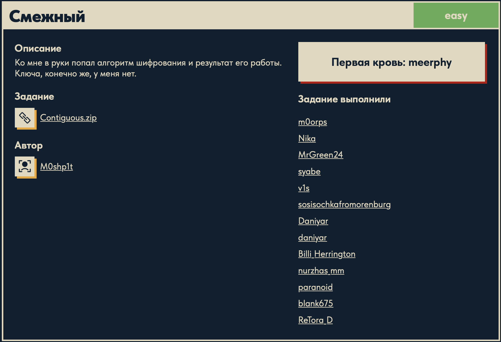

# Смежный 🔐

## Описание задачи 📌

Название задачи:

```text
Смежный
```

Сложность:

```text
Easy
```

Описание со страницы задачи:

```text
Ко мне в руки попал алгоритм шифрования и результат его работы.
Ключа, конечно же, у меня нет.
```

В качестве файла задачи был дан архив:

```text
Contiguous.zip
```

После распаковки в папке задачи находятся:

```text
Contiguous/
├── encoder.py
└── res.txt
```

Скрин страницы задачи:



## Выданные файлы 🔎

Внутри папки `Contiguous` лежат два файла:

```text
encoder.py
res.txt
```

`encoder.py` - это скрипт, которым был зашифрован исходный флаг.

`res.txt` - это результат работы скрипта, то есть зашифрованная строка.

## Осмотр `encoder.py` ⚙️

Посмотрели содержимое скрипта:

```bash
cat Contiguous/encoder.py
```

Код:

```python
from secret import FLAG

cp = ""
a = 7
b = 20

for letter in FLAG:
    if letter.isalpha():
        if letter.islower():
            tmp = ord(letter) - ord('a')
            enc = (a * tmp + b) % 26
            cp += chr(enc + ord('a'))
        else:
            tmp = ord(letter) - ord('A')
            enc = (a * tmp + b) % 26
            cp += chr(enc + ord('A'))
    else:
        cp += letter

with open('res.txt', 'w') as file:
    file.write(cp)
```

На первом этапе видно:

- скрипт импортирует исходный `FLAG` из файла `secret.py`;
- файл `secret.py` не дан;
- результат записывается в `res.txt`;
- буквы шифруются отдельно для lowercase и uppercase;
- символы, которые не являются буквами, остаются без изменений;
- внутри формулы используются значения `a = 7` и `b = 20`.

## Что делает алгоритм 🧠

Главная строка шифрования:

```python
enc = (a * tmp + b) % 26
```

Здесь:

```text
tmp
```

это номер буквы в английском алфавите.

Например для маленьких букв:

```text
a -> 0
b -> 1
c -> 2
```

Для заглавных букв логика такая же, только отсчет идет от `A`.

После этого номер буквы преобразуется по формуле:

```text
enc = (a * tmp + b) mod 26
```

`% 26` нужен, потому что в английском алфавите 26 букв. Если значение выходит за пределы алфавита, остаток от деления возвращает его обратно в диапазон от `0` до `25`.

## Осмотр `res.txt` 📄

Посмотрели результат шифрования:

```bash
cat Contiguous/res.txt
```

Содержимое:

```text
PEIMWJN{...}
```

Строка похожа на зашифрованный флаг:

- сохранены фигурные скобки;
- сохранены цифры и нижние подчеркивания;
- меняются только буквы;
- длина и структура похожи на формат `DUCKERZ{...}`.

## Обратная формула 🧮

В `encoder.py` используется формула:

```text
enc = (a * tmp + b) mod 26
```

Значения из скрипта:

```text
a = 7
b = 20
```

Значит:

```text
enc = (7 * tmp + 20) mod 26
```

Нужно найти исходное значение `tmp`, если известно зашифрованное значение `enc`.

Сначала убираем сдвиг `+ 20`.

Из формулы:

```text
enc = 7 * tmp + 20
```

вычитаем `20`:

```text
enc - 20 = 7 * tmp
```

Но мы работаем не с обычными числами, а по модулю `26`, потому что в английском алфавите 26 букв.

Поэтому правильно писать так:

```text
enc - b ≡ a * tmp (mod 26)
```

Теперь нужно "разделить" на `a`.

В обычной арифметике мы бы сделали:

```text
tmp = (enc - b) / a
```

Но в модульной арифметике деления напрямую нет. Вместо деления используется умножение на обратное число.

Нужно найти такое число `a_inv`, чтобы:

```text
a * a_inv ≡ 1 (mod 26)
```

Для `a = 7` обратное число по модулю `26` равно `15`, потому что:

```text
7 * 15 = 105
105 mod 26 = 1
```

Проверка:

```text
26 * 4 = 104
105 - 104 = 1
```

Значит:

```text
7 * 15 ≡ 1 (mod 26)
```

Теперь можно восстановить исходный номер буквы:

```text
tmp = a_inv * (enc - b) mod 26
```

Подставляем значения:

```text
tmp = 15 * (enc - 20) mod 26
```

Именно эта формула используется в декодере:

```python
dec = (a_inv * (enc - b)) % 26
```

## Почему это работает на примере 🔎

Допустим, исходная буква была `D`.

Для заглавных букв отсчет идет от `A`:

```text
A -> 0
B -> 1
C -> 2
D -> 3
```

Значит:

```text
tmp = 3
```

Шифрование:

```text
enc = (7 * 3 + 20) mod 26
enc = 41 mod 26
enc = 15
```

Номер `15` в алфавите:

```text
P
```

Поэтому в `res.txt` зашифрованный флаг начинается с `P`.

Теперь расшифровка:

```text
dec = 15 * (enc - 20) mod 26
dec = 15 * (15 - 20) mod 26
dec = 15 * (-5) mod 26
dec = -75 mod 26
```

Чтобы взять остаток:

```text
-75 + 78 = 3
```

Получаем:

```text
dec = 3
```

А `3` снова соответствует букве:

```text
D
```

То есть обратная формула вернула исходную букву.

## Скрипт для расшифровки ⚙️

Для решения был написан скрипт `decode.py`:

```python
from pathlib import Path

base_dir = Path(__file__).resolve().parent

with open(base_dir / "Contiguous" / "res.txt", "r", encoding="utf-8") as file:
    text = file.read()

decode = ""

a = 7
b = 20
a_inv = 15  # обратное к 7 по модулю 26

for char in text:
    if char.isalpha():
        if char.islower():
            enc = ord(char) - ord('a')
            dec = (a_inv * (enc - b)) % 26
            decode += chr(dec + ord('a'))
        else:
            enc = ord(char) - ord('A')
            dec = (a_inv * (enc - b)) % 26
            decode += chr(dec + ord('A'))
    else:
        decode += char

print(decode)
```

## Разбор скрипта 🔎

В начале подключается `Path`:

```python
from pathlib import Path
```

`Path` нужен для удобной работы с путями к файлам.

Дальше определяется папка, где лежит `decode.py`:

```python
base_dir = Path(__file__).resolve().parent
```

Здесь:

```text
__file__
```

это путь к текущему файлу.

```text
resolve()
```

превращает путь в абсолютный.

```text
parent
```

берет папку, в которой лежит скрипт.

Файл `res.txt` лежит не рядом с `decode.py`, а внутри папки `Contiguous`, поэтому путь строится так:

```python
base_dir / "Contiguous" / "res.txt"
```

Файл открывается на чтение:

```python
with open(base_dir / "Contiguous" / "res.txt", "r", encoding="utf-8") as file:
    text = file.read()
```

`with open(...)` открывает файл и автоматически закрывает его после завершения блока.

```text
"r"
```

означает режим чтения.

```text
encoding="utf-8"
```

указывает кодировку.

```python
file.read()
```

читает содержимое файла целиком в переменную `text`.

Дальше создается пустая строка для результата:

```python
decode = ""
```

В нее постепенно будут добавляться расшифрованные символы.

Потом задаются параметры из исходного `encoder.py`:

```python
a = 7
b = 20
a_inv = 15
```

`a` и `b` взяты из формулы шифрования.

`a_inv` - это обратное число к `a` по модулю `26`.

Дальше начинается проход по каждому символу зашифрованного текста:

```python
for char in text:
```

Одна итерация цикла обрабатывает один символ.

Проверка:

```python
if char.isalpha():
```

Метод `.isalpha()` возвращает `True`, если символ является буквой.

Это важно, потому что в исходном шифраторе буквы шифровались, а все остальные символы оставались без изменений.

Если символ - маленькая буква:

```python
if char.islower():
```

метод `.islower()` возвращает `True`.

Тогда номер буквы считается от `a`:

```python
enc = ord(char) - ord('a')
```

`ord()` возвращает числовой код символа.

Например:

```text
ord('a') = 97
ord('b') = 98
```

Если сделать:

```text
ord('b') - ord('a')
```

получится:

```text
1
```

Так буква переводится в номер от `0` до `25`.

После этого применяется обратная формула:

```python
dec = (a_inv * (enc - b)) % 26
```

Здесь:

- `enc` - номер зашифрованной буквы;
- `enc - b` убирает сдвиг `+ b`;
- `a_inv * (...)` отменяет умножение на `a`;
- `% 26` возвращает результат в диапазон английского алфавита.

Потом номер снова превращается в букву:

```python
decode += chr(dec + ord('a'))
```

`chr()` - обратная функция к `ord()`: она превращает числовой код обратно в символ.

Если символ был заглавной буквой, логика такая же, только отсчет идет от `A`:

```python
enc = ord(char) - ord('A')
dec = (a_inv * (enc - b)) % 26
decode += chr(dec + ord('A'))
```

Это нужно, чтобы сохранить регистр.

Если символ не является буквой:

```python
else:
    decode += char
```

он добавляется в результат без изменений.

Так сохраняются:

```text
{
}
_
цифры
```

В конце скрипт печатает расшифрованную строку:

```python
print(decode)
```

## Запуск скрипта 🏁

Запустили скрипт:

```bash
python3 ./cryptography/Adjacent/decode.py
```

В выводе появился флаг:

```text
DUCKERZ{...}
```

Сам флаг в writeup замазан, чтобы не палить ответ.

## Итог 🏁

Краткая цепочка решения:

```text
encoder.py -> формула enc = (7 * tmp + 20) mod 26 -> обратное к 7 равно 15 -> decode.py -> DUCKERZ{...}
```

Суть задачи: был дан аффинный шифр над английским алфавитом. Чтобы обратить его, нужно вычесть сдвиг `b`, а затем умножить на обратное число к `a` по модулю `26`.

Автор: masquadd :) ✍️
