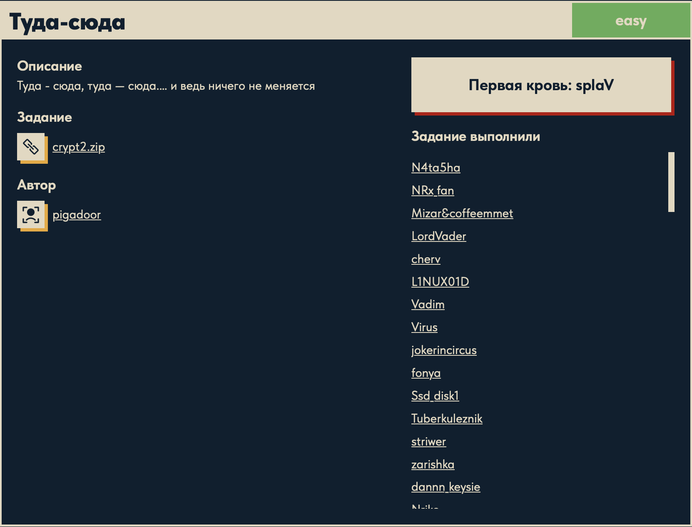

# Туда-сюда 🔁

## Описание задачи

Задача: **Туда-сюда**

Сложность: 

Описание с платформы:

> Туда - сюда, туда — сюда.... и ведь ничего не меняется

Задание:

```text
crypt2.zip   (crypt2.py + output)
```

Автор задачи:

```text
pigadoor
```

Первая кровь:

```text
splaV
```

Скрин с названием и описанием:



---

## Первый взгляд 👀

В архиве два файла: скрипт-шифратор `crypt2.py` и результат `output`.

Шифратор:

```python
from math import *

print('Enter the messsage: ')
message = input()
output = ''
for i in range(len(message)):
    output += chr(ord(message[i]) ^ i)

print(output, "GLHF")
```

Что он делает: идёт по символам сообщения и **каждый символ XOR-ит с его индексом** `i`:

```text
output[i] = message[i] XOR i
```

То есть первый символ XOR-ится с 0 (не меняется), второй — с 1, третий — с 2 и так далее.

### Почему «ничего не меняется» = XOR

Описание — прямая подсказка на ключевое свойство **XOR**: он **обратен сам себе**.

```text
x XOR i XOR i = x
```

Если применить тот же XOR второй раз тем же значением — вернёшься к исходнику («туда-сюда, и
ничего не меняется»). Значит **расшифровка — тот же алгоритм**:

```text
message[i] = output[i] XOR i
```

### Что в `output`

Файл `output` — это **Python-репрезентация байтов** (сохранённый `repr`):

```text
b'DTAHAW\|p9xT=8Qa &Mw%sP&{Lv,C~/o\x13S_'
```

Это и есть шифртекст (сами байты, с экранированием непечатных как `\xNN`). Быстрая проверка
первых символов подтверждает вектор:

```text
'D' XOR 0 = 'D'
'T' XOR 1 = 'U'
'A' XOR 2 = 'C'
'H' XOR 3 = 'K'
'A' XOR 4 = 'E'
'W' XOR 5 = 'R'   ->  складывается "DUCKER..."
```

---

## План решения

```text
1. Разобрать crypt2.py: output[i] = message[i] XOR i                        [сделано]
2. Распарсить output как bytes-литерал (ast.literal_eval)
3. Расшифровать: message[i] = output[i] XOR i (тот же XOR)
4. Прочитать флаг DUCKERZ{...}
```

---

## Решение: расшифровка ⚙️

Так как XOR обратен сам себе, дешифратор повторяет ту же операцию — XOR каждого байта с его
индексом. Единственная тонкость — правильно прочитать `output`:

```python
import ast

with open("crypt2/output") as f:
    data = f.read().strip()

data = ast.literal_eval(data)          # b'...' -> реальные байты (шифртекст)

flag = ''
for i in range(len(data)):
    flag += chr(data[i] ^ i)           # message[i] = output[i] XOR i

print(flag)
```

- `ast.literal_eval(data)` — разбирает Python-литерал `b'...'` в **настоящий объект `bytes`**:
  снимает обёртку `b'…'` и декодирует escape'ы (`\x13` → байт `0x13`, `\|` → `\` + `|`).
- `data[i] ^ i` — тот же XOR по индексу; `data` уже `bytes`, поэтому `data[i]` — это **целое число**
  (0–255), и `ord()` не нужен.

Результат:

```text
DUCKERZ{...}
```

---

## Полный разбор кода 📖

### Шифратор `crypt2.py` построчно

```python
from math import *                 # (1) не используется по делу — «шум»
print('Enter the messsage: ')      # (2) приглашение (в слове опечатка "messsage")
message = input()                  # (3) читаем исходное сообщение (флаг) как строку
output = ''                        # (4) сюда копим шифртекст
for i in range(len(message)):      # (5) идём по индексам символов: i = 0,1,2,...
    output += chr(ord(message[i]) ^ i)   # (6) КЛЮЧЕВАЯ СТРОКА
print(output, "GLHF")              # (7) печать результата (+ "GLHF" как приманка)
```

Разбор строки (6) — сердце шифра:

- `message[i]` — i-й символ сообщения;
- `ord(message[i])` — его числовой код (ASCII/Unicode), например `ord('D') = 68`;
- `^ i` — **XOR с индексом** этого символа: 0-й символ XOR-ится с `0`, 1-й — с `1`, и т.д.;
- `chr(...)` — обратно в символ;
- `output += ...` — дописываем в результат.

То есть **ключ шифрования — не фикс, а сам номер позиции**. `output[i] = message[i] XOR i`.
Символ №0 не меняется (`^0`), дальше «сдвиг» растёт. Отсюда и название «Туда-сюда»: XOR туда
(шифр) и XOR обратно (дешифр) тем же индексом — и «ничего не меняется».

### Дешифратор построчно

```python
import ast                                  # (1) для разбора литерала b'...'

with open("crypt2/output") as f:            # (2) открыть файл с шифртекстом
    data = f.read().strip()                 # (3) прочитать текст, убрать лишние пробелы/перевод строки

data = ast.literal_eval(data)               # (4) ТЕКСТ "b'...'" -> настоящий объект bytes
                                            #     (снимает b'…' и декодирует \x13, \| и т.п.)

flag = ''                                   # (5) сюда собираем расшифровку
for i in range(len(data)):                  # (6) по тем же индексам, что и при шифровании
    flag += chr(data[i] ^ i)                # (7) обратный XOR: message[i] = output[i] XOR i
                                            #     data[i] уже int (элемент bytes) -> без ord()

print(flag)                                 # (8) вывести флаг
```

Почему это точно обращает шифр: шифратор сделал `c = m ^ i`. Дешифратор делает `c ^ i =
(m ^ i) ^ i = m ^ (i ^ i) = m ^ 0 = m`. То есть **тот же XOR с тем же индексом возвращает
исходный символ** — фундаментальное свойство XOR (`x ^ x = 0`, `x ^ 0 = x`).

Единственная разница с шифратором — на входе не строка, а `bytes` (из-за формата `output`),
поэтому `ord()` не нужен, а парсинг литерала (`ast.literal_eval`) обязателен.

---

## Итог 🏁

Цепочка решения:

```text
crypt2.py -> шифр: output[i] = message[i] XOR i (XOR с индексом)
описание "ничего не меняется" -> XOR обратен сам себе -> дешифр = тот же XOR
output -> распарсить как bytes-литерал (ast.literal_eval)
message[i] = output[i] XOR i -> флаг
```

Флаг:

```text
DUCKERZ{...}
```

---

## Текущий статус

Задача решена.

Зафиксировано:

- название, сложность `Easy`, описание, автор `pigadoor`, первая кровь `splaV`;
- дан `crypt2.py` (шифратор) и `output` (шифртекст в виде bytes-литерала);
- шифр: `output[i] = message[i] XOR i` — XOR каждого символа с его индексом;
- «ничего не меняется» = XOR обратен сам себе, поэтому дешифр = тот же XOR;
- `output` распарсен через `ast.literal_eval` (иначе `\xNN` ломает хвост);
- получен флаг `DUCKERZ{...}`.

---

Автор: **masquadd :)** ✍️
