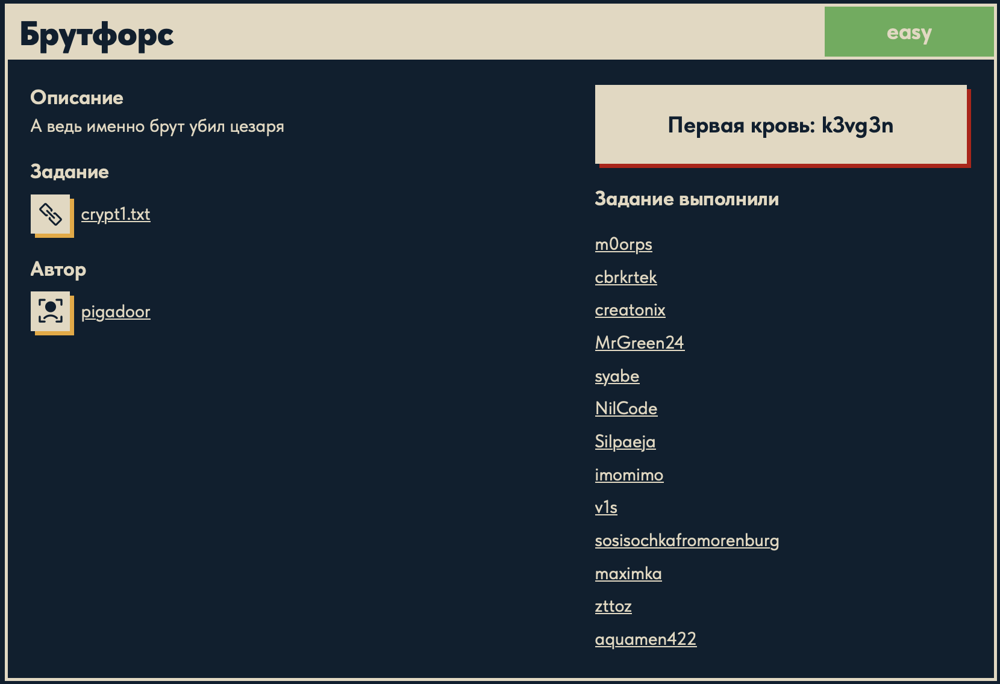
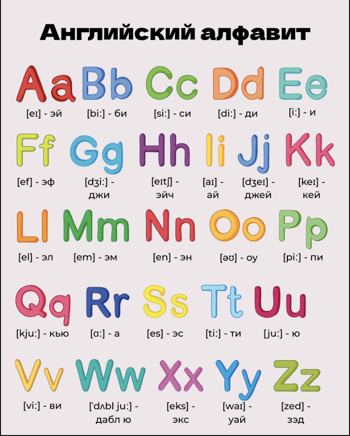

# Брутфорс 🔐

## Описание задачи 📌

Название задачи:

```text
Брутфорс
```

Сложность:

```text
Easy
```

Описание со страницы задачи:

```text
А ведь именно брут убил цезаря
```

В качестве файла задачи был дан текстовый файл:

```text
crypt1.txt
```

Скрин страницы задачи:



## Файл задачи 🔎

В задаче был дан файл:

```text
crypt1.txt
```

Посмотрели содержимое файла:

```bash
cat crypt1.txt
```

Фрагмент содержимого:

```text
Adgtb xehjb sdadg hxi pbti, rdchtritijg psxexhrxcv taxi, hts sd txjhbds itbedg xcrxsxsjci ji apqdgt ti sdadgt bpvcp paxfjp.
...
SJRZTGO{...}
...
```

В тексте видна строка, похожая на флаг:

```text
SJRZTGO{...}
```

На этом этапе стало понятно, что текст выглядит как результат шифра сдвига. Подсказка из описания задачи упоминает Цезаря, значит нужно проверить шифр Цезаря.

## Идея шифра Цезаря 🧠

Шифр Цезаря - это простой шифр замены, где каждая буква заменяется другой буквой, сдвинутой по алфавиту на фиксированное число позиций.

Например, если сдвиг равен `3`:

```text
A -> D
B -> E
C -> F
```

В этой задаче было видно, что зашифрованный флаг начинается так:

```text
SJRZTGO{...}
```

А обычный формат флага должен начинаться с:

```text
DUCKERZ{...}
```

Значит буквы просто смещены по английскому алфавиту.

Для наглядности была добавлена картинка с английским алфавитом:



## Скрипт для расшифровки ⚙️

Для расшифровки был написан скрипт `brute.py`:

```python
from pathlib import Path

alphabet_lower = "abcdefghijklmnopqrstuvwxyz"
alphabet_upper = "ABCDEFGHIJKLMNOPQRSTUVWXYZ"

base_dir = Path(__file__).resolve().parent

with open(base_dir / "crypt1.txt", "r", encoding="utf-8") as file:
    text = file.read()

result = ""

for char in text:
    if char in alphabet_lower:
        index = alphabet_lower.index(char)
        new_index = (index - 15) % 26
        result += alphabet_lower[new_index]

    elif char in alphabet_upper:
        index = alphabet_upper.index(char)
        new_index = (index - 15) % 26
        result += alphabet_upper[new_index]

    else:
        result += char

print(result)
```

## Разбор скрипта 🔎

В начале подключается `Path`:

```python
from pathlib import Path
```

`Path` нужен для удобной работы с путями к файлам. Благодаря нему скрипт может найти `crypt1.txt`, даже если запускать `brute.py` из корня репозитория.

Дальше задаются два алфавита:

```python
alphabet_lower = "abcdefghijklmnopqrstuvwxyz"
alphabet_upper = "ABCDEFGHIJKLMNOPQRSTUVWXYZ"
```

Нужно два алфавита, потому что в тексте есть и маленькие, и большие буквы. Если обрабатывать только lowercase, то заглавные буквы во флаге не расшифруются правильно.

Потом определяется папка, где лежит сам скрипт:

```python
base_dir = Path(__file__).resolve().parent
```

Здесь:

```text
__file__
```

это путь к текущему файлу `brute.py`.

```text
resolve()
```

превращает путь в полный абсолютный путь.

```text
parent
```

берет папку, в которой лежит скрипт.

Это нужно, потому что команда запускалась из корня проекта:

```bash
python3 ./cryptography/Bruteforce/brute.py
```

Если написать просто:

```python
open("crypt1.txt")
```

Python будет искать `crypt1.txt` в текущей папке запуска, то есть в корне репозитория. А файл лежит рядом со скриптом. Поэтому используется:

```python
base_dir / "crypt1.txt"
```

Дальше читается весь файл:

```python
with open(base_dir / "crypt1.txt", "r", encoding="utf-8") as file:
    text = file.read()
```

`with open(...)` открывает файл и автоматически закрывает его после чтения.

```text
"r"
```

означает режим чтения.

```text
encoding="utf-8"
```

указывает кодировку файла.

```python
file.read()
```

читает весь текст целиком в переменную `text`.

Создается пустая строка для результата:

```python
result = ""
```

В нее постепенно будут добавляться расшифрованные символы.

Дальше начинается проход по каждому символу исходного текста:

```python
for char in text:
```

Одна итерация цикла обрабатывает один символ.

Если символ - маленькая английская буква:

```python
if char in alphabet_lower:
```

то скрипт находит ее позицию в алфавите:

```python
index = alphabet_lower.index(char)
```

Например:

```text
a -> 0
b -> 1
c -> 2
```

Затем считается новая позиция:

```python
new_index = (index - 15) % 26
```

Почему `- 15`: найденный текст был зашифрован сдвигом, и чтобы расшифровать его обратно, нужно сдвинуть буквы назад.

Почему `% 26`: в английском алфавите 26 букв. Остаток от деления нужен, чтобы сдвиг корректно "закольцовывался".

Например, если при сдвиге назад позиция стала отрицательной, `% 26` вернет ее в конец алфавита.

После этого добавляется расшифрованная буква:

```python
result += alphabet_lower[new_index]
```

Для заглавных букв логика такая же:

```python
elif char in alphabet_upper:
    index = alphabet_upper.index(char)
    new_index = (index - 15) % 26
    result += alphabet_upper[new_index]
```

Отдельная ветка нужна, чтобы сохранить регистр букв.

Если символ не является буквой:

```python
else:
    result += char
```

он добавляется без изменений.

Так сохраняются:

```text
пробелы
знаки препинания
цифры
фигурные скобки
нижние подчеркивания
```

Это важно, потому что внутри флага есть цифры, `_`, `{` и `}`. Их сдвигать по алфавиту не нужно.

В конце скрипт печатает расшифрованный текст:

```python
print(result)
```

## Запуск скрипта 🏁

Запустили скрипт из корня репозитория:

```bash
python3 ./cryptography/Bruteforce/brute.py
```

В выводе появился читаемый текст, а внутри него был найден флаг:

```text
DUCKERZ{...}
```

Сам флаг в writeup замазан, чтобы не палить ответ.

## Итог 🏁

Краткая цепочка решения:

```text
crypt1.txt -> найдено SJRZTGO{...} -> шифр Цезаря -> сдвиг назад на 15 -> brute.py -> DUCKERZ{...}
```

Суть задачи: текст был зашифрован примитивным сдвигом по английскому алфавиту, а флаг удалось восстановить обратным сдвигом.

Автор: masquadd :) ✍️
