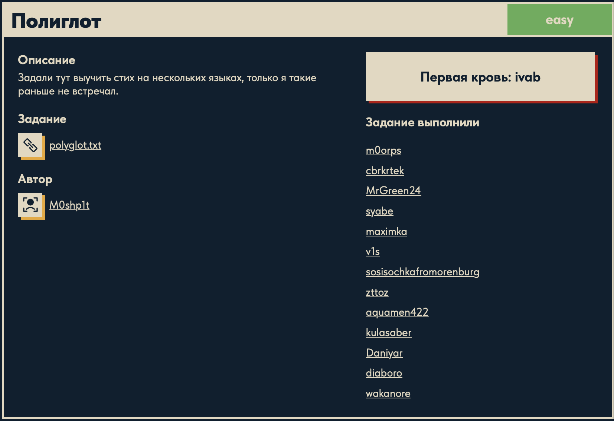

# Полиглот 🔐

## Описание задачи 📌

Название задачи:

```text
Полиглот
```

Сложность:

```text
Easy
```

Описание со страницы задачи:

```text
Задали тут выучить стих на нескольких языках, только я такие раньше не встречал.
```

В качестве файла задачи был дан текстовый файл:

```text
polyglot.txt
```

Скрин страницы задачи:



## Файл задачи 🔎

В задаче был дан файл:

```text
polyglot.txt
```

Посмотрели содержимое файла:

```bash
cat polyglot.txt
```

Содержимое выглядит как несколько строк в разных форматах записи:

```text
42 65 6e 65 61 74 68 20 74 68 65 ...
\u005F\u0063\u0030\u006D\u0070\u0075...
XzNu...
```

## Что видно на первом этапе 🧠

Название задачи и описание намекают, что данные записаны "на нескольких языках", то есть в разных кодировках или форматах представления.

В файле сразу видны три разных типа данных:

| Фрагмент | Что похоже означает |
|---|---|
| `42 65 6e 65 ...` | Hex-байты |
| `\u005F\u0063...` | Unicode escape-последовательности |
| `XzNu...` | Base64-строка |

## Hex-байты ⚙️

Первая большая часть файла записана в шестнадцатеричном виде.

Hex - это способ записывать байты с помощью символов:

```text
0 1 2 3 4 5 6 7 8 9 a b c d e f
```

Каждые два hex-символа соответствуют одному байту.

Например:

```text
42
```

это один байт. Если интерпретировать его как ASCII-символ, получится буква:

```text
B
```

## Unicode escape 🔤

Вторая часть файла выглядит так:

```text
\u005F\u0063\u0030...
```

Запись вида:

```text
\uXXXX
```

это Unicode escape-последовательность.

`XXXX` - это шестнадцатеричный код символа в таблице Unicode.

Например:

```text
\u005F
```

соответствует символу:

```text
_
```

## Base64 🧩

Третья часть файла выглядит так:

```text
XzNu...
```

Строка похожа на Base64, потому что:

- состоит из латинских букв, цифр и символа `=`;
- символ `=` часто используется как padding в конце Base64-строк;
- длина строки подходит под формат Base64.

Base64 - это не шифрование, а кодирование бинарных данных в печатные символы.

## Как понять формат каждой части 🧠

Файл состоит из трех строк, и каждая строка выглядит по-разному.

Первая строка:

```text
42 65 6e 65 61 74 68 ...
```

Как поняли, что это hex:

- строка состоит из пар символов;
- используются символы `0-9` и `a-f`;
- пары разделены пробелами;
- такие значения удобно интерпретировать как байты.

Вторая строка:

```text
\u005F\u0063\u0030...
```

Как поняли, что это Unicode escape:

- каждый фрагмент начинается с `\u`;
- после `\u` идут четыре hex-символа;
- формат `\uXXXX` стандартно используется для записи Unicode-символов.

Третья строка:

```text
XzNu...
```

Как поняли, что это Base64:

- строка состоит из латинских букв, цифр и символа `=`;
- `=` в конце часто встречается как padding в Base64;
- длина строки подходит для Base64;
- визуально строка похожа на типичную base64-кодировку.

Получается, что задача действительно "полиглот": один текст разрезан на части, а части записаны разными способами.

## Скрипт для решения ⚙️

Для декодирования был написан скрипт `poly.py`:

```python
import base64
from pathlib import Path

base_dir = Path(__file__).resolve().parent
text = []

with open(base_dir / "polyglot.txt", "r", encoding="utf-8") as file:
    for line in file:
        text.append(line)

for r in text:
    print(r)

flag1 = bytes.fromhex(text[0]).decode()
print(flag1)
print(type(flag1))

flag2 = text[1].encode().decode('unicode_escape').strip()
print(flag2)
print(type(flag2))

flag3 = base64.b64decode(text[2]).decode()
print(flag3)
print(type(flag3))

flag = flag1 + flag2 + flag3
print(flag)
```

## Разбор скрипта 🔎

В начале подключается модуль `base64`:

```python
import base64
```

Он нужен для декодирования третьей строки. В Python модуль `base64` уже встроенный, поэтому ничего дополнительно устанавливать не нужно.

Дальше подключается `Path`:

```python
from pathlib import Path
```

`Path` используется для удобной работы с путями к файлам.

Затем определяется папка, где лежит сам скрипт:

```python
base_dir = Path(__file__).resolve().parent
```

Здесь:

```text
__file__
```

это путь к текущему файлу `poly.py`.

```text
resolve()
```

превращает путь в абсолютный.

```text
parent
```

берет папку, в которой находится скрипт.

Это нужно, чтобы файл `polyglot.txt` находился корректно даже при запуске из корня репозитория.

Дальше создается пустой список:

```python
text = []
```

В него будут сохраняться строки из файла.

Файл открывается так:

```python
with open(base_dir / "polyglot.txt", "r", encoding="utf-8") as file:
```

`with open(...)` открывает файл и автоматически закрывает его после завершения блока.

```text
"r"
```

означает режим чтения.

```text
encoding="utf-8"
```

указывает кодировку, в которой читается текстовый файл.

Путь:

```python
base_dir / "polyglot.txt"
```

означает: взять папку скрипта и открыть файл `polyglot.txt` внутри нее.

Дальше скрипт читает файл построчно:

```python
for line in file:
    text.append(line)
```

`for line in file` проходит по каждой строке файла.

Метод:

```python
append()
```

добавляет элемент в конец списка.

После чтения файла в списке `text` лежит три строки:

```text
text[0] -> hex
text[1] -> unicode escape
text[2] -> base64
```

Для проверки исходные строки печатаются:

```python
for r in text:
    print(r)
```

Переменная `r` по очереди принимает каждую строку из списка `text`, а `print()` выводит ее в терминал.

## Декодирование первой части: hex 🧩

Первая часть декодируется так:

```python
flag1 = bytes.fromhex(text[0]).decode()
```

Здесь:

```python
text[0]
```

берет первую строку из файла.

Метод:

```python
bytes.fromhex(...)
```

превращает hex-строку в байты.

Например:

```text
42 65
```

превратится в байты:

```text
b"Be"
```

Потом вызывается:

```python
.decode()
```

Метод `.decode()` превращает байты в обычную строку Python.

То есть первая строка проходит путь:

```text
hex -> bytes -> str
```

После этого скрипт печатает результат и тип:

```python
print(flag1)
print(type(flag1))
```

`type(flag1)` показывает, что после `.decode()` переменная стала строкой:

```text
<class 'str'>
```

## Декодирование второй части: Unicode escape 🔤

Вторая часть декодируется так:

```python
flag2 = text[1].encode().decode('unicode_escape').strip()
```

Разберем по шагам.

Сначала:

```python
text[1]
```

берет вторую строку из файла.

В ней символы записаны буквально:

```text
\u005F\u0063...
```

Чтобы Python обработал эти escape-последовательности как специальные коды символов, сначала строка переводится в байты:

```python
.encode()
```

Метод `.encode()` превращает строку в байты.

Потом вызывается:

```python
.decode('unicode_escape')
```

Обычный `.decode()` просто превратил бы байты обратно в текст. Но параметр:

```text
unicode_escape
```

говорит Python интерпретировать последовательности вида `\uXXXX` как Unicode-символы.

Например:

```text
\u005F
```

превращается в:

```text
_
```

В конце используется:

```python
.strip()
```

Метод `.strip()` убирает лишние пробелы и переносы строк по краям. Это важно, потому что строка была прочитана из файла вместе с символом новой строки `\n`.

После этого скрипт снова печатает результат и тип:

```python
print(flag2)
print(type(flag2))
```

## Декодирование третьей части: Base64 🧬

Третья часть декодируется так:

```python
flag3 = base64.b64decode(text[2]).decode()
```

Сначала:

```python
text[2]
```

берет третью строку из файла.

Функция:

```python
base64.b64decode(...)
```

декодирует Base64-строку и возвращает байты.

После `b64decode()` получается байтовая строка, поэтому для обычного текста снова используется:

```python
.decode()
```

После этого скрипт печатает результат и тип:

```python
print(flag3)
print(type(flag3))
```

## Сборка флага 🏁

После декодирования есть три части:

```python
flag1
flag2
flag3
```

Все они являются строками, поэтому их можно просто сложить:

```python
flag = flag1 + flag2 + flag3
```

Оператор `+` для строк выполняет конкатенацию, то есть склеивание.

Например:

```text
"DUC" + "KER" + "Z{...}" = "DUCKERZ{...}"
```

В конце результат выводится:

```python
print(flag)
```

## Запуск скрипта 🚀

Запустили скрипт из корня репозитория:

```bash
python3 ./cryptography/Polyglot/poly.py
```

В выводе появились промежуточные части и итоговая строка:

```text
DUCKERZ{...}
```

Сам флаг в writeup замазан, чтобы не палить ответ.

## Итог 🏁

Краткая цепочка решения:

```text
polyglot.txt -> hex decode -> unicode_escape decode -> base64 decode -> склеивание частей -> DUCKERZ{...}
```

Суть задачи: флаг был разделен на несколько частей, и каждая часть была записана в своем формате представления данных.

Автор: masquadd :) ✍️
