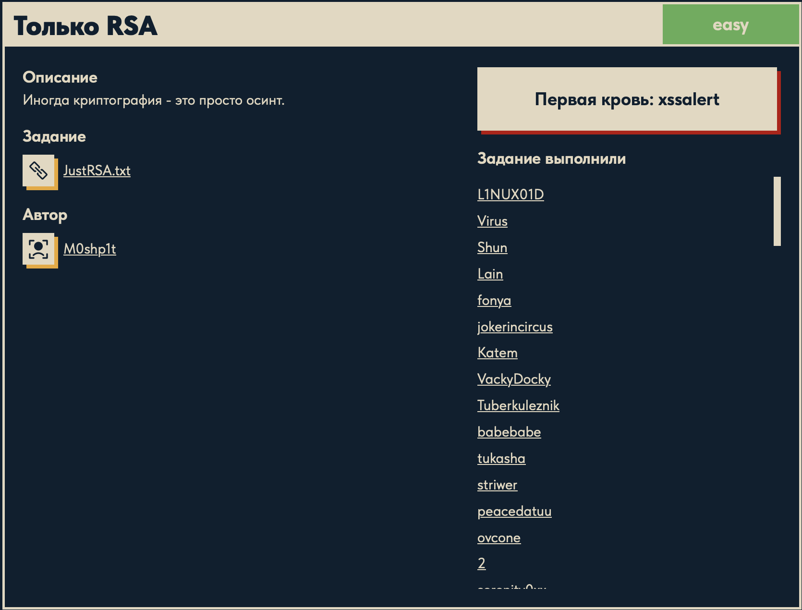
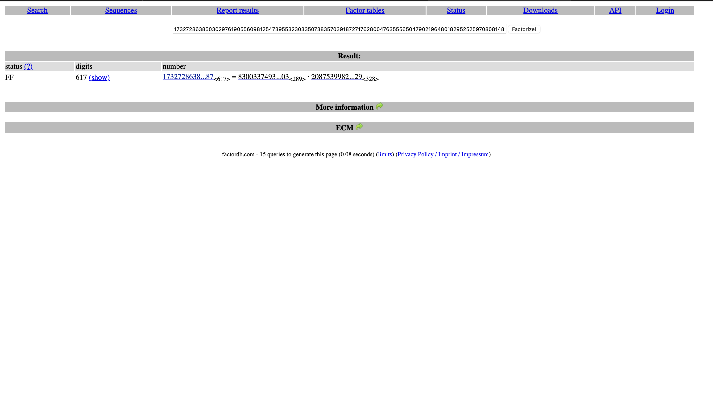

# Только RSA 🔐

## Описание задачи

Задача: **Только RSA**

Сложность: 

Описание с платформы:

> Иногда криптография - это просто осинт.

Задание:

```text
JustRSA.txt
```

Автор задачи:

```text
M0shp1t
```

Первая кровь:

```text
xssalert
```

Скрин с названием и описанием:



---

## Первый взгляд 👀

В файле `JustRSA.txt` — классический набор RSA:

```text
n  = 17327286385030297619...96896091487   (~2048 бит)
e  = 65537
ct = 10058608948455821517...12510486456   (шифртекст)
```

Чтобы расшифровать RSA, нужен закрытый ключ `d = e^{-1} mod φ(n)`, а для `φ(n) = (p-1)(q-1)`
требуется **факторизация** `n` на простые `p` и `q`. Для честного 2048-битного модуля это
вычислительно невозможно — значит задумка не в переборе.

Главная подсказка — в описании: **«криптография это просто осинт»**. То есть модуль `n`
**не случайный, а известный/опубликованный**, и его разложение уже где-то лежит. Стандартный
приём для таких задач — проверить `n` в онлайн-базе факторизаций **[factordb.com](http://factordb.com)**:
если число когда-либо факторизовали, база сразу отдаст `p` и `q`.

(Ещё подробнее теория RSA и вывод расшифровки — в задаче
[«Ни в чём не ошибся»](../singlemistake/): `e·d ≡ 1 mod φ(n)`, теорема Эйлера, `m = ct^d mod n`.)

---

## Как устроен RSA (понятным языком) 🧠

RSA — это **шифрование с открытым ключом**: одним ключом шифруют (его можно раздать всем),
другим — расшифровывают (его держат в секрете).

- Берут два больших **простых числа** `p` и `q` и перемножают: `n = p · q`.
- **Открытый ключ** — пара `(n, e)` (у нас `e = 65537`). Его знают все, им **шифруют**:

  ```text
  ct = m^e mod n           (m — сообщение как число)
  ```

- **Закрытый ключ** — число `d`, которым **расшифровывают**:

  ```text
  m = ct^d mod n
  ```

- Как связаны `d` и `p, q`: `d` — это «обратное» к `e` по модулю `φ(n)`, где
  `φ(n) = (p-1)(q-1)`. То есть чтобы вычислить `d`, нужно знать `p` и `q`.

**Где тут стойкость.** Все знают `n` и `e`, но чтобы получить секретный `d`, нужен `φ(n)`,
а для него — **разложить `n` на `p` и `q`**. Для честного 2048-битного `n` факторизация
занимает астрономическое время — на этом и держится безопасность RSA.

**А значит и весь взлом сводится к одному:** если каким-то образом узнать `p` и `q`, то дальше
всё элементарно — считаем `φ(n)`, затем `d`, затем расшифровываем `ct`. Никакой «магии», просто
арифметика. Вся сложность — именно в факторизации `n`.

---

## Что такое factordb и зачем оно 🗄️

**[factordb.com](http://factordb.com)** (Factorization Database) — открытая онлайн-**база
разложений чисел на простые множители**. Пользователи со всего мира отправляют туда числа, а
база хранит их факторизации (или досчитывает при возможности). Для огромного количества чисел
разложение там **уже готово**.

Зачем это нам: самому факторизовать 2048-битный `n` невозможно. Но если это число **уже
встречалось** (было опубликовано, использовалось в другой задаче, попало в базу) — его `p` и `q`
могут **уже лежать** в factordb. Тогда «взлом» превращается в **обычный поиск** — ровно то, о
чём говорит описание: *«криптография это просто осинт»*.

Статусы в factordb:

- **FF** — *Fully Factored*, число полностью разложено (покажет все простые множители — наши `p`, `q`);
- **C** — *Composite*, составное, но ещё не факторизовано;
- **P / PRP** — простое / вероятно простое.

Нам нужен статус **FF** — тогда база отдаст `p` и `q`.

### Результат по нашему `n`: `C` → `FF`

При **первой** проверке factordb вернул **`C` (Composite)** — число известно как составное, но
разложение ещё «в очереди», `p`/`q` не показаны. Легко решить, что тупик.

Но factordb **факторизует асинхронно**: он ставит присланное число в очередь и досчитывает
разложение в фоне (алгоритмами вроде ECM). При **повторной** проверке того же `n` статус стал
**`FF` (Fully Factored)** — база отдала два простых сомножителя:



```text
статус: FF
digits: 617
1732728638...87 <617>  =  8300337493...03 <289>  ·  2087539982...29 <328>
                 n                    p                        q
```

- `p` — **289 цифр**;
- `q` — **328 цифр**.

### Почему не сработало с первого раза

При первом запросе factordb ещё **не досчитал** разложение — число висело в очереди и
показывалось как `C` (составное, но множители неизвестны). factordb **не хранит готовое
разложение для каждого присланного числа сразу** — он подбирает множители в фоне, и для
факторизуемых чисел статус позже меняется `C → FF`. Мы просто попали в момент «ещё считается».
На повторной проверке (спустя время) факторизация уже была готова.

Почему это число вообще поддалось: `p` и `q` **сильно разного размера** (289 против 328 цифр) —
признак слабой генерации ключа. Меньший множитель (289 цифр) находится методами вроде ECM
куда быстрее, чем у «честного» сбалансированного RSA, поэтому factordb его и осилил.

Мораль по OSINT-шагу: если factordb показал `C` — **не бросать сразу**, а перепроверить чуть
позже или отправить число на факторизацию (кнопка `Factorize!`) и вернуться. Здесь именно так:
подождали → `FF` → есть `p` и `q`.

Копируем полные значения `p` и `q` со страницы factordb (клик по множителю / `(show)` раскрывает
число целиком) — и переходим к расшифровке.

---

## Расшифровка: собираем приватный ключ ⚙️

Дальше — чистая арифметика RSA, без внешних библиотек (всё есть во встроенном Python):

```python
n  = 17327286385030297619...96896091487   # из JustRSA.txt
e  = 65537
ct = 10058608948455821517...12510486456   # из JustRSA.txt
p  = 8300337493...03                       # из factordb (289 цифр)
q  = 2087539982...29                       # из factordb (328 цифр)

assert p * q == n                          # проверка: p и q действительно делят n
phi = (p - 1) * (q - 1)                    # функция Эйлера φ(n)
d   = pow(e, -1, phi)                      # приватная экспонента: e^{-1} mod φ(n)
m   = pow(ct, d, n)                        # расшифровка: m = ct^d mod n
print(m.to_bytes((m.bit_length() + 7) // 8, 'big'))   # число -> байты -> флаг
```

Построчно (это и есть весь алгоритм решения):

- **`n, e, ct`** берём из файла; **`p, q`** — из factordb (OSINT-шаг).
- **`assert p * q == n`** — контроль: перемножаем найденные простые и убеждаемся, что получаем
  ровно `n`. Если равенство ложно — скопировали `p`/`q` с ошибкой.
- **`phi = (p-1)*(q-1)`** — функция Эйлера `φ(n)`. Именно она была «недостающим звеном»: без
  `p, q` её не вычислить, а с ними — тривиально.
- **`d = pow(e, -1, phi)`** — приватная экспонента: **обратное к `e` по модулю `φ(n)`**
  (`pow(base, -1, mod)` — встроенный модульный обратный, Python 3.8+; заменяет
  `Crypto.Util.number.inverse`).
- **`m = pow(ct, d, n)`** — сама расшифровка: быстрое возведение в степень по модулю
  `m = ct^d mod n`. Работает, потому что `e·d ≡ 1 (mod φ(n))` (см. теорию RSA выше).
- **`m.to_bytes((m.bit_length()+7)//8, 'big')`** — превращаем восстановленное число `m` обратно
  в байты (big-endian, ceil(бит/8) байт) — заменяет `long_to_bytes`. Получаем текст флага.

> Практическая заметка: изначально код использовал `from Crypto.Util.number import ...`
> (**pycryptodome**), но на macOS её не поставить в системный Python (PEP 668). Проще было
> убрать зависимость: `inverse` → `pow(e,-1,phi)`, `long_to_bytes` → `to_bytes(...)`.

Результат:

```text
DUCKERZ{...}
```

---

## В чём соль задачи 🎯

**«Криптография это просто осинт»:**

1. **RSA сам по себе стойкий** — при честной генерации `n` не факторизуется, и задача была бы
   нерешаемой.
2. **Но ключ сгенерирован слабо:** `p` и `q` сильно разного размера (289 vs 328 цифр). Из-за
   маленького множителя число **поддаётся факторизации** (ECM) — и уже лежит/досчитывается в
   **factordb**.
3. **Значит «взлом» = поиск:** вставить `n` в factordb, получить `p, q`, дальше — обычная
   арифметика RSA. Никакой атаки на математику, чистый OSINT (как и обещало описание).

Мораль: **безопасность RSA держится на качестве генерации ключа**. Неравные/слабые простые,
повторно используемые модули, «засвеченные» ключи — всё это превращает стойкий алгоритм в
задачку на поиск. Всегда стоит прогнать `n` через factordb, прежде чем считать RSA «сложным».

---

## Итог 🏁

Цепочка решения:

```text
JustRSA.txt: n, e=65537, ct
-> описание "криптография = осинт" -> вставить n в factordb.com
-> при первой проверке C (в очереди) -> при повторной FF: n = p·q (p 289 цифр, q 328 цифр)
-> phi = (p-1)(q-1); d = pow(e,-1,phi); m = pow(ct,d,n); to_bytes(m)
-> флаг
```

Флаг:

```text
DUCKERZ{...}
```

---

## Текущий статус

Задача решена.

Зафиксировано:

- название, сложность `Easy`, описание («криптография = осинт»), автор `M0shp1t`, первая кровь `xssalert`;
- в `JustRSA.txt` даны `n` (617 цифр), `e = 65537`, `ct`;
- OSINT-шаг: `n` в **factordb** — сначала `C` (в очереди), при повторной проверке `FF`;
- `n = p·q`, где `p` (289 цифр) и `q` (328 цифр) — неравные простые (слабая генерация ключа);
- по `p, q` собран приватный ключ (`φ`, `d`) и расшифрован `ct` встроенными средствами Python;
- получен флаг `DUCKERZ{...}`.

---

Автор: **masquadd :)** ✍️

---

## Инструменты 🧰

- **factordb.com** — онлайн-база разложений чисел на множители (OSINT-шаг: найти `p`, `q` по `n`).
- **Python** (`pow(e,-1,phi)`, `pow(ct,d,n)`) — собрать приватный ключ и расшифровать.
- **CyberChef / long_to_bytes** — превратить расшифрованное число `m` в текст флага.

---

## План решения

```text
1. Прочитать n, e, ct из JustRSA.txt                                        [сделано]
2. OSINT: вставить n в factordb.com -> получить p и q
3. phi = (p-1)(q-1); d = pow(e, -1, phi)
4. m = pow(ct, d, n); long_to_bytes(m) -> флаг DUCKERZ{...}
```
