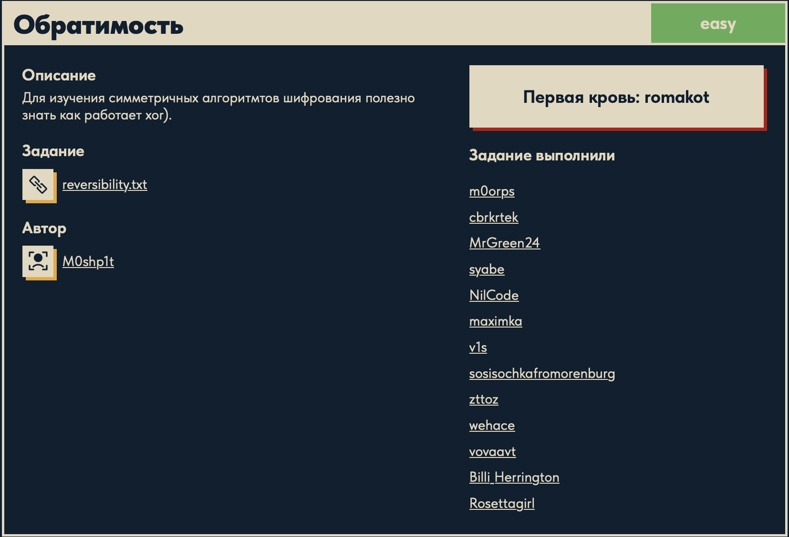

# Обратимость 🔐

## Описание задачи 📌

Название задачи:

```text
Обратимость
```

Сложность:

```text
Easy
```

Описание со страницы задачи:

```text
Для изучения симметричных алгоритмов шифрования полезно знать как работает xor).
```

В качестве файла задачи был дан текстовый файл:

```text
reversibility.txt
```

Скрин страницы задачи:



## Файл задачи 🔎

В задаче был дан файл:

```text
reversibility.txt
```

Посмотрели содержимое файла:

```bash
cat reversibility.txt
```

Содержимое:

```text
key1: 21af7f08b2152df088a5e72226c447d4d0d964bb46f0845b3f39f578b9748bd4440e17d04a20c0f4
key1 ^ key2: 9600e25b79ba3b5543adaad720a0343f6d1be23c7e5f95915f2f0835c4c74a8a0bb717ec6ff1d3f5
key2 ^ key3: cf27c4d4319805747929c7e9f758f3e4160b3fffa83b2b3ab0c689fb98273585b4cc534a6aabd384
flag ^ key1 ^ key3 ^ key2: aaddf897c6df72ffc5ff53fbb2ad8044f7a46a3097949b0feba00eb05760cc22c1a075f611ff6a0d
```

## Что видно на первом этапе 🧠

В файле нет обычного текста, зато есть несколько hex-строк.

Hex-строка - это данные, записанные в шестнадцатеричном виде. Каждые два hex-символа соответствуют одному байту.

Например:

```text
21
```

это один байт.

В строках также явно используется операция:

```text
^
```

В Python и во многих языках программирования символ `^` обозначает XOR.

## Что такое XOR ⚙️

XOR - это побитовая операция "исключающее или".

Она работает с битами:

```text
0 ^ 0 = 0
0 ^ 1 = 1
1 ^ 0 = 1
1 ^ 1 = 0
```

Главное свойство XOR для таких задач - обратимость:

```text
a ^ b ^ b = a
```

То есть если одно и то же значение применить через XOR два раза, оно "отменяется".

Именно поэтому в названии задачи говорится про обратимость, а в описании отдельно упоминается `xor`.

## Логические операции 🧮

Перед решением полезно вспомнить базовые логические операции.

| Операция | Обозначение | Когда дает `1` | Таблица |
|---|---|---|---|
| NOT | `not a` | Когда `a = 0` | `not 0 = 1`, `not 1 = 0` |
| AND | `a & b` | Только если оба бита равны `1` | `0&0=0`, `0&1=0`, `1&0=0`, `1&1=1` |
| OR | `a \| b` | Если хотя бы один бит равен `1` | `0\|0=0`, `0\|1=1`, `1\|0=1`, `1\|1=1` |
| XOR | `a ^ b` | Если биты разные | `0^0=0`, `0^1=1`, `1^0=1`, `1^1=0` |

Для этой задачи важен именно XOR.

## Математика решения 🧠

На этом этапе зафиксировали входные данные задачи:

```text
key1
key1 ^ key2
key2 ^ key3
flag ^ key1 ^ key3 ^ key2
```

Не все данные из файла понадобились. Для решения достаточно:

```text
key1
key2 ^ key3
flag ^ key1 ^ key3 ^ key2
```

Обозначим:

```text
K1 = key1
K23 = key2 ^ key3
C = flag ^ key1 ^ key3 ^ key2
```

Нужно получить:

```text
flag
```

Сначала убираем `key1`.

Так как:

```text
a ^ a = 0
a ^ 0 = a
```

то:

```text
C ^ K1 = flag ^ key1 ^ key3 ^ key2 ^ key1
```

Одинаковые `key1` сокращаются:

```text
key1 ^ key1 = 0
```

Получается:

```text
C ^ K1 = flag ^ key3 ^ key2
```

Порядок для XOR не важен, потому что XOR коммутативен:

```text
a ^ b = b ^ a
```

Значит:

```text
flag ^ key3 ^ key2 = flag ^ key2 ^ key3
```

А в файле уже есть:

```text
key2 ^ key3
```

Теперь применяем XOR еще раз:

```text
(flag ^ key2 ^ key3) ^ (key2 ^ key3)
```

Одинаковые значения снова сокращаются:

```text
key2 ^ key2 = 0
key3 ^ key3 = 0
```

Остается:

```text
flag
```

Итоговая формула:

```text
flag = (flag ^ key1 ^ key3 ^ key2) ^ key1 ^ (key2 ^ key3)
```

Именно поэтому строка `key1 ^ key2` оказалась не нужна.

## Скрипт для решения ⚙️

Для решения был написан скрипт `xor.py`:

```python
from pathlib import Path

base_dir = Path(__file__).resolve().parent
name_list = []
value_list = []

def xor(a, b):
    return bytes(
        x ^ y
        for x, y in zip(a, b)
    )

with open(base_dir / "reversibility.txt", "r", encoding="utf-8") as file:
    for line in file:
        name, value = line.strip().split(": ")
        name_list.append(name)
        value_list.append(value)

print(name_list)
print(value_list)

key1 = bytes.fromhex(value_list[0])

key1_xor_key2 = bytes.fromhex(value_list[1])

key2_xor_key3 = bytes.fromhex(value_list[2])

flag_xor_key1_xor_key3_xor_key2 = bytes.fromhex(value_list[3])

flag_xor_key3_xor_key2 = xor(flag_xor_key1_xor_key3_xor_key2, key1)

flag = xor(flag_xor_key3_xor_key2, key2_xor_key3)

print(flag)
```

## Разбор скрипта 🔎

В начале подключается `Path`:

```python
from pathlib import Path
```

`Path` нужен для удобной работы с путями. Благодаря нему скрипт может открыть `reversibility.txt`, даже если запускать `xor.py` из корня репозитория.

Дальше определяется папка, где лежит сам скрипт:

```python
base_dir = Path(__file__).resolve().parent
```

Здесь:

```text
__file__
```

это путь к текущему файлу `xor.py`.

```text
resolve()
```

превращает путь в полный абсолютный путь.

```text
parent
```

берет папку, в которой лежит скрипт.

После этого создаются два пустых списка:

```python
name_list = []
value_list = []
```

В `name_list` будут сохраняться названия строк:

```text
key1
key1 ^ key2
key2 ^ key3
flag ^ key1 ^ key3 ^ key2
```

В `value_list` будут сохраняться сами hex-значения.

Дальше объявляется функция для XOR двух наборов байтов:

```python
def xor(a, b):
    return bytes(
        x ^ y
        for x, y in zip(a, b)
    )
```

`def` создает функцию. В данном случае функция называется `xor` и принимает два аргумента:

```text
a
b
```

Это два байтовых значения одинаковой длины.

Внутри используется `zip(a, b)`:

```python
for x, y in zip(a, b)
```

`zip()` берет элементы из двух последовательностей парами.

Например:

```text
a = [10, 20, 30]
b = [1, 2, 3]
```

`zip(a, b)` даст пары:

```text
(10, 1)
(20, 2)
(30, 3)
```

Это нужно, потому что XOR выполняется побайтно: первый байт с первым, второй со вторым, третий с третьим.

Дальше для каждой пары выполняется:

```python
x ^ y
```

В Python оператор `^` делает XOR.

Если `x` и `y` - числа от `0` до `255`, то результатом тоже будет число от `0` до `255`.

Конструкция:

```python
x ^ y
for x, y in zip(a, b)
```

это генератор. Он не создает список сразу, а по очереди отдает результаты XOR.

Функция `bytes(...)` собирает эти числа обратно в байтовую строку:

```python
return bytes(...)
```

То есть функция `xor(a, b)` возвращает результат побайтового XOR.

Дальше открывается файл:

```python
with open(base_dir / "reversibility.txt", "r", encoding="utf-8") as file:
```

`with open(...)` открывает файл и автоматически закрывает его после завершения блока.

```text
"r"
```

означает режим чтения.

```text
encoding="utf-8"
```

указывает кодировку файла.

Путь:

```python
base_dir / "reversibility.txt"
```

означает: взять папку скрипта и внутри нее найти файл `reversibility.txt`.

Дальше скрипт проходит по файлу построчно:

```python
for line in file:
```

Одна итерация цикла - одна строка из файла.

Строка разбирается так:

```python
name, value = line.strip().split(": ")
```

Сначала вызывается:

```python
line.strip()
```

Метод `.strip()` убирает лишние пробелы и символ перевода строки `\n` по краям строки.

Например:

```text
"key1: abc\n"
```

после `.strip()` станет:

```text
"key1: abc"
```

Потом вызывается:

```python
.split(": ")
```

Метод `.split()` делит строку на части по указанному разделителю.

В файле каждая строка устроена так:

```text
название: значение
```

Поэтому разделитель:

```text
: 
```

делит строку на две части.

Например:

```text
"key1: 21af..."
```

превращается в:

```text
["key1", "21af..."]
```

Эти две части сразу раскладываются по переменным:

```python
name, value = ...
```

Дальше название и значение добавляются в списки:

```python
name_list.append(name)
value_list.append(value)
```

Метод `.append()` добавляет новый элемент в конец списка.

После чтения файла скрипт печатает оба списка:

```python
print(name_list)
print(value_list)
```

Это нужно как промежуточная проверка: видно, что файл разобрался правильно.

Дальше hex-строки превращаются в байты:

```python
key1 = bytes.fromhex(value_list[0])
```

`value_list[0]` берет первое значение из списка, то есть hex для `key1`.

Метод:

```python
bytes.fromhex(...)
```

преобразует hex-строку в реальные байты.

Например:

```text
"4142"
```

станет:

```text
b"AB"
```

потому что `41` в hex - это байт буквы `A`, а `42` - байт буквы `B`.

По такому же принципу читаются остальные значения:

```python
key1_xor_key2 = bytes.fromhex(value_list[1])
key2_xor_key3 = bytes.fromhex(value_list[2])
flag_xor_key1_xor_key3_xor_key2 = bytes.fromhex(value_list[3])
```

Переменная:

```python
key1_xor_key2
```

создается, потому что это значение есть в файле. Но в итоговой формуле оно не используется.

Дальше начинается само восстановление флага.

Сначала убирается `key1`:

```python
flag_xor_key3_xor_key2 = xor(flag_xor_key1_xor_key3_xor_key2, key1)
```

Было:

```text
flag ^ key1 ^ key3 ^ key2
```

Применили XOR с `key1`:

```text
flag ^ key1 ^ key3 ^ key2 ^ key1
```

Два `key1` взаимно уничтожились:

```text
key1 ^ key1 = 0
```

Осталось:

```text
flag ^ key3 ^ key2
```

Потом убирается связка `key2 ^ key3`:

```python
flag = xor(flag_xor_key3_xor_key2, key2_xor_key3)
```

Было:

```text
flag ^ key3 ^ key2
```

Применили XOR с:

```text
key2 ^ key3
```

Получилось:

```text
flag ^ key3 ^ key2 ^ key2 ^ key3
```

`key2` сокращается с `key2`, `key3` сокращается с `key3`, остается только:

```text
flag
```

В конце скрипт печатает результат:

```python
print(flag)
```

Флаг выводится как `bytes`, то есть в формате:

```text
b"DUCKERZ{...}"
```

## Запуск скрипта 🏁

Скрипт запускается из корня репозитория:

```bash
python3 ./cryptography/Reversibility/xor.py
```

В выводе появляется байтовая строка с флагом:

```text
b"DUCKERZ{...}"
```

Сам флаг в writeup замазан, чтобы не палить ответ.

## Итог 🏁

Краткая цепочка решения:

```text
reversibility.txt -> hex-строки -> bytes.fromhex() -> XOR с key1 -> XOR с key2 ^ key3 -> DUCKERZ{...}
```

Суть задачи: благодаря обратимости XOR не нужно восстанавливать все ключи по отдельности. Достаточно убрать из выражения известный `key1`, а затем убрать известную связку `key2 ^ key3`.

Автор: masquadd :) ✍️
