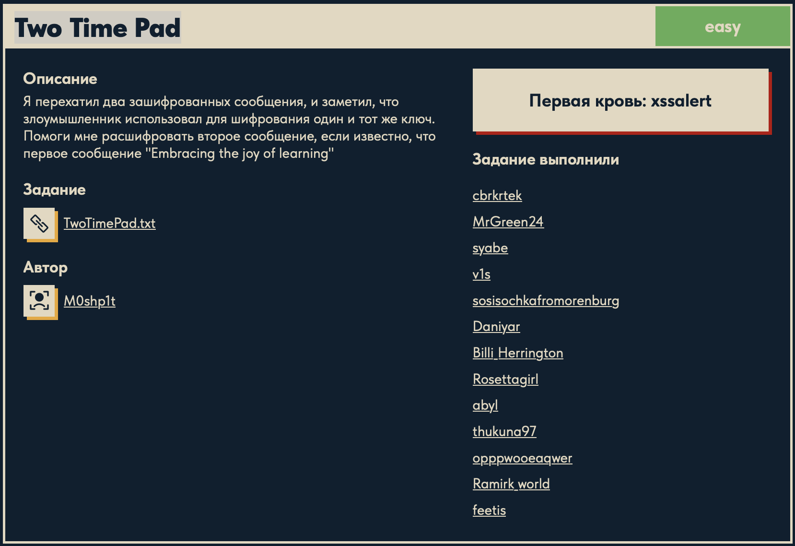

# Two Time Pad 🔐

## Описание задачи 📌

Название задачи:

```text
Two Time Pad
```

Сложность:

```text
Easy
```

Описание со страницы задачи:

```text
Я перехатил два зашифрованных сообщения, и заметил, что злоумышленник использовал для шифрования один и тот же ключ.
Помоги мне расшифровать второе сообщение, если известно, что первое сообщение "Embracing the joy of learning"
```

В качестве файла задачи был дан текстовый файл:

```text
TwoTimePad.txt
```

Скрин страницы задачи:



## Файл задачи 🔎

В задаче был дан файл:

```text
TwoTimePad.txt
```

Посмотрели содержимое файла:

```bash
cat TwoTimePad.txt
```

Содержимое:

```text
ciphertext1 = 1d70170afcb2dc4c93f2f869d87ccd2b6fbaf52e07e6c3b13d2f41bf98
ciphertext2 = 1c483633d883ef599ae2d3738e29d47749f1a93178bbc88f001578f082
```

## Что известно на старте 🧠

Из условия есть три важных факта:

```text
ciphertext1
ciphertext2
plaintext1 = Embracing the joy of learning
```

Также сказано, что для обоих сообщений использовался один и тот же ключ.

Это и есть ошибка, которая называется `Two-Time Pad`.

## Что такое One-Time Pad ⚙️

One-Time Pad - это схема, где сообщение шифруется через XOR с ключом такой же длины:

```text
ciphertext = plaintext ^ key
```

Если ключ:

- случайный;
- такой же длины, как сообщение;
- используется только один раз;

то схема считается криптографически стойкой.

## Почему повтор ключа ломает схему 🧩

Проблема начинается, если один и тот же ключ используется два раза:

```text
ciphertext1 = plaintext1 ^ key
ciphertext2 = plaintext2 ^ key
```

Если известны `ciphertext1` и `plaintext1`, можно восстановить ключ:

```text
key = ciphertext1 ^ plaintext1
```

Почему так:

```text
ciphertext1 = plaintext1 ^ key
ciphertext1 ^ plaintext1 = plaintext1 ^ key ^ plaintext1
```

Одинаковые значения при XOR сокращаются:

```text
plaintext1 ^ plaintext1 = 0
```

Остается:

```text
key
```

После восстановления ключа можно расшифровать второе сообщение:

```text
plaintext2 = ciphertext2 ^ key
```

## Что видно в файле 📄

Оба ciphertext записаны в hex.

Hex - это шестнадцатеричная запись байтов. Каждые два символа соответствуют одному байту.

Например:

```text
1d
```

это один байт.

Перед XOR hex-строки нужно будет превратить в байты.

## Как понять, что это XOR 🧠

Главная подсказка находится прямо в условии:

```text
злоумышленник использовал для шифрования один и тот же ключ
```

Название задачи тоже говорит:

```text
Two Time Pad
```

Это отсылка к `One-Time Pad`.

В классическом One-Time Pad сообщение шифруется через XOR:

```text
ciphertext = plaintext ^ key
```

Почему именно XOR:

- One-Time Pad обычно строится на операции XOR;
- XOR обратим: если применить тот же ключ еще раз, сообщение восстановится;
- в условии сказано про повторное использование одного ключа;
- нам дан известный открытый текст `plaintext1`, значит можно восстановить ключ через `ciphertext1 ^ plaintext1`.

То есть логика такая:

```text
если ciphertext = plaintext ^ key
то key = ciphertext ^ plaintext
```

## Скрипт для решения ⚙️

Для решения был написан скрипт `decode.py`:

```python
ciphertext1 = bytes.fromhex(
    "1d70170afcb2dc4c93f2f869d87ccd2b6fbaf52e07e6c3b13d2f41bf98"
)

ciphertext2 = bytes.fromhex(
    "1c483633d883ef599ae2d3738e29d47749f1a93178bbc88f001578f082"
)

plaintext1 = b"Embracing the joy of learning"

# Восстанавливаем ключ
key = bytes(c ^ p for c, p in zip(ciphertext1, plaintext1))

# Расшифровываем второе сообщение
plaintext2 = bytes(c ^ k for c, k in zip(ciphertext2, key))

print(plaintext2.decode())
```

## Разбор скрипта 🔎

Сначала hex-строка первого шифртекста превращается в байты:

```python
ciphertext1 = bytes.fromhex(
    "1d70170afcb2dc4c93f2f869d87ccd2b6fbaf52e07e6c3b13d2f41bf98"
)
```

Метод:

```python
bytes.fromhex(...)
```

берет строку с hex-символами и превращает ее в настоящие байты.

Например:

```text
41
```

это hex-запись байта, который соответствует символу:

```text
A
```

То же самое делается для второго шифртекста:

```python
ciphertext2 = bytes.fromhex(
    "1c483633d883ef599ae2d3738e29d47749f1a93178bbc88f001578f082"
)
```

Дальше задается известное первое сообщение:

```python
plaintext1 = b"Embracing the joy of learning"
```

Буква `b` перед строкой означает, что это не обычная строка `str`, а байтовая строка `bytes`.

Это важно, потому что XOR выполняется не над текстом напрямую, а над числами-байтами.

Например:

```python
list(b"ABC")
```

даст:

```text
[65, 66, 67]
```

То есть каждый символ представлен числом от `0` до `255`.

## Восстановление ключа 🗝️

Ключ восстанавливается строкой:

```python
key = bytes(c ^ p for c, p in zip(ciphertext1, plaintext1))
```

Разберем ее по частям.

`zip(ciphertext1, plaintext1)` берет байты попарно:

```text
первый байт ciphertext1 + первый байт plaintext1
второй байт ciphertext1 + второй байт plaintext1
третий байт ciphertext1 + третий байт plaintext1
...
```

На каждой итерации:

```python
for c, p in zip(ciphertext1, plaintext1)
```

переменная `c` получает байт из `ciphertext1`, а переменная `p` получает байт из `plaintext1`.

Дальше выполняется:

```python
c ^ p
```

Это XOR двух байтов.

Почему так получается ключ:

```text
ciphertext1 = plaintext1 ^ key
```

Если сделать XOR с `plaintext1`:

```text
ciphertext1 ^ plaintext1 = plaintext1 ^ key ^ plaintext1
```

XOR можно переставлять местами:

```text
plaintext1 ^ plaintext1 ^ key
```

Одинаковые значения уничтожаются:

```text
plaintext1 ^ plaintext1 = 0
```

А `0 ^ key` дает:

```text
key
```

Поэтому:

```text
key = ciphertext1 ^ plaintext1
```

Конструкция:

```python
c ^ p for c, p in zip(ciphertext1, plaintext1)
```

создает последовательность чисел-байтов ключа.

А `bytes(...)` собирает эти числа обратно в байтовую строку:

```python
key = bytes(...)
```

## Расшифровка второго сообщения 🧩

После восстановления ключа второе сообщение расшифровывается так:

```python
plaintext2 = bytes(c ^ k for c, k in zip(ciphertext2, key))
```

Логика такая же.

Если:

```text
ciphertext2 = plaintext2 ^ key
```

то:

```text
ciphertext2 ^ key = plaintext2 ^ key ^ key
```

`key ^ key` сокращается в `0`:

```text
plaintext2 ^ 0 = plaintext2
```

Значит:

```text
plaintext2 = ciphertext2 ^ key
```

В коде `zip(ciphertext2, key)` снова берет байты попарно:

```text
байт ciphertext2 + байт key
```

`c ^ k` расшифровывает каждый байт, а `bytes(...)` собирает результат.

## Вывод результата 🏁

В конце:

```python
print(plaintext2.decode())
```

Метод:

```python
.decode()
```

превращает байты в обычную строку.

После запуска:

```bash
python3 ./cryptography/Two_Time_Pad/decode.py
```

получили флаг:

```text
DUCKERZ{...}
```

Сам флаг в writeup замазан, чтобы не палить ответ.

## Итог 🏁

На этом этапе зафиксировали входные данные и идею атаки:

```text
ciphertext1 + известный plaintext1 -> key
key + ciphertext2 -> plaintext2
```

Суть задачи: один и тот же ключ был использован дважды. Из-за этого известная пара `plaintext1` и `ciphertext1` позволила восстановить ключ, а затем этим ключом расшифровать `ciphertext2`.

Автор: masquadd :) ✍️
