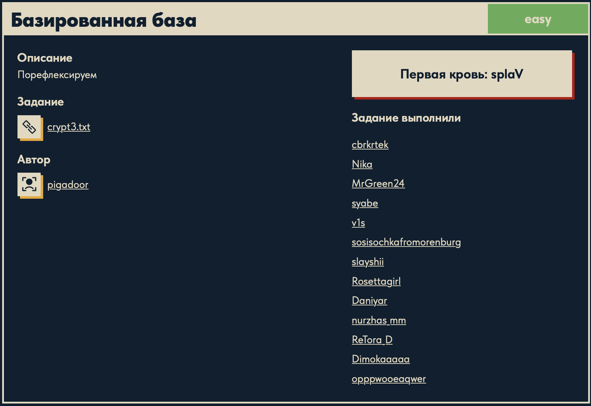

# Базированная база 🔐

## Описание задачи 📌

Название задачи:

```text
Базированная база
```

Сложность:

```text
Easy
```

Описание со страницы задачи:

```text
Порефлексируем
```

В качестве файла задачи был дан текстовый файл:

```text
crypt3.txt
```

Скрин страницы задачи:



## Файл задачи 🔎

В задаче был дан файл:

```text
crypt3.txt
```

Посмотрели содержимое файла:

```bash
cat crypt3.txt
```

Содержимое:

```text
R1k0Q0FPQlZFQTNET0lCWEdVUURNT0pBSEFaQ0FPSlFFQVlURU1aQUdRNFNBTkpWRUE0VEtJQlVIRVFES01aQUhFMlNBT0pZRUEyVEVJQlZHTVFES01KQUdFWkRLPT09=
```

## Что видно на первом этапе 🧠

Строка похожа на данные, закодированные в Base64:

- состоит из латинских букв и цифр;
- в конце есть символ `=`;
- длина строки подходит под формат Base64;
- название задачи содержит слово "база", что может намекать на base-кодировки.

Base64 - это не шифрование, а кодирование данных в печатные символы.

## Что такое Base64 ⚙️

Base64 используется, когда бинарные данные нужно записать обычным текстом.

Алфавит Base64 обычно состоит из:

```text
A-Z
a-z
0-9
+
/
```

Символ:

```text
=
```

используется как padding, то есть добивка в конце строки.

## Как понять, что это за кодировки 🧠

В этой задаче важно не просто один раз декодировать строку, а смотреть на результат каждого шага.

Первая строка похожа на Base64:

- есть маленькие и большие латинские буквы;
- есть цифры;
- в конце стоит `=`;
- длина строки кратна 4;
- в названии задачи есть намек на `base`.

После декодирования Base64 получается новая строка:

```text
GY4CAOBVEA3DOIBXGUQDMOJA...
```

Она уже похожа на Base32:

- используются только заглавные буквы `A-Z`;
- встречаются цифры из диапазона `2-7`;
- в конце есть несколько символов `=`;
- формат визуально отличается от Base64: нет маленьких букв, нет `+` и `/`.

После декодирования Base32 получается строка из чисел:

```text
число число число ...
```

Это похоже на ASCII-коды:

- числа разделены пробелами;
- значения находятся в обычном диапазоне печатных ASCII-символов;
- каждое число можно проверить через `chr()` и получить соответствующий символ.

## Скрипт для решения ⚙️

Для решения был написан скрипт `base.py`:

```python
import base64
from pathlib import Path

base_dir = Path(__file__).resolve().parent

with open(base_dir / "crypt3.txt", "r", encoding="utf-8") as file:
    text = file.read()

print(text)

text = base64.b64decode(text).decode()
print(text)

text = base64.b32decode(text).decode()
print(text)

flag = ''.join(chr(int(x)) for x in text.split())

print(flag)
```

## Разбор скрипта 🔎

В начале подключается модуль `base64`:

```python
import base64
```

Несмотря на название, модуль `base64` умеет работать не только с Base64. В нем также есть функции для Base32:

```python
base64.b64decode()
base64.b32decode()
```

Дальше подключается `Path`:

```python
from pathlib import Path
```

`Path` нужен для удобной работы с путями к файлам.

Затем определяется папка, где лежит скрипт:

```python
base_dir = Path(__file__).resolve().parent
```

Здесь:

```text
__file__
```

это путь к текущему файлу `base.py`.

```text
resolve()
```

превращает путь в абсолютный.

```text
parent
```

берет папку, в которой находится скрипт.

Это нужно, чтобы `crypt3.txt` корректно открывался даже при запуске из корня репозитория.

Файл открывается так:

```python
with open(base_dir / "crypt3.txt", "r", encoding="utf-8") as file:
    text = file.read()
```

`with open(...)` открывает файл и автоматически закрывает его после завершения блока.

```text
"r"
```

означает режим чтения.

```text
encoding="utf-8"
```

указывает кодировку текстового файла.

```python
file.read()
```

читает весь файл целиком в переменную `text`.

Команда:

```python
print(text)
```

печатает исходную строку, чтобы видеть, с чем начинается работа.

## Первый слой: Base64 🧩

Первое декодирование:

```python
text = base64.b64decode(text).decode()
```

Функция:

```python
base64.b64decode(text)
```

принимает Base64-строку и возвращает байты.

После декодирования получаются именно байты, поэтому дальше используется:

```python
.decode()
```

Метод `.decode()` превращает байты в обычную строку Python.

После этого переменная `text` перезаписывается:

```python
text = ...
```

Это удобно: на каждом шаге в `text` лежит результат последнего декодирования.

Промежуточный результат печатается:

```python
print(text)
```

После первого шага видна строка, похожая уже на Base32.

## Второй слой: Base32 🧬

Второе декодирование:

```python
text = base64.b32decode(text).decode()
```

Функция:

```python
base64.b32decode(text)
```

декодирует Base32-строку и возвращает байты.

Base32 использует другой алфавит, поэтому для него нужна отдельная функция, а не `b64decode()`.

После Base32 снова вызывается:

```python
.decode()
```

Потому что нужно превратить байты в обычную строку.

После второго декодирования получается строка с числами:

```text
число число число ...
```

## Третий слой: ASCII-коды 🔤

Последний шаг:

```python
flag = ''.join(chr(int(x)) for x in text.split())
```

Разберем эту строку подробно.

Сначала:

```python
text.split()
```

Метод `.split()` без аргументов делит строку по пробельным символам.

Например:

```text
"65 66 67"
```

превращается в список:

```text
["65", "66", "67"]
```

Дальше идет генератор:

```python
chr(int(x)) for x in text.split()
```

Он по очереди берет каждое значение `x` из списка.

Сначала `x` является строкой:

```text
"65"
```

Функция:

```python
int(x)
```

превращает строку с числом в настоящее число:

```text
"65" -> 65
```

Потом:

```python
chr(65)
```

превращает числовой код символа в сам символ.

Например:

```text
chr(65) = A
chr(66) = B
chr(67) = C
```

Так ASCII-коды превращаются в текст.

После этого используется:

```python
''.join(...)
```

Метод `.join()` склеивает все получившиеся символы в одну строку.

Пустая строка перед `.join()`:

```python
''
```

означает, что символы нужно склеить без разделителей.

То есть:

```text
["D", "U", "C"]
```

превращается в:

```text
DUC
```

В конце скрипт печатает результат:

```python
print(flag)
```

## Запуск скрипта 🚀

Запустили скрипт из корня репозитория:

```bash
python3 ./cryptography/base/base.py
```

В выводе видна цепочка преобразований:

```text
Base64-строка
Base32-строка
ASCII-коды
DUCKERZ{...}
```

Сам флаг в writeup замазан, чтобы не палить ответ.

## Итог 🏁

Краткая цепочка решения:

```text
crypt3.txt -> Base64 decode -> Base32 decode -> ASCII-коды через chr(int(...)) -> DUCKERZ{...}
```

Суть задачи: данные были упакованы в несколько последовательных "base"-представлений, а финальный слой оказался набором ASCII-кодов.

Автор: masquadd :) ✍️
