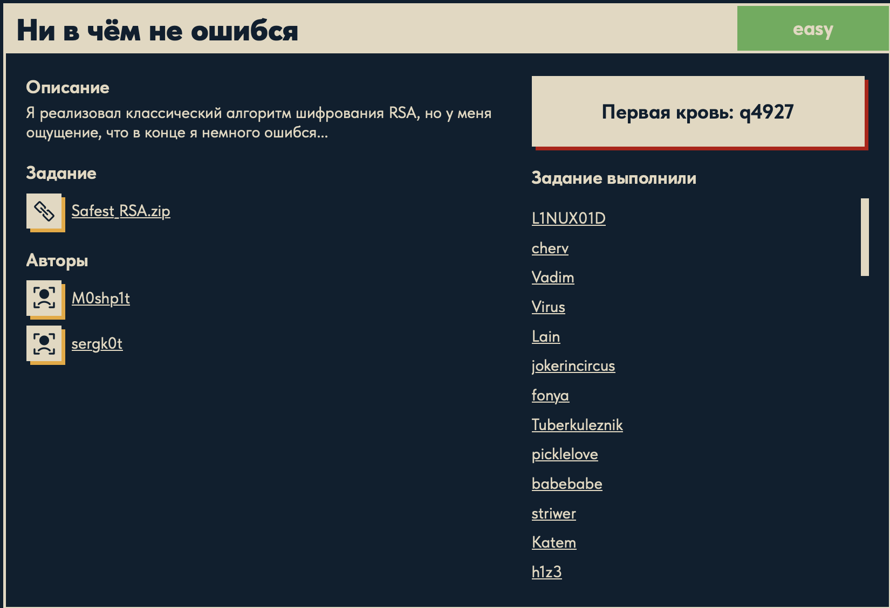

# Ни в чём не ошибся 🔐

## Описание задачи

Задача: **Ни в чём не ошибся**

Сложность: 

Описание с платформы:

> Я реализовал классический алгоритм шифрования RSA, но у меня ощущение, что в конце я
> немного ошибся...

Задание:

```text
Safest_RSA.zip
```

Авторы задачи:

```text
M0shp1t, sergk0t
```

Первая кровь:

```text
q4927
```

Скрин с названием и описанием:



---

## Первый взгляд 👀

В архиве `Safest_RSA.zip` — два файла: `encoder.py` (шифратор) и `out.txt` (его вывод).

`encoder.py`:

```python
from Crypto.Util.number import getPrime, bytes_to_long
from secret import flag

FLAG = bytes_to_long(flag)

p = getPrime(1024)
q = getPrime(1024)
n = p * q
e = 2**16 + 1
ct = pow(FLAG, e, n)

print(f'n: {n}')
print(f'e: {e + p}')      # <-- «в конце я немного ошибся»
print(f'ct: {ct}')
```

`out.txt` содержит три больших числа `n`, `e`, `ct` (здесь показаны только длины):

```text
n:  620 цифр  (~2048 бит — произведение двух 1024-битных простых)
e:  312 цифр  (~1024 бит — НЕ 65537!)
ct: 621 цифра (шифртекст)
```

---

## Краткая теория RSA 🧠

RSA — асимметричный шифр. Кратко, как он устроен:

- берут два больших простых `p` и `q`, считают **модуль** `n = p · q`;
- **функция Эйлера** `φ(n) = (p − 1)(q − 1)`;
- выбирают **открытую экспоненту** `e` (обычно `65537`);
- закрытую экспоненту `d = e⁻¹ mod φ(n)` (обратное к `e` по модулю `φ`);
- **шифрование:** `ct = m^e mod n`; **расшифровка:** `m = ct^d mod n`.

Публичны `n` и `e`; секретны `p`, `q`, `φ(n)`, `d`.

**Почему RSA стоек:** зная только `n` и `e`, чтобы получить `d`, нужен `φ(n)`, а для него — `p`
и `q`. Но **разложить огромное `n` на простые множители** (факторизация) вычислительно
невозможно за разумное время. Вся стойкость держится на секретности `p`/`q`.

Вывод: **кто знает `p` — знает всё.** `q = n / p`, дальше `φ`, `d` и расшифровка тривиальны.

---

## Ошибка: утечка `p` 🕳️

Единственная (и фатальная) ошибка — в строке вывода:

```python
print(f'e: {e + p}')      # должно быть просто e
```

Вместо открытой экспоненты `e` автор напечатал **`e + p`**. Поскольку `e = 2¹⁶ + 1 = 65537`
известно и фиксировано, простое `p` восстанавливается вычитанием:

```text
p = (значение из поля "e") − 65537
```

А `p` — это тот самый секрет, на котором держится вся защита. Получив `p`, мы разбираем весь
приватный ключ и расшифровываем `ct`.

Подтверждение по длине: настоящий `e = 65537` — 5 цифр; а в `out.txt` поле «e» — 312 цифр
(~1024 бита), ровно размер `p`. Значит там точно `e + p`, а не `e`.

---

## План решения

```text
1. Считать n, "e"(=e+p), ct из out.txt
2. Восстановить p = "e" - 65537   (проверить: n % p == 0)
3. q = n // p; phi = (p-1)(q-1); d = pow(65537, -1, phi)
4. m = pow(ct, d, n); long_to_bytes(m) -> флаг DUCKERZ{...}
```

---

## Решение ⚙️

Скрипт восстанавливает приватный ключ из утечки и расшифровывает `ct`
(байты собираем вручную, без внешних зависимостей):

```python
# читаем n, "e"(=e+p), ct из out.txt
vals = {}
for line in open('Safest_RSA/out.txt'):
    if ':' in line:
        k, v = line.split(':', 1)
        vals[k.strip()] = int(v.strip())
n, leaked, ct = vals['n'], vals['e'], vals['ct']

e = 65537
p = leaked - e                      # снимаем ошибку: (e + p) - e = p
assert n % p == 0, "p не делит n!"  # проверка: p восстановлен верно
q = n // p                          # n = p*q -> q = n/p
phi = (p - 1) * (q - 1)             # функция Эйлера φ(n)
d = pow(e, -1, phi)                 # приватная экспонента: e^{-1} mod φ(n)
m = pow(ct, d, n)                   # расшифровка: ct^d mod n
print(m.to_bytes((m.bit_length() + 7) // 8, 'big'))
```

Построчно:

- **чтение `out.txt`** — вытаскиваем три числа `n`, `leaked` (это `e + p`), `ct`;
- **`p = leaked - e`** — отменяем ошибку автора: `(e + p) − e = p`;
- **`assert n % p == 0`** — контроль: настоящий `p` обязан делить `n` нацело. Если проверка
  падает, значит гипотеза про `e + p` неверна;
- **`q = n // p`** — раз `n = p · q`, второй множитель находится делением;
- **`phi = (p - 1) * (q - 1)`** — функция Эйлера `φ(n)`;
- **`d = pow(e, -1, phi)`** — Python-нативное **обратное по модулю** (расширенный алгоритм
  Евклида): находит `d`, для которого `e · d ≡ 1 (mod φ)`;
- **`m = pow(ct, d, n)`** — быстрое **возведение в степень по модулю** (square-and-multiply);
  для чисел в сотни цифр иначе никак;
- **`m.to_bytes(...)`** — превращаем число обратно в байты (см. ниже).

### Почему `m = ct^d mod n` возвращает исходное сообщение

Это математическое ядро RSA. По построению `d` выбрано так, что:

```text
e · d ≡ 1  (mod φ(n))      =>   e · d = 1 + k · φ(n)   для некоторого целого k
```

Тогда, подставляя `ct = m^e`:

```text
ct^d = (m^e)^d = m^(e·d) = m^(1 + k·φ(n)) = m · (m^φ(n))^k   (mod n)
```

И здесь работает **теорема Эйлера**: если `gcd(m, n) = 1`, то `m^φ(n) ≡ 1 (mod n)`. Значит:

```text
m · (m^φ(n))^k ≡ m · 1^k = m   (mod n)
```

Итог: `ct^d ≡ m (mod n)` — расшифровка честно возвращает исходное `m`. Именно поэтому знание
`φ(n)` (а через него `d`) равносильно взлому: без факторизации `n` его не получить, а у нас `p`
утёк напрямую.

### Разбор строки `m.to_bytes((m.bit_length() + 7) // 8, 'big')`

После расшифровки `m` — это большое **число**, а флаг изначально был **байтами**. В шифраторе
их превратили в число строкой `FLAG = bytes_to_long(flag)` — байты прочитаны как одно большое
число по основанию 256, **big-endian** (старший байт слева). Обратная операция:

- `m.bit_length()` — сколько бит занимает число `m` (значение **точное**, не оценка);
- `(m.bit_length() + 7) // 8` — сколько **байт** нужно = округление `бит / 8` **вверх**;
- `m.to_bytes(length, 'big')` — превращает число обратно в байты в том же порядке `big-endian`,
  что использовал `bytes_to_long`.

**Почему именно `+ 7` (частый вопрос).** Число бит мы знаем точно — вопрос лишь в переводе бит
в байты. В байте 8 бит; если бит не кратно 8, «лишние» биты требуют **ещё один целый байт**.
Но `//` округляет **вниз** и эти биты потерял бы. Прибавление 7 перед делением на 8 даёт
округление **вверх**:

```text
ceil(бит / 8) = (бит + 7) // 8

  бит=8:  (8+7)//8  = 1     бит=9:  (9+7)//8  = 2   (а 9//8 = 1 — мало!)
  бит=10: (10+7)//8 = 2     бит=16: (16+7)//8 = 2
  бит=17: (17+7)//8 = 3     (а 17//8 = 2 — обрезало бы данные)
```

Важно: `//` — **целочисленное** деление, оно не даёт дробь, а отбрасывает остаток. Например,
для 10 бит `17 // 8 = 2` (а не `2.125`, как было бы у обычного `/`). Два байта = 16 бит ≥ 10,
значит 10 бит помещаются (лишние 6 бит — ведущие нули), а одного байта (8 бит) не хватило бы.

Это общий приём деления с округлением вверх: `ceil(a / b) = (a + b − 1) // b`; при `b = 8`
получается `+ 7`.

В результате число снова читается как текст: `b'DUCKERZ{...}'`.

---

## В чём именно уязвимость 🎯

Сам алгоритм RSA реализован **корректно** — стойкость убила одна строка вывода:

```python
print(f'e: {e + p}')      # вместо print(f'e: {e}')
```

Автор случайно **напечатал секретное `p`** (замаскированное прибавлением известного `e`).
Так как `e = 65537` публично и фиксировано, `p = (утёкшее значение) − 65537`. А `p` — это весь
секрет RSA: зная его, тривиально получаем `q = n/p`, `φ(n)`, `d` и расшифровку.

Мораль: криптоалгоритм может быть математически безупречен, но **утечка любого секретного
параметра** (`p`, `q`, `φ`, `d`) рушит всё. Отсюда и название задачи — «ни в чём не ошибся»
(на самом деле ошибся ровно в одном месте, в самом конце).

---

## Итог 🏁

Цепочка решения:

```text
encoder.py печатает n, (e+p), ct   [ошибка: e+p вместо e]
-> p = (e+p) - 65537
-> q = n / p ; phi = (p-1)(q-1) ; d = e^{-1} mod phi
-> m = ct^d mod n ; to_bytes(m) -> флаг
```

Флаг:

```text
DUCKERZ{...}
```

---

## Текущий статус

Задача решена.

Зафиксировано:

- название, сложность `Easy`, описание, авторы `M0shp1t`/`sergk0t`, первая кровь `q4927`;
- дан `encoder.py` (RSA-шифратор) и `out.txt` (`n`, `e`, `ct`);
- разобрана теория RSA и математика расшифровки (`e·d ≡ 1 mod φ`, теорема Эйлера);
- найдена ошибка: в поле `e` напечатано `e + p` — утечка простого `p`;
- восстановлен приватный ключ (`p → q → φ → d`) и расшифрован `ct`;
- разобрана сборка байт `to_bytes` (`bytes_to_long` наоборот);
- получен флаг `DUCKERZ{...}`.

---

Автор: **masquadd :)** ✍️
