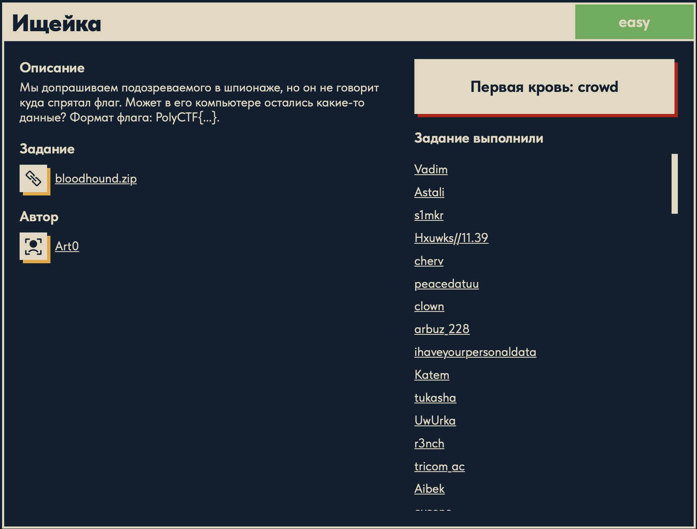

# Ищейка 🐾

## Описание задачи

Задача: **Ищейка**

Сложность: 

Описание с платформы:

> Мы допрашиваем подозреваемого в шпионаже, но он не говорит куда спрятал флаг.
> Может в его компьютере остались какие-то данные? Формат флага: PolyCTF{...}.

Задание:

```text
bloodhound.zip
```

Автор задачи:

```text
Art0
```

Первая кровь:

```text
crowd
```

Скрин с названием и описанием:



---

## Первый взгляд 👀

После распаковки `bloodhound.zip` внутри оказался файл:

```text
bloodhound.vmem   (1 073 741 824 байт = ровно 1 ГБ)
```

Расширение `.vmem` — это **дамп оперативной памяти (RAM) виртуальной машины VMware**.
То есть у нас есть снимок памяти «компьютера подозреваемого» на некоторый момент времени.

Что важно понять сразу:

- Это не файловая система и не диск, а **слепок оперативки**: процессы, их память,
  сетевые соединения, буфер обмена, куски открытых документов, история команд, кэш браузера,
  введённые пароли — всё, что было в RAM в момент снятия дампа.
- Формат флага здесь — **`PolyCTF{...}`** (а не привычный `DUCKERZ{...}`), значит искать
  и грепать нужно именно по строке `PolyCTF`.
- Описание прямо намекает: подозреваемый что-то «спрятал» на компьютере — ищем артефакты
  пользовательской активности (заметки, команды, файлы, буфер обмена).

Основной инструмент для разбора дампов памяти — **Volatility** (framework для memory
forensics). Но так как задача помечена как `easy`, сначала имеет смысл попробовать самый
простой путь — `strings` + `grep` по формату флага.

---

## План решения

```text
1. Быстрая проверка: strings по дампу + grep 'PolyCTF' (флаг может лежать в открытом виде
   или в легко узнаваемой кодировке — base64 и т.п.)
2. Если не нашлось напрямую — определить ОС/профиль дампа (Volatility: windows.info / imageinfo)
3. Разведка активности пользователя: список процессов, командные строки, буфер обмена,
   открытые файлы/заметки, история команд, браузер
4. Извлечь спрятанные данные из найденного артефакта и восстановить флаг PolyCTF{...}
```

---

## Решение: strings + grep 🔎

Так как задача `easy`, начали с самого дешёвого шага — поиска флага в открытом виде прямо
по байтам дампа:

```bash
strings -a bloodhound.vmem | grep -i "PolyCTF"
```

И флаг нашёлся сразу же, первой командой:

```text
PolyCTF{...}
```

Задача оказалась ровно про то, о чём говорит сам флаг: спрятанная строка так и осталась
лежать в оперативной памяти открытым текстом, и её достаточно «выцепить» утилитой `strings`.
Volatility и разбор процессов не понадобились.

---

## Что такое `.vmem` 🧠

`.vmem` — это **файл с полным образом оперативной памяти (RAM) виртуальной машины VMware**.
Когда ВМ запущена (или приостановлена/сохранена через snapshot), VMware держит её физическую
память в файле `<имя-вм>.vmem` рядом с `.vmx`/`.vmsn`. По сути это «слепок» всего, что было
в RAM гостевой ОС на момент сохранения.

Ключевые свойства для форензики:

- Размер `.vmem` равен объёму RAM виртуалки — здесь ровно **1 ГБ** (`1 073 741 824` байта),
  то есть у ВМ был 1 ГБ памяти.
- Внутри — «сырая» физическая память: код и данные всех процессов, ядро, драйверы, кэши,
  буфер обмена, куски открытых документов, введённый текст, иногда пароли и ключи.
- Это фактически **raw memory dump**, поэтому его понимают инструменты memory forensics
  (Volatility, Rekall) — им можно скормить `.vmem` напрямую как образ памяти.
- Данные в памяти лежат как есть, без шифрования (если приложение само их не шифровало),
  поэтому текстовые артефакты часто читаются напрямую.

Именно поэтому «спрятать» флаг, просто открыв его в блокноте или скопировав в буфер, —
плохая идея: он остаётся в RAM и попадает в дамп.

---

## Что такое `strings` и как мы её применили 🛠️

`strings` — стандартная Unix-утилита, которая **ищет и печатает последовательности печатных
символов** в бинарном файле. По умолчанию она выводит любые цепочки из ≥4 печатных ASCII-байт,
подряд идущих в файле. Это идеальный первый инструмент для быстрого осмотра любого дампа,
образа или неизвестного бинаря.

Разбор нашей команды:

```bash
strings -a bloodhound.vmem | grep -i "PolyCTF"
```

- `strings` — извлекаем все текстовые строки из файла;
- `-a` (`--all`) — сканировать **весь файл** целиком, а не только «загрузочные» секции
  (для сырого дампа это обязательно, иначе часть данных пропустится);
- `bloodhound.vmem` — наш образ памяти;
- `| grep -i "PolyCTF"` — фильтруем поток строк, оставляя только те, где встречается
  формат флага; `-i` делает поиск регистронезависимым.

Полезный приём на будущее — **Windows-дампы часто хранят строки в UTF-16** (по 2 байта на
символ), и обычный `strings` их не видит. Тогда помогает флаг кодировки:

```bash
strings -a -e l bloodhound.vmem | grep -i "PolyCTF"
```

- `-e l` — искать строки в 16-битной little-endian кодировке (типичная для Windows Unicode).

В этой задаче хватило обычного ASCII-режима: флаг лежал в памяти как есть.

---

## Почему это сработало 🧠

1. **Флаг остался в RAM открытым текстом.** Подозреваемый где-то держал строку флага
   (в редакторе, буфере обмена, консоли), и она попала в дамп памяти как обычный ASCII-текст.
2. **`.vmem` — это сырой снимок памяти без шифрования**, поэтому текст читается напрямую.
3. **`strings` вытаскивает любой печатный текст**, а известный формат `PolyCTF{...}` даёт
   готовый признак для `grep` — не нужно вручную просматривать гигабайт данных.

Мораль задачи (и буквально текст самого флага): чтобы найти секрет в дампе памяти, часто
достаточно **поискать строку внутри `.vmem`** — самый первый и самый быстрый шаг форензики.

---

## Итог 🏁

Цепочка решения:

```text
bloodhound.zip -> bloodhound.vmem (образ RAM VMware, 1 ГБ)
-> strings -a bloodhound.vmem | grep -i "PolyCTF"
-> флаг найден в открытом виде в памяти
```

Флаг:

```text
PolyCTF{...}
```

---

## Текущий статус

Задача решена.

Зафиксировано:

- название задачи, сложность `Easy`, описание с платформы, автор `Art0`, первая кровь `crowd`;
- формат флага `PolyCTF{...}`;
- содержимое архива: `bloodhound.vmem` — образ оперативной памяти VMware (1 ГБ);
- разобрано, что такое `.vmem` и утилита `strings`;
- флаг найден одной командой `strings -a bloodhound.vmem | grep -i "PolyCTF"`.

---

Автор: **masquadd :)** ✍️
