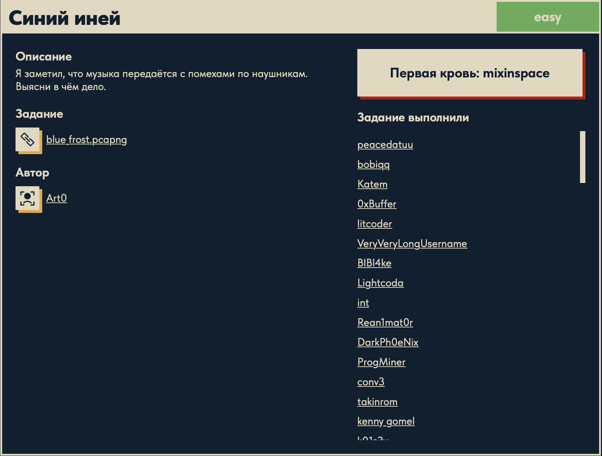
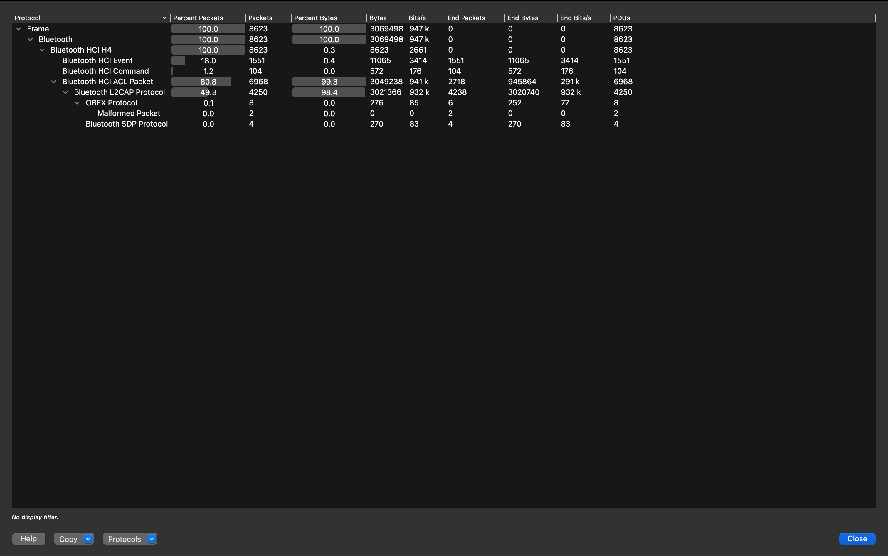
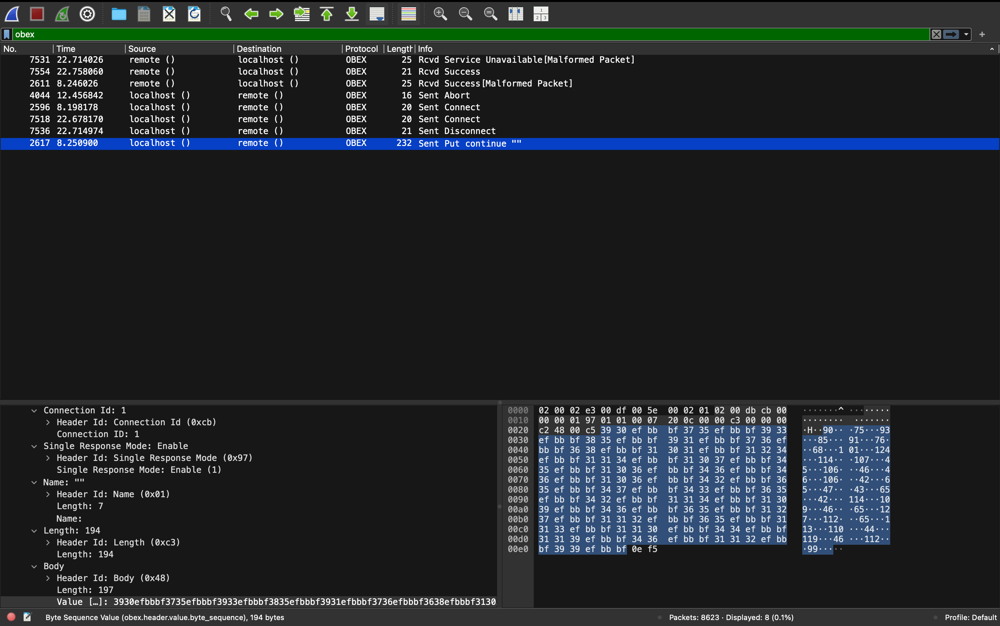

# Синий иней ❄️

## Описание задачи

Задача: **Синий иней**

Сложность: 

Описание с платформы:

> Я заметил, что музыка передаётся с помехами по наушникам. Выясни в чём дело.

Задание:

```text
blue_frost.pcapng
```

Автор задачи:

```text
Art0
```

Первая кровь:

```text
mixinspace
```

Скрин с названием и описанием:



---

## Первый взгляд 👀

Дан дамп трафика `blue_frost.pcapng` (~3.4 МБ). Название **«Синий иней»** и «музыка по
наушникам» намекают на **Bluetooth** («Blue» = Bluetooth, беспроводные наушники).

Первый шаг с любым дампом — посмотреть, **какие вообще протоколы** в нём есть:
**Statistics → Protocol Hierarchy** (или `tshark -q -z io,phs`).



### Протоколы в дампе

| Протокол | Что это |
|---|---|
| **Bluetooth** | беспроводная связь ближнего радиуса (наушники, мыши, файлообмен) — весь трафик здесь Bluetooth |
| **HCI H4** | *Host Controller Interface* (транспорт H4) — «шов» между хостом (ОС) и Bluetooth-чипом; дамп снят на этом уровне |
| **HCI Event** | события **от контроллера к хосту** (статусы, результаты команд, уведомления) |
| **HCI Command** | команды **от хоста к контроллеру** (настроить/подключиться/передать) |
| **HCI ACL Packet** | *Asynchronous Connectionless* — основной **канал данных** (не голос); тут ~99% байт |
| **L2CAP** | *Logical Link Control and Adaptation* — **мультиплексирование/сегментация** поверх ACL; несёт верхние протоколы |
| **OBEX** | *Object Exchange* — **обмен файлами/объектами** по Bluetooth («HTTP для Bluetooth-файлообмена») |
| **SDP** | *Service Discovery Protocol* — **обнаружение сервисов** устройства |
| **Malformed Packet** | не протокол, а **пометка Wireshark** — пакет, который диссектор не смог разобрать (обрезан/битый) |

Наблюдение: основной объём — `HCI ACL` / `L2CAP` (это музыкальный аудиопоток, то, что «играет в
наушниках»). Но на фоне музыки выделяются **несколько «нетипичных» кадров** — `OBEX` (обмен
файлами) и `SDP`. Именно они — кандидаты на «помехи» из описания: под прикрытием музыки в эфир
затесалось что-то ещё.

---

## Инструменты 🧰

- **Wireshark** — фильтр отображения `obex`; в деталях OBEX-пакета видны имя файла (`Name`) и
  тело (`Body` / `End of Body`). Можно `File → Export Objects` при поддержке, либо вручную.
- **tshark** — вытащить поля OBEX: `tshark -r blue_frost.pcapng -Y obex -T fields -e obex.name`
  и т.п., либо тело `obex` для сборки файла.
- **strings / file** — опознать/прочитать вытащенный файл.

---

## План решения

```text
1. Опознать Bluetooth-дамп, в иерархии протоколов найти OBEX                [сделано]
2. Отфильтровать obex, найти операцию PUT (имя файла + тело)                [сделано]
3. Собрать переданный файл из OBEX Body
4. Прочитать/декодировать флаг из файла -> DUCKERZ{...}
```

---

## Разбор OBEX: передача файла 📤

Ставим фильтр `obex` — остаётся 8 пакетов. Это полный цикл **OBEX Object Push** (отправка файла
«по воздуху»):

```text
Sent Connect  ->  Sent Put continue ""  ->  Sent Abort/Disconnect  (+ ответы Success)
```

Нужный — пакет с **`Opcode: Put`** и большой длиной (**232 байта, кадр 2617**). Раскрыв
**OBEX Protocol** в деталях, видим заголовки:

- `Connection Id: 1`, `Single Response Mode: Enable`;
- **`Name: ""`** — имя файла «пустое» (на самом деле невидимый символ);
- `Length: 194`;
- **`Body` (Header Id 0x48), Length: 197** — вот оно, **содержимое переданного файла**.



### Что в Body

В теле — **десятичные числа**, разделённые байтовой последовательностью **`EF BB BF`**
(это UTF-8 BOM / zero-width-символ; из-за него и `Name` выглядел пустым). По ASCII-колонке:

```text
90 · 75 · 93 · 85 · 91 · 76 · 68 · 101 · 124 · 114 · 107 · 45 · 106 · 46 · 46 · 106 · 42 ·
65 · 47 · 43 · 65 · 42 · 114 · 109 · 46 · 65 · 127 · 112 · 65 · 113 · 110 · 44 · 119 · 46 · 112 · 99 ...
```

То есть переданный «файл» — это **массив кодов**, по одному числу на символ флага. Но напрямую
как ASCII они не читаются (`90='Z'`, `75='K'`…) — над кодами сделано простое обратимое
преобразование, которое ещё предстоит снять.

---

## Снятие кодировки: XOR по известному тексту 🔑

Коды не равны ASCII напрямую, значит над каждым сделали обратимую операцию. Ключ находим
методом **известного открытого текста**: флаг всегда начинается с `DUCKERZ{`. Сопоставляем:

| число | 90 | 75 | 93 | 85 | 91 | 76 | 68 | 101 |
|---|---|---|---|---|---|---|---|---|
| символ | `D` | `U` | `C` | `K` | `E` | `R` | `Z` | `{` |
| ASCII | 68 | 85 | 67 | 75 | 69 | 82 | 90 | 123 |

Разность непостоянна (сложение/вычитание не подходит), а вот **XOR** даёт один ключ:

```text
90 XOR 68 = 30      (0x1E)
75 XOR 85 = 30
93 XOR 67 = 30
...
```

Значит **символ = код XOR 30**. Ключ `30` подтверждается на всех парах — это и есть
преобразование.

---

## Разбор чисел: рекурсия 🔁

Есть тонкость. Если убрать разделители `EF BB BF`, все цифры сливаются в одну строку:

```text
t = "907593859176681011241141074510646461064265474365421141094665127112651131104411946..."
```

А числа-то **разной длины** (2 или 3 цифры: `90`, `75` … но `101`, `124`, `127`). Как понять,
где кончается одно число и начинается другое? Здесь помогает то, что **все коды ≤ 127**
(это байтовые/ASCII-значения). Отсюда правило: смотрим на 3 цифры подряд —

- если они образуют число **≥ 128** — три цифры не могут быть одним кодом, значит настоящее
  число это первые **2** цифры;
- если **< 128** — это полноценное **3-значное** число (100–127).

(Работает, потому что 3-значные коды тут это 100–127 (< 128), а любое 2-значное число ≥ ~42,
и «окно» из 3 цифр для него даёт ≥ 420 — гарантированно ≥ 128. Разделение чёткое.)

Именно это делает рекурсивная функция:

```python
def create_list(code: str) -> list:
    if not code:                       # база рекурсии: строка кончилась
        return codel                   # -> вернуть накопленный список
    tmp = code[0:3]                    # берём первые 3 цифры
    if int(tmp) >= 128:                # 3 цифры дают >=128 -> это 2-значное число
        codel.append(int(tmp[:2]))     #   берём первые 2 цифры
        code = code[2:]                #   «съедаем» 2 символа
        return create_list(code)       #   рекурсия по остатку
    else:                              # иначе -> полноценное 3-значное число
        codel.append(int(tmp))         #   берём все 3 цифры
        code = code[3:]                #   «съедаем» 3 символа
        return create_list(code)       #   рекурсия по остатку
```

Как работает рекурсия, по шагам:

1. **База.** `if not code: return codel` — когда строка опустела, разбор закончен, возвращаем
   накопленный список кодов `codel`.
2. **Шаг.** Иначе берём кусок `tmp = code[0:3]` (до 3 цифр) и решаем, сколько цифр «откусить»:
   - `int(tmp) >= 128` → число двухзначное: кладём `int(tmp[:2])`, отрезаем 2 символа
     (`code = code[2:]`);
   - иначе → трёхзначное: кладём `int(tmp)`, отрезаем 3 символа (`code = code[3:]`).
3. **Рекурсивный вызов.** `return create_list(code)` — запускаем ту же функцию на **укороченной**
   строке. С каждым вызовом `code` короче хотя бы на 2 символа, поэтому рано или поздно он
   станет пустым — сработает база, и рекурсия «свернётся» обратно.

Это по сути **хвостовая рекурсия**: один вызов = одно распознанное число + переход к остатку.
`codel` здесь — список-аккумулятор (объявлен снаружи), в который каждый вызов дописывает
очередной код; итог возвращается из базы.

Пример первых шагов:

```text
"907593..."  -> "907">=128 -> взять 90,  остаток "7593..."
"759385..."  -> "759">=128 -> взять 75,  остаток "9385..."
...
"101124..."  -> "101"<128  -> взять 101, остаток "124114..."
```

---

## Финальное преобразование → флаг ⚙️

Собираем всё вместе: разбираем строку на числа рекурсией, затем каждый код XOR-им с 30 и
превращаем в символ:

```python
t = "9075938591766810112411410745106464610642654743654211410946651271126511311044119..." # коды из Body
codel = []
codel = create_list(t)                              # строка цифр -> список чисел
flag = "".join(chr(i ^ 30) for i in codel)          # код XOR 30 -> символ
print(flag)
```

- `create_list(t)` → список кодов `[90, 75, 93, 85, 91, 76, 68, 101, 124, …]`;
- `chr(i ^ 30)` → снимаем XOR-ключ `30` и получаем ASCII-символ для каждого кода
  (`90^30=68='D'`, `75^30=85='U'`, `93^30=67='C'`, `101^30=123='{'`, …);
- `"".join(...)` → склеиваем символы в строку.

Результат:

```text
DUCKERZ{...}
```

---

## В чём соль задачи 🎯

**Эксфильтрация через Bluetooth OBEX под прикрытием музыки:**

1. **Легенда — «музыка с помехами по наушникам».** Основной трафик — Bluetooth-аудио
   (`HCI ACL`/`L2CAP`), обычная передача звука на наушники.
2. **Скрытая передача файла.** На фоне музыки прошёл **OBEX Object Push** — кто-то отправил файл
   «по воздуху». Это и есть «помехи»: несколько OBEX-пакетов среди тысяч аудио-кадров.
3. **Двойная обфускация содержимого.** Имя файла спрятано за zero-width-символом, а тело — не
   текст, а массив чисел через невидимый разделитель `EF BB BF`, да ещё и **XOR-нутый ключом 30**.

Мораль (защитная): при разборе Bluetooth-дампа смотреть не только на профили аудио, но и на
**OBEX/файлообмен** — через него утекают данные, замаскированные под бытовой трафик.

---

## Итог 🏁

Цепочка решения:

```text
blue_frost.pcapng (Bluetooth HCI-дамп)
-> Statistics -> Protocol Hierarchy: среди аудио (ACL/L2CAP) есть OBEX
-> фильтр obex -> OBEX Object Push, кадр 2617 = Put с Body (~200 байт)
-> Body = десятичные коды через разделитель EF BB BF
-> ключ по известному тексту: код XOR 30 = ASCII (90^30='D')
-> рекурсивно разбить цифры на числа -> XOR 30 -> chr -> флаг
```

Флаг:

```text
DUCKERZ{...}
```

---

## Текущий статус

Задача решена.

Зафиксировано:

- название, сложность `Easy`, описание, автор `Art0`, первая кровь `mixinspace`;
- `blue_frost.pcapng` — Bluetooth HCI-дамп; основной трафик — аудио (ACL/L2CAP);
- в иерархии протоколов найден **OBEX** (Object Push) — передача файла по Bluetooth;
- кадр 2617 (`Put`) содержит `Body` — массив десятичных кодов через разделитель `EF BB BF`;
- ключ преобразования найден по известному тексту `DUCKERZ`: **символ = код XOR 30**;
- коды разобраны рекурсивной функцией (2- или 3-значные, порог `>= 128`), затем `chr(код ^ 30)`;
- получен флаг `DUCKERZ{...}`.

---

Автор: **masquadd :)** ✍️
