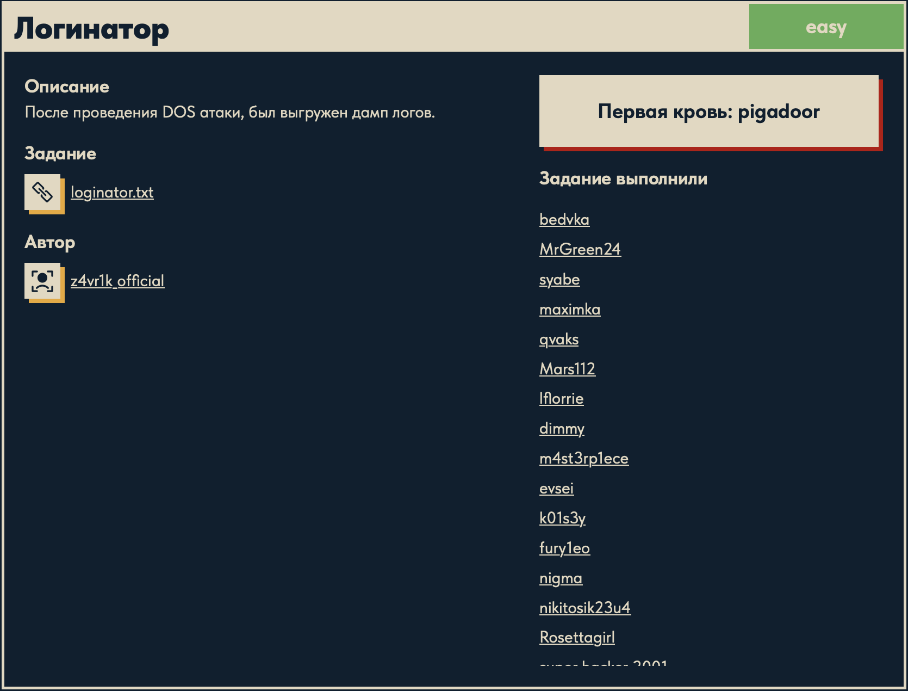

# Логинатор 🕵️

## Описание задачи 📌

Название задачи:

```text
Логинатор
```

Сложность:

```text
Easy
```

Описание со страницы задачи:

```text
После проведения DOS атаки, был выгружен дамп логов.
```

В качестве файла задачи был дан текстовый файл с логами:

```text
loginator.txt
```

Скрин страницы задачи:



## Файл задачи 🔎

В задаче был дан файл:

```text
loginator.txt
```

Файл содержит строки логов. Первые строки выглядят так:

```text
2024-12-04 00:34:47,693 - ERROR - Ошибка при обработке запроса GET /login.php от 8.8.8.8 (user2)
2024-12-04 00:34:47,693 - INFO - DELETE /admin/dashboard от 192.168.1.100 (admin) с агентом Safari/537.36
2024-12-04 00:34:47,693 - INFO - PUT /api/data от 172.16.254.1 (user2) с агентом Google Chrome
2024-12-04 00:34:47,693 - INFO - GET /admin/dashboard от 8.8.8.8 (user1) с агентом Safari/537.36
2024-12-04 00:34:47,693 - INFO - POST /api/data от 8.8.8.8 (admin) с агентом Mozilla/5.0
```

## Первичный осмотр логов 🧠

По первым строкам видно, что каждая запись содержит:

1. Дату и время события.
2. Уровень лога: `INFO`, `WARNING`, `ERROR`.
3. Описание действия.
4. HTTP-метод: `GET`, `POST`, `PUT`, `DELETE`.
5. Путь запроса, например `/login.php`, `/admin/dashboard`, `/api/data`.
6. IP-адрес источника.
7. Имя пользователя в скобках.
8. Иногда user-agent браузера.

Пример строки:

```text
2024-12-04 00:34:47,694 - INFO - PUT /flag.php/D от 172.16.254.1 (guest) с агентом Google Chrome
```

При просмотре логов стало заметно, что среди обычных запросов встречаются строки с путем вида:

```text
/flag.php/<символ>
```

Например:

```text
2024-12-04 00:34:47,694 - INFO - PUT /flag.php/D от 172.16.254.1 (guest) с агентом Google Chrome
```

В таких строках после `/flag.php/` находится один символ. Эти символы идут по логам в нужном порядке и собираются в флаг.

## Скрипт для извлечения флага 🧠

Для автоматического извлечения символов был написан небольшой Python-скрипт:

```python
with open("loginator.txt", "r", encoding="utf-8") as file:
      for line in file:
          if "/flag.php/" in line:
              part = line.split("/flag.php/")[1]
              symbol = part[0]
              print(symbol, end="")

print()
```

## Разбор скрипта ⚙️

Открываем файл логов:

```python
with open("loginator.txt", "r", encoding="utf-8") as file:
```

Здесь важно несколько моментов.

```text
loginator.txt
```

Это файл с логами, который был дан в задаче.

```text
"r"
```

Означает режим чтения. Скрипт не изменяет файл, а только читает его содержимое.

```text
encoding="utf-8"
```

Нужно, потому что в логах есть русский текст:

```text
Ошибка при обработке запроса
Неудачная попытка авторизации
```

Если явно указать `utf-8`, Python корректно прочитает кириллицу.

```python
with open(...) as file:
```

Конструкция `with` сама закрывает файл после завершения работы. Это удобнее и безопаснее, чем открывать файл вручную и потом отдельно вызывать `close()`.

Дальше скрипт идет по файлу построчно:

```python
for line in file:
```

Лог устроен так, что каждое событие записано отдельной строкой. Поэтому читать файл построчно удобно: одна итерация цикла - одна запись лога.

Затем проверяем, есть ли в строке нужный путь:

```python
if "/flag.php/" in line:
```

Почему именно так: в обычных строках встречаются пути вроде:

```text
/login.php
/admin/dashboard
/api/data
/index.html
```

А символы флага находятся только в строках, где есть:

```text
/flag.php/
```

Поэтому такая проверка отсекает весь шум и оставляет только строки, связанные с флагом.

После этого строка делится по маркеру `/flag.php/`:

```python
part = line.split("/flag.php/")[1]
```

Метод `.split()` - это строковый метод Python. Он разбивает строку на части по указанному разделителю и возвращает список.

Простой пример:

```python
"hello/world/test".split("/")
```

Результат:

```python
["hello", "world", "test"]
```

То есть разделитель `/` исчезает, а все фрагменты между разделителями становятся элементами списка.

Почему это работает:

если строка такая:

```text
2024-12-04 00:34:47,694 - INFO - PUT /flag.php/D от 172.16.254.1 (guest) с агентом Google Chrome
```

то после разделения по `/flag.php/` получится список из двух частей:

```text
часть 0: 2024-12-04 00:34:47,694 - INFO - PUT 
часть 1: D от 172.16.254.1 (guest) с агентом Google Chrome
```

Индекс `[1]` берется потому, что нужный символ находится после `/flag.php/`, то есть во второй части.

Дальше берется первый символ этой второй части:

```python
symbol = part[0]
```

Почему именно первый символ: после `/flag.php/` в логе сразу стоит очередной символ флага, а затем идет пробел и остальная информация:

```text
D от 172.16.254.1 ...
```

Значит `part[0]` для этой строки будет:

```text
D
```

После этого символ печатается:

```python
print(symbol, end="")
```

Обычный `print()` после каждого вывода добавляет перенос строки. Здесь это не подходит, потому что символы нужно склеить в одну строку.

Параметр:

```text
end=""
```

говорит Python не добавлять перевод строки после символа. Поэтому все найденные символы печатаются подряд и собираются в один флаг.

В конце:

```python
print()
```

добавляет обычный перенос строки, чтобы после вывода флага терминал выглядел аккуратно.

## Запуск скрипта 🏁

Скрипт нужно запускать из папки задачи, потому что он открывает файл по относительному пути `loginator.txt`:

```bash
cd forensics/Loginator
python3 log.py
```

Результат:

```text
DUCKERZ{...}
```

Флаг был собран из символов, которые находились в запросах вида:

```text
PUT /flag.php/<символ>
```

## Итог 🏁

Краткая цепочка решения:

```text
получен loginator.txt -> найден шаблон /flag.php/<символ> -> написан log.py -> собран флаг
```

Суть задачи: в большом дампе логов символы флага были спрятаны в URL запросов к `/flag.php/`.

Автор: masquadd :) ✍️
