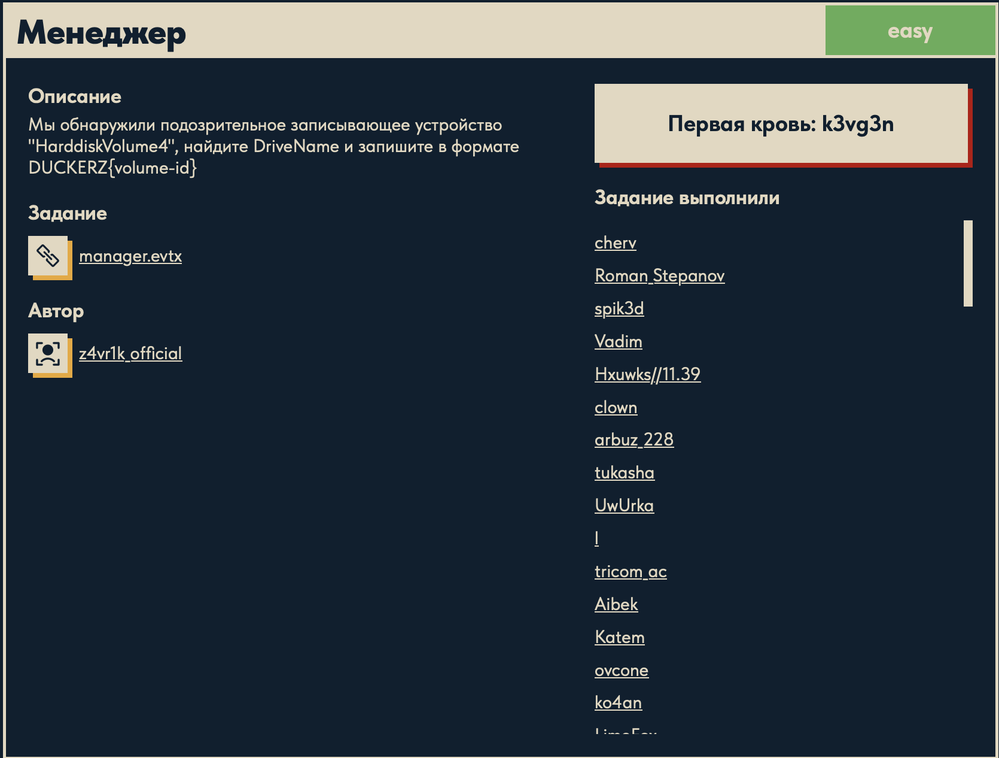

# Менеджер 🗂️

## Описание задачи

Задача: **Менеджер**

Сложность: 

Описание с платформы:

> Мы обнаружили подозрительное записывающее устройство "HarddiskVolume4", найдите DriveName
> и запишите в формате DUCKERZ{volume-id}

Задание:

```text
manager.evtx
```

Автор задачи:

```text
z4vr1k_official
```

Первая кровь:

```text
k3vg3n
```

Скрин с названием и описанием:



---

## Первый взгляд 👀

Дан файл:

```text
manager.evtx   (~1.1 МБ)
```

Расширение `.evtx` — это **журнал событий Windows** (Windows Event Log). Это бинарный формат,
в котором Windows хранит системные, прикладные и диагностические события: входы в систему,
запуск процессов, подключение устройств, ошибки служб и т.д.

Что уже понятно из условия:

- Речь про **устройство `\Device\HarddiskVolume4`** — это внутреннее имя тома в Windows.
  Windows нумерует тома как `HarddiskVolume1`, `HarddiskVolume2`, … и работает с ними по
  этим именам на низком уровне.
- Нужно найти **DriveName** этого тома — то есть его понятный/уникальный идентификатор.
  В диагностических журналах томам сопоставляется **GUID тома** (вида `Volume{XXXXXXXX-...}`).
- Ответ оформляется как **`DUCKERZ{volume-id}`** .

Скорее всего нужный артефакт лежит в журнале **Microsoft-Windows-Partition/Diagnostic**
(события с ID `1006`) — там Windows логирует характеристики дисков и томов: модель,
серийный номер, а также имена вида `HarddiskVolumeN` и связанные с ними идентификаторы.

---

## Что такое «том» (volume) в Windows 🧱

Чтобы понять условие, разложим цепочку **диск → раздел → том**:

- **Физический диск (disk)** — само устройство хранения: HDD, SSD, USB-флешка. В Windows
  видится как `\\.\PhysicalDrive0`, `PhysicalDrive1` и т.д.
- **Раздел (partition)** — выделенный кусок диска, размеченный в таблице разделов (MBR/GPT).
  Один диск может быть поделён на несколько разделов.
- **Том (volume)** — это **логическая область с файловой системой** (NTFS, FAT32, exFAT),
  которую пользователь реально видит и использует. Обычно том лежит поверх раздела, но не
  всегда один-к-одному: том может охватывать несколько дисков (RAID, spanned) или быть
  виртуальным (VHD, зашифрованный контейнер, смонтированный образ).

Именно тому Windows назначает **букву диска** (`C:`, `D:`, `E:`) — это то, что видит человек.

### Как том называется «внутри» Windows

Буква диска — лишь удобный ярлык. На низком уровне у каждого тома есть служебные имена:

- **Имя устройства тома:** `\Device\HarddiskVolume1`, `\Device\HarddiskVolume2`, … — так том
  называет **менеджер томов** ядра. Именно такое имя (`HarddiskVolume4`) фигурирует в условии.
  Номер выдаётся по мере появления томов и не привязан жёстко к букве.
- **GUID тома:** `\\?\Volume{XXXXXXXX-XXXX-XXXX-XXXX-XXXXXXXXXXXX}\` — глобально уникальный
  идентификатор тома. Он стабилен и не зависит от буквы диска (буква может меняться, а GUID —
  нет). Это и есть **DriveName / volume-id**, который нужен в задаче.
- **Буква диска:** `C:` — это просто символическая ссылка (алиас) на `\Device\HarddiskVolumeN`.

Все эти имена — по сути **разные псевдонимы одного и того же тома**. Сопоставлением
«буква ↔ `HarddiskVolumeN` ↔ `Volume{GUID}`» занимается системный компонент
**Mount Manager (`mountmgr`)** — отсюда и название задачи «Менеджер».

### Почему это важно для форензики

Когда к системе подключают «подозрительное записывающее устройство» (USB-накопитель),
Windows заводит для него новый том `HarddiskVolumeN` и присваивает GUID. Эти сопоставления
остаются в журналах событий и в реестре (`MountedDevices`), даже если устройство давно
отключено. Поэтому по номеру `HarddiskVolume4` можно поднять журнал и восстановить его
постоянный идентификатор — `Volume{GUID}`, что мы и делаем в этой задаче.

---

## План решения

```text
1. Быстрая проверка: strings (UTF-16) + grep по 'HarddiskVolume4' и 'DriveName'
2. Полноценный разбор .evtx парсером (python-evtx) в текст/XML
3. Найти событие, где упоминается HarddiskVolume4, и рядом прочитать поле DriveName
4. Извлечь volume-id и оформить ответ DUCKERZ{volume-id}
```

---

## Решение 🔧

### Шаг 1. Быстрая проверка через `strings`

По аналогии с задачей «Ищейка» сначала попробовали дешёвый путь — вдруг нужное имя лежит
в файле открытым текстом. `.evtx` хранит строки в UTF-16, поэтому режим `-e l`:

```bash
strings -e l manager.evtx | grep -i "HarddiskVolume4"
strings -e l manager.evtx | grep -i "DriveName"
```

Это годится как разведка, но `strings` рвёт структуру событий: даже если имена мелькнут,
неясно, какое `DriveName` относится к какому `DeviceName`. Нужен нормальный разбор журнала
в XML, где видно, какие поля лежат внутри одного события.

### Шаг 2. Установка парсера `python-evtx`

`.evtx` — бинарный формат (binary XML с шаблонами), глазами не читается. Ставим парсер
в изолированное окружение (системный Python на macOS «externally managed»):

```bash
python3 -m venv venv
source venv/bin/activate
pip install python-evtx
```

### Шаг 3. Грабли с запуском парсера (важно для повторения)

Несколько тупиков, через которые пришлось пройти, — фиксирую, чтобы не наступить снова:

1. **`evtx_dump.py manager.evtx` → `command not found`.** Готовый CLI-скрипт не оказался
   в `PATH`.
2. **`python -m Evtx.Evtx manager.evtx > manager.xml` → файл пустой, но без ошибок.**
   Причина: `Evtx.Evtx` — это модуль с классом парсера, а **не** утилита командной строки.
   Запуск через `-m` просто импортирует его и ничего не печатает, поэтому в файл уходит пусто.
3. **Проверка ошибок:** `python -m Evtx.Evtx manager.evtx > manager.xml 2> err.log`, затем
   `head err.log` — пусто. Раз ошибок нет, а вывод пустой, значит модуль действительно ничего
   не выводит (а не падает).
4. **Поиск скрипта:** `find venv -name "evtx_dump*.py"` — ничего. В этой сборке `python-evtx`
   поставил только библиотеку, без CLI-скриптов.

### Шаг 4. Свой мини-дампер на библиотеке `python-evtx`

Раз готового CLI нет — написали свой в три строки, используя уже установленную библиотеку:

```bash
cat > dump.py <<'EOF'
from Evtx.Evtx import Evtx
with Evtx("manager.evtx") as log:
    for r in log.records():
        print(r.xml())
EOF

python dump.py > manager.xml
wc -l manager.xml     # -> 15448
```

Что делает скрипт:

- `Evtx("manager.evtx")` — открывает журнал событий;
- `log.records()` — перебирает все записи (события) по очереди;
- `r.xml()` — рендерит каждое событие в человекочитаемый XML;
- `print(...)` — выводим их, перенаправляя в `manager.xml`.

Результат — `manager.xml` на **15 448 строк**, полноценный дамп журнала в XML.

### Шаг 5. Поиск нужного события

Ищем все упоминания дисков/томов и полей `DriveName` сразу:

```bash
grep -in "harddisk\|drivename\|volume" manager.xml | head -20
```

Ключевые строки вывода (GUID замаскирован — это и есть флаг):

```text
292:  <Data Name="DriveName">C:</Data>
293:  <Data Name="DeviceName">\Device\HarddiskVolume3</Data>
...
2940: <Data Name="DriveName">\\?\Volume{XXXXXXXX-XXXX-XXXX-XXXX-XXXXXXXXXXXX}</Data>
2941: <Data Name="DeviceName">\Device\HarddiskVolume4</Data>
```

Наблюдение: в журнале несколько пар `DriveName`/`DeviceName`:

- у **`HarddiskVolume3`** значение `DriveName` = **`C:`** — это системный том с буквой диска;
- у **`HarddiskVolume4`** значение `DriveName` = **`\\?\Volume{...}`** — том **без буквы**,
  только с GUID. Отсутствие буквы диска характерно для съёмного/подключаемого устройства —
  ровно того «подозрительного записывающего устройства» из условия.

### Шаг 6. Разбор найденного события

Смотрим событие целиком, чтобы понять его происхождение:

```bash
sed -n '2925,2945p' manager.xml
```

```xml
<Event ...><System>
  <Provider Name="Microsoft-Windows-Ntfs" Guid="{3ff37a1c-a68d-4d6e-8c9b-f79e8b16c482}"/>
  <EventID Qualifiers="">98</EventID>
  <Level>4</Level>
  <TimeCreated SystemTime="2024-12-01 15:38:26.280643+00:00"/>
  <EventRecordID>135</EventRecordID>
  <Channel>System</Channel>
  <Computer>DESKTOP-DMF0A8P</Computer>
  <Security UserID="S-1-5-18"/>
</System>
<EventData>
  <Data Name="DriveName">\\?\Volume{XXXXXXXX-XXXX-XXXX-XXXX-XXXXXXXXXXXX}</Data>
  <Data Name="DeviceName">\Device\HarddiskVolume4</Data>
  <Data Name="CorruptionActionState">0</Data>
</EventData>
</Event>
```

Что это за событие:

- **Provider `Microsoft-Windows-Ntfs`, EventID `98`, канал `System`.** (Начальная гипотеза про
  `Partition/Diagnostic` 1006 не подтвердилась — искомое сопоставление логирует сам драйвер
  NTFS.) Событие Ntfs 98 — служебная запись о состоянии тома, в которой NTFS явно печатает
  **связку `DriveName` ↔ `DeviceName`** для тома.
- **`DeviceName` = `\Device\HarddiskVolume4`** — то самое устройство из условия.
- **`DriveName` = `\\?\Volume{...}`** — его постоянный идентификатор (GUID тома). Это и есть
  ответ.
- Время `2024-12-01 15:38:26 UTC`, машина `DESKTOP-DMF0A8P`, `UserID S-1-5-18` (LocalSystem) —
  событие сгенерировано системой при работе с этим томом.

### Извлечение ответа

Условие: *найти `DriveName` устройства `HarddiskVolume4` и записать в формате
`DUCKERZ{volume-id}`*. `DriveName` = `\\?\Volume{<GUID>}`, а `volume-id` — это сам GUID
внутри `Volume{...}`. Оформляем флаг:

```text
DUCKERZ{...}
```

---

## Почему это работает 🧠

1. **Windows сам логирует сопоставление имён тома.** Драйвер NTFS в событии `System / Ntfs 98`
   печатает пару `DeviceName` (`\Device\HarddiskVolumeN`) ↔ `DriveName` (буква или GUID тома).
   Поэтому по номеру `HarddiskVolume4` из условия можно поднять его постоянный `Volume{GUID}`.
2. **GUID тома стабилен и уникален** — в отличие от буквы диска или номера `HarddiskVolumeN`,
   которые могут меняться. Именно он однозначно идентифицирует «записывающее устройство».
3. **Съёмное устройство выделяется на фоне системного тома:** у `HarddiskVolume3` есть буква
   `C:`, а у `HarddiskVolume4` буквы нет — только GUID, что типично для подключаемого носителя.

---

## Итог 🏁

Цепочка решения:

```text
manager.evtx (журнал событий Windows)
-> strings (быстрая разведка) — недостаточно, нужна структура
-> python-evtx в venv; готового CLI нет -> свой dump.py -> manager.xml (15448 строк)
-> grep 'harddisk|drivename|volume' -> находим пару DriveName/DeviceName
-> событие System / Microsoft-Windows-Ntfs / EventID 98:
     DeviceName = \Device\HarddiskVolume4
     DriveName  = \\?\Volume{<GUID>}
-> volume-id = GUID -> ответ DUCKERZ{<GUID>}
```

Флаг:

```text
DUCKERZ{...}
```

---

## Текущий статус

Задача решена.

Зафиксировано:

- название задачи, сложность `Easy`, описание с платформы, автор `z4vr1k_official`, первая кровь `k3vg3n`;
- формат ответа `DUCKERZ{volume-id}`;
- дан журнал событий Windows `manager.evtx`;
- разобрано, что такое том в Windows и как он именуется (`HarddiskVolumeN`, GUID, буква диска);
- журнал распарсен своим `dump.py` на базе `python-evtx` в `manager.xml`;
- найдено событие `System / Microsoft-Windows-Ntfs / EventID 98`, связывающее
  `\Device\HarddiskVolume4` с `DriveName = \\?\Volume{<GUID>}`;
- ответ оформлен как `DUCKERZ{<volume-id>}` (GUID тома).

---

Автор: **masquadd :)** ✍️
