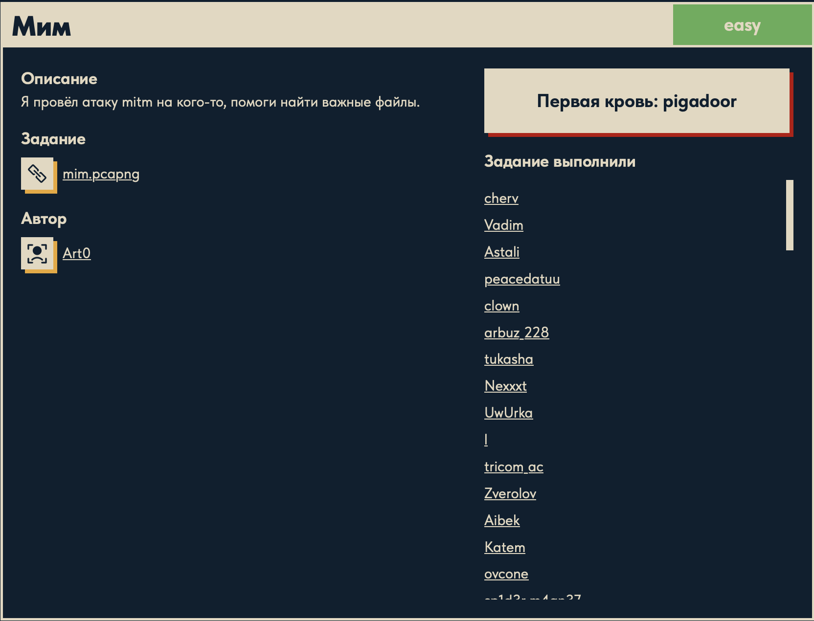
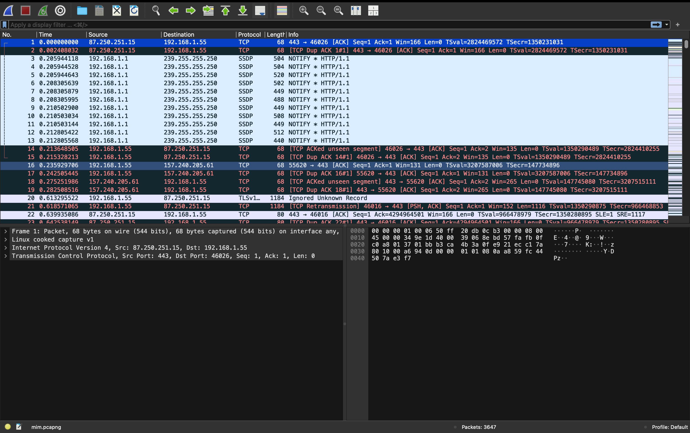
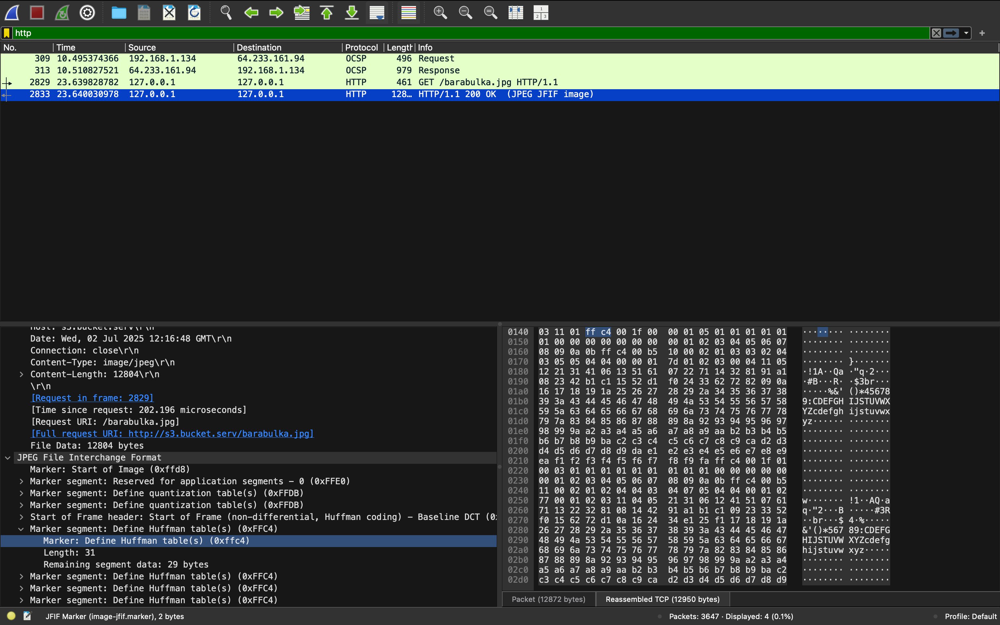
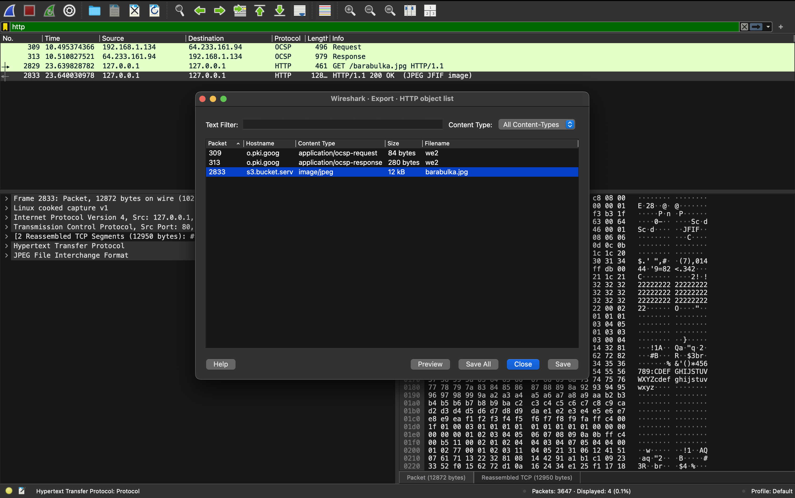

# Мим 🕵️‍♂️

## Описание задачи

Задача: **Мим**

Сложность: 

Описание с платформы:

> Я провёл атаку mitm на кого-то, помоги найти важные файлы.

Задание:

```text
mim.pcapng
```

Автор задачи:

```text
Art0
```

Первая кровь:

```text
pigadoor
```

Скрин с названием и описанием:



---

## Первый взгляд 👀

Дан файл `mim.pcapng` (~2 МБ). Тип:

```bash
file mim.pcapng
# -> pcapng capture file - version 1.0
```

**pcapng** — формат дампа сетевого трафика (новее классического `.pcap`), открывается
Wireshark/tshark. Название «Мим» — это игра слов на **MITM** (man-in-the-middle): по описанию
кто-то перехватил чужой трафик, и в нём остались «важные файлы».

Быстрая разведка строк даёт направление:

```bash
strings mim.pcapng | grep -iE "content-type|duckerz|filename|boundary" | head
```

```text
Content-Type: application/ocsp-request     # проверки TLS-сертификатов (был HTTPS)
Content-Type: application/ocsp-response
duckerz.ru / backend.duckerz.ru            # хосты
Content-Type: image/jpeg                    # по HTTP передавалась картинка!
```

Ключевые выводы:

- в дампе есть **plaintext-HTTP** (раз заголовки `Content-Type` читаются напрямую) — значит
  часть файлов передавалась в открытом виде и её можно достать;
- среди переданного есть как минимум **JPEG-изображение** — вероятный кандидат на «важный файл»
  и носитель флага;
- OCSP-трафик (`application/ocsp-*`) — это служебные проверки сертификатов, к флагу вряд ли
  относятся, но подтверждают, что рядом шёл HTTPS.

---

## Инструмент: Wireshark и формат pcapng 🦈

### Что такое `.pcapng`

**pcapng** (PCAP Next Generation) — современный формат хранения **захваченного сетевого
трафика**, преемник классического `.pcap`. Внутри — сырые пакеты «как с провода» плюс
метаданные (описания интерфейсов, точные временные метки, комментарии). Файл состоит из блоков
(заголовок секции, описания интерфейсов, блоки пакетов), и каждый пакет сохранён со всеми
уровнями — от канального (Ethernet / Linux cooked) до прикладного (HTTP, TLS, DNS…). Открывается
Wireshark, `tshark`, `tcpdump`, `scapy`.

### Что такое Wireshark

**Wireshark** — самый популярный **анализатор сетевых протоколов** (сниффер). Он открывает
дампы (или захватывает трафик вживую) и раскладывает каждый пакет по уровням модели
(`Ethernet → IP → TCP → HTTP …`), понимая сотни протоколов. Для форензики особенно полезны:
фильтры отображения, «follow stream» (собрать поток целиком), **Export Objects** (вытащить
переданные файлы), поиск по содержимому.

### Интерфейс (по скрину)



Три главные панели:

1. **Список пакетов** (сверху) — таблица со столбцами: `No.` (номер), `Time` (время от начала
   захвата), `Source`/`Destination` (IP-адреса), `Protocol` (распознанный протокол),
   `Length` (размер), `Info` (краткое описание). Строки подкрашены по типам/проблемам.
2. **Детали пакета** (снизу слева) — разбор выбранного пакета **по уровням**:
   `Frame → Linux cooked capture → IPv4 → TCP → …`; раскрывая ветки, видишь каждое поле.
3. **Байты пакета** (снизу справа) — сырой дамп пакета в hex и ASCII.

Внизу статус-бар: имя файла и число пакетов (здесь **3647**).

### Что видно в этом дампе

- Захват сделан на Linux — псевдо-уровень **`Linux cooked capture v1`** (интерфейс `any`).
- Много **TCP на порт 443** (HTTPS/TLS — шифрование), плюс `SSDP` (обнаружение устройств в
  локальной сети) и `TLSv1`.
- Хосты вроде `87.250.251.15` (Яндекс), `157.240.205.61` (Facebook) — обычный веб-трафик жертвы,
  перехваченный при MITM.
- Нам нужен **не** зашифрованный TLS, а **plaintext-HTTP**-передачи (где читается `Content-Type`),
  из которых и вытащим «важные файлы».

---

## Инструменты 🧰

- **Wireshark** (GUI) — открыть дамп, `File → Export Objects → HTTP`, сохранить переданные файлы.
- **tshark** (CLI, есть в системе) — то же самое без GUI:
  `tshark -r mim.pcapng --export-objects http,<папка>`.
- **strings / file** — быстрый осмотр и опознание вытащенных файлов.

---

## План решения

```text
1. Опознать дамп (pcapng), быстрая разведка strings                     [сделано]
2. Экспортировать HTTP-объекты (Wireshark Export Objects / tshark --export-objects)
3. Просмотреть вытащенные файлы (картинка/документы) — искать флаг
4. При необходимости — метаданные/strings по файлам -> флаг DUCKERZ{...}
```

---

## Разведка HTTP: фильтр `http` 🔎

Чтобы среди 3647 пакетов увидеть только веб-запросы, вводим в строку фильтра Wireshark:

```text
http
```

Фильтр отображения оставляет лишь HTTP-пакеты. Сразу проступает нужная передача:



Что видно:

- пакет `GET /barabulka.jpg HTTP/1.1` — запрос файла;
- ответ `HTTP/1.1 200 OK (JPEG JFIF image)` — сервер отдал **JPEG-картинку**;
- в деталях пакета: `Full request URI: http://s3.bucket.serv/barabulka.jpg`,
  `Content-Type: image/jpeg`, `Content-Length: 12804`, `File Data: 12804 bytes`;
- Wireshark даже разобрал внутреннюю структуру JPEG (маркеры `Start of Image 0xFFD8`,
  таблицы квантования `DQT`, Хаффмана `DHT`, `Start of Frame`) — подтверждение, что это
  валидное изображение.

Ещё деталь: запрос/ответ идут между `127.0.0.1` (localhost) — значит MITM выполнен через
**локальный прокси** (типа mitmproxy/Burp), который и расшифровал/пропустил трафик в открытом
HTTP. Поэтому файл доступен в plaintext.

Вывод: «важный файл» — это **`barabulka.jpg`** (12804 байта) с `s3.bucket.serv`. Осталось
вытащить его из дампа и посмотреть — флаг наверняка в самой картинке или её метаданных.

---

## Шаг: вытащить файл через Wireshark (Export Objects) 📤

Wireshark умеет собрать переданный по HTTP файл из пакетов обратно в целый файл:

1. Меню **File → Export Objects → HTTP…**.
2. Откроется окно **«Export · HTTP object list»** — таблица всех HTTP-объектов со столбцами
   `Packet`, `Hostname`, `Content Type`, `Size`, `Filename`.
3. Находим строку с **`Filename = barabulka.jpg`** (`Hostname: s3.bucket.serv`,
   `Content Type: image/jpeg`, `Size: 12804`). Для скорости — вписать `barabulka` в поле
   **Text Filter** внизу окна.
4. Кликаем по строке (Wireshark подсветит соответствующий пакет).
5. Кнопка **Save** → выбрать папку и сохранить как `barabulka.jpg` (или **Save All** — выгрузить
   все объекты сразу).



В окне видно три объекта:

| Packet | Hostname | Content Type | Size | Filename |
|---|---|---|---|---|
| 309 | o.pki.goog | application/ocsp-request | 84 B | we2 |
| 313 | o.pki.goog | application/ocsp-response | 280 B | we2 |
| **2833** | **s3.bucket.serv** | **image/jpeg** | **12 kB** | **barabulka.jpg** |

Первые два (`we2`) — служебные OCSP-проверки сертификатов Google, мусор. Нужен третий —
`barabulka.jpg`. Как Wireshark это делает: он **собирает TCP-поток обратно** — тело HTTP-ответа
разбито на несколько пакетов (в деталях видно `2 Reassembled TCP Segments`), и Wireshark
склеивает их в исходные байты файла. Выделяем строку и жмём **Save**.

То же самое без GUI — одной командой `tshark`:

```bash
tshark -r mim.pcapng --export-objects http,objects
ls objects/          # -> barabulka.jpg
```

Осталось открыть картинку и посмотреть:

```bash
open barabulka.jpg
```

---

## Результат: флаг на картинке 🚩

Открываем `barabulka.jpg` — и флаг **нарисован прямо на изображении** (жёлтым текстом на
тёмном фоне), виден сразу глазами:


Это и есть тот «важный файл», который жертва скачивала по незащищённому HTTP, а атакующий
перехватил.

---

## В чём уязвимость 🎯

Задача про **перехват незашифрованного трафика** (MITM):

1. **Файл передавался по обычному HTTP, а не HTTPS.** Запрос `http://s3.bucket.serv/barabulka.jpg`
   шёл в открытом виде. Всё, что идёт по HTTP, доступно любому, кто находится на пути пакетов
   (man-in-the-middle): содержимое, заголовки, имена файлов — всё в plaintext.
2. **Полный файл тривиально восстанавливается из дампа.** HTTP-ответ разбит на TCP-пакеты, но
   Wireshark (Export Objects) склеивает их обратно в исходный `barabulka.jpg` — байт в байт.
   Никакой расшифровки не требуется.
3. **Секрет (флаг) утёк вместе с картинкой.** Раз чувствительные данные передавались без
   шифрования, перехватчик получил их целиком.

Мораль: **любые данные нужно передавать по TLS/HTTPS**. Незашифрованный HTTP полностью
раскрывает содержимое перед сниффером/MITM — как и произошло здесь. (Обрати внимание: остальной
трафик жертвы шёл по TLS на порт 443, а вот этот файл «выпал» в открытый HTTP — одной такой
бреши достаточно.)

---

## Итог 🏁

Цепочка решения:

```text
mim.pcapng (дамп MITM-трафика)
-> strings/Wireshark: есть plaintext-HTTP, Content-Type: image/jpeg
-> фильтр http -> GET /barabulka.jpg -> 200 OK (JPEG) с s3.bucket.serv
-> Export Objects -> HTTP -> сохранить barabulka.jpg (Wireshark склеивает TCP-поток)
-> открыть картинку -> флаг нарисован на изображении
```

Флаг:

```text
DUCKERZ{...}
```

---

## Текущий статус

Задача решена.

Зафиксировано:

- название, сложность `Easy`, описание (MITM-атака), автор `Art0`, первая кровь `pigadoor`;
- дан `mim.pcapng` — дамп сетевого трафика (pcapng);
- разобраны формат pcapng и инструмент Wireshark (панели, фильтры, Export Objects);
- фильтр `http` выявил передачу `GET /barabulka.jpg` → `200 OK (JPEG)` с `s3.bucket.serv`;
- файл вытащен через Wireshark **Export Objects → HTTP** (склейка TCP-потока);
- флаг оказался **нарисован на самой картинке** `barabulka.jpg`;
- уязвимость: передача файла по незашифрованному HTTP → перехват при MITM.

---

Автор: **masquadd :)** ✍️
