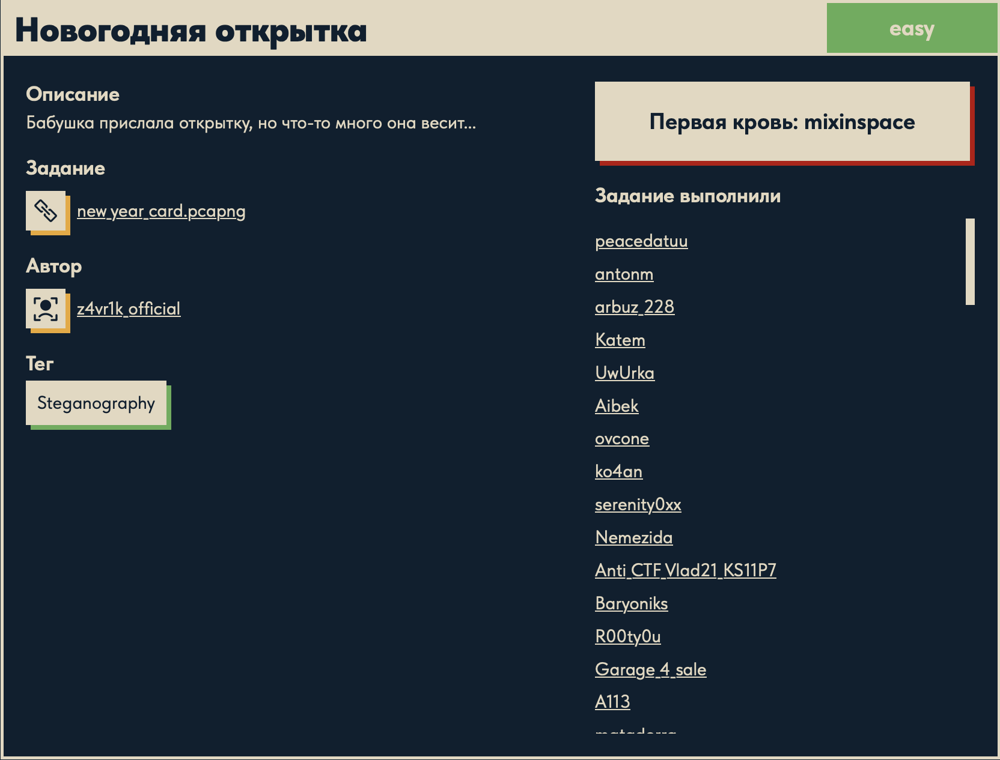
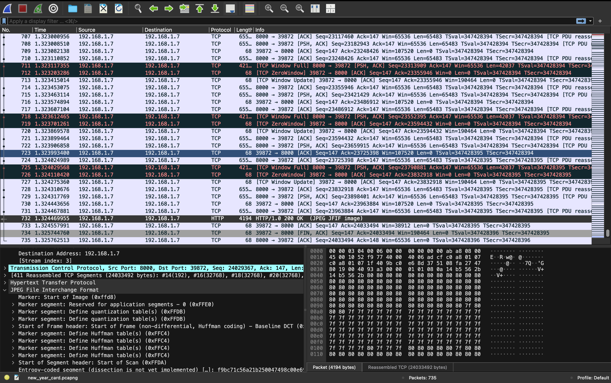
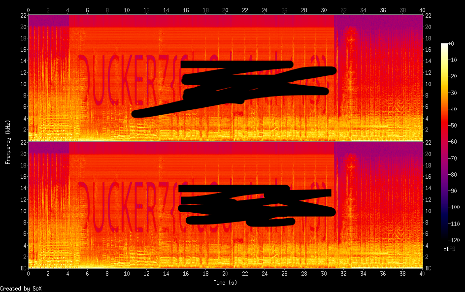

# Новогодняя открытка 🎄

## Описание задачи

Задача: **Новогодняя открытка**

Сложность: 

Тег: `Steganography`

Описание с платформы:

> Бабушка прислала открытку, но что-то много она весит...

Задание:

```text
new_year_card.pcapng
```

Автор задачи:

```text
z4vr1k_official
```

Первая кровь:

```text
mixinspace
```

Скрин с названием и описанием:



---

## Первый взгляд 👀

Дан дамп трафика `new_year_card.pcapng` (~24 МБ). Открываем в Wireshark:



Что видно:

- по HTTP (localhost, порт 8000) передавался **JPEG** — пакет `HTTP/1.0 200 OK (JPEG JFIF image)`;
- ответ собран из **411 TCP-сегментов**, итог ~**24 МБ**.

Значит первый шаг — как в задаче «Мим»: **вытащить переданный файл** (Wireshark →
`File → Export Objects → HTTP`, либо `tshark --export-objects http,<папка>`). Получаем
`NewYearCard.jpg`.

### Аномалия: картинка «много весит»

```bash
file NewYearCard.jpg
# -> JPEG image data, JFIF ... 1024x1024 ...
ls -l NewYearCard.jpg
# -> ~24 МБ
```

Обычный JPEG **1024×1024** весит сотни килобайт, а тут **24 МБ**. Это ровно та подсказка из
описания — «что-то много она весит». Классика стеганографии: **к картинке дописаны данные
после её конца** (маркер `FF D9`), которые не мешают показу изображения, но раздувают файл.

Проверка структуры показывает: после JPEG-открытки идёт приклеенный **WAV-аудиофайл**
(сигнатура `RIFF....WAVE`, PCM):

```bash
# ищем, где начинается RIFF/WAVE внутри NewYearCard.jpg
python3 -c "d=open('NewYearCard.jpg','rb').read(); print('RIFF at', d.find(b'RIFF'))"
# -> RIFF at 418882
```

То есть в один файл упаковали: **JPEG-открытку + WAV-песню** (отсюда 24 МБ). А раз задача про
стеганографию и внутри спрятан звук — флаг, скорее всего, **нарисован в спектрограмме аудио**
(как в задаче «Спектр звука»).

---

## Инструменты 🧰

- **binwalk / foremost** — найти и вытащить встроенные/дописанные файлы автоматически.
- **dd / Python** — вырезать WAV вручную с найденного смещения.
- **sox / Audacity / Sonic Visualiser** — построить спектрограмму WAV и прочитать флаг.

---

## План решения

```text
1. Из pcapng вытащить NewYearCard.jpg (Export Objects / tshark)             [сделано]
2. Заметить аномальный размер -> к JPEG дописан WAV (RIFF на смещении 418882)
3. Вырезать WAV (dd/Python/binwalk) в отдельный файл
4. Построить спектрограмму WAV (sox/Audacity) -> прочитать флаг DUCKERZ{...}
```

---

## Решение ⚙️

### Разведка картинки

```bash
exiftool NewYearCard.jpg          # обычные JPEG-метаданные, ничего лишнего
binwalk NewYearCard.jpg
# -> 0x0  JPEG image, total size: 418882 bytes
```

`binwalk` подтверждает: **реальное изображение — только первые 418882 байта**, остальные ~23.6 МБ
— «хвост». Отрезаем его в отдельный файл:

```bash
python3 -c "open('hidden.bin','wb').write(open('NewYearCard.jpg','rb').read()[418882:])"
file hidden.bin
# -> RIFF (little-endian) data, WAVE audio, Microsoft PCM, 8 bit, stereo 44100 Hz
mv hidden.bin hidden.wav
```

Хвост оказался **WAV-аудио**. Его метаданные (`ffmpeg -i hidden.wav`) выдают реальный трек:

```text
title  : Новогодняя
artist : Дискотека Авария
album  : НГ 2020
Duration: 00:04:27.73, pcm_u8, 44100 Hz, stereo
```

То есть в открытку-JPEG вклеили целую **новогоднюю песню** — вот и «много весит».

> Мелочь: в первых 418882 байтах на самом деле **два** JPEG-а (SOI на 0 и 209441) — сама
> открытка (утёнок в шапке Санты) продублирована. Флага на изображении нет, он в аудио.

### Спектрограмма: сначала пусто, потом — зум

Строим спектрограмму всего трека:

```bash
sox hidden.wav -n spectrogram -o spec.png
```

…и на первый взгляд **ничего** — просто музыка. Причина: трек длиной **4:27**, и при такой ширине
любой скрытый текст сжимается в нечитаемую полоску в 1–2 пикселя.

Решение — **приблизить нужный участок по времени**. Скрытый фрагмент находится примерно на
**190–230 секунде**; вырезаем этот отрезок и строим спектрограмму только по нему:

```bash
sox hidden.wav -n trim 190 40 spectrogram -o spec_zoom.png   # 40 сек с 190-й
open spec_zoom.png
```

Теперь в спектре чётко **нарисован флаг буквами**:



Флаг:

```text
DUCKERZ{...}
```

---

## В чём соль задачи 🎯

Многослойная стеганография «матрёшкой» + приём с масштабом:

1. **Файл передан по HTTP** и вытаскивается из pcap (Export Objects).
2. **К JPEG дописаны данные после `FF D9`** — картинка показывается нормально, но файл раздут
   (подсказка «много весит»). Реальный JPEG = первые 418882 байта, дальше — WAV.
3. **Флаг спрятан в спектрограмме аудио** — но замаскирован ещё и **длиной трека**: на полном
   4-минутном спектре текст не виден, нужно догадаться **приблизить** нужный отрезок по времени.

Приёмы на будущее: при аномальном размере файла всегда проверяй `binwalk`/хвост после `FF D9`;
для аудио-стего — не только строй спектрограмму, но и **зумь по времени и смотри каналы отдельно**.

---

## Итог 🏁

Цепочка решения:

```text
new_year_card.pcapng -> Export Objects -> NewYearCard.jpg (24 МБ, аномалия)
-> binwalk: реальный JPEG = 418882 байт, дальше хвост
-> вырезаем хвост -> hidden.wav (WAV, песня "Дискотека Авария - Новогодняя")
-> спектрограмма всего трека пустая -> zoom на 190-230с (sox trim)
-> в спектре нарисован флаг
```

Флаг:

```text
DUCKERZ{...}
```

---

## Текущий статус

Задача решена.

Зафиксировано:

- название, сложность `Easy`, тег `Steganography`, автор `z4vr1k_official`, первая кровь `mixinspace`;
- из pcapng вытащен `NewYearCard.jpg` (~24 МБ — аномальный размер);
- `binwalk`: реальный JPEG = 418882 байта, остальное — дописанный **WAV** (`RIFF` на 418882);
- WAV — реальный трек «Дискотека Авария — Новогодняя» (метаданные через `ffmpeg`/`exiftool`);
- спектрограмма всего трека пустая; флаг виден только при **zoom по времени** (`sox trim 190 40`);
- прочитан флаг `DUCKERZ{...}` из спектрограммы участка.

---

Автор: **masquadd :)** ✍️
