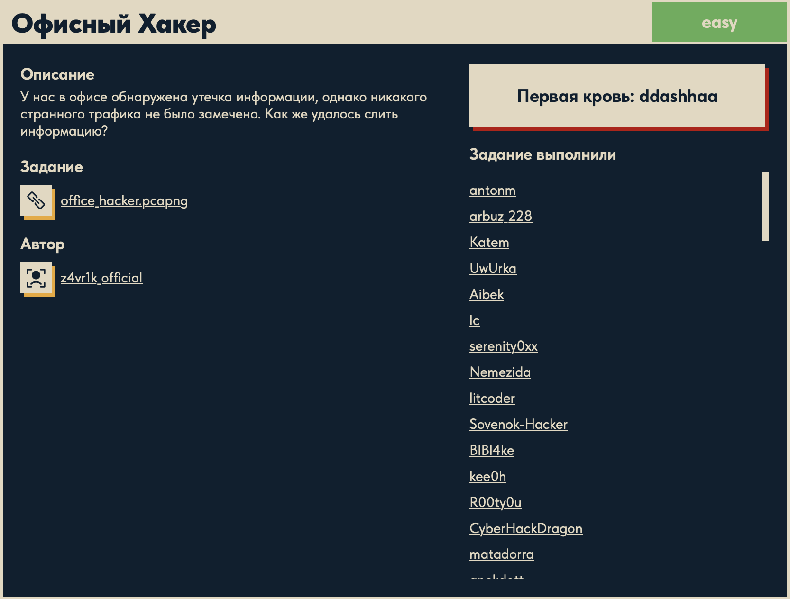
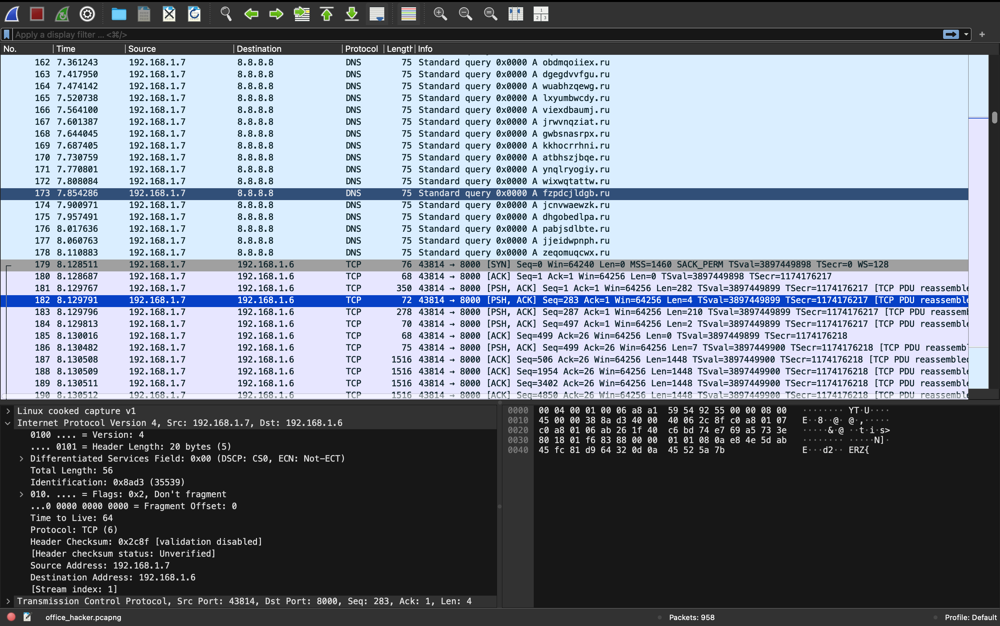
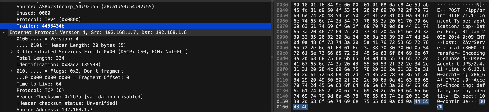

# Офисный Хакер 🏢

## Описание задачи

Задача: **Офисный Хакер**

Сложность: 

Описание с платформы:

> У нас в офисе обнаружена утечка информации, однако никакого странного трафика не было
> замечено. Как же удалось слить информацию?

Задание:

```text
office_hacker.pcapng
```

Автор задачи:

```text
z4vr1k_official
```

Первая кровь:

```text
ddashhaa
```

Скрин с названием и описанием:



---

## Первый взгляд 👀

Дан дамп трафика `office_hacker.pcapng` (~1 МБ, 958 пакетов). Открываем в Wireshark:



В глаза бросаются **две** вещи:

1. **Поток DNS-запросов** от `192.168.1.7` к `8.8.8.8` на странные домены со случайными
   именами: `obdmqoiiex.ru`, `dgegdvvfgu.ru`, `wuabhzqewg.ru`, `lxyumbwcdy.ru`, … Это типичный
   признак **DNS-туннелирования / эксфильтрации через DNS**: данные кодируют в именах доменов.
   DNS почти всегда разрешён и «не считается странным трафиком» — ровно то, о чём спрашивает
   описание («странного трафика не замечено»).
2. **TCP-поток** `192.168.1.7 → 192.168.1.6:8000` (порт 8000, `PSH, ACK`). В payload одного из
   пакетов уже виден фрагмент **`ERZ{`** (в hex `45 52 5a 7b`) — это часть `DUCKERZ{`. Значит
   флаг передаётся по этому TCP-потоку, разбитый по пакетам.

Рабочая гипотеза: флаг лежит в **TCP-потоке на порт 8000** — нужно собрать поток целиком
(`Follow TCP Stream`) и прочитать. DNS-запросы — либо второй канал эксфильтрации, либо шум/
приманка, обыгрывающая тему «утечки без странного трафика».

---

## Инструменты 🧰

- **Wireshark** — `Follow → TCP Stream` (собрать поток), фильтры `tcp.port == 8000` / `dns`.
- **tshark** — вытащить данные потока: `tshark -r office_hacker.pcapng -z follow,tcp,raw,<n>`
  или экспорт по фильтру.
- **strings / CyberChef** — если данные закодированы (base64/hex).

---

## План решения

```text
1. Опознать дамп, увидеть DNS-шум + TCP-поток на :8000 с фрагментом флага   [сделано]
2. Follow TCP Stream на разговоре 43814 -> 8000, собрать поток целиком
3. Прочитать/декодировать флаг из потока -> DUCKERZ{...}
4. (при необходимости) проверить DNS-запросы как второй канал эксфильтрации
```

---

## Что на самом деле в TCP-потоке

Разговор `192.168.1.7 → 192.168.1.6:8000` оказался **обычной печатью по IPP** (Internet Printing
Protocol): `POST /ipp/print HTTP/1.1`, `Host: ZAvrServer.local:8000`, `User-Agent: CUPS/2.4.11
(Linux ... x86_64) IPP/2.0`. То есть на первый взгляд — сотрудник просто отправил документ на
печать. Никакого «странного трафика», как и сказано в описании.

Но при внимательном разборе кадров видно необычное поле — **трейлер (Trailer)**:



```text
Trailer: 4455434b     ->  0x44 0x55 0x43 0x4b  =  "DUCK"
```

### Что такое трейлер кадра

Дамп снят на Linux в формате **SLL (Linux cooked capture)**. У кадра канального уровня после
полезных данных иногда идёт **трейлер / паддинг** — «хвостовые» байты (обычно нули), которыми
добивают кадр до минимального размера. Эти байты **не относятся к содержимому пакета** и
поэтому **игнорируются** обычным анализом трафика.

Здесь «офисный хакер» использовал трейлер как **скрытый канал**: в хвост каждого кадра
IPP-печати он дописал по несколько байт флага. Трафик выглядит как штатная печать, а секрет
утекает в невидимом для мониторинга «довеске». Отсюда и загадка «утечка без странного трафика».

---

## Решение: сбор флага из трейлеров ⚙️

Флаг разбит по трейлерам пакетов IPP-потока (кадры ~181–191). Собираем их скриптом:

```python
import subprocess, re

out = subprocess.run(
    ["tshark", "-r", "office_hacker.pcapng",
     "-Y", "frame.number>=181 && frame.number<=191",   # только кадры потока с флагом
     "-T", "fields", "-e", "sll.trailer"],              # берём ТОЛЬКО поле трейлера
    capture_output=True, text=True
).stdout

hexstr = re.sub(r'[^0-9a-fA-F]', '', out)               # оставить только hex-цифры
print(bytes.fromhex(hexstr).decode(errors="replace"))   # hex -> байты -> текст
```

Разбор построчно:

- **`subprocess.run([...])`** — запускаем `tshark` из Python и забираем его вывод как текст
  (`capture_output=True, text=True`). Аргументы tshark:
  - `-r office_hacker.pcapng` — читать дамп;
  - `-Y "frame.number>=181 && frame.number<=191"` — **display-фильтр**: только кадры 181–191
    (пакеты IPP-потока, в трейлерах которых сидит флаг);
  - `-T fields -e sll.trailer` — вывести **только значение поля `sll.trailer`** (трейлер
    SLL-кадра) для каждого подходящего пакета. `sll` = Linux cooked capture, `trailer` — те самые
    «хвостовые» байты.
- **`re.sub(r'[^0-9a-fA-F]', '', out)`** — tshark печатает трейлеры с разделителями
  (`44:55:43:4b`) и по строке на пакет; регулярка выкидывает всё, кроме hex-цифр (`0-9 a-f A-F`),
  склеивая трейлеры всех пакетов в одну непрерывную hex-строку.
- **`bytes.fromhex(hexstr)`** — превращает hex-строку в байты.
- **`.decode(errors="replace")`** — трактует байты как текст (ASCII); `errors="replace"`
  не даёт скрипту упасть, если попадётся неотображаемый байт (заменит на `�`).
- **`print(...)`** — выводит собранный флаг.

Результат:

```text
DUCKERZ{...}
```

---

## В чём соль задачи 🎯

Это **скрытый канал (covert channel) в паддинге/трейлере кадра**:

1. **Прикрытие — легитимный трафик.** Данные шли внутри обычной **IPP-печати** (документ на
   принтер) — такой трафик в офисе никого не насторожит.
2. **Секрет — в «невидимом» поле.** Байты флага дописаны в **трейлер кадра** после полезных
   данных. Трейлер — это обычно паддинг, его не смотрят ни человек, ни автоматический анализ
   протоколов, поэтому «странного трафика не замечено».
3. **Сборка.** Каждый пакет несёт кусочек; конкатенация трейлеров нужных кадров восстанавливает
   флаг.

Мораль (защитная): мониторинг должен проверять не только протоколы и payload, но и **аномалии
в служебных/паддинг-полях** — трейлеры, неиспользуемые заголовки, «лишние» байты кадра. Через
них данные утекают так же, как через тело пакета. (DNS-запросы к случайным доменам в дампе —
скорее отвлекающий шум, обыгрывающий тему «незаметной утечки».)

---

## Итог 🏁

Цепочка решения:

```text
office_hacker.pcapng -> DNS-шум + TCP :8000 (оказалось — IPP-печать, легитимный вид)
-> в кадрах необычное поле Trailer (напр. 4455434b = "DUCK")
-> флаг спрятан в трейлерах кадров (скрытый канал в паддинге)
-> tshark -e sll.trailer по кадрам 181-191 -> склеить hex -> декодировать
-> флаг
```

Флаг:

```text
DUCKERZ{...}
```

---

## Текущий статус

Задача решена.

Зафиксировано:

- название, сложность `Easy`, описание, автор `z4vr1k_official`, первая кровь `ddashhaa`;
- дан `office_hacker.pcapng` — дамп трафика (SLL / Linux cooked);
- TCP-поток на `:8000` — легитимная **IPP-печать** (POST /ipp/print, CUPS);
- флаг спрятан в **трейлере кадров** (SLL trailer, паддинг после данных) — напр. `4455434b`="DUCK";
- скрипт `tshark -e sll.trailer` по кадрам 181–191 + склейка hex + декод собрал флаг `DUCKERZ{...}`;
- суть — скрытый канал в паддинге кадра под прикрытием обычной печати.

---

Автор: **masquadd :)** ✍️
