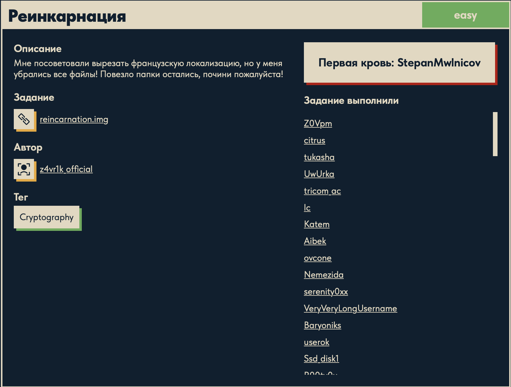

# Реинкарнация 🪦➡️📄

## Описание задачи

Задача: **Реинкарнация**

Сложность: 

Тег: `Cryptography`

Описание с платформы:

> Мне посоветовали вырезать французскую локализацию, но у меня убрались все файлы!
> Повезло папки остались, почини пожалуйста!

Задание:

```text
reincarnation.img
```

Автор задачи:

```text
z4vr1k_official
```

Первая кровь:

```text
StepanMwlnicov
```

Скрин с названием и описанием:



---

## Первый взгляд 👀

Дан файл `reincarnation.img` (2 МБ). Проверяем тип:

```bash
file reincarnation.img
# -> Linux rev 1.0 ext4 filesystem data, UUID=999ec9c7-...-85587b33c9bc
#    (extents) (64bit) (large files) (huge files)
```

Это **образ файловой системы ext4** — «слепок» Linux-раздела. Не диск с таблицей разделов,
а сразу одна файловая система, которую можно смонтировать или разобрать форензик-инструментами.

Разбор легенды задачи:

- **«Реинкарнация»** = воскрешение удалённого. Значит нас ждёт **восстановление удалённых
  данных** из ext4.
- **«убрались все файлы, повезло папки остались»** — ключевая подсказка: содержимое файлов
  затёрто/удалено, но **каталоги (папки) уцелели**. Скорее всего искомое спрятано в **самой
  структуре и именах папок**, а не в содержимом файлов.
- **«вырезать французскую локализацию»** — шуточное объяснение, почему файлы пропали
  (пользователь «удалял ненужное» и снёс лишнее).
- Тег **Cryptography** намекает, что имена папок, вероятно, ещё и **закодированы** (base64,
  hex, шифр) — то есть после восстановления структуры будет крипто-шаг.

Рабочая гипотеза: восстановить дерево каталогов из ext4 и собрать флаг из **имён папок**
(возможно, декодировав их).

---

## Что такое ext4-образ 🧠

### `.img` — это «слепок» носителя

`.img` — это **побайтовая копия (raw-образ)** носителя или раздела: содержимое диска/флешки/
раздела, сохранённое в один файл «как есть», байт в байт. Обычно такой образ снимают командой
`dd`. Внутри может лежать либо целый диск с таблицей разделов, либо, как здесь, сразу **одна
файловая система** без разметки.

### ext4 — файловая система Linux

`ext4` (fourth extended filesystem) — основная файловая система Linux с 2008 года, развитие
ext2/ext3. Отвечает за то, **как байты организованы в файлы и каталоги** на носителе.
Ключевые структуры (важно для форензики):

- **Суперблок (superblock)** — «паспорт» ФС: размер, число блоков, UUID, включённые фичи.
- **Инод (inode)** — запись метаданных **одного файла или каталога**: размер, права, временные
  метки, и указатели на блоки с данными. У каждого объекта свой **номер inode**. Важно: имя
  файла в inode **не хранится**.
- **Записи каталога (directory entries)** — каталог это по сути список пар
  **«имя → номер inode»**. Именно каталог связывает человекочитаемое имя с inode.
- **Блоки данных (data blocks)** — собственно содержимое файлов.
- **Журнал (journal)** — лог изменений для восстановления после сбоя.

**Почему это важно для задачи.** При удалении файла обычно убирают запись в каталоге и
помечают inode свободным, но **сами блоки данных какое-то время остаются** — отсюда возможность
восстановления (реинкарнации). А по легенде здесь наоборот: контент файлов пропал, но
**структура каталогов (имена папок) уцелела** — значит имена папок можно прочитать напрямую из
directory entries, и, вероятно, именно они складываются во флаг.

### Разбор вывода `file`

```text
reincarnation.img: Linux rev 1.0 ext4 filesystem data,
    UUID=999ec9c7-137e-4dcb-a12f-85587b33c9bc
    (extents) (64bit) (large files) (huge files)
```

| Токен | Что означает |
|---|---|
| `Linux rev 1.0` | ревизия формата ext (dynamic revision 1 — поддержка расширенных фич) |
| `ext4 filesystem data` | это файловая система ext4 |
| `UUID=999ec9c7-…` | уникальный идентификатор этой ФС (по нему её монтируют/опознают) |
| `(extents)` | файлы отображаются на блоки через **extent'ы** (диапазоны), а не поблочно — фича ext4, эффективнее для больших непрерывных файлов |
| `(64bit)` | 64-битные номера блоков — поддержка ФС объёмом больше 16 ТиБ |
| `(large files)` | поддержка файлов больше 2 ГиБ |
| `(huge files)` | размер файла может измеряться в блоках ФС (фича `huge_file`) — под очень большие файлы |

Для нас это подтверждает: перед нами именно **ext4**, и разбирать его нужно инструментами,
понимающими эту ФС (The Sleuth Kit, `debugfs`), — на macOS «двойным кликом» он не смонтируется.

---

## Инструменты 🧰

macOS не монтирует ext4 «из коробки», поэтому берём форензик-утилиты:

- **The Sleuth Kit (TSK)** — `brew install sleuthkit`. Ключевые команды:
  - `fls -r reincarnation.img` — рекурсивно перечислить файлы и каталоги (в т.ч. удалённые);
  - `istat` / `icat` — метаданные и содержимое по номеру inode;
  - `tsk_recover reincarnation.img out/` — вытащить восстановимые файлы.
- **debugfs** (`brew install e2fsprogs`) — интерактивный разбор ext-раздела: `ls -l`,
  `stat`, `rdump`, просмотр удалённых inode.
- **strings** — быстрая разведка (вдруг флаг лежит в образе открытым текстом).

---

## План решения

```text
1. strings по образу — быстрая проверка на флаг/подсказки
2. Разобрать ext4 через TSK/debugfs — восстановить дерево каталогов
3. Прочитать структуру: собрать флаг из имён папок (уцелевших каталогов)
4. При необходимости декодировать имена (тег Cryptography) -> флаг DUCKERZ{...}
```

---

## Разведка: strings + fls 🔎

Быстрый `strings` по образу нашёл имена удалённых файлов:

```bash
strings reincarnation.img | grep -iE "duckerz|flag"
# -> flag.png.gz  flag.txt.gz  flag.odt.gz  (и flag.png, flag.txt, flag.odt)
```

Это **gzip-архивы**. Деталь: формат gzip хранит исходное имя файла в своём заголовке — поэтому
видно и `flag.txt.gz`, и `flag.txt` (второе — имя внутри архива).

Дерево каталогов через The Sleuth Kit:

```bash
fls -r reincarnation.img
```

```text
d/d 13: folder1
d/d 15: folder2
d/d 17: folder3
V/V 257: $OrphanFiles
+ -/r * 14: OrphanFile-14
+ -/r * 16: OrphanFile-16
+ -/r * 18: OrphanFile-18
```

- `d/d` — каталоги, `r/r` — файлы; `*` — **удалённый** объект.
- `folder1/2/3` (иноды 13/15/17) — **папки уцелели** (как обещала легенда).
- `$OrphanFiles` — удалённые иноды без записи в каталоге (имя потеряно). Иноды **14, 16, 18**
  идут сразу за папками — значит в каждой папке лежал файл, и его удалили. Это и есть наши
  `flag.*.gz`.

---

## Восстановление: почему `icat` даёт 0 ⚠️

Пробуем вытащить содержимое удалённых инодов:

```bash
icat reincarnation.img 14 | wc -c   # -> 0
icat reincarnation.img 16 | wc -c   # -> 0
icat reincarnation.img 18 | wc -c   # -> 0
```

Пусто по всем трём. Причина: **в ext4 при удалении файла обнуляется карта блоков (extent-дерево)
прямо в inode**. `icat` восстанавливает файл, идя по указателям из inode на блоки данных — а раз
указателей больше нет, находить нечего. Это особенность ext4 (в ext3 указатели оставались, и
восстановление inode-инструментами работало).

Но **сами блоки данных ещё в образе**: `strings` нашёл `flag.png` — а это имя лежит внутри
gzip-заголовка, то есть в блоке данных. Значит содержимое не затёрто, просто до него не дойти
через inode. Решение — **карвинг**: искать данные напрямую по сигнатуре, минуя файловую систему.

---

## Карвинг gzip по сигнатуре 🔪

### Что такое карвинг и карвер

**Файловый карвинг (file carving)** — техника восстановления файлов из «сырого» потока байт
(образа диска, дампа памяти, свободного/неразмеченного пространства) **по их содержимому**,
в обход файловой системы. Вместо того чтобы спрашивать у ФС «где файл?», карвинг сам находит
файлы, узнавая их по характерным признакам.

**Карвер** — это инструмент (или скрипт), который выполняет карвинг. В нашем случае карвером
выступил маленький Python-скрипт.

Зачем это нужно: обычное чтение файлов опирается на **метаданные** файловой системы (inode/MFT:
где лежит файл, какой размер, как называется). Если метаданные **стёрты или повреждены** —
файл удалён, диск отформатирован, ФС побита — навигация ломается, хотя сами **байты данных
часто ещё на месте**. Карвинг работает именно с этими байтами напрямую. Ровно наша ситуация:
в ext4 при удалении обнулили карту блоков в inode (`icat` = 0), но содержимое блоков цело.

Как карверы опознают файлы:

- **По сигнатуре (header/footer).** У многих форматов есть фиксированные «магические» байты
  в начале (а иногда и концевой маркер): gzip — `1F 8B`, PNG — `89 50 4E 47`, JPEG —
  `FF D8 FF`, PDF — `%PDF`, ZIP/ODT/DOCX — `50 4B` (`PK`). Карвер ищет заголовок и вырезает
  данные до конца файла/следующего маркера. **Мы делаем именно это.**
- **По структуре формата.** Точнее определить конец файла помогают внутренние поля длины и
  блоки формата (для gzip удобно, что распаковщик сам останавливается на концевом CRC+размер).
- **Статистически / по содержимому** — для фрагментированных или безголовых данных.

Готовые карверы: `foremost`, `scalpel`, `photorec`, `binwalk`, `bulk_extractor`. Мы же собрали
свой на 8 строк — под конкретный формат (gzip) этого достаточно и нагляднее для понимания.

Ограничение метода: карвинг плохо справляется с **фрагментацией** — если файл разбросан по
несмежным блокам, простое «вырезать от заголовка подряд» соберёт мусор. Здесь повезло: gzip-
потоки лежали непрерывно, и распаковка прошла целиком.

### Что такое сигнатура и смещение

Любой gzip-файл начинается с трёх магических байт:

| Байт | Значение | Что это |
|---|---|---|
| `\x1f` | `0x1F` | 1-й байт магии gzip |
| `\x8b` | `0x8B` | 2-й байт магии gzip |
| `\x08` | `0x08` | метод сжатия DEFLATE (у gzip всегда `08`) |

**Смещение (offset)** — позиция в байтах от начала файла. Ищем сигнатуру `1F 8B 08` по всему
образу и получаем смещения, где начинаются архивы (данные лежат в блоках ext4, а до них мы
добираемся по содержимому, а не через inode):

```bash
LC_ALL=C grep -abo $'\x1f\x8b\x08' reincarnation.img
# 1184768:
# 1192960:
# 2032640:
# 2076672:
```

Разбор команды: `LC_ALL=C` — «сырые байты» (иначе macOS-grep падает на бинаре с
`illegal byte sequence`); `-a` — считать бинарь текстом; `-b` — печатать байтовое смещение;
`-o` — только совпавший кусок; `$'\x1f\x8b\x08'` — ANSI-C-кавычки bash, превращают запись
в реальные 3 байта.

### Скрипт-карвер на Python

Найти сигнатуру и с каждого смещения распаковать поток:

```python
import zlib
data = open('reincarnation.img', 'rb').read()   # весь образ как байты
i = n = 0
while True:
    i = data.find(b'\x1f\x8b\x08', i)            # следующая магия gzip с позиции i
    if i < 0:
        break                                    # -1 -> больше нет
    try:
        d = zlib.decompressobj(16 + zlib.MAX_WBITS)  # распаковщик в режиме gzip
        out = d.decompress(data[i:]) + d.flush()     # распаковать один поток
        if out:
            open(f'carved_{n}.bin', 'wb').write(out)
            print(f'offset {i}: {len(out)} bytes -> carved_{n}.bin')
            n += 1
    except Exception as e:
        print(f'offset {i}: fail ({e})')
    i += 1
```

Ключевые моменты кода:

- **`data.find(b'...', i)`** — ищет сигнатуру в байтах `data`, начиная с позиции `i`, и
  возвращает **индекс первого совпадения**. Так, двигая `i` вперёд, мы обходим все архивы
  по очереди.

  **Почему возвращается `-1`.** Индекс найденного всегда **неотрицательный** (0, 1, 2, … —
  позиция в данных). Значит для случая «не нашлось» нужен какой-то *невозможный* индекс-маркер,
  и в Python для этого выбран **`-1`** (реального смещения `-1` быть не может). Это приём
  «sentinel» (значение-часовой): `data.find(...)` возвращает либо позицию совпадения `>= 0`,
  либо `-1`, если от позиции `i` до конца данных сигнатуры больше нет. Именно на это и
  проверяет `if i < 0: break` — как только очередной поиск вернул `-1`, все gzip-потоки
  пройдены и цикл завершается.

  Полезно знать разницу: у `.find()` есть «строгий» брат — `.index()`, который вместо `-1`
  при отсутствии совпадения **бросает исключение** `ValueError`. `.find()` удобнее в цикле
  ровно потому, что позволяет проверить результат обычным `if`, не оборачивая в `try/except`.
- **`zlib.decompressobj(16 + zlib.MAX_WBITS)`** — потоковый распаковщик.

  Параметр `wbits` задаёт **сразу две вещи одним числом**: размер окна И **какой формат-обёртку**
  ожидать. zlib различает форматы по **числовому диапазону** `wbits`:

  | Значение `wbits` | Формат | Что внутри |
  |---|---|---|
  | `8..15` | **zlib** (RFC 1950) | 2-байтовый zlib-заголовок + контрольная сумма Adler-32 |
  | `-8..-15` | **raw deflate** (RFC 1951) | голый DEFLATE, без заголовка |
  | `24..31` (`16 + 8..15`) | **gzip** (RFC 1952) | gzip-заголовок (`1f 8b`, имя файла) + CRC-32 и размер в хвосте |
  | `40..47` (`32 + 8..15`) | авто | zlib или gzip — определит сам |

  Все три формата используют **один алгоритм сжатия DEFLATE** — отличается только «обёртка»
  (заголовок и контрольная сумма). Поэтому zlib переиспользует один параметр: базовые `8..15` —
  это размер окна (`zlib.MAX_WBITS` = 15, окно 32 КБ), а **сдвиг `+16`** переносит число в
  «gzip-диапазон», то есть говорит «жди gzip-заголовок и хвост». Итог: `16 + 15 = 31` → окно
  32 КБ + gzip-режим.

  Если бы оставили просто `15`, zlib ждал бы **zlib**-заголовок и упал бы на наших данных
  (магия `1f 8b` — не тот заголовок); отрицательное значение — ждал бы raw deflate без заголовка.
  То есть `+16` — это фактически «флаг gzip», упакованный в число.
- **`d.decompress(data[i:])`** — распаковывает **один** gzip-член от смещения `i`; распаковщик
  сам останавливается на конце архива (концевые CRC и размер), а «хвост» файловой системы
  уходит в `d.unused_data` и игнорируется.

**Почему карвинг вообще работает:** содержимое физически осталось в блоках данных ext4 —
стёрлись лишь указатели в inode. Сканируя сырые байты по сигнатуре и распаковывая, мы
**полностью обходим файловую систему**.

### Что вытащили карвингом

Запуск карвера нашёл **4** gzip-потока и распаковал их:

```text
offset 1184768: 9571 bytes  -> carved_0.bin
offset 1192960: 31 bytes    -> carved_1.bin
offset 2032640: 43948 bytes -> carved_2.bin
offset 2076672: 22436 bytes -> carved_3.bin
```

Опознаём типы (`file carved_*.bin`):

| Файл | Тип | Роль |
|---|---|---|
| `carved_0.bin` | OpenDocument Text (`.odt`) | отвлекающий файл |
| `carved_1.bin` | ASCII, 31 байт | **приманка**: `NotDUCKERZ{Is_not_valied_flag}` |
| `carved_2.bin` | PNG 233×233 RGBA | отвлекающий файл (картинка) |
| `carved_3.bin` | ASCII, 22 КБ | **крипто-слой** → к нему и ведёт тег Cryptography |

Быстрый `strings carved_*.bin | grep -i duckerz` выдал `NotDUCKERZ{Is_not_valied_flag}` — это
явная **приманка** (31 байт = ровно `carved_1.bin`). Настоящий флаг спрятан глубже — в
`carved_3.bin`.

---

## Снятие матрёшки кодировок (carved_3) 🪆

`carved_3.bin` — это текст из символов `A–Z` и `2–7`. Такой алфавит (без `0`, `1`, `8`, `9`) —
характерный признак **Base32** (RFC 4648). Дальше слои снимаются один за другим.

### Слой 1: Base32 → Base64

```python
import base64
d = ''.join(open('carved_3.bin').read().split())   # весь текст без переносов строк
raw = base64.b32decode(d)                           # декодируем Base32
print(raw[:300])
```

- `''.join(...read().split())` — склеиваем строки в одну (убираем `\n`), иначе декодер
  споткнётся о переносы.
- `base64.b32decode(d)` — стандартный декодер Base32.

Результат — снова **текст**, но уже из алфавита Base64 (`A–Za–z0–9+/`):

```text
ZmxhZy50eHQuZ3oAAAAA...ADAwMDA2NDQAMDAwMTc1MAAwMDAxNzMwA...
```

Здесь уже видно подсказку: `ZmxhZy50eHQuZ3o` в Base64 = **`flag.txt.gz`**, а октальные поля
(`0000644`, `0001750`, …) — это части заголовка TAR-архива.

### Слой 2: Base64 → TAR-архив

```python
import base64
d = ''.join(open('carved_3.bin').read().split())
raw = base64.b64decode(base64.b32decode(d))   # Base32 -> Base64 -> байты
open('layer.tar', 'wb').write(raw)
print('written', len(raw), 'bytes')           # written 10240 bytes
```

`base64.b64decode(...)` декодирует Base64-текст в **бинарные данные**.

Важное уточнение по этим двум строкам (частый вопрос — «мы что, просто *назвали* текст
tar-архивом?»):

- `raw = base64.b64decode(base64.b32decode(d))` — это **реальное декодирование**, а не
  переименование. Читается изнутри наружу: сначала `b32decode` превращает Base32-текст в байты
  (получился Base64-текст), затем `b64decode` превращает его в **сырые двоичные данные** `raw`.
- `open('layer.tar', 'wb').write(raw)` — просто сохраняет эти байты в файл (`'wb'` = двоичная
  запись). Имя `layer.tar` — **произвольная метка**; расширение `.tar` само по себе ничего не
  «назначает».

Это tar-архив **не потому, что мы так назвали файл**, а потому, что сами декодированные байты
по внутренней структуре — формат TAR. Мы это **распознали** (поля заголовка `flag.txt.gz`,
октальные размер/права) и подтвердили командой:

```bash
file layer.tar
# -> POSIX tar archive (GNU)
```

`file` определяет формат по **содержимому** (сигнатурам и структуре), а не по расширению.
Аналогия: переименование `photo.jpg` в `photo.txt` не сделает картинку текстом. Точно так же
файл можно было назвать `layer.bin` — `tar xf layer.bin` всё равно бы его распаковал, потому
что внутри лежит настоящий tar.

**TAR** (Tape ARchive) — это контейнер: он просто «склеивает» файлы вместе с их заголовками
(имя, права, размер, время), **без сжатия**. То есть внутри лежит ещё один файл.

### Слой 3: распаковка TAR → gzip → flag.txt

```bash
tar tvf layer.tar        # список содержимого (t=list, v=verbose, f=файл)
# -rw-r--r-- zavrik/users 55 Mar 21 2025 flag.txt.gz

tar xf layer.tar         # извлечь (x=extract, f=файл) -> появится flag.txt.gz
gunzip -k flag.txt.gz    # распаковать gzip (-k = сохранить .gz) -> flag.txt
cat flag.txt             # прочитать флаг
```

Внутри TAR — `flag.txt.gz` (55 байт), последний слой сжатия. `gunzip` разворачивает его в
`flag.txt`, а `cat` печатает **настоящий флаг**.

Полная цепочка слоёв `carved_3`:

```text
gzip-поток из ext4  ->  Base32-текст  ->  Base64-текст  ->  TAR-архив  ->  flag.txt.gz  ->  flag.txt
```

---

## Итог 🏁

Цепочка решения:

```text
reincarnation.img (ext4)
-> fls: папки folder1/2/3 целы, файлы удалены ($OrphanFiles, иноды 14/16/18)
-> icat = 0 (ext4 при удалении затирает карту блоков в inode)
-> карвинг по сигнатуре gzip (1F 8B 08) -> 4 файла (.odt, приманка, .png, Base32-текст)
-> приманка: NotDUCKERZ{...}; настоящий путь — Base32-текст (carved_3)
-> Base32 -> Base64 -> TAR -> flag.txt.gz -> gunzip -> flag.txt
```

Флаг:

```text
DUCKERZ{...}
```

Смысл флага — «reverse deletion» (обратное удаление): мы «реинкарнировали» удалённые данные,
восстановив их карвингом в обход затёртых метаданных ext4.

---

## Текущий статус

Задача решена.

Зафиксировано:

- название, сложность `Easy`, тег `Cryptography`, автор `z4vr1k_official`, первая кровь `StepanMwlnicov`;
- файл `reincarnation.img` — образ файловой системы **ext4**;
- разобрано устройство ext4 (суперблок, inode, directory entries, блоки данных);
- `fls`: папки уцелели, файлы удалены (`$OrphanFiles`, иноды 14/16/18);
- `icat` даёт 0 — ext4 затирает карту блоков в inode при удалении;
- данные восстановлены **карвингом** по сигнатуре gzip (`1F 8B 08`) — 4 файла;
- отсеяна приманка `NotDUCKERZ{...}`;
- снята матрёшка кодировок `carved_3`: Base32 → Base64 → TAR → gzip → `flag.txt`;
- получен флаг `DUCKERZ{...}`.

---

Автор: **masquadd :)** ✍️
