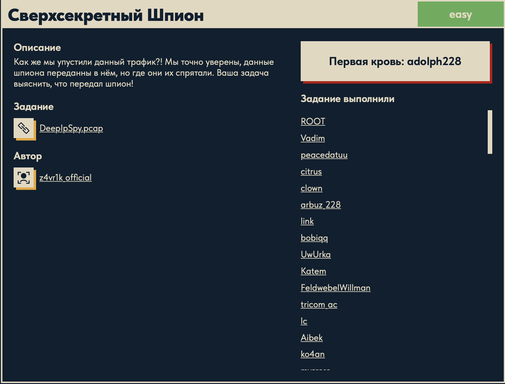
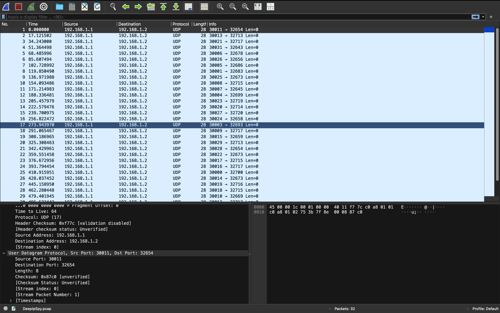

# Сверхсекретный Шпион 🕵️

## Описание задачи

Задача: **Сверхсекретный Шпион**

Сложность: 

Описание с платформы:

> Как же мы упустили данный трафик?! Мы точно уверены, данные шпиона переданны в нём,
> но где они их спрятали. Ваша задача выяснить, что передал шпион!

Задание:

```text
DeepIpSpy.pcap
```

Автор задачи:

```text
z4vr1k_official
```

Первая кровь:

```text
adolph228
```

Скрин с названием и описанием:



---

## Первый взгляд 👀

Дан дамп трафика:

```bash
file DeepIpSpy.pcap
# -> pcap capture file ... (Raw IPv4, capture length 65535)
```

Открываем в Wireshark:



Что видно:

- **32 UDP-пакета**, все `192.168.1.1 → 192.168.1.2`;
- у всех **нет полезной нагрузки** (`Len=0`, в пакете только заголовки) — значит данные спрятаны
  не в теле, а в **полях заголовков**;
- необычные **порты**:
  - **source port** = `30000..30031` — 32 уникальных значения, ровно по числу пакетов;
  - **destination port** = `32643..32720` — меняется и **повторяется**.

Название `DeepIpSpy` и легенда («где они спрятали данные») указывают на **скрытый канал**
(covert channel): полезная информация закодирована в служебных полях пакетов, а не в payload.

Рабочая гипотеза:

- **source port** несёт **порядковый номер** символа: `index = srcport − 30000` (`0..31`).
  Пакеты в дампе перемешаны, и порт задаёт правильный порядок сборки.
- **destination port** несёт **сам символ** (по одному на пакет). Повторяющиеся dst-порты —
  это повторяющиеся символы флага.

---

## Инструменты 🧰

- **Wireshark** (GUI) — осмотреть пакеты, увидеть поля портов.
- **tshark** (CLI) — вытащить поля пачкой:
  `tshark -r DeepIpSpy.pcap -T fields -e udp.srcport -e udp.dstport`.
- **Python** — отсортировать по индексу и декодировать символы.

---

## План решения

```text
1. Опознать дамп, увидеть 32 UDP-пакета без payload, странные порты        [сделано]
2. Извлечь srcport/dstport (tshark)
3. Понять кодировку: srcport-30000 = индекс; dstport -> символ (найти формулу)
4. Собрать символы по индексу -> флаг DUCKERZ{...}
```

---

## Про ASCII 📇

Прежде чем декодировать, важно понять: **любой символ — это число**. **ASCII** (American
Standard Code for Information Interchange) — таблица, которая сопоставляет символам числовые
коды `0..127`. Примеры: `'A' = 65`, `'D' = 68`, `'U' = 85`, `'a' = 97`, `'0' = 48`, `'{' = 123`,
`'}' = 125`. Печатные символы занимают диапазон примерно `32..126`.

В Python перевод в обе стороны:

- `ord('D')` → `68` (символ → его код);
- `chr(68)` → `'D'` (код → символ).

Именно потому, что символ — это число, его можно **спрятать в числовом поле** (например, в номере
порта) и потом восстановить арифметикой. На этом и построена задача.

---

## Ручной расчёт: откуда взялась константа 32768 🧮

Формулу «символ ↔ dstport» находим методом **известного открытого текста** (known plaintext):
мы заранее знаем, что флаг начинается с `DUCKERZ{`.

1. Сортируем пакеты по `srcport`. Первый (индекс 0, `srcport = 30000`) имеет `dstport = 32700`.
2. Значит символ №0 — это `'D'`, а `ASCII('D') = 68`.
3. Пробуем самую простую обратимую связь «константа минус символ»:

   ```text
   dstport = C − ASCII(символ)
   32700   = C − 68     =>     C = 32700 + 68 = 32768
   ```

4. `32768 = 2^15` — «круглое» число (степень двойки), это явный признак, что мы угадали верно.
5. Проверяем на следующих символах:

   ```text
   индекс 1: 'U' (85), dstport 32683 -> 32768 − 32683 = 85 = 'U'  ✅
   индекс 2: 'C' (67), dstport 32701 -> 32768 − 32701 = 67 = 'C'  ✅
   индекс 3: 'K' (75), dstport 32693 -> 32768 − 32693 = 75 = 'K'  ✅
   ```

Всё сходится. Итоговая формула декодирования:

```text
символ = 32768 − dstport
```

(То есть шпион при шифровании сделал `dstport = 32768 − ASCII(символ) = 0x8000 − код`.)

---

## Решение: скрипт ⚙️

```python
import subprocess

# 1) запускаем tshark, забираем stdout как текст
out = subprocess.run(
    ["tshark", "-r", "DeepIpSpy.pcap",
     "-T", "fields", "-e", "udp.srcport", "-e", "udp.dstport"],
    capture_output=True, text=True, check=True
).stdout

# 2) парсим строки в список пар (src, dst)
pairs = []
for line in out.splitlines():
    if not line.strip():
        continue
    src, dst = line.split("\t")     # tshark разделяет поля табом
    pairs.append((int(src), int(dst)))

# 3) сортируем по src port — это индекс (порядок) символа
pairs.sort(key=lambda t: t[0])

# 4) декодируем каждый dst -> символ и собираем строку
flag = ""
for src, dst in pairs:
    sim = 32768 - dst               # символ = 32768 − dstport
    flag += chr(sim)                # число -> символ (ASCII)
    print(f"{src} -> {sim} -> {chr(sim)}")

print(flag)
```

Построчно:

- **`subprocess.run([...])`** — запускаем `tshark` из Python и **захватываем его вывод**
  (`capture_output=True`, `text=True` — как строку; `check=True` — упасть при ошибке). Команда
  та же, что вручную: вытащить поля `udp.srcport` и `udp.dstport` из дампа.
- **парсинг** — `out.splitlines()` разбивает вывод на строки; каждая строка это
  `srcport<TAB>dstport` (tshark в режиме `-T fields` разделяет поля **табуляцией** `\t`), поэтому
  `line.split("\t")` даёт два числа. Пустые строки пропускаем.
- **`pairs.sort(key=lambda t: t[0])`** — сортируем по первому элементу пары, т.е. по `srcport`.
  Так как `srcport = 30000 + индекс`, сортировка ставит символы в **правильный порядок**
  (в дампе они шли вперемешку).
- **декод** — для каждого пакета `sim = 32768 - dst` даёт **ASCII-код** символа, а `chr(sim)`
  превращает код в сам символ. Конкатенацией собираем флаг. `print(...)` внутри цикла показывает
  промежуточную раскладку `src -> код -> символ` (удобно для проверки).

> В рабочем черновике осталась строка `dst_m = dst + 68` — это как раз тот самый шаг, которым
> нащупали константу (`32700 + 68 = 32768`). На финальный декод она не влияет, можно убрать.

Результат:

```text
DUCKERZ{...}
```

---

## В чём соль задачи 🎯

Это пример **скрытого канала (covert channel) / скрытой эксфильтрации данных**:

1. **Данные спрятаны в служебных полях, а не в payload.** Пакеты выглядят как безобидный UDP-шум
   без содержимого (`Len=0`), поэтому «мы упустили этот трафик» — на первый взгляд в нём ничего нет.
2. **Номера портов — это числа, а значит в них можно закодировать что угодно.** Шпион разложил
   флаг по `dstport` (символы) и `srcport` (порядок), перемешав пакеты.
3. **Обнаружить такое сложно** обычным просмотром: нужно заметить аномалию (диапазоны портов,
   отсутствие данных, ровно 32 пакета) и сообразить, что это кодировка.

Мораль (защитная сторона): мониторинг должен ловить не только «плохой payload», но и
**аномалии в метаданных** — необычные последовательности портов, TTL, IP ID и т.п. — через них
утекают данные так же легко, как через тело пакета.

---

## Итог 🏁

Цепочка решения:

```text
DeepIpSpy.pcap -> 32 UDP-пакета без payload, порты 30000-30031 / 32643-32720
-> srcport − 30000 = индекс (порядок); dstport = данные
-> известный плейнтекст DUCKERZ{: 32700 + ASCII('D')=68 = 32768 = 2^15
-> символ = 32768 − dstport, порядок по srcport
-> собираем флаг
```

Флаг:

```text
DUCKERZ{...}
```

---

## Текущий статус

Задача решена.

Зафиксировано:

- название, сложность `Easy`, описание, автор `z4vr1k_official`, первая кровь `adolph228`;
- дан `DeepIpSpy.pcap` — 32 UDP-пакета `192.168.1.1 → 192.168.1.2` без полезной нагрузки;
- данные спрятаны в **номерах портов** (скрытый канал);
- `srcport − 30000` = порядковый индекс символа; `dstport` кодирует символ;
- формула найдена по известному плейнтексту `DUCKERZ{`: `символ = 32768 − dstport` (`32768 = 2^15`);
- скрипт на Python (tshark + сортировка по индексу + `chr(32768−dst)`) собрал флаг `DUCKERZ{...}`.

---

Автор: **masquadd :)** ✍️
