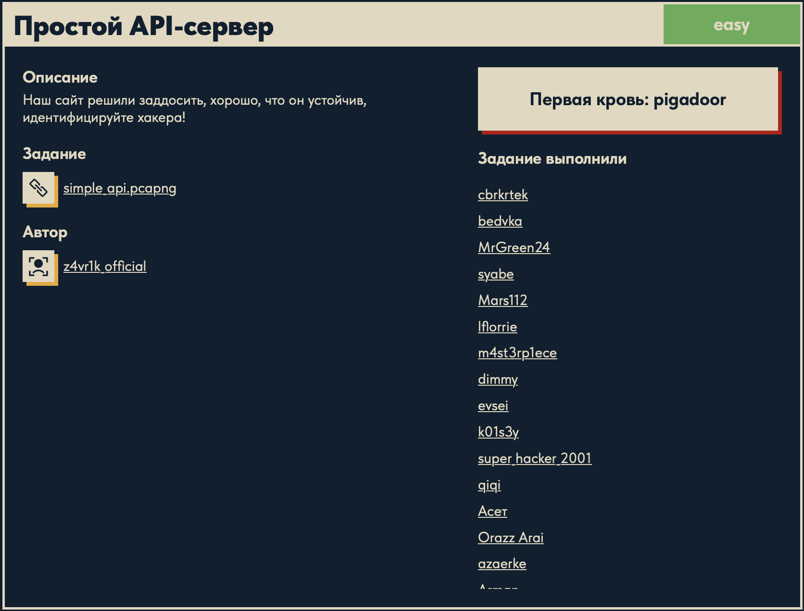
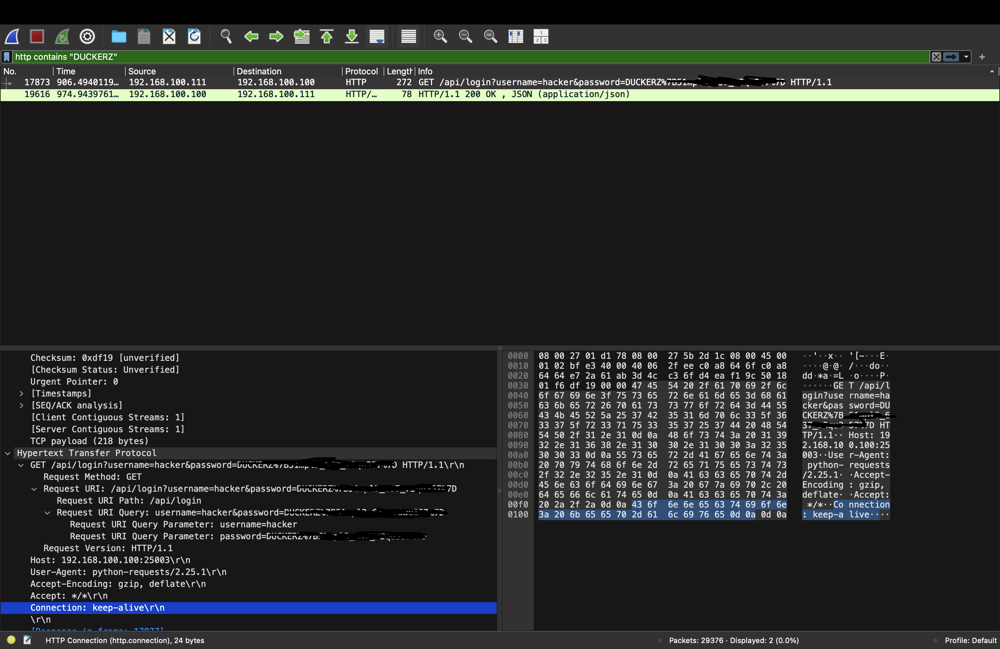

# Простой API-сервер 🕵️

## Описание задачи 📌

Название задачи:

```text
Простой API-сервер
```

Сложность:

```text
Easy
```

Описание со страницы задачи:

```text
Наш сайт решили заддосить, хорошо, что он устойчив,
идентифицируйте хакера!
```

В качестве файла задачи был дан дамп сетевого трафика:

```text
simple_api.pcapng
```

Скрин страницы задачи:



## Файл задачи 🔎

В задаче был дан файл:

```text
simple_api.pcapng
```

Проверили тип файла:

```bash
file simple_api.pcapng
```

Результат:

```text
simple_api.pcapng: pcapng capture file - version 1.0
```

`pcapng` - это формат дампа сетевого трафика. Такие файлы обычно открывают в Wireshark или анализируют через консольные инструменты вроде `tshark`.

Также посмотрели размер файла:

```bash
ls -lh
```

Результат:

```text
simple_api.pcapng    78M
```

Файл достаточно большой, значит дальше удобнее будет фильтровать трафик, а не просматривать весь дамп вручную.

## Анализ в Wireshark 🦈

Дальше открыли файл `simple_api.pcapng` в Wireshark.

Wireshark - это инструмент для просмотра и анализа сетевого трафика. Он позволяет открыть дамп, посмотреть отдельные пакеты, протоколы, HTTP-запросы, ответы сервера, параметры URL и содержимое пакетов.

В Wireshark удобно работать через display filters - фильтры отображения. Они не изменяют сам дамп, а только показывают подходящие пакеты. Это важно: фильтр не удаляет остальные пакеты, а просто скрывает их из текущего вида.

Так как по условию нужно было идентифицировать хакера, в трафике начали искать данные, связанные с флагом. Для этого применили фильтр:

```text
http contains "DUCKERZ"
```

Суть фильтра:

```text
http
```

говорит Wireshark искать только в HTTP-трафике.

```text
contains "DUCKERZ"
```

оставляет только те пакеты, где внутри HTTP-данных встречается текст `DUCKERZ`.

Итоговый смысл фильтра:

```text
показать HTTP-пакеты, внутри которых есть строка DUCKERZ
```

Также при анализе могли быть полезны другие фильтры.

### `frame contains "DUCKERZ"`

```text
frame contains "DUCKERZ"
```

Этот фильтр ищет строку `DUCKERZ` вообще во всем пакете, а не только в HTTP-части.

Разница:

```text
http contains "DUCKERZ"   ищет DUCKERZ внутри HTTP-данных
frame contains "DUCKERZ"  ищет DUCKERZ в любом месте пакета
```

`frame contains` шире. Он полезен, если неизвестно, в каком именно протоколе или поле лежит нужная строка.

### `http.request`

```text
http.request
```

Показывает только HTTP-запросы.

Это удобно, когда нужно убрать HTTP-ответы сервера и оставить только действия клиентов: какие URL открывали, какие параметры передавали, какие методы использовали.

### `http.request.uri contains "login"`

```text
http.request.uri contains "login"
```

Показывает HTTP-запросы, где URI содержит `login`.

Например, такой запрос попадет под фильтр:

```text
GET /api/login?username=hacker&password=... HTTP/1.1
```

Этот фильтр полезен, когда нужно найти попытки авторизации или обращения к login-endpoint.

### `ip.src == 192.168.100.111`

```text
ip.src == 192.168.100.111
```

Показывает пакеты, которые пришли от конкретного IP-адреса.

В этой задаче такой фильтр помогает сфокусироваться на трафике подозрительного клиента.

### `http.request && ip.src == 192.168.100.111`

```text
http.request && ip.src == 192.168.100.111
```

Показывает только HTTP-запросы от конкретного IP.

Здесь используется оператор `&&`, то есть логическое "И". Пакет должен одновременно быть HTTP-запросом и иметь source IP `192.168.100.111`.

Такой фильтр удобен после того, как найден подозрительный адрес: можно посмотреть только его HTTP-активность и понять, какие запросы он отправлял.

После применения фильтра осталось всего несколько пакетов. В одном из них был виден запрос:

```text
GET /api/login?username=hacker&password=DUCKERZ%7B...%7D HTTP/1.1
```

На скрине видно, что найденный запрос относится к авторизации:



Важные данные из запроса:

```text
username=hacker
password=DUCKERZ%7B...%7D
```

Так стало понятно, что хакер использовал логин:

```text
hacker
```

А пароль содержал флаг.

## URL-encoding 🧠

В URL некоторые спецсимволы часто заменяются кодами. Это называется URL-encoding.

В найденном запросе были такие последовательности:

```text
%7B
%7D
```

Они означают:

```text
%7B = {
%7D = }
```

Поэтому строка вида:

```text
DUCKERZ%7B...%7D
```

после декодирования превращается в:

```text
DUCKERZ{...}
```

Сам флаг на скрине замазан, чтобы не палить ответ в публичном writeup.

## Итог 🏁

Краткая цепочка решения:

```text
получен simple_api.pcapng -> открыт в Wireshark -> применен фильтр http contains "DUCKERZ" -> найден login-запрос -> определен hacker
```

Суть задачи: в сетевом дампе был HTTP-запрос авторизации, где в параметре `username` был указан хакер, а в параметре `password` находился URL-encoded флаг.

Автор: masquadd :) ✍️
