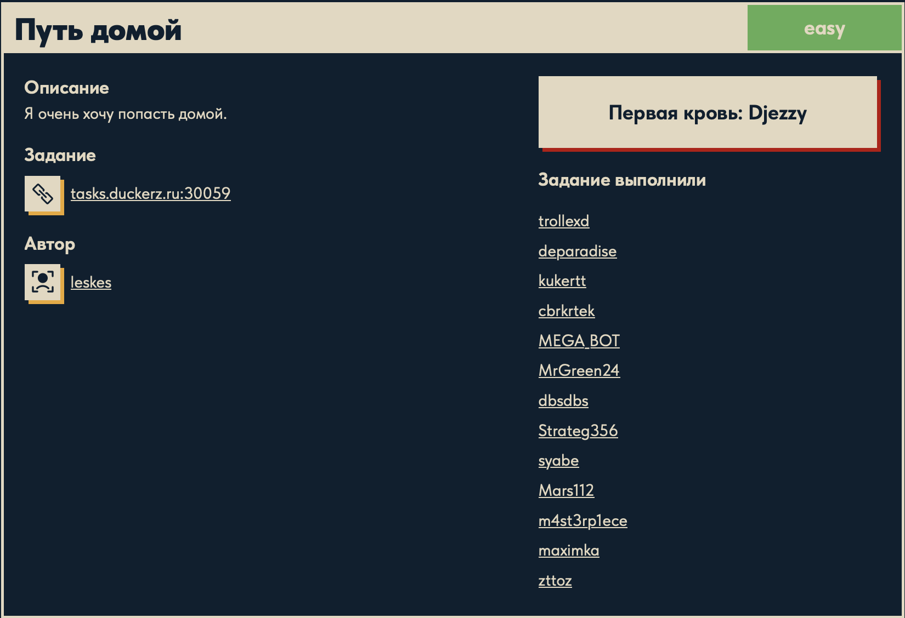
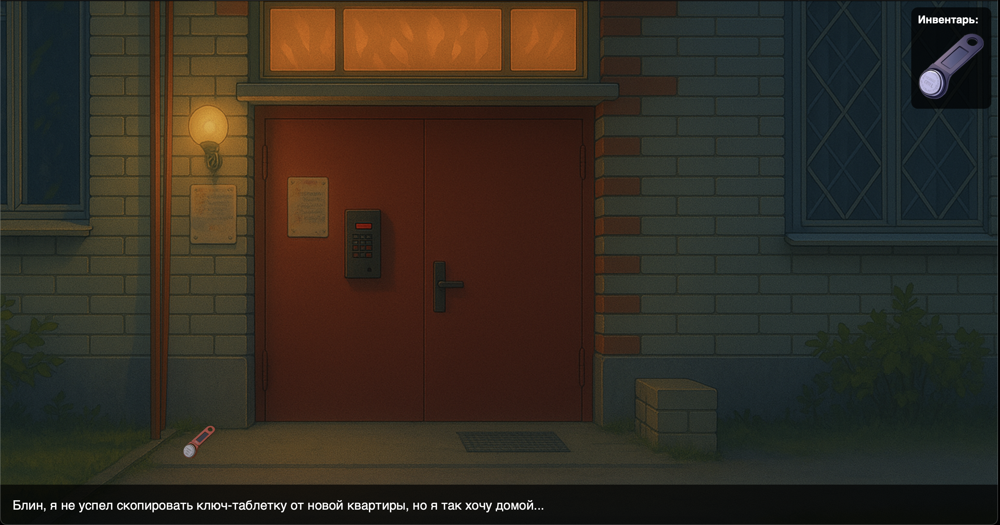
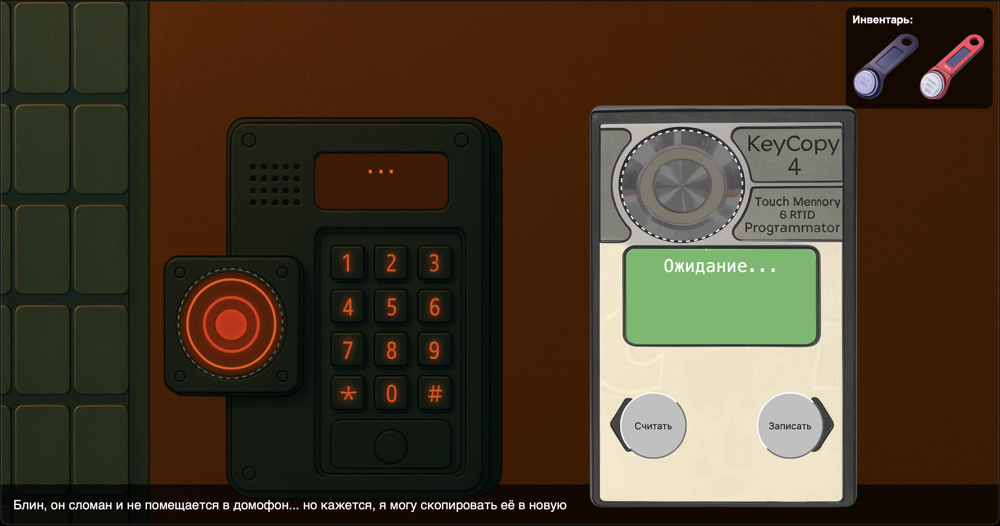
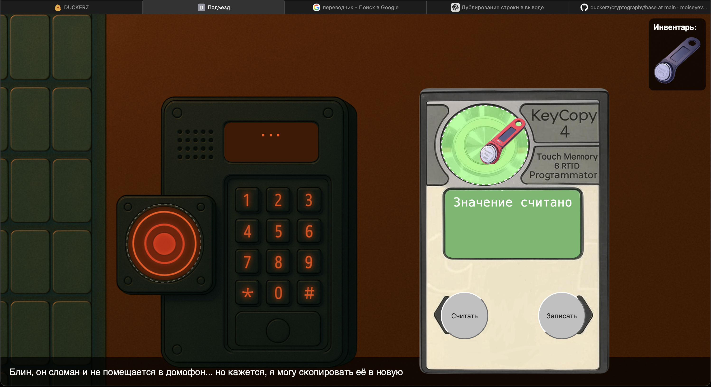
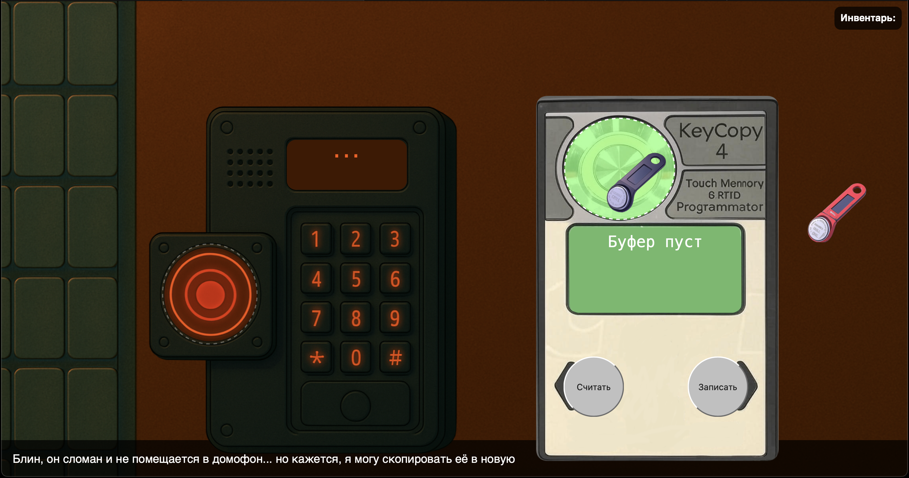
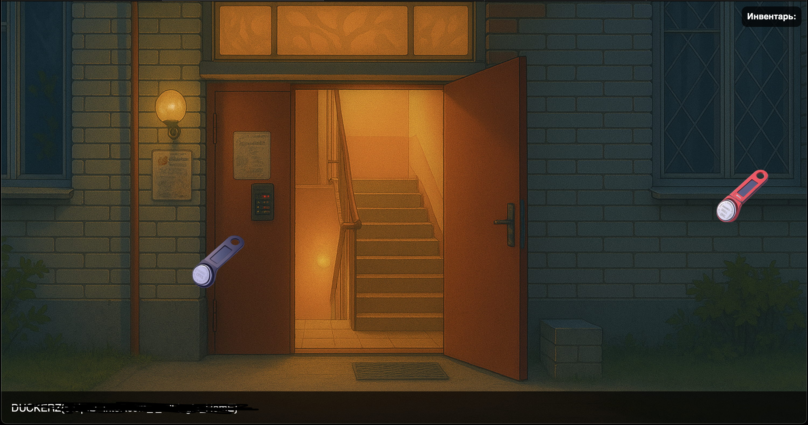

# Путь домой ⚙️

## Описание задачи 📌

Название задачи:

```text
Путь домой
```

Сложность:

```text
Easy
```

Описание со страницы задачи:

```text
Я очень хочу попасть домой.
```

В качестве цели задачи был указан адрес:

```text
tasks.duckerz.ru:30059
```

Скрин страницы задачи:



## Что есть на старте 🔎

На странице задачи нет файла для скачивания. Вместо этого дан удаленный адрес:

```text
tasks.duckerz.ru:30059
```

Значит, решение связано не с анализом локального файла, а с подключением к сервису.

После перехода на сервис видим интерактивную сцену с домофоном, дверью и ключами.

Стартовая сцена:



## Первичное наблюдение 🧠

По описанию:

```text
Я очень хочу попасть домой.
```

и по самой сцене становится понятно, что нужно открыть дверь подъезда.

На экране есть:

```text
домофон
считыватель
программатор KeyCopy 4
ключ-таблетка в инвентаре
красный ключ рядом с дверью
```

По подсказке внизу экрана:

```text
Блин, я не успел скопировать ключ-таблетку от новой квартиры, но я так хочу домой...
```

становится понятно, что нужно не подбирать код от домофона, а скопировать данные с одного ключа на другой.

## Что такое ключ-таблетка 🧩

Ключ-таблетка - это небольшой электронный ключ для домофона.

В реальной жизни такие ключи обычно прикладывают к считывателю. Домофон проверяет записанный внутри идентификатор и открывает дверь, если значение подходит.

В задаче есть программатор:

```text
KeyCopy 4
Touch Memory 6 RFID Programmator
```

То есть устройство, которое умеет работать с электронными ключами:

- считать значение с одного ключа;
- записать это значение на другой ключ.

## Шаг 1. Берем ключ в инвентарь 🗝️

Сначала берем ключ-таблетку в инвентарь.

На сцене видно, что в инвентаре уже есть синий ключ, а рядом с дверью лежит красный ключ.



Логика такая:

```text
синий ключ -> наш пустой ключ
красный ключ -> ключ, с которого нужно считать данные
```

## Шаг 2. Считываем красный ключ 🔎

Дальше прикладываем красный ключ к программатору и нажимаем:

```text
Считать
```

После этого на экране появляется сообщение:

```text
Значение считано
```



Это значит, что программатор сохранил значение красного ключа во внутренний буфер.

Проще говоря:

```text
красный ключ -> программатор
```

## Шаг 3. Записываем значение на синий ключ ✍️

После считывания берем синий ключ и записываем на него значение из буфера.

Для этого прикладываем синий ключ к программатору и нажимаем:

```text
Записать
```

После записи буфер становится пустым:

```text
Буфер пуст
```



То есть цепочка получилась такая:

```text
красный ключ -> считать -> буфер программатора -> записать -> синий ключ
```

Теперь синий ключ стал копией красного.

## Получение флага 🏁

После записи подносим синий ключ к домофону. Дверь открывается, и на экране появляется флаг.

Флаг на скриншоте замазан:



В writeup сам флаг не показывается, чтобы не палить ответ.

## Итог 🏁

Краткая цепочка решения:

```text
взять ключ -> считать красный ключ -> записать значение на синий ключ -> открыть дверь -> DUCKERZ{...}
```

Суть задачи: нужно было понять, что домофон открывается не кодом, а клонированным электронным ключом. Красный ключ содержит нужное значение, а программатор позволяет перенести его на синий ключ.

Автор: masquadd :) ✍️
