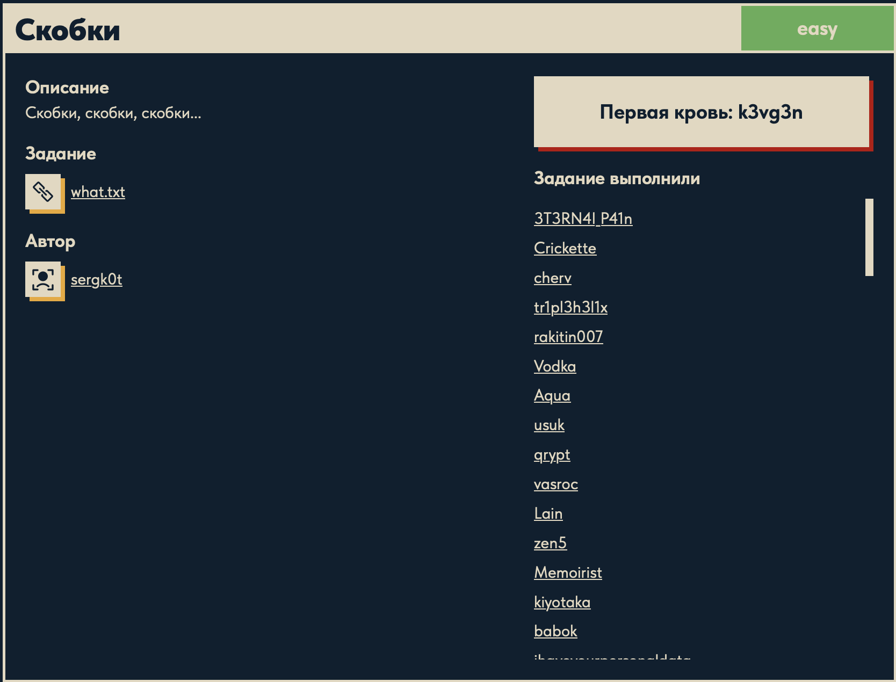

# Скобки 🧩

## Описание задачи

Задача: **Скобки**

Сложность: 

Описание с платформы:

> Скобки, скобки, скобки...

Задание:

```text
what.txt
```

Автор задачи:

```text
sergk0t
```

Первая кровь:

```text
k3vg3n
```

Скрин с названием и описанием:



---

## Первый взгляд 👀

Дан текстовый файл `what.txt` (~454 байта). Смотрим его содержимое — начало:

```text
++++++++++[>+>+++>+++++++>++++++++++<<<<-]>>>--.>---------------.<-.++++++++.------.>---.++++++++.
```

И проверяем, какие вообще символы встречаются в файле:

```bash
fold -w1 what.txt | sort -u | tr -d '\n'
# -> +-.<>[]
```

Ровно **8 символов**: `+ - . < > [ ] `. Это не случайность — это **полный набор команд языка
Brainfuck**. А название задачи «Скобки» прямо намекает на `[` `]` и `<` `>`.

Значит `what.txt` — это программа на Brainfuck, и наша задача — **выполнить её**: при запуске
она напечатает флаг.

---

## Что такое Brainfuck 🧠

Brainfuck — эзотерический язык программирования, минималистичный до предела: всего **8 команд**.
Модель памяти — бесконечная лента ячеек (байтов) и указатель на текущую ячейку:

| Команда | Что делает |
|---|---|
| `>` | сдвинуть указатель на ячейку вправо |
| `<` | сдвинуть указатель на ячейку влево |
| `+` | увеличить значение текущей ячейки на 1 |
| `-` | уменьшить значение текущей ячейки на 1 |
| `.` | вывести текущую ячейку как ASCII-символ |
| `,` | прочитать один байт ввода в текущую ячейку |
| `[` | если текущая ячейка == 0 — прыгнуть за парный `]` (начало цикла) |
| `]` | если текущая ячейка != 0 — вернуться к парному `[` (конец цикла) |

### Правила и модель памяти

- Есть **лента** из ячеек (обычно по 1 байту, значения `0..255` с переполнением по кругу) и
  **указатель**, который в начале стоит на нулевой ячейке; все ячейки инициализированы нулём.
- Программа исполняется слева направо; **любой символ, кроме этих восьми, игнорируется** —
  поэтому переносы строк, пробелы и комментарии внутри кода никак не мешают.
- Единственная управляющая конструкция — **цикл** `[ ... ]`: тело повторяется, пока в текущей
  ячейке не станет `0`. Через него выражают и условия, и повторения, и всю арифметику.
- Ввод/вывод — побайтовый (`.` печатает ASCII-символ, `,` читает байт). В нашей задаче ввода
  нет — только вывод, поэтому программа детерминированно печатает одну и ту же строку (флаг).

Несмотря на всего 8 команд, Brainfuck **полон по Тьюрингу** — на нём в принципе можно вычислить
всё, что и на любом «большом» языке, просто крайне многословно.

### Краткая история

Язык придумал швейцарец **Урбан Мюллер (Urban Müller) в 1993 году**. Его целью было написать
язык с **максимально маленьким компилятором** — первый компилятор Brainfuck занимал около
**240 байт** (позже ужали до ~100). Провокационное название закрепилось за языком как за
символом «эзотерического» программирования (esolang) — языков, созданных не для практики, а
ради эксперимента, шутки или интеллектуального вызова.

### Применение

В «настоящей» разработке Brainfuck не используют — он специально неудобен. Зато он живёт в:

- **обучении** — наглядно показывает модель машины Тьюринга и минимальный набор операций,
  достаточный для универсальных вычислений;
- **code golf и головоломках** — где ценится минимализм и изобретательность;
- **обфускации и CTF** — как раз наш случай: спрятать строку/флаг в «нечитаемый» поток
  `+-.<>[]`, который на самом деле тривиально исполнить интерпретатором.

Типичный приём (и он есть в начале нашего файла): цикл `+++++[>+++>...<<-]` «раскладывает»
по ячейкам стартовые значения (умножение), а потом серии `+`/`-` доводят каждую ячейку до
нужного ASCII-кода буквы, и `.` печатает её. То есть программа просто **посимвольно
выкладывает флаг** в вывод.

---

## План решения

```text
1. Убедиться, что это Brainfuck (набор символов +-.<>[])
2. Выполнить программу любым интерпретатором Brainfuck
3. Прочитать напечатанный флаг DUCKERZ{...}
```

---

## Решение ⚙️

Задача сводится к простому запуску программы. Проще всего — готовым интерпретатором Brainfuck.
Здесь использовался установленный интерпретатор `brainfuck`:

```bash
brainfuck what.txt
```

Программа сразу напечатала флаг:

```text
DUCKERZ{...}
```

(Внутри флага — шуточная фраза в leet-стиле, выложенная программой посимвольно.)

### Альтернатива без установки: интерпретатор на Python

Если не хочется ничего ставить, Brainfuck исполняется крошечным скриптом. Логика ровно та же,
что описана в правилах выше:

```python
code = open("what.txt").read()
tape = [0] * 30000        # лента ячеек (память), все нули
ptr = i = 0               # ptr — указатель на ячейку, i — позиция в коде
out = []

# 1) заранее строим карту парных скобок [ ]
stack, jump = [], {}
for idx, c in enumerate(code):
    if c == '[':
        stack.append(idx)          # запомнили открывающую
    elif c == ']':
        s = stack.pop()            # нашли пару к последней открытой
        jump[s] = idx              # с '[' можно прыгнуть на ']'
        jump[idx] = s              # и обратно с ']' на '['

# 2) главный цикл: выполняем команды по одной
while i < len(code):
    c = code[i]
    if   c == '>': ptr += 1                              # вправо по ленте
    elif c == '<': ptr -= 1                              # влево по ленте
    elif c == '+': tape[ptr] = (tape[ptr] + 1) % 256     # +1 (с переполнением байта)
    elif c == '-': tape[ptr] = (tape[ptr] - 1) % 256     # -1 (с переполнением байта)
    elif c == '.': out.append(chr(tape[ptr]))            # печать символа
    elif c == '[' and tape[ptr] == 0: i = jump[i]        # ячейка 0 -> прыжок за ']'
    elif c == ']' and tape[ptr] != 0: i = jump[i]        # ячейка !=0 -> возврат на '['
    i += 1

print(''.join(out))
```

Как он работает:

1. **Карта скобок.** Прежде чем исполнять, один раз проходим по коду и сопоставляем каждой
   `[` её парную `]` (через стек). Это позволяет в цикле мгновенно «перепрыгивать» между
   началом и концом цикла, не сканируя код каждый раз. `jump[i]` — куда прыгнуть с позиции `i`.
2. **Состояние машины.** `tape` — лента из 30000 нулевых ячеек, `ptr` — где мы на ленте,
   `i` — какую команду кода сейчас читаем, `out` — накопитель вывода.
3. **Диспетчер.** Главный `while` читает символ `code[i]` и выполняет соответствующее действие:
   `>`/`<` двигают указатель, `+`/`-` меняют ячейку (по модулю 256 — эмуляция байта), `.`
   печатает символ.
4. **Циклы.** На `[` при нулевой ячейке прыгаем **за** парную `]` (пропускаем тело), иначе
   входим в тело. На `]` при ненулевой ячейке прыгаем **назад** на парную `[` (повторяем),
   иначе выходим. После любой команды `i += 1` — переход к следующей.

Запуск даёт тот же флаг, что и внешний интерпретатор:

```bash
python3 bf.py   # (сохранив код как bf.py в папке задачи)
```

---

## Итог 🏁

Цепочка решения:

```text
what.txt -> набор символов +-.<>[] -> это программа на Brainfuck
-> выполняем её интерпретатором (внешним `brainfuck` или скриптом на Python)
-> программа посимвольно печатает флаг
```

Флаг:

```text
DUCKERZ{...}
```

Вся «сложность» задачи — узнать по 8 символам и названию «Скобки» язык Brainfuck; дальше
достаточно его исполнить.

---

## Текущий статус

Задача решена.

Зафиксировано:

- название задачи, сложность `Easy`, описание, автор `sergk0t`, первая кровь `k3vg3n`;
- содержимое `what.txt` — программа на Brainfuck (только символы `+-.<>[]`);
- разобраны правила, модель памяти, история и применение языка;
- программа выполнена внешним интерпретатором `brainfuck` (и приведён свой на Python);
- получен флаг `DUCKERZ{...}`.

---

Автор: **masquadd :)** ✍️
