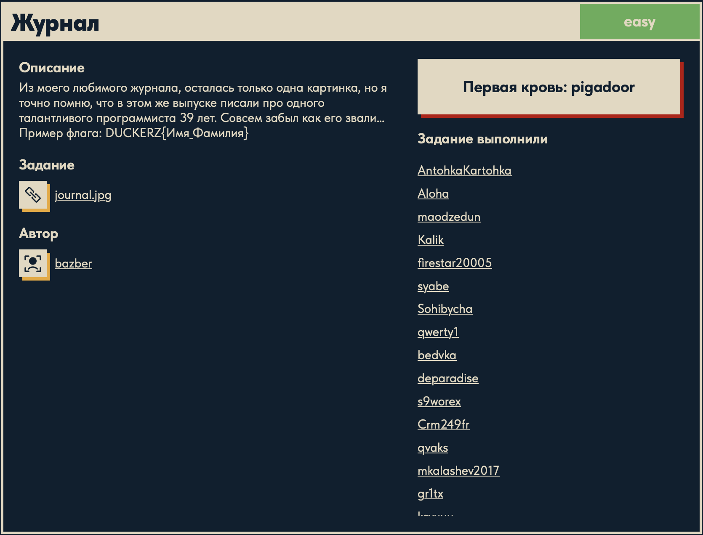
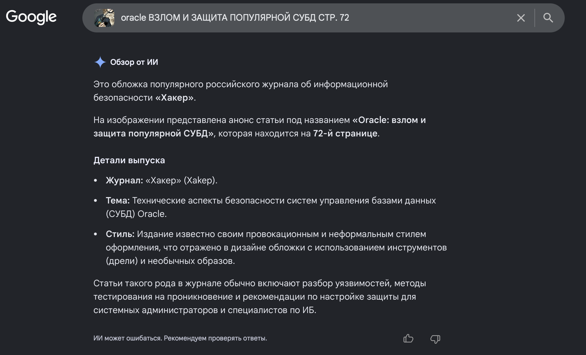

# Журнал 🔎

## Описание задачи 📌

Название задачи:

```text
Журнал
```

Сложность:

```text
Easy
```

Описание со страницы задачи:

```text
Из моего любимого журнала, осталась только одна картинка, но я точно помню, что в этом же выпуске писали про одного талантливого программиста 39 лет.
Совсем забыл как его звали...
Пример флага: DUCKERZ{Имя_Фамилия}
```

В качестве исходного файла дана картинка:

```text
journal.jpg
```

Скрин страницы задачи:



## Исходное изображение 🖼️

На выданной картинке видна часть обложки журнала:


На изображении можно прочитать несколько важных деталей:

```text
oracle
ВЗЛОМ И ЗАЩИТА ПОПУЛЯРНОЙ СУБД
СТР. 72
```

Это хорошая OSINT-зацепка: текст с обложки можно использовать как поисковый запрос.

## Поиск по фрагменту обложки 🧠

Сначала был сделан поиск по заметным словам с картинки:

```text
oracle ВЗЛОМ И ЗАЩИТА ПОПУЛЯРНОЙ СУБД СТР. 72
```

Поиск показал, что это обложка российского журнала:

```text
Хакер
```

Скрин поиска:



## Найденный выпуск 📚

Дальше удалось найти оригинальный PDF этого выпуска:

```text
https://www.nzdr.ru/data/media/biblio/j/xak/2008/xa-2008-01-109.pdf
```

По названию файла и пути видно:

```text
xak
2008
xa-2008-01-109.pdf
```

То есть это выпуск журнала "Хакер" за январь 2008 года.

## Что ищем дальше 🎯

Из условия задачи известно:

```text
в этом же выпуске писали про талантливого программиста
возраст: 39 лет
нужен формат флага: DUCKERZ{Имя_Фамилия}
```

Значит, следующий шаг — открыть найденный PDF и искать внутри выпуска упоминание программиста 39 лет.

Полезные варианты поиска внутри PDF:

```text
39
39 лет
программист
талантливый программист
```

## Поиск имени в PDF 🔍

Так как в описании задачи прямо указан возраст:

```text
39 лет
```

логично искать в PDF именно число `39`.

Поиск по числу `39` внутри найденного выпуска приводит к упоминанию программиста:

```text
Алан Кокс
```

Это совпадает с условием:

- речь идет о программисте;
- в тексте указан возраст `39`;
- задача просит имя и фамилию.

## Получение флага 🏁

По условию формат флага:

```text
DUCKERZ{Имя_Фамилия}
```

Значит, найденные имя и фамилию нужно подставить в этот формат. Сам флаг в writeup не вставляется.

## Итоговая цепочка ✅

```text
journal.jpg
        ↓
текст на обложке: Oracle / СУБД / стр. 72
        ↓
поиск оригинального выпуска журнала "Хакер"
        ↓
PDF: xa-2008-01-109.pdf
        ↓
поиск по числу 39 внутри PDF
        ↓
найден программист Алан Кокс
        ↓
формат DUCKERZ{Имя_Фамилия}
```

Суть задачи: по фрагменту обложки нужно было восстановить выпуск журнала, а затем найти в нем упоминание программиста 39 лет.

Автор: masquadd :) ✍️
