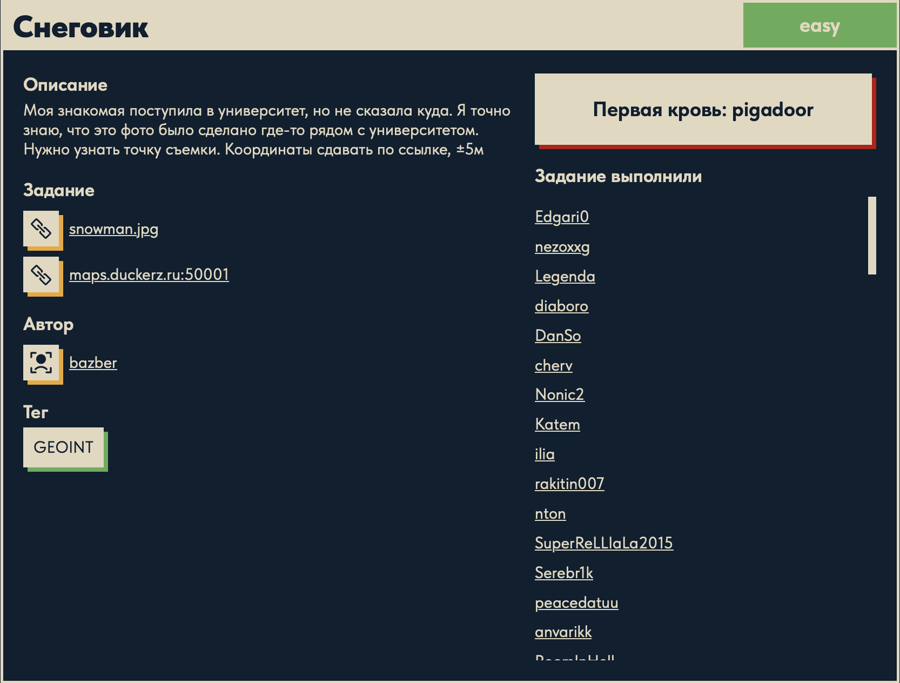
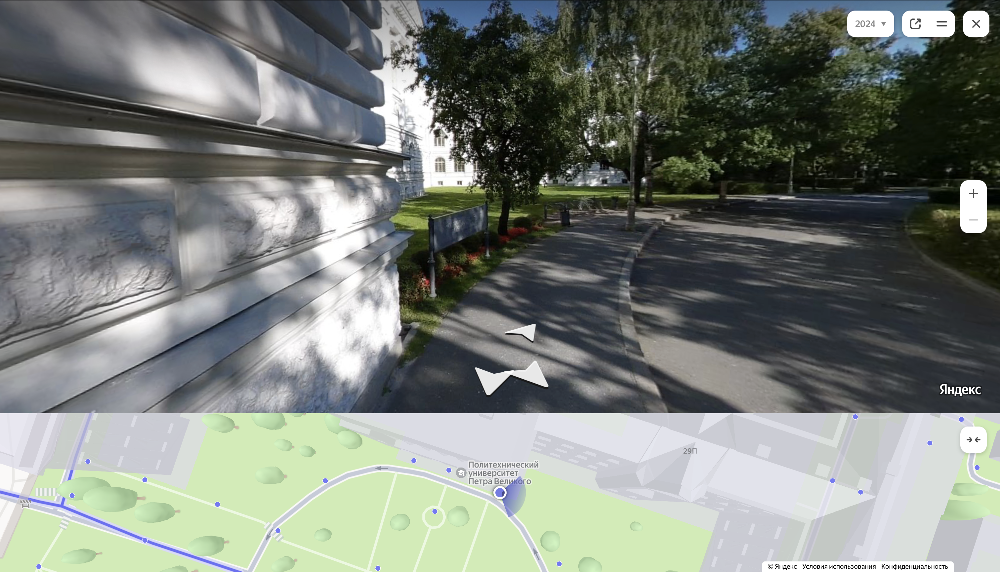
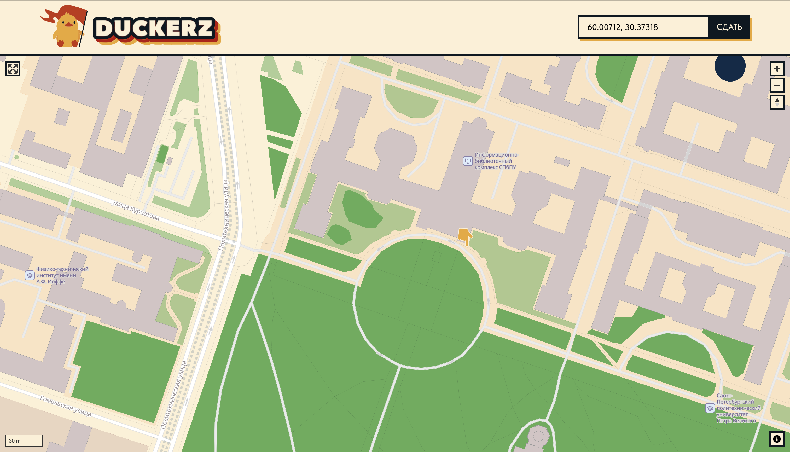

# Снеговик ⛄

## Описание задачи

Задача: **Снеговик**

Сложность: 

Тег: `GEOINT`

Описание с платформы:

> Моя знакомая поступила в университет, но не сказала куда. Я точно знаю, что это фото было
> сделано где-то рядом с университетом. Нужно узнать точку съёмки. Координаты сдавать по ссылке, ±5м

Задание:

```text
snowman.jpg
maps.duckerz.ru:50001   (карта для сдачи координат)
```

Автор задачи:

```text
bazber
```

Первая кровь:

```text
pigadoor
```

Скрин с названием и описанием:



---

## Первый взгляд 👀

Дано фото `snowman.jpg`: ночь, снеговик на парапете, а на фоне — **монументальный фасад**
(рустованный камень, высокие арочные окна, декоративный фриз). Это **GEOINT**-задача: нужно
не просто узнать город, а найти **точную точку съёмки** с погрешностью **±5 метров** и сдать
координаты на карте [maps.duckerz.ru:50001](http://maps.duckerz.ru:50001).

Зацепки прямо на фото (главное в OSINT — читать, что попало в кадр):

- на тёмной табличке-стенде внизу видно **«National …»** (латиницей) и кириллицу
  **«…ский университет / …ПЕТЕРБУРГСКИЙ»** — то есть это **университет в Санкт-Петербурге**,
  и в его названии есть слова «National … University» (характерно для вывесок вида
  «National Research University»);
- по описанию фото сделано **рядом с университетом** — значит здание на фото и есть тот вуз
  (или его корпус);
- архитектура — типичный парадный Петербург.

План: по вывеске и зданию **опознать конкретный университет** (реверс-поиск изображения),
найти корпус на карте и по ракурсу вычислить **точку, где стоял фотограф**.

---

## Инструменты 🧰

- **Яндекс.Картинки** (reverse image search) — лучший для российских локаций: загрузить
  `snowman.jpg`, найти это здание/вуз.
- **Google Lens** — альтернативный визуальный поиск, читает текст на вывеске.
- **Яндекс.Карты / Google Maps + панорамы (Street View)** — найти здание, сопоставить окна,
  парапет, вывеску и вычислить точку съёмки.
- **maps.duckerz.ru:50001** — карта задачи: клик по точке → координаты `lat, long` → «СДАТЬ».

---

## План решения

```text
1. Прочитать зацепки на фото: вывеска "National ... университет", Петербург   [сделано]
2. Reverse image search (Яндекс.Картинки) / прочитать вывеску -> опознать вуз
3. Найти корпус на Яндекс.Картах, открыть панораму, сопоставить ракурс
4. Определить точку съёмки (±5м) -> кликнуть на maps.duckerz.ru:50001 -> СДАТЬ
```

---

## Решение ⚙️

### Шаг 1 — опознать университет

По вывеске («National … University» + «…ПЕТЕРБУРГСКИЙ») и монументальному рустованному фасаду
перебрали университеты Санкт-Петербурга с таким брендом и нашли совпадение:
**Санкт-Петербургский политехнический университет Петра Великого (СПбПУ)** — «Peter the Great
St. Petersburg Polytechnic University», национальный исследовательский университет. Его
**главный (Главное) здание** на **Политехнической ул., 29** — как раз с таким рустованным
фасадом и высокими арочными окнами.

### Шаг 2 — сопоставить ракурс в панорамах

Открыли здание СПбПУ на **Яндекс.Картах → Панорамы** и «прошлись» вдоль фасада. Рустовка камня,
пилястры, парапет и рекламный стенд у стены — всё совпало с фото со снеговиком:



Мини-карта внизу панорамы прямо подписывает объект — «Политехнический университет Петра Великого»,
корпус `29П`. Это подтвердило и здание, и сторону, с которой сделан снимок.

### Шаг 3 — точка съёмки и сдача координат

По ракурсу (расстояние до стены, конкретное окно/угол, где стоял снеговик) определили **точку,
где стоял фотограф**, и поставили её на карте задачи
[maps.duckerz.ru:50001](http://maps.duckerz.ru:50001). Координаты (`lat, long`) появляются в поле
справа сверху — жмём **СДАТЬ** (допуск ±5 м):



Точка — у главного корпуса СПбПУ (район `60.00712, 30.37318`). При попадании в ±5 м сайт
принимает координаты и выдаёт флаг.

Флаг:

```text
DUCKERZ{...}
```

---

## В чём соль задачи 🎯

Это **GEOINT** — геолокация по фотографии:

1. **Читаем, что попало в кадр.** Вывеска с «National … University» и кириллицей сузила поиск
   до конкретного петербургского вуза — это половина решения.
2. **Опознаём здание** реверс-поиском/перебором и подтверждаем **панорамой** (совпадение
   архитектурных деталей: рустовка, окна, парапет).
3. **Точную точку (±5 м)** вычисляем по ракурсу — расстоянию до стены и положению объектов
   в кадре, сверяясь с панорамой.

Мораль OSINT: на фото почти всегда есть «подпись» — вывеска, табличка, характерная архитектура,
отражение, — которая ведёт к точному месту. Панорамы (Яндекс/Google) превращают «где-то там»
в «вот эта точка».

---

## Итог 🏁

Цепочка решения:

```text
snowman.jpg -> вывеска "National ... University" + петербургский фасад
-> опознан СПбПУ (Политехнический ун-т Петра Великого, Политехническая ул. 29)
-> Яндекс-панорама подтвердила фасад и ракурс
-> точка съёмки у главного корпуса (~60.00712, 30.37318) -> maps.duckerz.ru:50001 -> СДАТЬ
-> флаг
```

Флаг:

```text
DUCKERZ{...}
```

---

## Текущий статус

Задача решена.

Зафиксировано:

- название, сложность `Easy`, тег `GEOINT`, автор `bazber`, первая кровь `pigadoor`;
- дано фото `snowman.jpg` + карта для сдачи координат `maps.duckerz.ru:50001` (±5 м);
- зацепка на фото — вывеска «National … University» + петербургская архитектура;
- опознан **СПбПУ** (Политехнический университет Петра Великого, Политехническая ул. 29);
- ракурс подтверждён **Яндекс-панорамой**, вычислена точка съёмки у главного корпуса;
- координаты (~`60.00712, 30.37318`) сданы на карте задачи → получен флаг `DUCKERZ{...}`.

---

Автор: **masquadd :)** ✍️
