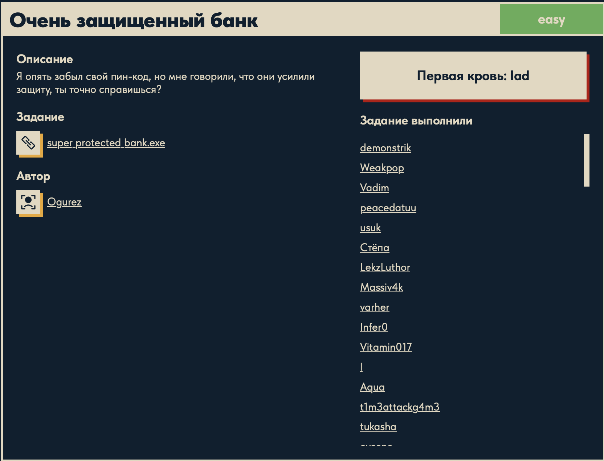
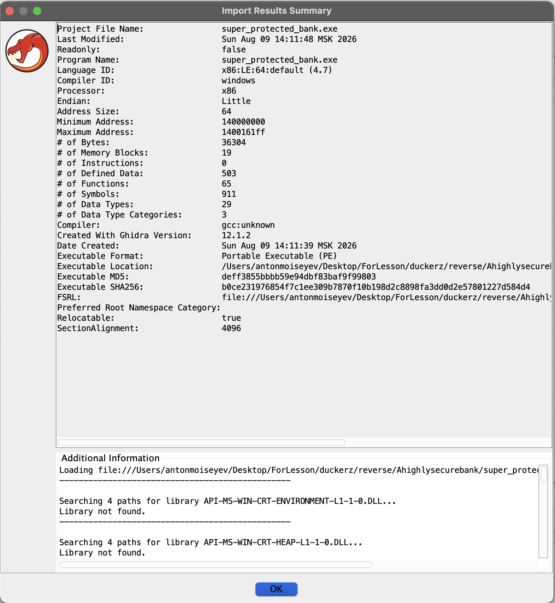
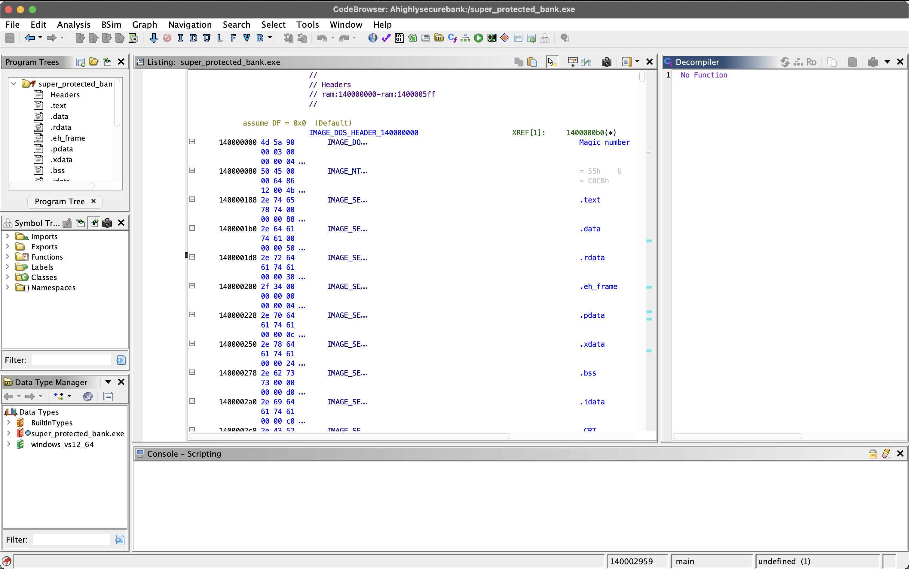
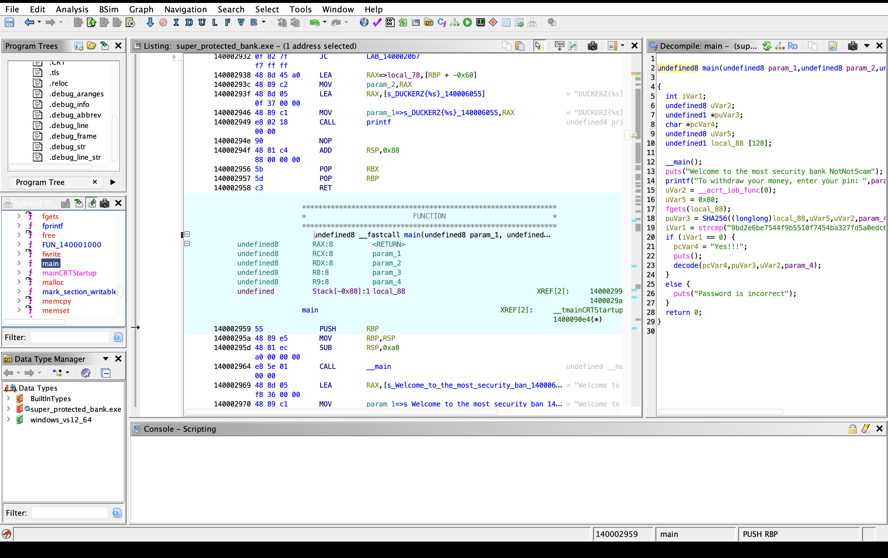

# Очень защищённый банк 🏦

## Описание задачи

Задача: **Очень защищённый банк**

Сложность: 

Описание с платформы:

> Я опять забыл свой пин-код, но мне говорили, что они усилили защиту, ты точно справишься?

Задание:

```text
super_protected_bank.exe
```

Автор задачи:

```text
Ogurez
```

Первая кровь:

```text
lad
```

Скрин с названием и описанием:



---

## Первый взгляд 👀

Дан исполняемый файл:

```text
super_protected_bank.exe
```

Базовая информация о файле (`file`):

```text
PE32+ executable (console) x86-64, for MS Windows
```

- **PE32+** — формат исполняемых файлов Windows (Portable Executable), «+» означает
  **64-битную** версию (x86-64).
- **console** — консольное приложение: запускается в терминале, общается через stdin/stdout
  (то есть, скорее всего, спрашивает пин-код и печатает ответ).
- Размер ~72 КБ — маленький бинарь, вероятно на C, без тяжёлых зависимостей.

Это **продолжение** задачи «Защищённый банк» (там флаг лежал в строках `.rdata` и доставался
через `strings`). По описанию защиту «усилили» — значит рассчитывать на то, что PIN или флаг
валяются в открытом виде, не стоит: скорее всего проверка пин-кода реализована в коде, и
нужно разобрать логику в дизассемблере.

Цель: восстановить правильный пин-код (или напрямую флаг), разобравшись, как устроена
проверка внутри программы.

---

## Инструменты 🧰

Работаем на macOS, поэтому:

- **Запуск бинаря:** `wine super_protected_bank.exe` — посмотреть поведение вживую
  (что спрашивает, как реагирует на неверный ввод).
- **Строки:** `strings` — быстрая разведка (вдруг «усиление» не идеальное).
- **Дизассемблер/декомпилятор** — основной инструмент задачи. Варианты:
  - **radare2 / rizin** (`brew install radare2`) — консольный дизассемблер, удобно читать
    ассемблер и ходить по функциям;
  - **Ghidra** — GUI с декомпилятором в псевдо-C, лучший вариант, чтобы «учиться читать»
    (asm рядом с восстановленным C);
  - **objdump / llvm-objdump** — быстрый статический дизасм всей секции кода.

Так как хочется поразбирать ассемблер и поучиться, основную работу ведём в radare2/Ghidra,
а `objdump` держим для быстрых выборочных просмотров.

---

## План решения

```text
1. Запустить под wine — понять поведение (запрос пин-кода, реакция на неверный ввод)
2. strings — быстрая разведка на предмет подсказок, пин-кода, флага, формата DUCKERZ{...}
3. Дизассемблировать и найти функцию проверки пин-кода (сравнение ввода с эталоном)
4. Разобрать логику: где хранится/как вычисляется правильный PIN, как строится флаг
5. Восстановить пин-код -> получить флаг
```

---

## Разведка: strings 🔎

Первым делом — быстрый поиск подсказок в строках бинаря:

```bash
strings super_protected_bank.exe | grep -iE "duckerz|pin|flag|correct|wrong|denied|access|неверн|верн"
```

Вывод (интересное выделено):

```text
DUCKERZ{%s}                                  <- шаблон флага
To withdraw your money, enter your pin:      <- приглашение ввода
Password is incorrect                        <- сообщение об ошибке
X86_TUNE_PARTIAL_FLAG_REG_STALL              <- мусор (внутренности компилятора)
X86_TUNE_FUSE_CMP_AND_BRANCH_SOFLAGS         <- мусор
__mingw_pcppinit                             <- мусор (рантайм MinGW)
__loader_flags__                             <- мусор
```

### Как работает команда

- `strings super_protected_bank.exe` — вытаскивает из бинаря все последовательности печатных
  символов (по умолчанию длиной ≥ 4). Это стандартный первый шаг осмотра любого исполняемого
  файла: сообщения, форматные строки, имена функций часто лежат в секции `.rdata` открытым
  текстом.
- `|` — конвейер: поток строк передаётся дальше в `grep`.
- `grep -iE "duckerz|pin|flag|..."` — фильтруем поток:
  - `-i` — регистронезависимо (`PIN`, `pin`, `Pin` — всё подойдёт);
  - `-E` — расширенные регулярные выражения, чтобы работал разделитель `|`;
  - `"a|b|c"` — «или»: строка проходит фильтр, если содержит **любое** из слов.

### Что мы из этого поняли

1. **Флаг не хранится готовым — он собирается в рантайме.** Строка `DUCKERZ{%s}` — это
   форматный шаблон для `printf`/`sprintf`, где `%s` подставляется во время выполнения.
   Поэтому `strings` и не показывает готовый `DUCKERZ{...}`, как в прошлой задаче
   «Защищённый банк». Это и есть «усиление защиты».
2. **Рабочая гипотеза:** в `%s` подставляется правильный пин-код (или строка, которая
   становится доступна только после верной проверки). Значит цель — восстановить PIN,
   разобрав логику проверки в дизассемблере.
3. **Найдены строки-якоря:** `"To withdraw your money, enter your pin:"` (приглашение) и
   `"Password is incorrect"` (ошибка). По ним в дизассемблере легко найти функцию проверки:
   ищем адрес строки ошибки → смотрим, какое условие ведёт к её выводу, а какое — к ветке
   с формированием флага.
4. **Остальное — шум:** `X86_TUNE_*`, `__mingw_*`, `__loader_flags__` — это внутренние
   строки компилятора GCC/MinGW и рантайма, к задаче отношения не имеют. Полезный навык —
   быстро отсеивать такой «компиляторный» мусор.

---

## Динамический запуск под wine 🍷

На macOS запускаем PE через wine:

```bash
wine super_protected_bank.exe
```

При старте wine печатает много служебного шума (`[mvk-info] MoltenVK ...`, список
`VK_*`-расширений Vulkan, строки `fixme:keyboard:...`) — это к задаче **не относится**,
просто вывод графической прослойки и заглушек wine. Чтобы его убрать, глушим stderr:

```bash
echo 1234 | wine super_protected_bank.exe 2>/dev/null
```

Реальный вывод программы:

```text
Welcome to the most security bank NotNotScam
To withdraw your money, enter your pin:
Password is incorrect
```

Что подтвердилось:

- программа приветствует («most security bank NotNotScam») и **запрашивает пин-код**;
- на неверный (или пустой) ввод печатает `Password is incorrect` — та самая строка-якорь
  из `strings`;
- значит, где-то внутри есть сравнение введённого PIN с эталоном, и по результату —
  ветка ошибки либо ветка с `DUCKERZ{%s}`.

Динамика подтвердила поведение; дальше нужно вскрыть саму проверку — статически
(дизассемблер/декомпилятор) и/или под отладчиком.

Для статического разбора выбрали **Ghidra** — она показывает восстановленный C-псевдокод
рядом с ассемблером, что удобно и для решения, и для обучения чтению кода.

---

## Инструмент: Ghidra 🐉

**Ghidra** — бесплатный фреймворк для реверс-инжиниринга, разработанный АНБ (NSA) и выложенный
в открытый доступ. Умеет главное, что нужно для разбора бинаря:

- **дизассемблирует** машинный код в ассемблер (поддержка кучи архитектур через язык описания
  процессоров SLEIGH: x86/x64, ARM, MIPS и др.);
- **декомпилирует** — восстанавливает из ассемблера читаемый C-подобный псевдокод (главная
  фишка, ради которой её и берут);
- строит **графы вызовов**, находит функции, строки, перекрёстные ссылки (xref);
- позволяет переименовывать переменные, править типы, оставлять комментарии — то есть
  постепенно «расшифровывать» логику программы.

Написана на Java, поэтому требует JDK (у нас Temurin 21). Работаем в её окне **CodeBrowser**
(значок зелёного дракона).

### Что написано в «Import Results Summary»

После импорта Ghidra показывает «паспорт» файла. Разберём поля (полезно понимать, что видишь):



| Поле | Значение | Что означает |
|---|---|---|
| Program Name | `super_protected_bank.exe` | имя импортированной программы |
| Language ID | `x86:LE:64:default` | архитектура: x86, Little Endian, 64 бита |
| Compiler ID | `windows` | ABI/соглашения вызовов — Windows |
| Processor / Endian / Address Size | `x86` / `Little` / `64` | то же самое по отдельности |
| Minimum / Maximum Address | `140000000` … `1400161ff` | куда образ отображается в память: база `0x140000000` (стандартная для 64-битных PE) и конец образа |
| # of Bytes | `36304` | сколько байт кода/данных загружено |
| # of Memory Blocks | `19` | число секций/блоков памяти (`.text`, `.data`, `.rdata`, …) |
| # of Instructions | `0` | инструкций пока `0` — **это снимок ДО анализа**; после «Analyze» появятся |
| # of Defined Data | `503` | распознанные данные (строки, константы, таблицы) |
| # of Functions | `65` | найденные функции (наш `main` + функции рантайма) |
| # of Symbols | `911` | всего имён (функции, импорты, метки) |
| Compiler | `gcc:unknown` | бинарь собран **GCC (MinGW)** — сходится со строками `__mingw_*` из `strings` |
| Executable Format | `Portable Executable (PE)` | формат исполняемого файла Windows |
| Executable MD5 / SHA256 | `deff3855…` / `b0ce2319…` | хеши файла — для идентификации и проверки целостности |
| Relocatable | `true` | есть таблица релокаций (образ можно грузить по другому адресу — поддержка ASLR) |
| SectionAlignment | `4096` | секции выровнены по размеру страницы памяти (`0x1000`) |

Важное для нас:

- **`# of Instructions: 0`** — это статистика на момент импорта, до автоанализа. Поэтому
  следующий обязательный шаг — запустить **Analyze**, тогда Ghidra дизассемблирует код и
  заполнит функции.
- **`Compiler: gcc:unknown` + `Compiler ID: windows`** — классический **MinGW-GCC**: код
  писали на C и собрали GCC под Windows. Значит внутри будет привычная логика на C
  (`scanf`, `strcmp`, `printf`), которую декомпилятор восстановит почти дословно.

В блоке **Additional Information** внизу видно строки вида:

```text
Searching 4 paths for library API-MS-WIN-CRT-ENVIRONMENT-L1-1-0.DLL...
Library not found.
```

Это Ghidra ищет системные библиотеки Windows (`API-MS-WIN-CRT-*.DLL` — это «api-set»
заглушки Universal CRT, через которые идут стандартные C-функции). На macOS их, естественно,
нет — поэтому «Library not found». Для нашей задачи это **не проблема**: имена импортируемых
функций всё равно известны из таблицы импорта, а сама логика `main` лежит внутри бинаря.

### Окна интерфейса CodeBrowser

Главное рабочее окно Ghidra после анализа. Разберём, за что отвечает каждая панель:



| Панель | Где | За что отвечает |
|---|---|---|
| **Program Trees** | слева вверху | дерево **секций памяти** программы: `Headers`, `.text` (код), `.data` (изменяемые данные), `.rdata` (константы и строки), `.eh_frame`/`.pdata`/`.xdata` (данные для обработки исключений и раскрутки стека), `.bss` (неинициализированные данные), `.idata` (таблица импорта). Двойной клик — прыжок к секции |
| **Symbol Tree** | слева в центре | дерево **символов**: `Imports` (функции из системных DLL), `Exports`, `Functions` (**все функции — здесь ищем `main`**), `Labels`, `Classes`, `Namespaces` |
| **Data Type Manager** | слева внизу | **типы данных**: встроенные (`BuiltInTypes`), типы самой программы и библиотечные (`windows_vs12_64`). Нужен для восстановления структур/типов |
| **Listing** | центр | главное окно **листинга** — дизассемблированный код и данные по адресам. Сейчас в кадре `Headers` (заголовки PE: `IMAGE_DOS_HEADER`, `IMAGE_NT_HEADERS`, заголовки секций). Формат строки: `адрес | байты | инструкция/данные | комментарии и XREF` |
| **Decompiler** | справа | **декомпилятор** — восстановленный C-псевдокод текущей функции. Сейчас `No Function`, потому что курсор стоит на заголовках, а не внутри функции. Как встанем в `main` — появится C-код |
| **Console – Scripting** | внизу | вывод скриптов Ghidra (нам пока не нужен) |
| **Status bar** | самый низ | текущий адрес (`140002959`), функция под курсором (`main`), тип данных |

Как читать связку: **Listing** (ассемблер) и **Decompiler** (C) синхронизированы — куда ткнёшь
в одном, туда подсветится в другом. Для решения задачи мы будем в основном смотреть
**Decompiler** (нагляднее), а в **Listing** заглядывать, когда нужно уточнить конкретную
инструкцию. `main` ищем в **Symbol Tree → Functions**.

---

## Разбор функции `main` 🔬

В **Symbol Tree → Functions** нашли `main` и открыли её в декомпиляторе. Слева — ассемблерный
листинг, справа — восстановленный C-псевдокод:



Псевдокод:

```c
undefined8 main(undefined8 param_1,undefined8 param_2,undefined8 param_3,undefined8 param_4)
{
  int iVar1;
  undefined8 uVar2;
  undefined1 *puVar3;
  char *pcVar4;
  undefined8 uVar5;
  undefined1 local_88 [128];

  __main();
  puts("Welcome to the most security bank NotNotScam");
  printf("To withdraw your money, enter your pin: ",param_2,param_3,param_4);
  uVar2 = __acrt_iob_func(0);
  uVar5 = 0x80;
  fgets(local_88);
  puVar3 = SHA256((longlong)local_88,uVar5,uVar2,param_4);
  iVar1 = strcmp("9bd2e6be7544f9b5510f7454ba327fd5a0edc6f602ad586f4a3abae96dcda114");
  if (iVar1 == 0) {
    pcVar4 = "Yes!!!";
    puts();
    decode(pcVar4,puVar3,uVar2,param_4);
  }
  else {
    puts("Password is incorrect");
  }
  return 0;
}
```

### Построчно

- **Объявления переменных**

  ```c
  int iVar1;                 // результат strcmp
  undefined8 uVar2;          // указатель на stdin
  undefined1 *puVar3;        // указатель на строку-хэш нашего ввода
  char *pcVar4;              // строка "Yes!!!"
  undefined8 uVar5;          // размер буфера (0x80)
  undefined1 local_88 [128]; // буфер под введённый пин-код
  ```

  Имена `iVar1`, `uVar2`, `local_88` — **автогенерация Ghidra**: настоящих имён переменных в
  бинаре нет (отладочная информация вырезана), поэтому декомпилятор придумывает свои.
  `undefined8` = «8-байтовое значение неизвестного типа» (то есть 64-битный регистр/указатель,
  тип которого Ghidra не смогла уточнить).

- **`__main();`** — служебный вызов рантайма MinGW/GCC (инициализация конструкторов). К логике
  задачи отношения не имеет.

- **`puts(...)` / `printf(...)`** — печатают приветствие и приглашение ввести пин.
  Лишние аргументы `param_2, param_3, param_4` в `printf` — артефакт декомпиляции: Ghidra не
  знает точный прототип и подставляет «висящие» в регистрах значения. Реально это просто
  `printf("To withdraw your money, enter your pin: ")`.

- **`uVar2 = __acrt_iob_func(0);`** — получение стандартного потока по индексу. `__acrt_iob_func`
  — внутренняя функция Universal CRT, возвращающая указатель на `FILE*`; индекс **`0` = stdin**
  (1 = stdout, 2 = stderr). То есть `uVar2` — это **stdin**.

- **`uVar5 = 0x80;`** — константа `128`, это размер буфера для чтения.

- **`fgets(local_88);`** — читает строку из потока в буфер `local_88`. Декомпилятор показал
  только один аргумент, но у `fgets` их **три**: `fgets(char *buf, int size, FILE *stream)`.
  Недостающие два лежат рядом: `uVar5 = 0x80` (size) и `uVar2` (stdin). Реальный вызов:

  ```c
  fgets(local_88, 0x80, stdin);
  ```

  Важная деталь: `fgets` **оставляет символ перевода строки** `\n` в конце ввода — это ещё
  пригодится, когда будем вычислять хэш «как в программе».

- **`puVar3 = SHA256(local_88, ...);`** — от введённой строки считается **SHA-256**.
  `puVar3` — указатель на результат (скорее всего уже в виде hex-строки, раз дальше идёт
  `strcmp`).

- **`iVar1 = strcmp("9bd2...da114");`** — сравнение. `strcmp` требует **два** аргумента, второй
  (наш вычисленный хэш `puVar3`) декомпилятор потерял. Реальная проверка:

  ```c
  iVar1 = strcmp(puVar3, "9bd2e6be7544f9b5510f7454ba327fd5a0edc6f602ad586f4a3abae96dcda114");
  ```

  `strcmp` возвращает `0`, если строки **равны**. То есть `iVar1 == 0` ⇔ хэш нашего ввода
  совпал с зашитым эталоном.

- **Ветка успеха**

  ```c
  if (iVar1 == 0) {
    puts("Yes!!!");
    decode(...);          // <- печатает флаг
  }
  ```

  При совпадении хэшей печатается `Yes!!!` и вызывается **`decode(...)`** — именно она
  формирует и выводит флаг `DUCKERZ{...}`.

- **Ветка ошибки**

  ```c
  else {
    puts("Password is incorrect");
  }
  ```

### Суть «усиленной защиты» 🔒

Ключевой вывод: программа **не хранит пин-код нигде** — ни в открытом виде, ни в `.rdata`.
Она хранит только **SHA-256-хэш** правильного пина:

```text
9bd2e6be7544f9b5510f7454ba327fd5a0edc6f602ad586f4a3abae96dcda114
```

Алгоритм проверки:

```text
ввод пользователя -> SHA256(ввод) -> сравнить с зашитым хэшем -> совпало? -> decode() -> флаг
```

Поэтому наивный `strings` (который сломал прошлый «Защищённый банк») здесь бесполезен: пина
в файле нет, а хэш **необратим математически** — из него нельзя «вычислить» пин. Это и есть
усиление по сравнению с первой задачей.

Но у хэша есть слабое место: если исходный пин **короткий и предсказуемый** (например,
4–8 цифр), его тривиально найти **перебором** — прогнать SHA-256 по всем кандидатам, пока
хэш не совпадёт. Именно этим и займёмся дальше.

---

## Обёртка `SHA256()` и перебор пин-кода 🔑

Открыли функцию `SHA256`, чтобы понять, что именно сравнивается:

```c
local_10 = strlen(param_1);                // длина введённой строки
local_18 = malloc(0x41);                   // 65 байт: 64 hex-символа + '\0'
SHA256Init(local_88);
SHA256Update(local_88, param_1, local_10); // считаем дайджест от ввода
SHA256Final(local_88, local_a8);           // 32 байта дайджеста -> local_a8
for (i = 0; i < 0x20; i++) {               // 0x20 = 32 байта
    sprintf(local_ab, "%02x", local_a8[i]);// байт -> 2 hex-символа
    strcat(local_18, local_ab);            // склеиваем hex-строку
}
return local_18;                           // hex-строка хэша (64 символа)
```

То есть проверка в `main` — это буквально:

```text
hex(sha256(ввод)) == "9bd2e6be7544f9b5510f7454ba327fd5a0edc6f602ad586f4a3abae96dcda114"
```

**Попытка перебора.** Раз пин короткий, попробовали найти прообраз хэша: прогнали SHA-256 по
числовым пинам 1–8 знаков (с ведущими нулями, с `\n` от `fgets` и без):

```python
import hashlib, itertools, sys
h = '9bd2e6be7544f9b5510f7454ba327fd5a0edc6f602ad586f4a3abae96dcda114'
for width in range(1, 9):
    for tup in itertools.product('0123456789', repeat=width):
        s = ''.join(tup)
        for cand in (s, s + '\n', s + '\r\n'):
            if hashlib.sha256(cand.encode()).hexdigest() == h:
                print('PIN', repr(s)); sys.exit()
```

Результат — **пусто**: ни один числовой пин до 8 знаков не подошёл (и crackstation тоже
не нашла). Значит пин длиннее или не чисто числовой. Гнать перебор дальше дорого — поэтому
переключились на `decode()`. Как оказалось, пин для получения флага **вообще не нужен**.

---

## Разбор функции `decode()` 🧩

`decode()` вызывается только при верном пине и печатает флаг: в конце стоит
`printf("DUCKERZ{%s}\n", local_78)`. Как устроена функция:

1. В локальный массив `local_48` побайтово записывается **захардкоженная строка** из 40 байт
   (с нулём в конце). В ASCII это `erpgmop5pmp+fA343v5345MPVrevpmMVi44voPMI` — обфусцированная
   заготовка флага.
2. Цикл `i = 0 .. strlen(local_48)-1` копирует байт в `local_78[i]` и «крутит» его битовыми
   операциями **в зависимости от индекса**:
   - четыре **независимых** условия — если `i` чётный / кратен 3 / кратен 4 / кратен 5, —
     каждое добавляет свою серию `& ^ | +`;
   - затем один **взаимоисключающий** `if / else if` по конкретному значению `i`
     (6, 7, 8, …, 0x24) — ещё пара операций (индекс `0xe` в цепочке пропущен).
3. Готовый `local_78` печатается внутри шаблона `DUCKERZ{%s}`.

**Ключевой вывод:** `decode()` **не использует свои аргументы** (`param_1..param_4` нигде не
читаются). То есть флаг **не зависит ни от пина, ни от хэша** — он полностью определяется
захардкоженным массивом и фиксированными операциями. Значит пин для получения флага
**не нужен вообще**, а идея «передать в decode хэш» не имеет смысла — decode его не смотрит.

### Почему прямая реконструкция даёт мусор ⚠️

Дословный перенос декомпилированного `decode()` (хоть в Python, хоть в C) выдаёт нечитаемую
строку. Причина — **декомпиляция `decode()` неполная**: в псевдокоде почти в каждой ветке по
индексу стоит комментарий Ghidra `WARNING: Ignoring partial resolution of indirect`. Это
значит, что часть байтовых операций (похоже, реализованных через таблицу переходов/`switch`)
Ghidra восстановила лишь частично. Логика на выходе неточная, поэтому любая её копия
воспроизводит ту же ошибку.

Вывод: реконструировать `decode()` из декомпилятора ненадёжно. Правильный путь — **выполнить
настоящий `decode()` из бинаря**. Пин мы не знаем (перебор SHA-256 не дал результата), но он и
не важен: достаточно **пропатчить проверку** (занопить условный переход после `strcmp`), чтобы
любой ввод считался верным, и запустить бинарь под wine — тогда полный, корректный `decode()`
сам сформирует и напечатает флаг.

---

## Решение: патчим проверку в radare2 🩹

Раз флаг лежит в `decode()`, а пин неизвестен, заставим бинарь **сам** вызвать `decode()`.
Для этого пропатчим условный переход в `main`, чтобы любой ввод считался верным. Работаем в
**radare2** (консольный дизассемблер с режимом записи `-w`). Каждая команда — с пояснением.

Сначала копируем бинарь (оригинал бережём) и открываем копию на запись:

```bash
cp super_protected_bank.exe patched.exe
r2 -w patched.exe
```

Дальше по одной команде внутри r2:

- **`aaa`** — *analyze all*: полный анализ бинаря. r2 находит функции, импорты, строки и
  перекрёстные ссылки. Без этого он не знает, где `main`. Команда лишь наполняет внутреннюю
  базу — своего вывода-результата у неё нет.

- **`afl~main`** — список функций (`afl` = *analyze functions list*), отфильтрованный грепом
  (`~`) по слову `main`. Показал, что функция называется **`sym.main`** (адрес `0x140002959`).
  Голое `s main` не сработало именно поэтому — r2 добавляет префикс `sym.`.

- **`s sym.main`** — *seek*: перейти к началу `main`. Приглашение меняется на `[0x140002959]`.

- **`pdf`** — *print disassemble function*: дизассемблировать `main`. Ключевой фрагмент:

  ```asm
  0x1400029c5   call sym.strcmp     ; eax = результат strcmp (0, если пины равны)
  0x1400029ca   test eax, eax       ; выставить флаги по eax: eax==0 -> ZF=1
  0x1400029cc   jne  0x1400029e4    ; ПРЫГНУТЬ в "отказ", если eax != 0 (пины разные)
  0x1400029ce   ...                 ; ветка успеха: puts("Yes!!!"); call sym.decode
  0x1400029e4   ...                 ; ветка отказа: puts("Password is incorrect")
  ```

  Здесь важно: `pdf` показывает **точный ассемблер** (реальные байты `85c0`, `7516`), а не
  приблизительную реконструкцию, как декомпилятор. Поэтому патчу тут можно доверять.

  Как работает развилка: процессор идёт по инструкциям сверху вниз, пока переход не уведёт его
  в сторону. `jne` (*jump if not equal*) прыгает в ветку отказа **только если пины не совпали**
  (`ZF == 0`). Если совпали — прыжка нет, и поток «проваливается» прямо в ветку успеха
  (`call decode`). Значит **`jne` — единственная развилка**, ведущая к отказу.

- **`s 0x1400029cc`** — переходим на адрес инструкции `jne`.

- **`wao nop`** — *write assembly op*: заменить текущую инструкцию на `nop`(ы) той же длины.
  `nop` (opcode `0x90`) — «ничего не делать»: процессор пропускает её и идёт дальше. `jne`
  занимал 2 байта (`75 16`) → стало два `nop` (`90 90`). Длина сохранена, поэтому адреса
  остальных инструкций не сдвинулись. Развилки больше нет — поток **всегда** проваливается в
  ветку успеха и вызывает `decode()`.

- **`pd 6`** — *print disassemble* 6 инструкций: проверяем патч.

  ```asm
  0x1400029cc   90    nop
  0x1400029cd   90    nop
  0x1400029ce   ... lea rax, str.Yes___
  0x1400029d8   call sym.puts
  0x1400029dd   call sym.decode
  ```

  `jne` заменён на два `nop`, дальше — ветка успеха с `call sym.decode`. Патч на месте.

- **`q`** — выход из r2. Так как открывали с `-w`, изменения уже записаны в `patched.exe`.

## Получение флага 🚩

Запускаем пропатченный бинарь под wine, подав любой ввод вместо пина:

```bash
echo x | wine patched.exe 2>/dev/null
```

Вывод:

```text
Welcome to the most security bank NotNotScam
To withdraw your money, enter your pin: Yes!!!
DUCKERZ{...}
```

Проверка теперь пройдена всегда, и `decode()` отработал в **настоящем** бинаре — со всеми
операциями, которые Ghidra потеряла в декомпиляции, — и напечатал корректный флаг.

Любопытный итог: наш прежний Python-порт `decode()` ошибся ровно в **одном символе** (один
байт, где decompiler «съел» операцию) — а реальный запуск дал точный результат. Хороший урок:
**декомпилятор может врать в деталях, а исполнение настоящего кода — источник истины.**

---

## Вопросы по ходу решения ❓

### Подойдёт ли GDB + pwndbg на маке для этого бинаря?

Для этой задачи — **нет**, это не тот инструмент:

- **pwndbg — плагин к GDB, заточенный под Linux/ELF** (анализ кучи, стека, `checksec`).
  Он отлично подходит для категории **PWN** и Linux-реверса, но не для Windows-бинарей.
- У нас **Windows PE x86-64**, а мак — на **Apple Silicon (M4)** (видно в выводе wine:
  `model: Apple M4`). Двойное несоответствие: GDB на macOS ARM сам по себе проблемный
  (code-signing, нет нормальной поддержки формата PE), плюс x86-код исполняется через
  трансляцию wine — GDB это чисто не отладит.
- Правильные отладчики для **PE под wine** — **winedbg** (встроен в wine) или
  **x64dbg под wine**, а не GDB.

Вывод: **pwndbg стоит поставить, но приберечь для PWN-задач** (Linux ELF). Для «банка»
(easy) отладчик, скорее всего, не нужен вовсе — хватает статического разбора в Ghidra;
если понадобится динамика, берём x64dbg/winedbg.

### Почему нельзя «просто вызвать `decode()` через wine»?

wine запускает программу с её **точки входа**, и код идёт по маршруту `main` → проверка пина →
только при верном пине → `decode()`. `decode()` — **внутренняя, не экспортируемая** функция,
поэтому снаружи (из командной строки/wine) вызвать именно её нельзя: нет «ручки», за которую
дёрнуть. Попасть в неё можно лишь (а) верным пином (его нет) или (б) заставив поток управления
самому дойти до `decode()` — то есть **пропатчив** бинарь, что мы и сделали.

---

## Почему это работает 🧠

1. **Флаг не хранится готовым и не зависит от пина.** `decode()` строит его из захардкоженного
   массива фиксированными битовыми операциями — пин лишь «замок на двери».
2. **Пин защищён хэшем, но проверку легко обойти.** SHA-256 необратим и перебор пина не удался —
   но пин и не нужен: достаточно убрать одну инструкцию (`jne`), и `decode()` вызовется при
   любом вводе.
3. **Патчинг надёжнее реконструкции.** Декомпиляция `decode()` была неполной; вместо ручной
   «дочинки» логики мы выполнили настоящий код бинаря — и получили точный флаг.

Мораль: «усиление защиты» (SHA-256-хэш вместо открытого пина + обфускация флага) не спасает,
если итоговая проверка — это один условный переход, который можно занопить.

---

## Итог 🏁

Цепочка решения:

```text
super_protected_bank.exe (PE32+ x86-64, MinGW-GCC)
-> strings: флаг собирается в рантайме (DUCKERZ{%s}), пина в открытом виде нет
-> Ghidra: main читает пин, сравнивает hex(SHA256(ввод)) с зашитым хэшем; при успехе -> decode()
-> decode() строит флаг из захардкоженного массива, аргументы игнорирует (пин не нужен)
-> перебор SHA-256-хэша пина не удался; декомпиляция decode() неполная
-> radare2: патчим main -> jne после strcmp заменяем на nop (проверка всегда проходит)
-> wine patched.exe -> настоящий decode() печатает флаг
```

Флаг:

```text
DUCKERZ{...}
```

---

## Текущий статус

Задача решена.

Зафиксировано:

- название, сложность `Easy`, описание, автор `Ogurez`, первая кровь `lad`;
- бинарь `super_protected_bank.exe` — PE32+ x86-64, собран MinGW-GCC;
- `strings`: флаг формируется в рантайме (`DUCKERZ{%s}`), приглашение и текст ошибки — якоря;
- `main` разобрана в Ghidra: проверка `hex(SHA256(ввод)) == зашитый хэш`, при успехе → `decode()`;
- `decode()` строит флаг из захардкоженного массива и **не зависит от пина**;
- перебор SHA-256-хэша пина не дал результата; декомпиляция `decode()` оказалась неполной;
- в radare2 пропатчен переход `jne` после `strcmp` (`wao nop`), проверка обойдена;
- под wine пропатченный бинарь вызвал настоящий `decode()` и напечатал флаг `DUCKERZ{...}`.

---

Автор: **masquadd :)** ✍️
