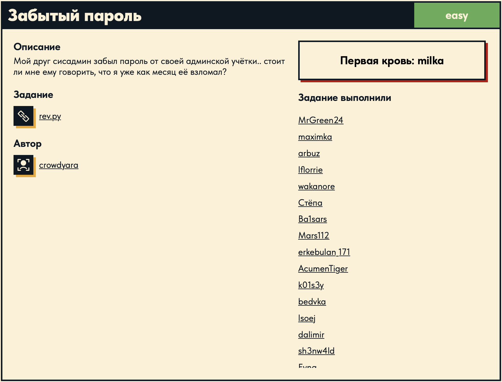

# Забытый пароль 🔁

## Описание задачи 📌

Название задачи:

```text
Забытый пароль
```

Сложность:

```text
Easy
```

Описание со страницы задачи:

```text
Мой друг сисадмин забыл пароль от своей админской учётки..
стоит ли мне ему говорить, что я уже как месяц её взломал?
```

В качестве файла задачи был дан Python-скрипт:

```text
rev.py
```

Скрин страницы задачи:



## Файл задачи 🔎

В задаче был дан файл:

```text
rev.py
```

`name.png` - это скрин страницы задачи, который был добавлен отдельно для оформления writeup.

## Первичный осмотр кода 🧠

Открыли `rev.py`:

```python
from math import *

flag = b'\x1c-\x1b#\x1d*2S(\x0c\n\nO\x08J<7\x1bJ\x0c\x1bC=\x1c7/\t\x0f@7\x1b\x0c\x1d\r\x0cJU'
print('[*] Hello this is simple cipher program. Enter the message: ')
message = str(input())
if message == "Give me flag":
    print("[*] where 'please'?")
elif message == "Give me flag please":
    print("[*] None. GLHF")

key = ord(message[len(message)-1])
list_output = []
flag_ouput = []
for i in range(0, len(message)):
    list_output.append(chr(ord(message[i])+key))
for i in range(0, len(flag)):
        flag_ouput.append(chr(flag[i]+key))

str_ouput = ''.join(list_output)
str_flag = ''.join(flag_ouput)

print('[*] This is your cipher text: ', str_ouput.encode())
print('[*] This is flag output: ', str_flag)
```

На этом этапе видно, что скрипт:

1. Хранит байтовую строку `flag`.
2. Просит пользователя ввести сообщение.
3. Берет последний символ введенного сообщения.
4. Использует `ord()` от этого символа как ключ.
5. Прибавляет этот ключ к каждому символу введенного сообщения.
6. Прибавляет этот же ключ к каждому байту из `flag`.
7. Печатает получившийся результат.

## Что такое `b'...'` 🧱

В Python обычная строка выглядит так:

```python
text = "hello"
```

А такая запись:

```python
flag = b'\x1c-\x1b#...'
```

это `bytes`, то есть набор байтов.

Байт - это число от `0` до `255`.

Например:

```python
b'ABC'
```

это не просто буквы, а набор байтов:

```text
A -> 65
B -> 66
C -> 67
```

Это можно проверить:

```python
print(list(b'ABC'))
```

Результат:

```text
[65, 66, 67]
```

То есть `b'\x1c-\x1b#...'` - это набор чисел. Просто Python показывает часть байтов как обычные символы, если они печатные.

## Что значит `\x1c` 🔢

Запись:

```text
\x1c
```

это один байт в шестнадцатеричной системе.

```text
\x1c = 28
```

Например:

```python
print(list(b'\x1c'))
```

выведет:

```text
[28]
```

Почему рядом с `\x1c` есть обычные символы вроде `-`, `#`, `*`, `2`, `S`?

Потому что если байт соответствует печатному символу, Python показывает его как символ:

```text
b'-' -> 45
b'#' -> 35
```

А если байт непечатный, Python показывает его в виде `\x..`.

Например:

```python
b'\x1c-\x1b#'
```

на самом деле означает:

```text
28, 45, 27, 35
```

## `ord()` и `chr()` 🧠

Функция `ord()` берет один символ и возвращает его числовой код.

Примеры:

```python
ord('A') # 65
ord('D') # 68
ord('(') # 40
```

Обратная функция - `chr()`.

```python
chr(65) # 'A'
```

То есть:

```text
ord('A') -> 65
chr(65) -> 'A'
```

## Как работает программа ⚙️

Главная часть:

```python
message = str(input())
key = ord(message[len(message)-1])
```

Программа просит ввести сообщение. Потом берет последний символ сообщения.

Например, если ввести:

```text
abc(
```

то последний символ:

```text
(
```

Дальше:

```python
key = ord('(')
```

А `ord('(')` равно `40`.

Значит:

```text
key = 40
```

После этого программа берет каждый байт из `flag` и прибавляет к нему `key`:

```python
flag_ouput.append(chr(flag[i]+key))
```

Например, если первый байт `flag` равен `28`, программа делает:

```text
28 + 40 = 68
```

А:

```python
chr(68)
```

это:

```text
D
```

Значит первый символ расшифрованного флага - `D`.

## Как был найден ключ 🔑

Мы знаем формат флагов Duckerz:

```text
DUCKERZ{...}
```

Для вычисления ключа не нужно было использовать весь префикс `DUCKERZ{`. Достаточно первой буквы: настоящий флаг должен начинаться с:

```text
D
```

Первый байт зашифрованного `flag`:

```text
\x1c
```

Это число:

```text
28
```

Буква `D` - это число:

```text
68
```

Нужно понять, какое число прибавили к `28`, чтобы получилось `68`:

```text
28 + key = 68
```

Отсюда:

```text
key = 68 - 28
key = 40
```

Теперь нужно найти символ, у которого код `40`:

```python
chr(40)
```

Результат:

```text
(
```

Значит программа должна использовать ключ `40`, а для этого последний символ ввода должен быть `(`.

## Проверка вручную ✍️

Можно взять первые байты из `flag` и прибавить к ним `40`.

Первые байты:

```text
\x1c  -> 28
-     -> 45
\x1b  -> 27
#     -> 35
\x1d  -> 29
```

Прибавляем `40`:

```text
28 + 40 = 68 -> D
45 + 40 = 85 -> U
27 + 40 = 67 -> C
35 + 40 = 75 -> K
29 + 40 = 69 -> E
```

Получается:

```text
DUCKE
```

Значит направление верное.

## Получение флага 🏁

Запускаем программу:

```bash
python3 rev.py
```

На ввод можно подать любой текст, главное - чтобы последний символ был `(`.

В данном случае ввели только один символ:

```text
(
```

Результат:

```text
[*] Hello this is simple cipher program. Enter the message:
(
[*] This is your cipher text:  b'P'
[*] This is flag output:  DUCKERZ{...}
```

Флаг:

```text
DUCKERZ{...}
```

## Итог 🏁

На текущем этапе:

```text
получен rev.py -> разобран bytes -> найден key=40 -> ввод '(' -> получен флаг
```

Суть задачи: автор "зашифровал" флаг прибавлением одного числа ко всем байтам. Это число удалось вычислить по первому байту зашифрованного флага и первой букве стандартного формата флага - `D`.

Автор: masquadd :) ✍️
