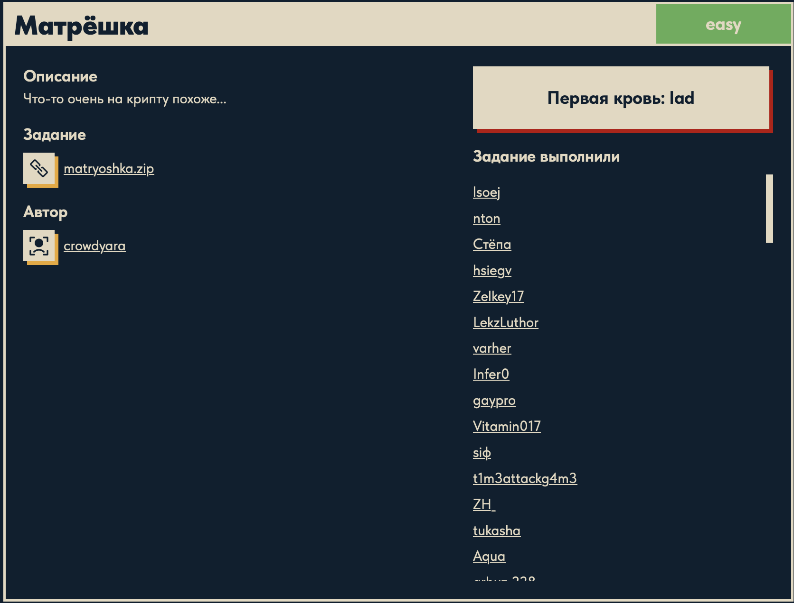

# Матрёшка 🪆

## Описание задачи

Задача: **Матрёшка**

Сложность: 

Описание с платформы:

> Что-то очень на крипту похоже...

Задание:

```text
matryoshka.zip
```

Автор задачи:

```text
crowdyara
```

Первая кровь:

```text
lad
```

Скрин с названием и описанием:



---

## Первый взгляд 👀

Категория — reverse, но описание намекает на криптографию («очень на крипту похоже»).
Название «Матрёшка» подсказывает главную идею задачи: данные спрятаны **слой за слоем**,
как вложенные куколки. Значит, нас ждёт несколько уровней распаковки/расшифровки.

После распаковки `matryoshka.zip` внутри оказалась папка `__pycache__/` с двумя файлами:

```text
__pycache__/
├── encrypt.txt                     # результат работы программы (шифртекст)
└── easy_reverse.cpython-38.pyc     # скомпилированный Python 3.8 байткод
```

Из этого сразу складываются роли файлов:

- `easy_reverse.cpython-38.pyc` — это **сама программа-шифратор**. Расширение `.pyc` и
  папка `__pycache__` означают, что это байткод, автоматически скомпилированный из
  `easy_reverse.py`. Имя `easy_reverse` — прямая подсказка: логику нужно «развернуть обратно».
- `encrypt.txt` — это **вывод этой программы**, зашифрованный флаг.

Содержимое `encrypt.txt`:

```text
01010011 01011011 00111101 00111001 01001110 00111101 01001010 00111101 01001110 01110001 01100010 00111111 01110001 01000000 00110111 01010000 01010111 01001110 00100111 01010101 01110110 01101110 00101011 00110011 00101101 01101011 00101100
```

Это группы по 8 бит, разделённые пробелами — классическая **бинарная (двоичная) запись
ASCII-строки**. Это самый внешний слой матрёшки: сначала снимаем его (двоичное → текст),
получим шифртекст, а потом уже разбираемся, каким алгоритмом он получен из `.pyc`.

---

## Слой 1: двоичное → ASCII

Раскодировали `encrypt.txt` из двоичного вида в текст:

```bash
python3 -c "print(''.join(chr(int(b,2)) for b in open('__pycache__/encrypt.txt').read().split()))"
```

Результат:

```text
S[=9N=J=Nqb?q@7PWN'Uvn+3-k,
```

Это не флаг, а **шифртекст** — набор печатных ASCII-символов. Внешний слой матрёшки снят.
Чтобы понять, каким алгоритмом он получен, нужно вскрыть саму программу `easy_reverse.pyc`.

---

## План решения

```text
1. Снять внешний слой: encrypt.txt (двоичное) -> ASCII-строка (шифртекст)
2. Восстановить исходник из easy_reverse.cpython-38.pyc (декомпиляция/дизассемблирование)
3. Понять алгоритм шифрования и обратить его
4. Применить обратное преобразование к шифртексту -> флаг DUCKERZ{...}
```

---

## Слой 2: декомпиляция `.pyc`

Системный Python на macOS «externally managed» (PEP 668), поэтому ставим декомпилятор в
изолированное окружение:

```bash
python3 -m venv venv
source venv/bin/activate
pip install decompyle3
decompyle3 __pycache__/easy_reverse.cpython-38.pyc
```

Восстановленный исходник `easy_reverse.py`:

```python
import string

def rot13(text):
    result = []
    for i in text:
        char = i - 13
        if char < 32:
            char += 95
        result.append(chr(char))
    return "".join(result)


def atbash(text):
    alphabet = string.ascii_uppercase + string.ascii_lowercase
    reversed_alphabet = alphabet[::-1]
    table = str.maketrans(
        alphabet + string.digits + string.punctuation,
        reversed_alphabet + string.digits[::-1] + string.punctuation[::-1],
    )
    return text.translate(table)


def to_hex(text):
    result = []
    for i in text:
        result.append(hex(ord(i)))
    return result


def xor(text):
    result = []
    for i in text:
        result.append(int(i, 16) ^ 8)
    return result


def reverse_text(text):
    return text[::-1]


def to_binary(text):
    result = []
    for i in text:
        result.append(bin(ord(i))[2:].zfill(8))
    return " ".join(result)


text = input()
print(to_binary(atbash(reverse_text(rot13(xor(to_hex(text)))))))
```

### Разбор конвейера

Вся программа — это цепочка вложенных преобразований (та самая «матрёшка»),
которая читается **изнутри наружу**:

```text
text
 -> to_hex        каждый символ -> hex-строка '0xNN'
 -> xor           int(hex,16) ^ 8  -> список чисел
 -> rot13         из числа: n - 13 (и + 95, если стало < 32) -> символ
 -> reverse_text  переворот всей строки
 -> atbash        замена по «зеркальному» алфавиту (буквы/цифры/пунктуация)
 -> to_binary     каждый символ -> 8 бит  -> encrypt.txt
```

Важные наблюдения:

- Последний слой (`to_binary`) мы уже сняли на шаге 1 — это и был бинарь в `encrypt.txt`.
- **`rot13` — обманка.** Несмотря на имя, это не классический ROT13, а вычитание 13
  с ручным «переносом» `+95` при выходе ниже 32. В reverse нельзя верить именам функций —
  только их коду.
- Каждый исходный символ независимо превращается в один символ (плюс общий разворот строки
  на шаге `reverse_text`). Значит, шифр обратим посимвольно.

---

## Слой 3: снятие atbash и reverse_text

`atbash` — инволюция, поэтому снимается повторным вызовом самой себя. `reverse_text` —
повторным разворотом. Снимаем оба слоя:

```python
print(reverse_text(atbash("S[=9N=J=Nqb?q@7PWN'Uvn+3-k,")))
```

Результат (выход прямой функции `rot13`):

```text
?P>6@MEf^mdk2+J,YJm.q.m0.*h
```

Осталось снять два внутренних слоя — `rot13` и XOR.

---

## Слой 4: обратный rot13 и XOR → флаг

Каждый символ переводим обратно в число (`unrot13`), затем снимаем XOR и превращаем в символ:

```python
s = reverse_text(atbash("S[=9N=J=Nqb?q@7PWN'Uvn+3-k,"))
nums = []
for c in s:
    n = ord(c) + 13     # отменяем "- 13"
    if n > 126:         # отменяем перенос "+ 95"
        n -= 95
    n ^= 8              # снимаем XOR
    nums.append(n)
print(''.join(chr(n) for n in nums))
```

После `unrot13` числа получаются равными `ord(символа) ^ 8`; снимаем XOR (`^ 8`) — и получаем
готовые ASCII-коды флага:

```text
[68, 85, 67, 75, 69, 82, 90, 123, ..., 125]
```

Каждое число здесь — ASCII-код символа флага (например, `chr(68)='D'`, `chr(123)='{'`).
Превращаем коды в символы через `chr()` и склеиваем — получается флаг вида `DUCKERZ{...}`.

---

## Итоговый расшифратор

```python
import string

def atbash(text):
    alphabet = string.ascii_uppercase + string.ascii_lowercase
    reversed_alphabet = alphabet[::-1]
    table = str.maketrans(
        alphabet + string.digits + string.punctuation,
        reversed_alphabet + string.digits[::-1] + string.punctuation[::-1],
    )
    return text.translate(table)

def reverse_text(text):
    return text[::-1]

# 1. encrypt.txt (двоичное) -> ASCII
bits = open("__pycache__/encrypt.txt").read().split()
cipher = "".join(chr(int(b, 2)) for b in bits)

# 2. atbash (инволюция) -> 3. reverse -> 4. unrot13 + XOR -> chr
s = reverse_text(atbash(cipher))
flag = []
for c in s:
    n = ord(c) + 13
    if n > 126:
        n -= 95
    n ^= 8
    flag.append(chr(n))
print("".join(flag))
```

Флаг:

```text
DUCKERZ{...}
```

(смысловая подсказка автора спрятана в самом флаге: «crypt0 in reverse» — крипта наизнанку.)

---

## Вопросы по ходу решения ❓

Раздел с вопросами, которые возникали во время решения, и ответами на них.

### Что вообще за формат `.pyc`?

Когда запускаешь Python-программу, интерпретатор не исполняет `.py` построчно напрямую.
Сначала исходник **компилируется** в промежуточное представление — *байткод*, и уже его
выполняет виртуальная машина CPython.

`.pyc` (**Python compiled**) — это файл, в который CPython **кэширует** этот байткод, чтобы
не компилировать модуль заново при каждом запуске. Он создаётся автоматически в папке
`__pycache__/` при импорте модуля. Имя `easy_reverse.cpython-38.pyc` расшифровывается как:
модуль `easy_reverse`, реализация `CPython`, версия Python `3.8`.

Что лежит внутри `.pyc`:

- **Заголовок** (для Python 3.8 — первые 16 байт): magic number (метка версии Python),
  биты флагов, timestamp и размер исходника.
- **Marshalled code object** — сериализованный объект с байткодом: сами инструкции,
  константы (в т.ч. строки и числа) и имена переменных.

Главное для reverse: **байткод — это не машинный код и не шифр, а почти дословный слепок
исходного `.py`**. Поэтому его можно:

- **декомпилировать** обратно в читаемый `.py` (`decompyle3`, `uncompyle6`, `pycdc`) —
  результат близок к оригиналу;
- либо **дизассемблировать** модулем `dis` — увидеть инструкции ВМ
  (`LOAD_CONST`, `BINARY_XOR` и т.п.).

Вывод: `.pyc` не защищает логику, а лишь прячет её от беглого взгляда. Смысл задачи —
восстановить алгоритм шифрования из этого байткода.

### Почему не работает `int(16, i)` при написании обратного XOR?

Перепутан порядок аргументов. Сигнатура функции — `int(строка, основание)`:

- `int(i, 16)` — «разобрать строку `i` как число в 16-ричной системе» ✅
- `int(16, i)` — первым аргументом идёт число `16` (а нужна строка), а строка `i`
  подставлена как основание → `TypeError` ❌

Кроме того, для расшифровки **отдельная обратная функция XOR не нужна**: XOR обратен сам
себе (`n ^ 8 ^ 8 == n`), поэтому слой снимается тем же `^ 8`.

Тонкость по типам: у прямой `xor` на входе были hex-**строки** (`'0x44'`), поэтому там
стоял `int(i, 16)`. При расшифровке на этом шаге на входе уже **числа** (после снятия
`rot13`), так что `int(..., 16)` не нужен — достаточно `число ^ 8`, а затем `chr(...)`.

### Почему обратный XOR падает с `ValueError: invalid literal for int() with base 16: '?'`?

Причина — **пропущен слой**. Порядок расшифровки (снаружи внутрь):

```text
S -> atbash -> reverse_text -> обратный rot13 -> XOR ^8 -> chr
```

После `atbash` и `reverse_text` на руках **строка символов** (в ней есть, например, `?`).
Эта строка — выход прямой функции `rot13`, где числа превращались в символы через `chr()`.
Если сразу отдать её в XOR-функцию с `int(i, 16)`, то `int('?', 16)` падает: `?` не hex-цифра.

Между `reverse_text` и XOR обязателен **обратный `rot13`** — именно он превращает символы
назад в **числа**. Прямая `rot13` для каждого числа `i` делала:

```python
char = i - 13
if char < 32:
    char += 95
```

Значит обратная операция для каждого символа `c`:

```python
n = ord(c) + 13     # отменяем "- 13"
if n > 126:         # отменяем перенос "+ 95"
    n -= 95
```

На выходе — список чисел `n`.

**Важное упрощение:** `to_hex` + `xor` вместе дают ровно `ord(символа) ^ 8`. Поэтому после
`unrot13` восстанавливать hex-строки `'0xNN'` не нужно — достаточно `chr(n ^ 8)`. Отдельная
обратная функция с `int(i, 16)` не требуется.

### Почему падает `TypeError: unsupported operand type(s) for ^: 'str' and 'int'`?

Две отдельные ошибки, обе про типы:

1. **`i ^ 8 ^ 8` — это no-op.** XOR дважды одним значением возвращает исходное
   (`x ^ 8 ^ 8 == x`), то есть слой XOR не снимается вообще. Нужно `^ 8` **ровно один раз**.

2. **`i` оказался строкой.** Обратный `rot13` вернул символы (`chr(...)`), а `^` работает
   только с числами. Значит `unrot13` должен возвращать **список чисел** (`append(n)`),
   а не строку (`append(chr(n))`). В символ число превращается только в самом конце —
   уже после XOR.

Правильная стыковка типов:

```text
строка символов --unrot13--> [числа] --(n ^ 8, chr)--> строка (флаг)
```

### Причём тут hex и почему мы его «пропустили»?

Посмотрим на два первых шага прямого шифрования **вместе**:

```python
to_hex:  'D'     -> hex(68)          -> '0x44'         # число -> строка
xor:     '0x44'  -> int('0x44', 16)  -> 68  -> 68 ^ 8  # строка -> обратно то же число, затем XOR
```

`to_hex` превращает число в **строку** `'0x44'`, а `xor` первым же действием делает
`int('0x44', 16)` — то есть **сразу парсит эту строку обратно в то же число 68**. Получается
круговой путь: `число -> hex-строка -> то же число`. Строка `'0x44'` — лишь временная
«обёртка», которая тут же разворачивается назад. Единственное реальное действие связки —
получить `ord(символа)` и применить к нему XOR.

Поэтому при расшифровке **восстанавливать hex не нужно**: после `unrot13` у нас уже есть
число `ord(символа) ^ 8`. Если бы мы честно собрали строку `'0x44'`, то следующим шагом
пришлось бы снова распарсить её в число через `int(..., 16)` — бессмысленный крюк. Мы просто
идём напрямую `число -> chr()`.

Короче: `to_hex` в этой программе — **косметика**, которая в паре с `int(..., 16)` внутри
`xor` взаимно сокращается. Это типичный приём в reverse-задачах: часть операций служит
только для запутывания и при обращении алгоритма схлопывается.

---

## Справочник использованных функций Python 📚

Разбор всех функций и приёмов Python, которые встретились в задаче — и во «вражеском»
шифраторе, и в нашем расшифраторе.

### Встроенные функции и операции

| Конструкция | Что делает | Пример |
|---|---|---|
| `input()` | читает строку из стандартного ввода | `text = input()` |
| `print(x)` | печатает значение в стандартный вывод | `print(flag)` |
| `ord(c)` | символ → его числовой код (code point) | `ord('D')` → `68` |
| `chr(n)` | число → символ с таким кодом (обратна `ord`) | `chr(68)` → `'D'` |
| `hex(n)` | целое число → строка в 16-ричном виде с префиксом `0x` | `hex(68)` → `'0x44'` |
| `bin(n)` | целое число → строка в двоичном виде с префиксом `0b` | `bin(68)` → `'0b1000100'` |
| `int(s, base)` | разбирает **строку** `s` как число в системе `base` | `int('0x44', 16)` → `68`, `int('1000100', 2)` → `68` |
| `"".join(list)` | склеивает список строк в одну строку через разделитель | `"".join(['a','b'])` → `'ab'` |
| `str.zfill(n)` | дополняет строку нулями слева до длины `n` | `'101'.zfill(8)` → `'00000101'` |
| `s[::-1]` | срез с шагом −1 — переворачивает строку/список | `'abc'[::-1]` → `'cba'` |
| `s[2:]` | срез от индекса 2 до конца (отрезаем префикс `0b`/`0x`) | `'0b101'[2:]` → `'101'` |
| `^` | побитовый XOR; **обратен сам себе**: `x ^ k ^ k == x` | `68 ^ 8` → `76`, `76 ^ 8` → `68` |

### Работа с таблицей замены (atbash)

| Конструкция | Что делает |
|---|---|
| `string.ascii_uppercase` | константа `'ABC…Z'` |
| `string.ascii_lowercase` | константа `'abc…z'` |
| `string.digits` | константа `'0123456789'` |
| `string.punctuation` | константа со знаками пунктуации `'!"#$%…'` |
| `str.maketrans(a, b)` | строит таблицу замены: символ `a[i]` → символ `b[i]` |
| `text.translate(table)` | применяет таблицу замены к строке |

`atbash` строит таблицу «прямой алфавит → его разворот» (`str.maketrans`) и применяет её
(`translate`). Так как это симметричная перестановка (A↔z, 0↔9 …), функция **инволютивна** —
повторный вызов возвращает исходную строку, что мы и использовали для расшифровки.

### Функции из шифратора `easy_reverse.py` (прямые)

| Функция | Тип входа → выхода | Суть |
|---|---|---|
| `to_hex(text)` | строка → список hex-строк | каждый символ → `hex(ord(c))` |
| `xor(text)` | список hex-строк → список чисел | `int(hex, 16) ^ 8` |
| `rot13(text)` | список чисел → строка | `chr(n - 13)` с переносом `+95`, если `< 32` (это **не** ROT13!) |
| `reverse_text(text)` | строка → строка | разворот `text[::-1]` |
| `atbash(text)` | строка → строка | «зеркальная» замена символов |
| `to_binary(text)` | строка → строка | каждый символ → 8 бит: `bin(ord(c))[2:].zfill(8)` |

### Функции, которые мы написали для расшифровки (обратные)

| Шаг | Реализация | Обращает |
|---|---|---|
| двоичное → текст | `chr(int(b, 2))` для каждой группы бит | `to_binary` |
| снятие atbash | повторный вызов `atbash(...)` (инволюция) | `atbash` |
| снятие разворота | повторный `reverse_text(...)` | `reverse_text` |
| обратный rot13 | `n = ord(c) + 13; if n > 126: n -= 95` → список чисел | `rot13` |
| снятие XOR | `n ^ 8` | `xor` |
| число → символ | `chr(n)` | `to_hex` (+ разбор hex схлопнулся) |

---

## Почему это работает 🧠

Задача — учебный пример того, что **обфускация ≠ защита**:

1. **`.pyc` не скрывает логику.** Байткод почти дословно декомпилируется обратно в исходник,
   так что весь алгоритм шифрования читается напрямую.
2. **Все преобразования обратимы.** Каждый слой — либо инволюция (`atbash`, `reverse_text`,
   `XOR`), либо однозначно обратимая операция (`rot13`-сдвиг, `to_hex`/`to_binary`). Никакого
   секретного ключа, известного только автору, в схеме нет — значит цепочку можно развернуть.
3. **Часть слоёв — «шум».** `to_hex` в паре с `int(..., 16)` внутри `xor` схлопывается;
   имя `rot13` вводит в заблуждение. Это маскировка, а не криптостойкость.

По сути «Матрёшка» — это набор кодировок и простых подстановок, наложенных друг на друга.
Чтобы её раскрыть, достаточно аккуратно снимать слои снаружи внутрь, следя за тем, какой
**тип данных** на входе и выходе каждого шага (строка ↔ список чисел ↔ список hex-строк).

---

## Итог 🏁

Цепочка решения:

```text
matryoshka.zip -> __pycache__/{encrypt.txt, easy_reverse.cpython-38.pyc}
-> декодируем encrypt.txt из двоичного вида в шифртекст
-> декомпилируем .pyc (decompyle3) и читаем алгоритм
-> разбираем конвейер: to_hex -> xor -> rot13 -> reverse -> atbash -> to_binary
-> обращаем цепочку снаружи внутрь: atbash -> reverse -> unrot13 -> XOR -> chr
-> собираем флаг
```

Флаг:

```text
DUCKERZ{...}
```

---

## Текущий статус

Задача решена.

Зафиксировано:

- название задачи, сложность `Easy`, описание с платформы, автор `crowdyara`, первая кровь `lad`;
- содержимое архива: `encrypt.txt` (двоичный шифртекст) и `easy_reverse.cpython-38.pyc`;
- снят внешний слой: двоичное → ASCII-шифртекст;
- `.pyc` декомпилирован в `easy_reverse.py`, разобран конвейер шифрования;
- определено, что `rot13` — обманка (сдвиг на 13 с переносом), а `to_hex` схлопывается с `int(.,16)`;
- написан обратный конвейер (atbash → reverse → unrot13 → XOR → chr);
- получен флаг `DUCKERZ{...}`.

---

Автор: **masquadd :)** ✍️
