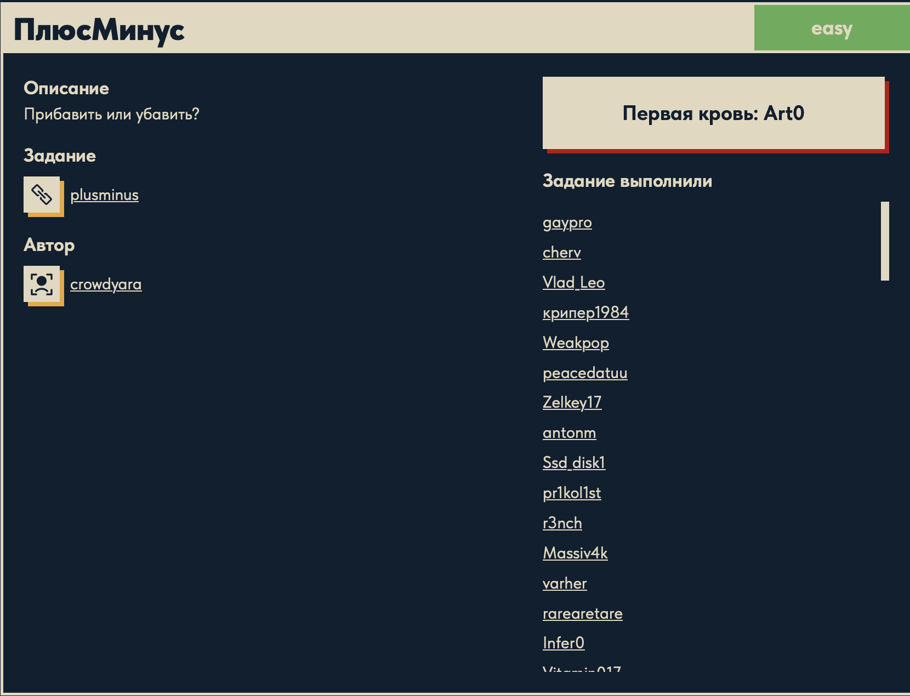

# ПлюсМинус ➕➖

## Описание задачи

Задача: **ПлюсМинус**

Сложность: 

Описание с платформы:

> Прибавить или убавить?

Задание:

```text
plusminus
```

Автор задачи:

```text
crowdyara
```

Первая кровь:

```text
Art0
```

Скрин с названием и описанием:



---

## Первый взгляд 👀

Первое действие с любым бинарём — узнать, **что это за файл**:

```bash
file plusminus
# -> ELF 64-bit LSB pie executable, x86-64, version 1 (SYSV), dynamically linked,
#    interpreter /lib64/ld-linux-x86-64.so.2, ... for GNU/Linux 3.2.0, not stripped
```

Разбор:

- **ELF 64-bit x86-64** — исполняемый файл **Linux** (не Windows PE, как в прошлых банках).
- **pie** (Position Independent Executable) — грузится по случайному базовому адресу (ASLR).
- **dynamically linked** — использует системные библиотеки (libc).
- **not stripped** — **символы не вырезаны!** Это большой подарок: имена функций и данных на
  месте, логика читается почти как исходник.

Смотрим таблицу символов (`nm`):

```bash
nm plusminus | grep -iE "flag|decrypt|encrypt|main"
```

```text
00000000000011e9 T decrypt_flag      # функция расшифровки
0000000000002010 r encrypted_flag    # зашифрованные данные (в .rodata)
000000000000124d T main
```

Картина ясна: в бинаре лежит **`encrypted_flag`** (зашифрованный флаг) и функция
**`decrypt_flag`**, которая его расшифровывает. Название задачи и описание («Прибавить или
убавить?») прямо намекают: шифрование — это **посимвольное сложение/вычитание** (сдвиг байтов,
как у шифра Цезаря). Нужно понять, что именно делает `decrypt_flag`, и обратить это.

Быстрая проверка `strings` подтверждает, что флаг **не лежит открытым текстом**:

```bash
strings -n 6 plusminus | grep -iE 'duckerz|flag|\{'
# -> encrypted_flag
#    decrypt_flag
```

Разбор команды: `strings -n 6` берёт печатные строки длиной от 6 символов (по умолчанию — от 4;
подняли порог, чтобы отсеять мусор); `grep -iE` фильтрует регистронезависимо (`-i`) по
расширенной регулярке (`-E`) «`duckerz` ИЛИ `flag` ИЛИ литеральная `{`» (`\{` экранирована, т.к.
в ERE `{` начинает квантификатор `{n,m}`). Нашлись только **имена символов**, а готового
`DUCKERZ{...}` нет — значит флаг **зашифрован**, и наивный `strings`-греп не поможет.

---

## План решения

```text
1. file / nm — опознать ELF и найти символы (decrypt_flag, encrypted_flag)   [сделано]
2. Прочитать байты encrypted_flag (objdump / radare2 / Ghidra)
3. Разобрать логику decrypt_flag: +/- какой константы, XOR, посимвольно
4. Применить расшифровку к encrypted_flag -> флаг DUCKERZ{...}
   (либо просто запустить бинарь под Linux/эмуляцией, если он сам печатает флаг)
```

---

## Мини-введение в ассемблер x86-64 (AT&T) 📚

`objdump -d` печатает дизассемблер в синтаксисе **AT&T**. Прежде чем читать `decrypt_flag`,
разберём базу.

Формат строки objdump (4 зоны):

```text
1203:   48 8d 15 06 0e 00 00    leaq  0xe06(%rip), %rdx   # 0x2010 <encrypted_flag>
└addr┘  └──── опкод (байты) ──┘  └──── мнемоника ─────┘   └──── комментарий ────┘
```

- **адрес** — смещение инструкции в файле/памяти;
- **опкод** — сами байты машинного кода (то, что исполняет процессор);
- **мнемоника** — человекочитаемая запись той же инструкции (то, что читаем мы);
- **комментарий** — подсказки objdump (например, вычисленный итоговый адрес и имя символа).

Байты и мнемоника — **одно и то же**, просто в разных представлениях.

Ключевые правила AT&T:

- **порядок операндов — `op ИСТОЧНИК, ПРИЁМНИК`** (наоборот к Intel): `movq %rsp, %rbp`
  означает `rbp = rsp`;
- **суффикс размера**: `q` = 8 байт (quad), `l` = 4 (long), `w` = 2 (word), `b` = 1 (byte);
- **регистры**: `%rax/%eax` — аккумулятор (64/32 бита), `%rbp` — база кадра стека,
  `%rsp` — вершина стека, `%rdi` — 1-й аргумент функции, `%rdx`/`%rcx` — рабочие;
- **память**: `смещение(база,индекс,масштаб)` = `*(база + индекс·масштаб + смещение)`.
  `-0x4(%rbp)` — локальная переменная (на 4 байта ниже базы кадра); `(%rax,%rdx)` = `*(rax+rdx)`;
- **`%rip`-относительная адресация**: `leaq 0xe06(%rip), %rdx` — типична для PIE: адрес считается
  относительно текущей инструкции, поэтому код работает по любому базовому адресу. objdump сам
  вычислил итог: `0x2010 <encrypted_flag>`.

Нужные инструкции:

| Инструкция | Что делает |
|---|---|
| `endbr64` | метка-заглушка для защиты потока управления (CET); для логики неважна |
| `push %rbp` / `mov %rsp,%rbp` | пролог функции — установка кадра стека |
| `lea` (load effective address) | вычислить адрес/выражение **без обращения к памяти** (часто как арифметика) |
| `movzbl` | загрузить **байт** и расширить нулями до 32 бит |
| `cltq` / `movslq` | знаковое расширение `eax`→`rax` (нужно для индексации) |
| `test %al,%al` + `jne` | проверить, что байт ≠ 0, и если так — прыгнуть (условие цикла) |

---

## Разбор `decrypt_flag` 🔬

Дизассемблер (`objdump -d plusminus`):

```asm
decrypt_flag:                          ; аргумент rdi = указатель на выходной буфер
  mov  %rdi, -0x18(%rbp)               ; сохранить out в локалку
  movl $0x0, -0x4(%rbp)                ; i = 0
  jmp  .check                          ; сразу к проверке условия
.loop:
  mov  -0x4(%rbp), %eax                ; eax = i
  cltq                                 ; расширить i до 64 бит (rax)
  lea  0xe06(%rip), %rdx               ; rdx = &encrypted_flag (0x2010)
  movzbl (%rax,%rdx), %eax             ; eax = encrypted_flag[i]  (байт, zero-extended)
  lea  -0xa(%rax), %ecx                ; ecx = eax - 10     <-- РАСШИФРОВКА: вычесть 10
  mov  -0x4(%rbp), %eax                ; eax = i
  movslq %eax, %rdx                    ; rdx = i
  mov  -0x18(%rbp), %rax               ; rax = out
  add  %rdx, %rax                      ; rax = out + i
  mov  %ecx, %edx
  mov  %dl, (%rax)                     ; out[i] = (encrypted_flag[i] - 10)
  addl $0x1, -0x4(%rbp)                ; i++
.check:
  mov  -0x4(%rbp), %eax; cltq
  lea  0xdde(%rip), %rdx               ; rdx = &encrypted_flag
  movzbl (%rax,%rdx), %eax             ; eax = encrypted_flag[i]
  test %al, %al                        ; байт == 0 ?
  jne  .loop                           ; нет -> следующий символ
  ... out[i] = 0                       ; да -> завершить строку нулём
```

Если переписать это на C, получится:

```c
void decrypt_flag(char *out) {
    for (int i = 0; encrypted_flag[i] != 0; i++)
        out[i] = encrypted_flag[i] - 10;   // <-- вся «криптография»
    out[i] = 0;
}
```

**Вся суть:** цикл идёт по `encrypted_flag` до нулевого байта и из **каждого байта вычитает 10**
(`lea -0xa(%rax), %ecx`). То есть флаг зашифровали, **прибавив 10** к каждому байту, а
расшифровка — **вычесть 10**. Отсюда и название «ПлюсМинус» / «Прибавить или убавить?».

(`main` дополнительно читает ввод пользователя, вызывает `decrypt_flag` в буфер и сравнивает
`strcmp` — это просто проверка «угадай флаг». Но раз `decrypt_flag` сам вычисляет флаг, нам
достаточно повторить `−10`.)

---

## Почему берём именно байты с `0x2010` 🎯

- Символ `encrypted_flag` лежит по адресу **`0x2010`** (видно и в `nm`, и в комментарии objdump
  к `leaq ... # 0x2010 <encrypted_flag>`).
- Дамп секции `.rodata` (`objdump -s -j .rodata plusminus`):

  ```text
  2010 4e5f4d55 4f5c6485 50766b71 695a3b7f  N_MUO\d.PvkqiZ;.
  2020 5d693b3a 8700d092 d0b2d0b5 d0b4d0b8  ]i;:............
  ```

- Цикл в `decrypt_flag` читает байты **до нулевого** (`test %al,%al; jne`). Значит
  `encrypted_flag` — это ровно последовательность с `0x2010` **до первого `00`**:

  ```text
  4e 5f 4d 55 4f 5c 64 85 50 76 6b 71 69 5a 3b 7f 5d 69 3b 3a 87   (21 байт)
  00                                                               <- терминатор (0x2025)
  ```

- Байты **после** `0x2025` (`d0 92 d0 b2 …`) — это **другие строки** программы: UTF-8-текст на
  русском (`d0 xx` — кириллица), то есть сообщения-приглашения и «Верно»/«Неверно». К флагу они
  не относятся, поэтому берём только диапазон `0x2010`–`0x2024`.

---

## Расшифровка (`1.py`) ⚙️

```python
enc = bytes([0x4e,0x5f,0x4d,0x55,0x4f,0x5c,0x64,0x85,0x50,0x76,0x6b,
             0x71,0x69,0x5a,0x3b,0x7f,0x5d,0x69,0x3b,0x3a,0x87])
print(bytes(b - 10 for b in enc).decode())
```

Построчно:

- `enc = bytes([...])` — те самые 21 байт `encrypted_flag`, скопированные из дампа `.rodata`
  (диапазон `0x2010`–`0x2024`, до нулевого байта);
- `b - 10 for b in enc` — для **каждого** байта вычитаем 10 — ровно то, что делает
  `lea -0xa(%rax), %ecx` в `decrypt_flag`;
- `bytes(...)` — собираем результат в байтовую строку;
- `.decode()` — трактуем байты как ASCII-текст.

Например, первый байт: `0x4e − 10 = 0x44 = 'D'`, восьмой: `0x85 − 10 = 0x7b = '{'` — складывается
`DUCKERZ{…`. На выходе:

```text
DUCKERZ{...}
```

---

## Вывод об уязвимости 🧠

«Шифрование» здесь — это **сдвиг байтов на константу** (+10), то есть по сути шифр Цезаря.
Проблемы:

1. **Обратимое преобразование без ключа.** Вычесть 10 может кто угодно; никакого секрета,
   который знал бы только автор, в схеме нет.
2. **И шифртекст, и алгоритм лежат в самом бинаре.** `encrypted_flag` — в `.rodata`, а
   `decrypt_flag` — рядом в коде. Клиент, которому отдали программу, содержит всё необходимое
   для восстановления секрета.
3. **Бинарь не stripped.** Имена `encrypted_flag`/`decrypt_flag` прямо указывают, где что лежит,
   — реверс становится тривиальным.
4. Даже не читая ассемблер, флаг достаётся **запуском** программы или **брутфорсом** сдвига
   (всего 255 вариантов).

Мораль: **прятать секрет за обратимым сдвигом в клиентском бинаре — это не защита, а
обфускация**. Настоящая криптостойкость требует секретного ключа, которого нет в руках у
атакующего.

---

## Итог 🏁

Цепочка решения:

```text
file -> ELF x86-64, not stripped
nm -> символы decrypt_flag (0x11e9), encrypted_flag (0x2010)
objdump -d decrypt_flag -> цикл out[i] = encrypted_flag[i] - 10 (сдвиг на 10)
objdump -s -j .rodata -> байты encrypted_flag с 0x2010 до нулевого (21 байт)
вычесть 10 из каждого байта -> флаг
```

Флаг:

```text
DUCKERZ{...}
```

---

## Текущий статус

Задача решена.

Зафиксировано:

- название, сложность `Easy`, описание, автор `crowdyara`, первая кровь `Art0`;
- `plusminus` — ELF 64-bit x86-64, PIE, **not stripped**;
- символы: `decrypt_flag`, `encrypted_flag`, `main`;
- разобран ассемблер `decrypt_flag`: цикл `out[i] = encrypted_flag[i] - 10`;
- из `.rodata` взяты байты `encrypted_flag` (`0x2010` до нулевого терминатора);
- вычитанием 10 из каждого байта получен флаг `DUCKERZ{...}`;
- уязвимость: обратимый сдвиг-Цезарь, шифртекст и алгоритм в самом бинаре.

---

Автор: **masquadd :)** ✍️
