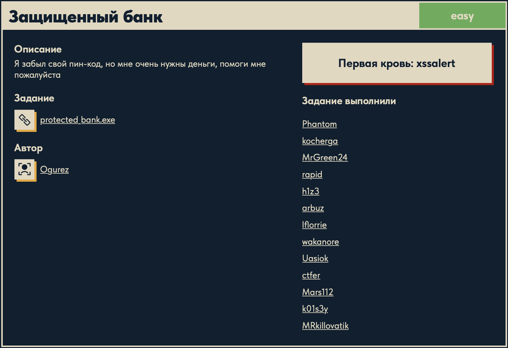
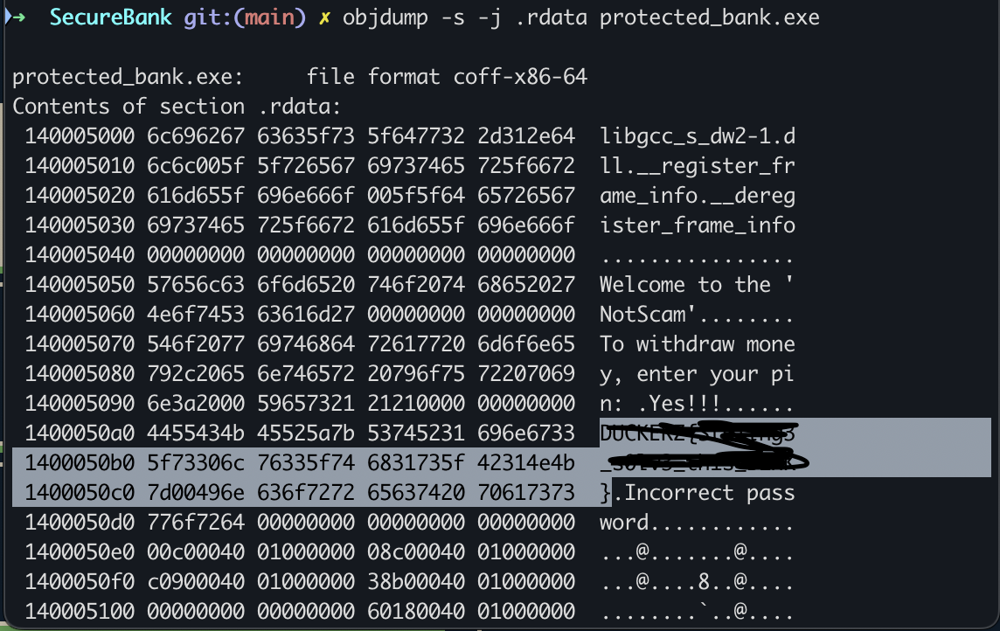

# Защищенный банк 🔁

## Описание задачи 📌

Название задачи:

```text
Защищенный банк
```

Сложность:

```text
Easy
```

Описание со страницы задачи:

```text
Я забыл свой пин-код, но мне очень нужны деньги, помоги мне пожалуйста
```

В качестве файла задачи был дан исполняемый файл:

```text
protected_bank.exe
```

Скрин страницы задачи:



## Первичная проверка файла 🔎

Сначала смотрим тип файла:

```bash
file protected_bank.exe
```

Результат:

```text
PE32+ executable (console) x86-64, for MS Windows
```

Что это значит:

- `PE` — формат исполняемых файлов Windows;
- `PE32+` — 64-битный Windows executable;
- `console` — программа консольная;
- `x86-64` — архитектура amd64.

То есть это reverse-задача с Windows-бинарем.

## Что есть на старте 🧠

По описанию задачи понятно, что программа связана с PIN-кодом:

```text
забыл свой пин-код
нужны деньги
```

Значит, основная цель анализа — найти, где программа проверяет PIN, и понять правильное значение или логику проверки.

## Направление анализа 🧭

Для такой задачи дальше обычно полезно:

- запустить программу и посмотреть интерфейс;
- проверить строки через `strings`;
- найти сообщения об успешном/неуспешном вводе PIN;
- открыть бинарь в дизассемблере;
- найти функцию проверки PIN;
- понять, сравнивается ли ввод с готовой строкой или вычисляется через алгоритм.

## Поиск строк через strings 🔤

После определения типа файла проверили читаемые строки:

```bash
strings -a -n 4 protected_bank.exe
```

Разберем команду.

```bash
strings
```

Ищет в бинарном файле последовательности печатных символов. В reverse-задачах это один из самых быстрых первых шагов, потому что в строках часто лежат:

- приветствия программы;
- тексты ошибок;
- сообщения об успешной проверке;
- подсказки;
- иногда сам флаг.

```bash
-a
```

Просит `strings` сканировать весь файл, а не только отдельные секции, которые утилита считает "подходящими".

Для CTF это удобно: мы хотим быстро посмотреть все читаемые строки, не пропуская возможные данные.

```bash
-n 4
```

Минимальная длина строки — `4` символа.

Если поставить слишком маленькое значение, вывод будет очень шумным. Если слишком большое — можно пропустить короткие важные строки. Значение `4` хорошо подходит для первичного осмотра.

```bash
protected_bank.exe
```

Имя файла, который анализируем.

## Что видно в выводе strings 🧠

В выводе были важные строки:

```text
Welcome to the 'NotScam'
To withdraw money, enter your pin:
Yes!!!
DUCKERZ{...}
Incorrect password
```

Что это значит:

- `Welcome to the 'NotScam'` — приветствие программы;
- `To withdraw money, enter your pin:` — программа просит PIN;
- `Incorrect password` — ветка неверного ввода;
- `Yes!!!` — вероятно, ветка успешной проверки;
- `DUCKERZ{...}` — флаг лежит в читаемых строках бинаря.

То есть задача решается уже на этапе просмотра строк: флаг не зашифрован и не спрятан глубоко в логике программы.

## Почему выбрали strings ⚙️

По условию задача про забытый PIN-код. Обычно в таком бинаре есть строки:

```text
enter pin
wrong password
success
```

Если автор задачи оставил флаг рядом с успешным сообщением, `strings` сразу это покажет.

Именно поэтому перед сложным дизассемблированием полезно сделать простой осмотр:

```text
file -> понять формат
strings -> найти читаемые строки
```

В этой задаче этого оказалось достаточно.

## Проверка секции .rdata 📦

Дополнительно был открыт вывод секции `.rdata`:

```bash
objdump -s -j .rdata protected_bank.exe
```

Разберем команду.

```bash
objdump
```

Утилита для просмотра содержимого объектных и исполняемых файлов.

```bash
-s
```

Показывает raw-содержимое секции в hex и ASCII-виде.

```bash
-j .rdata
```

Выбирает конкретную секцию `.rdata`.

Для Windows PE-файлов `.rdata` часто содержит read-only данные: строковые константы, таблицы, служебные данные.

```bash
protected_bank.exe
```

Файл, который анализируем.

На скрине видно, что в `.rdata` рядом лежат строки:

```text
Welcome to the 'NotScam'
To withdraw money, enter your pin:
Yes!!!
DUCKERZ{...}
Incorrect password
```

Скрин с замазанным флагом:



Это подтверждает вывод `strings`: флаг действительно находится в строковых данных программы.

## Получение флага 🏁

Флаг был найден в читаемых строках бинаря. В writeup сам флаг не вставляется.

## Итоговая цепочка ✅

```text
protected_bank.exe
        ↓
file показывает Windows PE x64
        ↓
strings -a -n 4 показывает читаемые строки
        ↓
видим сообщения программы и DUCKERZ{...}
        ↓
objdump -s -j .rdata подтверждает наличие флага в секции строк
        ↓
флаг найден
```

Суть задачи: флаг лежал в открытом виде среди строк бинаря, поэтому полноценный разбор проверки PIN-кода не понадобился.

## Финальный статус 🏁

В решении использовали:

```text
файл: protected_bank.exe
тип: Windows PE x64
тема: проверка PIN-кода
основная техника: просмотр строк
ключевые команды: file, strings, objdump
```

Автор: masquadd :) ✍️
