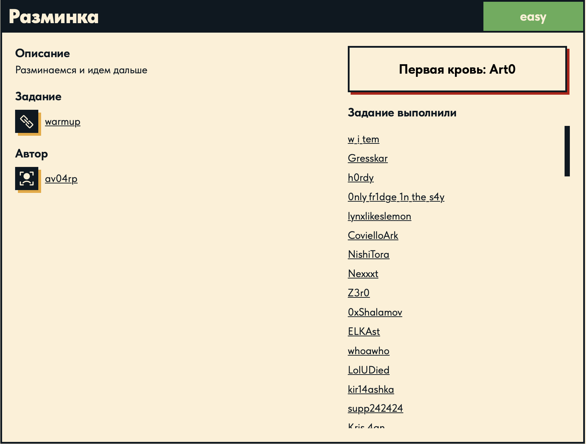

# Разминка 🏃

## Описание задачи

Задача: **Разминка**

Сложность: 

Описание с платформы:

> Разминаемся и идем дальше

Задание:

```text
warmup
```

Автор задачи:

```text
av04rp
```

Первая кровь:

```text
Art0
```

Скрин с названием и описанием:



---

## Первый взгляд 👀

Узнаём, **что это за файл**:

```bash
file warmup
```

```text
warmup: ELF 64-bit LSB pie executable, x86-64, version 1 (SYSV), dynamically linked,
interpreter /lib64/ld-linux-x86-64.so.2, BuildID[sha1]=aa7d1b5924e2dd3082e4853eba2b316fbb2279b2,
for GNU/Linux 3.2.0, not stripped
```

Узнаём, что **бинарь под Linux** (ELF, x86-64).

---

## Запуск через Docker 🐳

У меня Mac, поэтому Linux-бинарь запускаю в контейнере Ubuntu через Docker (с эмуляцией
amd64):

```bash
docker run --rm -it --platform linux/amd64 -v "$PWD":/work -w /work ubuntu:24.04 ./warmup
```

Разбор команды по частям:

- **`docker run`** — создать и запустить новый контейнер из образа.
- **`--rm`** — удалить контейнер сразу после выхода, чтобы не копить остановленные контейнеры.
- **`-it`** — `-i` (держать stdin открытым) + `-t` (выделить псевдо-TTY). Вместе дают
  интерактивную консоль — без этого нельзя было бы ввести строку, которую ждёт программа.
- **`--platform linux/amd64`** — запустить под архитектуру x86-64. На ARM-маке Docker эмулирует
  amd64 (через QEMU), так как бинарь собран под x86-64.
- **`-v "$PWD":/work`** — смонтировать текущую папку хоста внутрь контейнера по пути `/work`,
  чтобы файл `warmup` был виден внутри.
- **`-w /work`** — сделать `/work` рабочей директорией внутри контейнера (там лежит `warmup`).
- **`ubuntu:24.04`** — образ-основа контейнера.
- **`./warmup`** — что исполнить внутри контейнера: наш бинарь.

Запуск:

```text
Введите строчку: 123
Неверно
```

Программа просит ввести строчку и на `123` отвечает `Неверно` — значит внутри есть проверка ввода.

---

## Ищем проверку в `main` 🔬

Дизассемблируем `main`:

```bash
objdump -d -M intel --no-show-raw-insn --disassemble-symbols=main warmup
```

Ключевой фрагмент:

```asm
12f6:   call   0x10b0 <.plt.sec>         ; strcpy(tmp, ввод)
1305:   call   0x1209 <transform_string> ; преобразуем наш ввод
131e:   call   0x1110 <.plt.sec+0x60>    ; strcmp(tmp, encrypted)
1323:   test   eax, eax
1325:   jne    0x1338 <main+0xc4>        ; не равно -> "Неверно"
1327:   lea    rax, [rip+0xd24]          ; # 0x2052 -> "Верно"
```

Весь поток `main`:

```text
printf("Введите строчку: ")
fgets(buf, 0x100, stdin)     ; читаем ввод
strcspn(buf, "\n")           ; обрезаем перевод строки
strcpy(tmp, buf)             ; копируем ввод
transform_string(tmp)        ; <-- преобразуем ввод
strcmp(tmp, encrypted)       ; сравниваем с эталоном
== 0 -> "Верно" : "Неверно"
```

Обращаем внимание именно на `call 0x1209 <transform_string>` (адрес `1305`): всё остальное —
рутинный ввод-вывод (`printf`, `fgets`, обрезка `\n`, `strcpy`). А `transform_string` —
**единственное**, что преобразует наш ввод перед сравнением `strcmp` с зашитой строкой
`encrypted`. Значит, чтобы понять, какой ввод пройдёт проверку, нужно разобрать эту функцию.

---

## Разбор `transform_string` (сдвиг битов) ⚙️

```bash
objdump -d -M intel --no-show-raw-insn --disassemble-symbols=transform_string warmup
```

Тело цикла (обрабатывается по одному байту строки, пока не встретится `0`):

```asm
movzx eax, byte [rbp-5]   ; b = str[i]
lea   ecx, [8*rax]        ; ecx = b * 8 = b << 3     (сдвиг ВЛЕВО на 3)
movzx eax, byte [rbp-5]
shr   al, 0x5             ; eax = b >> 5             (сдвиг ВПРАВО на 5)
or    ecx, esi            ; ecx = (b << 3) | (b >> 5)
mov   byte [rax], dl      ; str[i] = младший байт результата
```

На C:

```c
for (int i = 0; str[i] != 0; i++) {
    unsigned char b = str[i];
    str[i] = (b << 3) | (b >> 5);   // циклический сдвиг ВЛЕВО на 3 (ROL 3)
}
```

`(b << 3) | (b >> 5)` над 8-битным байтом — это **циклический сдвиг (rotate)** на 3 бита.
Биты, ушедшие за левый край при `<< 3`, возвращаются справа через `>> 5`, ничего не теряется.
Это **ROL 3** (rotate left) — так функция «шифрует» наш ввод.

Чтобы обратить это и получить исходную строку (флаг), применяем обратную операцию —
**ROR 3** (rotate right на 3): `(x >> 3) | (x << 5)`.

---

## Где лежит цель — `encrypted` в `.rodata` 🎯

В `main` эталон для сравнения берётся по адресу `0x2010`:

```asm
1311:   lea rdx, [rip+0xcf8]   ; # 0x2010 <encrypted>
131e:   call ... <strcmp>      ; strcmp(преобразованный_ввод, encrypted)
```

Значит `encrypted` (`0x2010`) — то, что должно получиться после `transform_string`. Дамп секции:

```bash
objdump -s -j .rodata warmup
```

```text
 2010 22aa1a5a 2a92d2db 990aa9cb fa818399  "..Z*...........
 2020 930ab94b 8172faa9 8163b399 23eb0000  ...K.r...c..#...
 2030 d092d0b2 d0b5d0b4 d0b8d182 d0b520d1  .............. .
 ...
```

- Байты с `0x2010` **до первого `00`** — это `encrypted` (30 байт):
  `22 aa 1a 5a 2a 92 d2 db 99 0a a9 cb fa 81 83 99 93 0a b9 4b 81 72 fa a9 81 63 b3 99 23 eb`.
- То, что идёт дальше с `0x2030` (`d0 92 d0 b2 …`) — это **другие строки** программы
  (UTF-8-кириллица): приглашение «Введите строчку: », символ `\n` для `strcspn`, «Верно»,
  «Неверно». В `main` они адресуются как `encrypted+0x20`, `+0x40`, `+0x42`, `+0x4d` — к флагу
  не относятся.

Поэтому нас интересует ровно диапазон `0x2010`–`0x202d` (30 байт).

---

## Расшифровка (`decode.py`) 🐍

```python
with open("warmup", "rb") as f:
    data = f.read()

enc = data[0x2010:0x2010+32]   # срез с офсета encrypted
enc = enc.rstrip(b"\x00")      # убрать нули в конце

ror3 = lambda x: ((x >> 3) | (x << 5)) & 0xFF
flag = bytes(ror3(b) for b in enc).decode()
print(flag)
```

Построчно:

- `open("warmup", "rb").read()` — читаем **сам бинарь** как байты: флаг лежит внутри него
  (в `.rodata`), отдельного файла с флагом нет.
- `data[0x2010:0x2010+32]` — вырезаем 32 байта начиная с офсета `0x2010`, где лежит `encrypted`.
  Здесь файловый офсет совпадает с виртуальным адресом `0x2010`, поэтому срез читает ровно те
  байты, что показал `objdump -s -j .rodata`.
- `.rstrip(b"\x00")` — отрезаем хвостовые нули: после 30 значащих байт идёт терминатор `00 00`,
  убираем его, чтобы остался ровно `encrypted`.
- `ror3 = lambda x: ((x >> 3) | (x << 5)) & 0xFF` — **обратная к ROL 3** операция: сдвигаем байт
  вправо на 3, а ушедшие младшие биты возвращаем слева (`<< 5`); `& 0xFF` обрезает результат до
  одного байта.
- `bytes(ror3(b) for b in enc)` — применяем ROR 3 к каждому байту `encrypted`.
- `.decode()` — трактуем получившиеся байты как текст → это и есть флаг.

Запуск (в том же Docker-контейнере или локально, где есть python3):

```text
DUCKERZ{...}
```

---

## Итог 🏁

Цепочка решения:

```text
file -> ELF x86-64, Linux, PIE, not stripped
docker run ubuntu ./warmup -> просит строку, сравнивает с эталоном
objdump main -> конвейер fgets -> strcpy -> transform_string -> strcmp(encrypted)
objdump transform_string -> (b<<3)|(b>>5) = ROL 3
objdump .rodata -> encrypted с 0x2010 до нулевого (30 байт)
decode.py: ROR 3 каждого байта encrypted -> флаг DUCKERZ{...}
```

Флаг:

```text
DUCKERZ{...}
```

---

## Текущий статус

Задача решена.

Зафиксировано:

- название, сложность `Easy`, описание, автор `av04rp`, первая кровь `Art0`;
- `warmup` — ELF 64-bit x86-64, PIE, **not stripped**; запуск на Mac через Docker (Ubuntu, amd64);
- поток `main`: `fgets` → `strcspn` → `strcpy` → `transform_string` → `strcmp` с `encrypted`;
- `transform_string` делает `(b<<3)|(b>>5)` = **ROL 3**; обратное — **ROR 3**;
- эталон `encrypted` — 30 байт в `.rodata` (`0x2010`–`0x202d`);
- `decode.py`: ROR 3 над каждым байтом `encrypted` → флаг (реальный флаг в отчёте не публикуется).

---

Автор: **masquadd :)** ✍️
