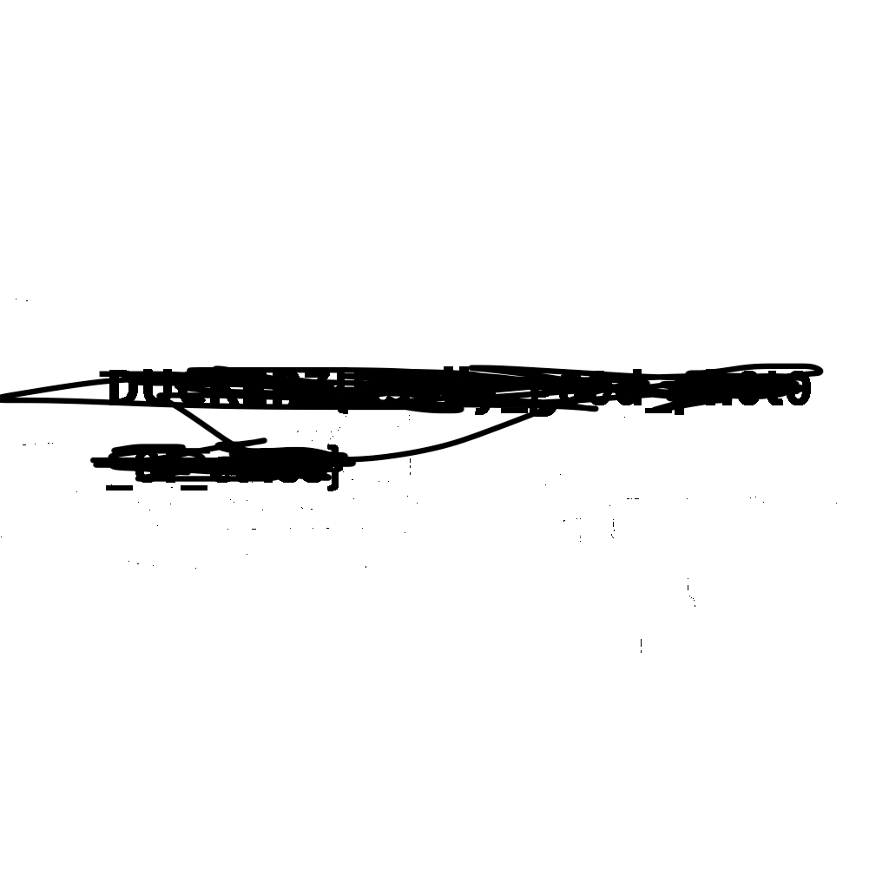

# Классное фото 🖼️

## Описание задачи 📌

Категория:

```text
Steganography
```

Название задачи:

```text
Классное фото
```

В задаче был дан PNG-файл:

```text
class.png
```

На этом этапе был получен исходный PNG-файл и начата базовая проверка изображения.

## Исходный файл 🔎

Файл задачи:

```text
class.png
```

Изображение выглядит как фотография учебного класса:


## Проверка типа файла 🧠

Первым делом проверили тип файла утилитой `file`:

```bash
file class.png
```

Результат:

```text
class.png: PNG image data, 1024 x 1024, 8-bit/color RGBA, non-interlaced
```

Утилита `file` определяет тип файла по его содержимому, а не только по расширению. Это полезно, потому что в CTF файл может называться `.png`, но на самом деле быть архивом, текстом или файлом другого формата.

Что получили:

```text
Файл действительно является PNG-изображением.
Размер изображения: 1024x1024.
Цветовая модель: RGBA.
Глубина цвета: 8 бит на канал.
Изображение не interlaced.
```

RGBA означает, что у изображения есть четыре канала:

```text
R - red
G - green
B - blue
A - alpha / прозрачность
```

## Проверка метаданных 🧾

Дальше посмотрели метаданные через `exiftool`:

```bash
exiftool class.png
```

`exiftool` показывает технические и пользовательские метаданные файла: размер, формат, время изменения, параметры изображения, EXIF-поля, комментарии и другие служебные данные.

Результат:

```text
ExifTool Version Number         : 13.55
File Name                       : class.png
Directory                       : .
File Size                       : 1113 kB
File Modification Date/Time     : 2026:05:29 00:21:29+03:00
File Access Date/Time           : 2026:05:29 00:22:29+03:00
File Inode Change Date/Time     : 2026:05:29 00:22:27+03:00
File Permissions                : -rw-r--r--
File Type                       : PNG
File Type Extension             : png
MIME Type                       : image/png
Image Width                     : 1024
Image Height                    : 1024
Bit Depth                       : 8
Color Type                      : RGB with Alpha
Compression                     : Deflate/Inflate
Filter                          : Adaptive
Interlace                       : Noninterlaced
Image Size                      : 1024x1024
Megapixels                      : 1.0
```

Что получили:

```text
Файл весит 1113 kB.
Формат: PNG.
MIME Type: image/png.
Размер: 1024x1024.
Цвет: RGB with Alpha.
Сжатие: Deflate/Inflate.
Interlace: Noninterlaced.
```

На этом этапе в метаданных не было найдено явного текстового комментария или готового флага.

## Поиск строк 🔤

После этого проверили файл через `strings`:

```bash
strings class.png
```

`strings` ищет в бинарном файле читаемые текстовые последовательности. Это помогает быстро найти спрятанные строки, комментарии, имена файлов, фрагменты архивов или флаг, если он был записан в файл обычным текстом.

Фрагмент вывода:

```text
IHDR
IDATx
~#22O
{zzzZ
p8BY
$Ipqw
uA)EL
!8f<
~*(;
$IjYN
/6}k
5?!:W?
,0?<
o~;>
G0=:D
7tOS
O<^u
ALAI
667FX
clno!
7qr2
*(D!
(@# b
1H)6
B GD
^5QQ
2~!<O
t=ECC
y0HA
0_d@
```

Вывод `strings` получился длинным, но на текущем этапе в нем не было сразу замечено явной строки с флагом.

## Проверка вложенных данных 📦

Дальше проверили файл через `binwalk`:

```bash
binwalk class.png
```

`binwalk` ищет внутри файла известные сигнатуры других файлов и данных: архивы, изображения, прошивки, сжатые блоки и другие вложения. В стеганографии это помогает понять, не приклеен ли к картинке дополнительный файл.

Результат:

```text
/duckerz/steganography/Coolphoto/class.png
--------------------------------------------------------------------------------------------------------
DECIMAL                            HEXADECIMAL                        DESCRIPTION
--------------------------------------------------------------------------------------------------------
0                                  0x0                                PNG image, total size: 1112577
                                                                      bytes
--------------------------------------------------------------------------------------------------------

Analyzed 1 file for 85 file signatures (187 magic patterns) in 2.0 milliseconds
```

Что получили:

```text
binwalk нашел только сам PNG-файл с offset 0x0.
Дополнительных вложенных файлов или известных сигнатур внутри class.png не обнаружено.
```

## Проверка структуры PNG 🧩

После этого проверили структуру PNG-файла через `pngcheck`:

```bash
pngcheck -v class.png
```

`pngcheck` проверяет PNG-файл на корректность и показывает его внутренние чанки. Для PNG это полезно, потому что данные изображения хранятся в отдельных блоках: `IHDR`, `IDAT`, `IEND` и других.

Чанк - это отдельный блок данных внутри PNG-файла. PNG устроен не как один сплошной поток байтов, а как последовательность таких блоков. Каждый чанк имеет тип и свое назначение.

Например:

```text
IHDR - основной заголовок изображения: ширина, высота, глубина цвета, тип цвета.
IDAT - сжатые данные пикселей изображения.
IEND - конец PNG-файла.
```

Если в PNG есть лишние или нестандартные чанки, в них иногда могут храниться комментарии, метаданные или скрытые данные. Поэтому просмотр чанков полезен при анализе стеганографии.

Результат:

```text
File: class.png (1112577 bytes)
  chunk IHDR at offset 0x0000c, length 13
    1024 x 1024 image, 32-bit RGB+alpha, non-interlaced
  chunk IDAT at offset 0x00025, length 65536
    zlib: deflated, 32K window, default compression
  chunk IDAT at offset 0x10031, length 65536
  chunk IDAT at offset 0x2003d, length 65536
  chunk IDAT at offset 0x30049, length 65536
  chunk IDAT at offset 0x40055, length 65536
  chunk IDAT at offset 0x50061, length 65536
  chunk IDAT at offset 0x6006d, length 65536
  chunk IDAT at offset 0x70079, length 65536
  chunk IDAT at offset 0x80085, length 65536
  chunk IDAT at offset 0x90091, length 65536
  chunk IDAT at offset 0xa009d, length 65536
  chunk IDAT at offset 0xb00a9, length 65536
  chunk IDAT at offset 0xc00b5, length 65536
  chunk IDAT at offset 0xd00c1, length 65536
  chunk IDAT at offset 0xe00cd, length 65536
  chunk IDAT at offset 0xf00d9, length 65536
  chunk IDAT at offset 0x1000e5, length 63752
  chunk IEND at offset 0x10f9f9, length 0
No errors detected in class.png (19 chunks, 73.5% compression).
```

Что получили:

```text
PNG состоит из стандартных чанков IHDR, IDAT и IEND.
Ошибок структуры pngcheck не нашел.
Файл содержит 19 чанков.
Сжатие: 73.5%.
```

На этом этапе структура PNG выглядит корректной, а дополнительных нестандартных чанков по выводу `pngcheck` не видно.

## Проверка статистики каналов 📊

После базовых проверок посмотрели подробную статистику изображения через ImageMagick:

```bash
identify -verbose class.png
```

`identify` - это утилита из набора ImageMagick. Она показывает подробную информацию об изображении: формат, размер, цветовые каналы, статистику по каналам, значения min/max, среднее значение, энтропию и другие параметры.

В выводе был важен блок по alpha-каналу:

```text
Alpha:
  min: 255
  max: 255
  entropy: 0
```

Что это значит:

```text
min: 255     минимальное значение alpha равно 255
max: 255     максимальное значение alpha равно 255
entropy: 0   все значения одинаковые
```

Alpha-канал отвечает за прозрачность. Если `min` и `max` равны `255`, значит все пиксели полностью непрозрачные. А `entropy: 0` подтверждает, что в alpha-канале нет разнообразия данных.

Вывод:

```text
alpha-канал полностью одинаковый, прозрачность в изображении не используется
```

После этого стало понятно, что дальше смотреть нужно не alpha-канал, а цветовые каналы:

```text
R - red
G - green
B - blue
```

## Извлечение младшего бита синего канала 🔵

Дальше были сделаны изображения из отдельных битовых плоскостей каналов `R`, `G` и `B`.

Самой важной оказалась проверка младшего бита синего канала:

```bash
magick class.png -alpha off -channel B -separate +channel -fx 'floor(mod(round(u*255),2))' -auto-level b_lsb.png
```

`magick` - это основная команда ImageMagick для обработки изображений. Здесь она используется для создания нового изображения, в котором виден только младший бит blue-канала.

Разбор команды:

```text
class.png
```

Исходное изображение.

```text
-alpha off
```

Отключает alpha-канал, чтобы прозрачность не мешала анализу.

```text
-channel B
```

Выбирает только синий канал изображения.

```text
-separate
```

Отделяет выбранный канал в отдельное grayscale-изображение.

```text
+channel
```

Сбрасывает выбор канала после отделения.

```text
-fx 'floor(mod(round(u*255),2))'
```

Главная часть команды. Она применяется к каждому пикселю.

Здесь:

```text
u
```

значение пикселя в диапазоне от `0` до `1`.

```text
u*255
```

перевод значения пикселя в привычный диапазон `0-255`.

```text
round(u*255)
```

округляет значение до целого числа.

```text
mod(..., 2)
```

берет остаток от деления на `2`, то есть достает младший бит.

```text
floor(...)
```

фиксирует результат как `0` или `1`.

Итог: для каждого пикселя остается только младший бит синего канала.

```text
-auto-level
```

Растягивает значения `0` и `1` до нормального черно-белого изображения, чтобы результат можно было увидеть глазами.

```text
b_lsb.png
```

Имя итогового файла.

## Результат 🏁

В получившемся изображении `b_lsb.png` стал виден текст с флагом:



Сам флаг на скрине замазан, чтобы не палить ответ в публичном writeup.

Формат найденного флага:

```text
DUCKERZ{...}
```

Метод решения:

```text
визуальная LSB-стеганография в младшем бите синего канала
```

## Итог 🏁

Краткая цепочка решения:

```text
получен PNG-файл -> file -> exiftool -> strings -> binwalk -> pngcheck -> identify -> B LSB -> flag
```

Флаг был найден после визуализации младшего бита синего канала.

Автор: masquadd :) ✍️
