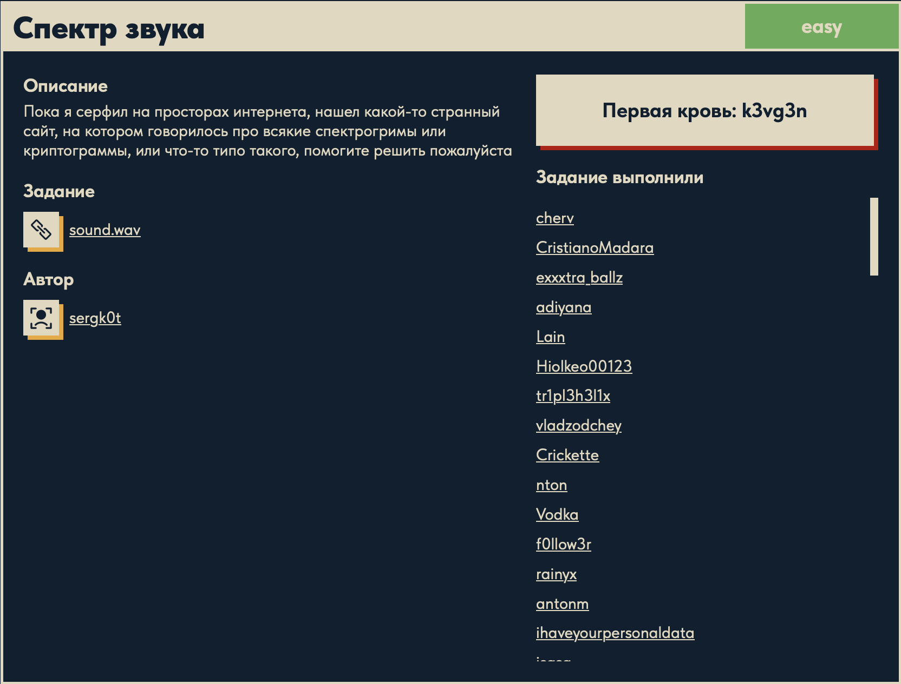
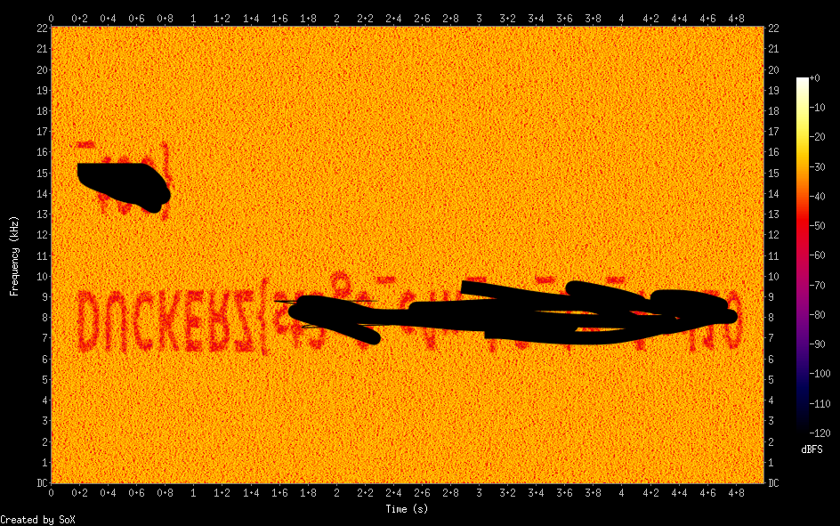
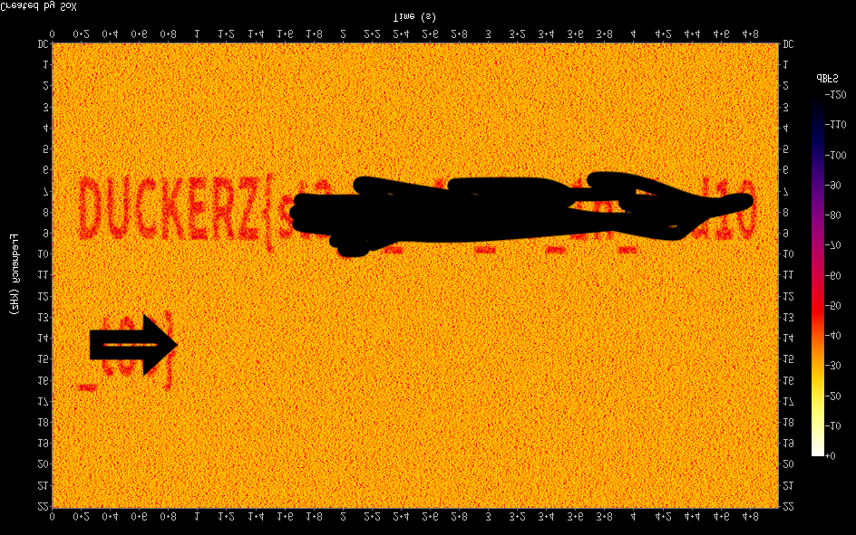

# Спектр звука 🎵

## Описание задачи

Задача: **Спектр звука**

Сложность: 

Описание с платформы:

> Пока я серфил на просторах интернета, нашел какой-то странный сайт, на котором говорилось
> про всякие спектрогримы или криптограммы, или что-то типо такого, помогите решить пожалуйста

Задание:

```text
sound.wav
```

Автор задачи:

```text
sergk0t
```

Первая кровь:

```text
k3vg3n
```

Скрин с названием и описанием:



---

## Первый взгляд 👀

Дан аудиофайл `sound.wav`. Определяем параметры:

```bash
file sound.wav
# -> RIFF (little-endian) data, WAVE audio, Microsoft PCM, 16 bit, mono 44100 Hz
```

- **WAV (RIFF/WAVE)** — несжатый аудиоформат (PCM), звук хранится «как есть».
- **16 bit, mono, 44100 Hz** — стандартное CD-качество, один канал; ~440 КБ ≈ 5 секунд.

Название задачи (**«Спектр звука»**) и описание (**«спектрогримы»** = спектрограммы) прямо
указывают на технику: флаг спрятан в **спектрограмме** аудио.

### Что такое спектрограмма

Спектрограмма — это визуализация звука в осях **время (по горизонтали) → частота
(по вертикали)**, где яркость точки показывает мощность звука на данной частоте в данный момент.
Обычный звук на спектрограмме выглядит как размытые полосы, но если специально «нарисовать»
в звуке нужные частоты, на спектрограмме проступит **картинка или текст**.

Именно так прячут флаги в аудио-стего: на слух файл звучит как шум/писк, а стоит открыть его
спектрограмму — и в ней **буквами написан флаг**.

### Как это работает технически

- WAV хранит звук как **волну** — последовательность отсчётов амплитуды во времени
  (waveform). Из самой волны частоты «не видны».
- Чтобы увидеть, из каких частот состоит звук, применяют **преобразование Фурье**. Спектрограмма
  — это **оконное преобразование Фурье (STFT)**: сигнал режут на короткие перекрывающиеся окна,
  для каждого окна считают **FFT** (быстрое преобразование Фурье) и получают спектр частот в этот
  момент времени. Эти спектры ставят столбиками рядом → выходит 2D-картинка:
  **X = время, Y = частота, яркость = мощность** на этой частоте.
- **Стего-приём:** автор синтезирует звук так, чтобы мощности частот во времени **обводили
  контуры букв**. На спектрограмме проступает текст, а ухо слышит лишь шум/писк — оно не
  «видит» узор, оно воспринимает лишь смесь частот.

Отсюда и решение: не слушать, а **построить спектрограмму и прочитать** нарисованное.

---

## Инструменты 🧰

- **Audacity** (GUI) — открыть трек, переключить вид дорожки на **Spectrogram**, прочитать флаг.
- **Sonic Visualiser** (GUI) — добавить слой Spectrogram, гибкие настройки.
- **sox** (CLI, `brew install sox`) — сгенерировать картинку спектрограммы одной командой:
  `sox sound.wav -n spectrogram -o spectrogram.png`.
- **Онлайн** — например spectrogram-вьюеры в браузере (загрузить wav, посмотреть спектр).

---

## План решения

```text
1. Послушать файл (обычно шум/писк — подтверждение, что смысл в спектре)
2. Построить спектрограмму (sox / Audacity / Sonic Visualiser)
3. Прочитать флаг, нарисованный в спектре
4. Оформить как DUCKERZ{...}
```

---

## Решение ⚙️

### Шаг 1 — построить спектрограмму (`sox`)

```bash
sox sound.wav -n spectrogram -o spectrogram.png
```

Разбор команды (`sox` — «швейцарский нож» для аудио, Sound eXchange):

- `sound.wav` — входной аудиофайл;
- `-n` — **null-выход**: не создавать выходной звук, нам нужен только побочный эффект-анализ;
- `spectrogram` — эффект, который считает STFT (оконное преобразование Фурье) по всему файлу
  и рисует его как изображение;
- `-o spectrogram.png` — куда сохранить картинку.

По сути `sox` режет звук на окна, делает FFT каждого, и раскладывает спектры в картинку
«время × частота». В полученной спектрограмме проступает текст флага:



### Шаг 2 — выпрямить текст (`magick`)

Текст оказался **отражён по вертикали** (буквы «вверх ногами», строки в обратном порядке) —
в стего частоты нарисованы перевёрнутыми по оси частот. Зеркалим картинку по вертикали:

```bash
magick spectrogram.png -flip spectrogram_fixed.png
```

Разбор команды (`magick` — ImageMagick, инструмент обработки изображений):

- `spectrogram.png` — входная картинка;
- `-flip` — **отражение по вертикали** (зеркало верх↔низ, порядок строк переворачивается);
  для сравнения: `-flop` — отражение по горизонтали (лево↔право);
- `spectrogram_fixed.png` — результат.

После флипа текст читается нормально:



Читаем флаг с выпрямленной спектрограммы.

---

## Итог 🏁

Цепочка решения:

```text
sound.wav (WAV PCM)
-> подсказка "спектрогримы" -> строим спектрограмму (sox: STFT -> картинка)
-> в спектре виден текст, но отражён по вертикали
-> magick -flip -> текст выпрямлен -> читаем флаг
```

Флаг:

```text
DUCKERZ{...}
```

---

## Текущий статус

Задача решена.

Зафиксировано:

- название, сложность `Easy`, описание, автор `sergk0t`, первая кровь `k3vg3n`;
- файл `sound.wav` — WAV PCM 16 bit mono 44100 Hz;
- разобрана теория: спектрограмма как STFT/FFT, приём аудио-стего «текст в спектре»;
- спектрограмма построена командой `sox ... -n spectrogram`;
- текст был отражён по вертикали — выпрямлен `magick ... -flip`;
- прочитан флаг `DUCKERZ{...}`.

---

Автор: **masquadd :)** ✍️
