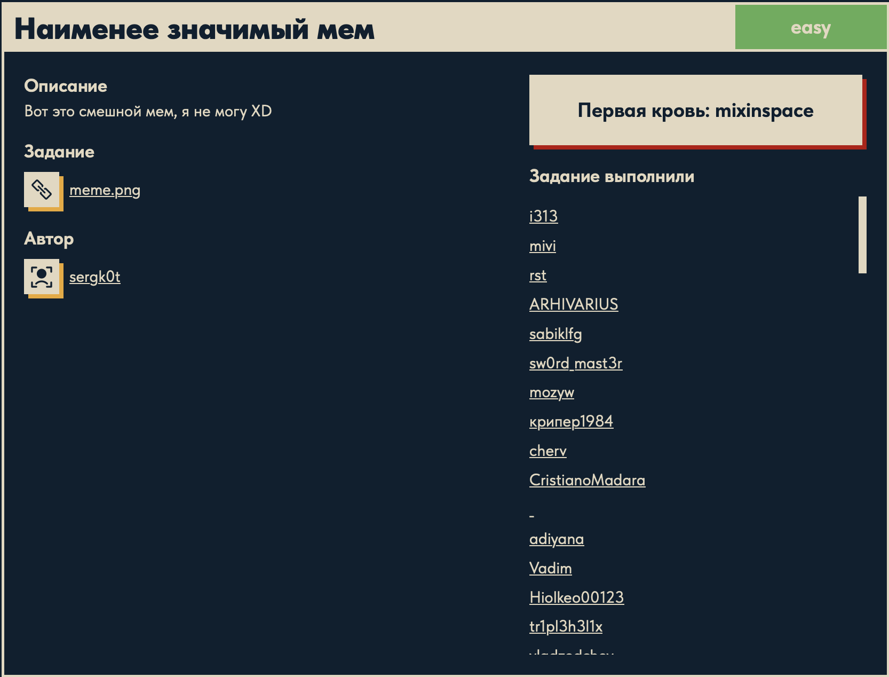

# Наименее значимый мем 🐱

## Описание задачи

Задача: **Наименее значимый мем**

Сложность: 

Описание с платформы:

> Вот это смешной мем, я не могу XD

Задание:

```text
meme.png
```

Автор задачи:

```text
sergk0t
```

Первая кровь:

```text
mixinspace
```

Скрин с названием и описанием:



---

## Первый взгляд 👀

Дан `meme.png` — картинка-мем 300×300 (RGBA), котик с подписью «hehe». На вид обычный мем,
но название задачи — **прямая подсказка**:

> **«Наименее значимый»** = **LSB (Least Significant Bit)** — младший бит.

Это классическая **LSB-стеганография**: секрет прячут в **младших битах пикселей**. Младший бит
каждого цвета почти не влияет на картинку (глазом разницу не видно), поэтому в него можно
«подмешать» данные — по 1 биту на канал. Собрав эти биты по всем пикселям, получаем скрытое
сообщение.

(Такую же технику разбирали в задаче [«Классное фото»](../Coolphoto/) — там флаг лежал в LSB
синего канала.)

Формат PNG важен: он **без потерь** (lossless), поэтому младшие биты сохраняются точно — в
отличие от JPEG, где сжатие их бы затёрло.

---

## Инструменты 🧰

- **zsteg** (`gem install zsteg`) — главный инструмент для LSB-стего в PNG: автоматически
  перебирает каналы (R/G/B/A), порядок бит (LSB/MSB) и направления — и находит скрытое.
- **StegSolve / StegOnline** — GUI: смотреть отдельные битовые плоскости.
- **Python + PIL** — вручную вытащить младшие биты пикселей и собрать байты.

### Что такое zsteg (и не перепутать с zstd!)

**zsteg** — Ruby-утилита для **анализа стеганографии** в изображениях **PNG/BMP**. Она
автоматически проверяет самые популярные способы спрятать данные: младшие/старшие биты
(**LSB/MSB**), по каждому каналу (`r`, `g`, `b`, `a`) и их комбинациям (`rgb`, `bgr`),
разные порядки обхода пикселей — и сразу показывает найденные строки/файлы. Для LSB-стего в PNG
это инструмент №1. Ставится **только через RubyGems** (`gem install zsteg`).

> **Грабли (реальные, из решения):** на `brew install zsteg` Homebrew ответил «No available
> formula… Did you mean **zstd**?» и предложил `zstd`. **`zstd` — это НЕ то!** Это *Zstandard* —
> быстрый **архиватор/компрессор** (как gzip), к стеганографии отношения не имеет. Команда
> `zstd meme.png` просто сожмёт картинку в `meme.png.zst` (бесполезный архив). Названия похожи
> (`zsteg` vs `zstd`), но это разные программы: **steg**anography против **std** (Zstandard).
> Правильно — `gem install zsteg`.

---

## План решения

```text
1. Опознать LSB-стего по названию ("наименее значимый" = LSB)               [сделано]
2. Прогнать zsteg meme.png (перебор каналов/бит) -> найти скрытое
3. (или) вручную вытащить LSB пикселей на Python
4. Прочитать флаг DUCKERZ{...}
```

---

## Решение: zsteg ⚙️

Установка (RubyGems; при `--user-install` бинарь ложится в `~/.gem/ruby/<версия>/bin` — надо
добавить в `PATH`):

```bash
gem install zsteg
export PATH="$HOME/.gem/ruby/2.6.0/bin:$PATH"   # путь может отличаться версией Ruby
zsteg meme.png
```

Вывод:

```text
imagedata      .. file: interLaced eXtensible Trace (LXT) file (Version 13082)
b1,rgb,lsb,xy  .. text: "DUCKERZ{...}"                     <-- НАСТОЯЩИЙ флаг
b2,b,msb,xy    .. text: "TD@EQUDQ"
b2,abgr,msb,xy .. text: "SSGCCGSW"
b3,b,msb,xy    .. text: "\"HJ6$K0%"
b3,abgr,msb,xy .. file: PGP Secret Sub-key -
b4,r,msb,xy    .. text: "Bp B5\"E@Q"
b4,b,msb,xy    .. file: OpenPGP Secret Key
...
```

### Как читать вывод zsteg

Каждая строка — это **одна конфигурация извлечения** бит, в формате
`<биты>,<каналы>,<порядок бит>,<обход>  .. <тип>: <данные>`:

- **`b1` / `b2` / `b3` / `b4`** — какой бит брать: `b1` = самый младший (LSB), `b2` — следующий и т.д.;
- **`r`/`g`/`b`/`a`** и комбинации (`rgb`, `bgr`, `abgr`) — из каких каналов;
- **`lsb`/`msb`** — порядок склейки бит в байты;
- **`xy`** — порядок обхода пикселей (построчно);
- **`text: "…"`** — извлечённые байты оказались печатным текстом; **`file: …`** — извлечённые
  байты совпали с сигнатурой какого-то формата файла.

### Флаг vs «ложные срабатывания»

Настоящий секрет — строка **`b1,rgb,lsb,xy`**: младший бит (`b1`/`lsb`) каналов `rgb`, обход
`xy` — ровно «наименее значимый бит» из названия задачи. Там читаемый осмысленный текст —
`DUCKERZ{...}`.

Все остальные строки — **шум / ложные срабатывания**. zsteg перебирает десятки конфигураций, и
для «неправильных» бит-плоскостей (`b2`,`b3`,`b4`) или каналов извлекаются по сути **случайные
байты**. Иногда они:

- складываются в короткий «печатный» огрызок (`"TD@EQUDQ"`, `"SSGCCGSW"`) — zsteg помечает как
  `text`, но это бессмысленный набор символов;
- **случайно совпадают с магической сигнатурой** формата (`OpenPGP Secret Key`, `PGP Secret
  Sub-key`, `interLaced eXtensible Trace (LXT) file`) — и zsteg пишет `file: …`. **Это не
  настоящие файлы**, а просто случайные байты, начавшиеся с нужных «магических» байт.

Навык здесь — **отличить реальную нагрузку от совпадений**: настоящие данные читаемы и
осмысленны (флаг, слова, валидный заголовок с содержимым), а «шумовые» строки — короткие
кракозябры или «файлы» без тела. У нас однозначный кандидат — единственная строка с `DUCKERZ{`.

---

## Итог 🏁

Цепочка решения:

```text
meme.png -> название "наименее значимый" = LSB-стего
-> zsteg meme.png (перебор каналов/бит)
-> b1,rgb,lsb,xy = младший бит RGB -> читаемый флаг
   (остальные строки b2/b3/b4 — шум и ложные "file"-совпадения)
```

Флаг:

```text
DUCKERZ{...}
```

---

## Текущий статус

Задача решена.

Зафиксировано:

- название, сложность `Easy`, описание, автор `sergk0t`, первая кровь `mixinspace`;
- `meme.png` — PNG 300×300 RGBA (без потерь → LSB сохраняются);
- название = подсказка на **LSB** (least significant bit) стеганографию;
- разобрана утилита `zsteg` (анализ LSB/MSB по каналам PNG/BMP) и путаница с `zstd` (компрессор);
- `zsteg meme.png` → флаг в конфигурации **`b1,rgb,lsb,xy`** (младший бит RGB);
- прочие строки вывода — шум/ложные срабатывания (случайные байты, совпавшие с сигнатурами);
- получен флаг `DUCKERZ{...}`.

---

Автор: **masquadd :)** ✍️
