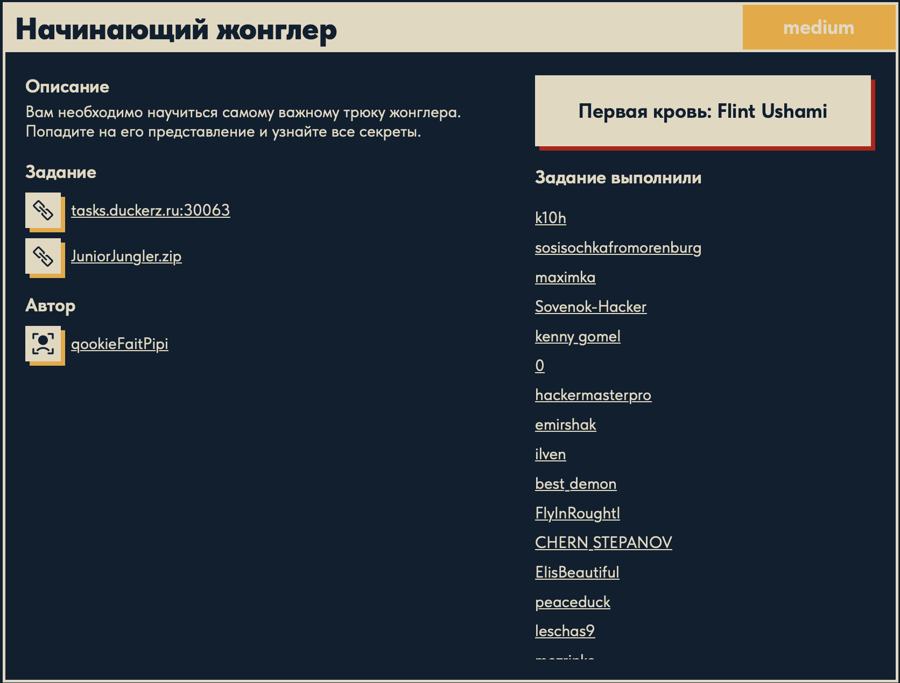

# Начинающий жонглер 🌐

## Описание задачи

Задача: **Начинающий жонглер**

Сложность: 

Описание с платформы:

> Вам необходимо научиться самому важному трюку жонглера. Попадите на его представление и узнайте все секреты.

Адрес задания:

```text
tasks.duckerz.ru:30063
```

К задаче также дан архив:

```text
JuniorJungler.zip
```

Автор задачи:

```text
qookieFaitPipi
```

Скрин с названием и описанием:



---

## Что есть на старте 🔎

В отличие от обычной web-задачи, здесь дан не только адрес сервиса, но и архив с исходным кодом.

Это сразу важная деталь: задачу имеет смысл анализировать не только через интерфейс сайта и Burp Suite, но и через разбор приложения локально.

После распаковки архива был виден проект:

```text
JuniorJungler/
├── docker-compose.yml
├── Dockerfile
└── src/
    ├── index.php
    └── static/
```

То есть на старте уже доступны:

- PHP-код приложения;
- docker-конфигурация;
- статические файлы сайта.

---

## Стек приложения

По `Dockerfile` из архива видно:

```dockerfile
FROM php:7.4-cli
```

Значит приложение работает на:

```text
PHP 7.4
```

В `docker-compose.yml` из архива указано:

```yaml
ports:
  - "30063:23007"
command: php -S 0.0.0.0:23007
```

То есть сервис запускается встроенным PHP-сервером и внутри контейнера слушает порт:

```text
23007
```

А наружу пробрасывается как:

```text
30063
```

---

## Первый взгляд на index.php

Главная логика задачи в архиве находилась в:

```text
src/index.php
```

В начале файла есть серверная проверка POST-запроса:

```php
if ($_SERVER['REQUEST_METHOD'] == 'POST') {
    if(isset($_POST['code'])) {
        $code = $_POST['code'];

        if (md5($code) == "0e974114726967211511915142978119") {
            $err =  "DUCKERZ{fake_flag}";
        } else {
            $err = "Вы ввели неверный код!";
        }
    }
}
```

Из этого уже можно подтвердить несколько фактов:

- на сервере проверяется параметр:

```text
code
```

- значение пропускается через:

```php
md5($code)
```

- затем результат сравнивается со строкой:

```text
0e974114726967211511915142978119
```

- при успешной проверке в текущем коде выводится:

```text
DUCKERZ{fake_flag}
```

То есть в архиве лежит не настоящий флаг, а заглушка.

---

## Что видно в интерфейсе страницы

В `index.php` из архива описаны две основные формы:

- покупка обычных билетов;
- получение бесплатного билета по коду.

Особенно интересна вторая форма:

```html
<form id="freeTicketForm" method="POST" action="">
    <label for="tickets">Код-ключ-сертификат:</label>
    <input type="text" id="code" name="code" required>
```

То есть логика задачи явно завязана на вводе специального кода.

Также на странице есть шоу:

```text
Jangler show
```

что хорошо сочетается с описанием задачи про жонглера и попадание на представление.

---

## Клиентский JavaScript

Внизу страницы в исходниках есть JavaScript-обработчик формы:

```javascript
document.getElementById('freeTicketForm').addEventListener('submit', function(e) {
    e.preventDefault();
    
    const code = document.getElementById('code').value;
    const errorDiv = document.getElementById('errorMessage');
    
    fetch('check_code.php', {
        method: 'POST',
        headers: {
            'Content-Type': 'application/x-www-form-urlencoded',
        },
        body: 'code=' + encodeURIComponent(code)
    })
```

Это важное наблюдение.

Хотя в начале файла серверная проверка написана прямо в `index.php`, клиентский код отправляет запрос не на текущую страницу, а на:

```text
check_code.php
```

То есть уже на первом чтении исходников видно расхождение между:

- PHP-логикой, находящейся в `index.php`;
- JavaScript-запросом на `check_code.php`.

Пока это только подтвержденный факт, а не вывод об уязвимости.

---

## Найденная уязвимость

Ключевая проблема находится в этой строке:

```php
if (md5($code) == "0e974114726967211511915142978119")
```

Здесь используется:

```php
==
```

а не строгое сравнение:

```php
===
```

Для PHP 7.4 это критично, потому что язык автоматически приводит типы при нестрогом сравнении.

В этой задаче уязвимость относится к тому, что обычно называют:

- `magic hash`;
- `PHP magic hash`;
- `type juggling hash`.

---

## Что такое magic hash

В контексте PHP опасны строки вида:

```text
0e123456789...
```

Если после `0e` идут только цифры, PHP при нестрогом сравнении может интерпретировать такую строку как число в научной записи:

```text
0 × 10^123456789
```

То есть как просто:

```text
0
```

Из-за этого две разные строки могут считаться равными:

```php
"0e12345" == "0e99999"
```

потому что обе стороны приводятся к числу `0`.

Именно в этом состоит суть `magic hash`: хеш выглядит как строка, но при `==` ведет себя как число.

---

## Почему это ломает проверку

Сервер не делает точную проверку хеша как строки, а делает нестрогое сравнение:

```php
md5($code) == "0e974114726967211511915142978119"
```

Поэтому злоумышленнику не нужно находить строку, чей MD5 буквально равен:

```text
0e974114726967211511915142978119
```

Достаточно найти любой ввод, для которого:

```text
md5(ввод) = 0e<только цифры>
```

Тогда PHP сравнит:

```php
"0e........" == "0e974114726967211511915142978119"
```

как:

```text
0 == 0
```

и условие станет истинным.

---

## Подходящий payload

Для MD5 давно известны строки, которые дают `magic hash`.

Один из самых известных примеров:

```text
QNKCDZO
```

Его MD5:

```text
0e830400451993494058024219903391
```

Эта строка начинается с:

```text
0e
```

и дальше содержит только цифры, а значит подходит под условие `magic hash`.

То есть логика решения выглядит так:

```text
ввести QNKCDZO
-> сервер посчитает md5("QNKCDZO")
-> получится 0e830400451993494058024219903391
-> PHP сравнит это с 0e974114726967211511915142978119 через ==
-> обе строки будут приведены к 0
-> условие станет true
```

Подошли бы и другие известные `magic hash`-строки, например:

```text
240610708
```

Но для writeup достаточно одного рабочего примера.

---

## Как решается задача

В интерфейсе есть форма:

```text
Код-ключ-сертификат
```

Туда нужно отправить строку, которая дает `magic hash`.

Например:

```text
QNKCDZO
```

После этого серверная проверка проходит успешно, потому что сравнение выполнено через `==`, и приложение считает код валидным.

В локальном архиве при успехе показана заглушка:

```text
DUCKERZ{fake_flag}
```

На боевом сервисе вместо нее выдается настоящий флаг.

---

## Почему это именно type juggling

Название `type juggling` означает, что PHP “жонглирует” типами во время сравнения.

Здесь происходит именно это:

- `md5($code)` возвращает строку;
- строка `"0e..."` выглядит как число;
- строка справа тоже выглядит как число;
- PHP при `==` пытается привести обе стороны к numeric type;
- обе стороны становятся `0`.

То есть проблема не в самой функции `md5`, а в сочетании:

```text
хеш + формат 0e<digits> + нестрогое сравнение ==
```

---

## Как этого не допустить

Правильное решение на стороне разработчика:

```php
if (md5($code) === "0e974114726967211511915142978119")
```

Строгое сравнение `===` сравнивает и тип, и точное значение строки, поэтому такой bypass уже не сработает.

Еще лучше:

- не строить security-проверки на MD5;
- не использовать loose comparison для проверки хешей;
- использовать безопасные функции сравнения вроде:

```php
hash_equals(...)
```

---

## Итог

Цепочка решения:

```text
анализ исходников JuniorJungler
-> нахождение проверки md5($code) == "0e..."
-> распознавание magic hash / type juggling в PHP
-> подбор строки, дающей md5 вида 0e<digits>
-> пример payload: QNKCDZO
-> отправка кода через форму бесплатного билета
-> успешное прохождение проверки
-> получение флага
```

Главная уязвимость задачи: `magic hash` в PHP из-за нестрогого сравнения `==`.

---

## Что уже стоит проверить дальше

По текущему коду самые важные направления анализа такие:

- существует ли на сервере `check_code.php`;
- совпадает ли реальная серверная логика с локальным `index.php`;
- как именно обрабатывается параметр `code` на боевом сервисе;
- что означает сравнение `md5($code)` со строкой, начинающейся на `0e`;
- можно ли попасть на “Jangler show” через проверку бесплатного билета.

На этом этапе логика решения уже понятна.

---

## Текущий статус

Задача решена.

Зафиксировано:

- название задачи;
- сложность `Medium`;
- описание с платформы;
- адрес сервиса;
- наличие архива `JuniorJungler.zip`;
- автор задачи;
- структура проекта;
- стек на `PHP 7.4`;
- серверная проверка `md5($code)` в `index.php`;
- использование заглушки `DUCKERZ{fake_flag}` в исходниках;
- наличие JavaScript-запроса на `check_code.php`;
- распознана уязвимость `magic hash` / `type juggling`;
- подобран тип подходящего payload для обхода проверки;
- получен флаг через успешную проверку кода.

---

Автор: **masquadd :)** ✍️
