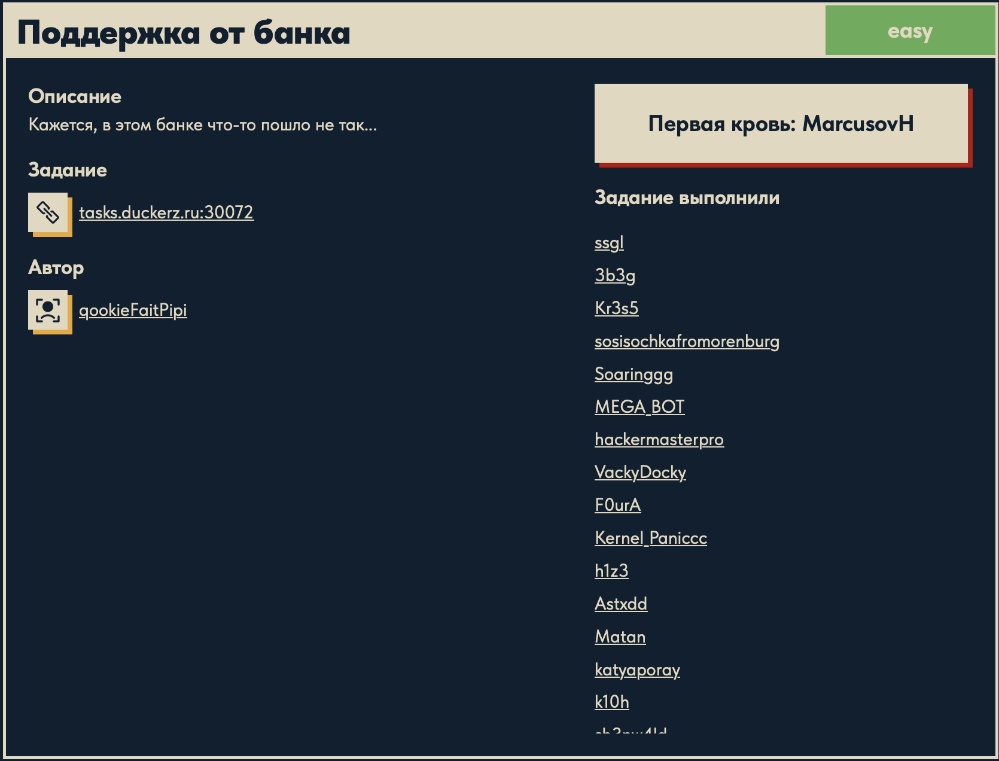
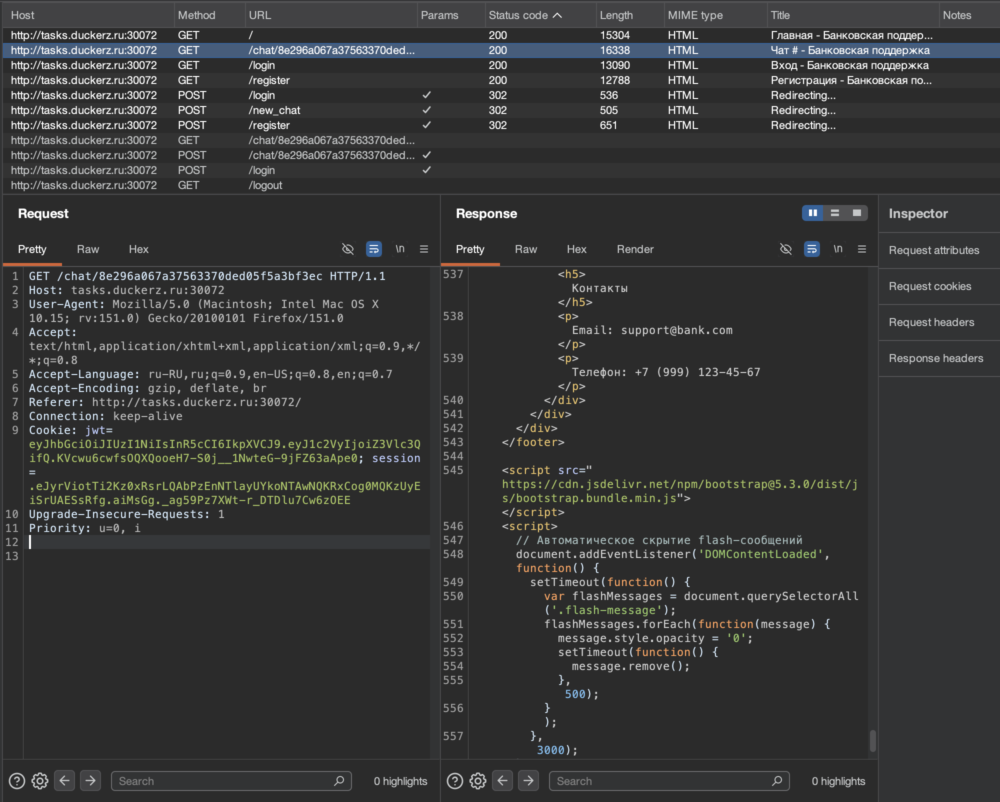
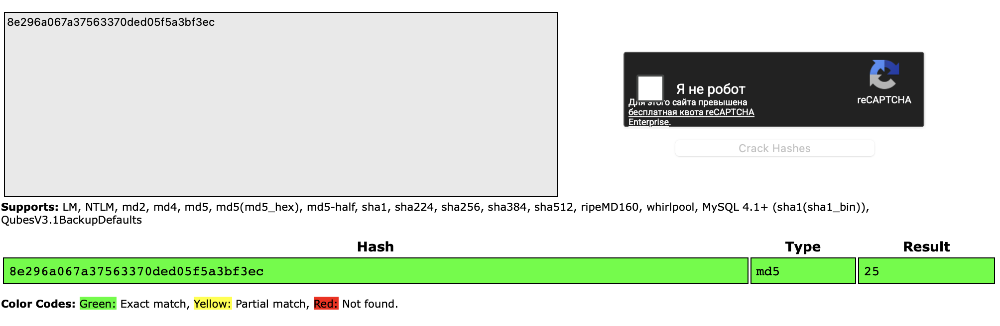
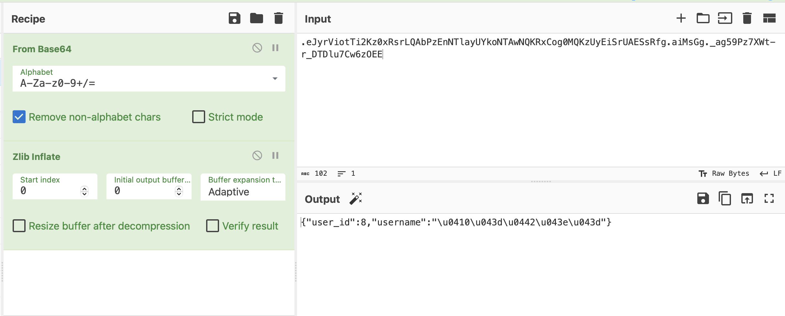
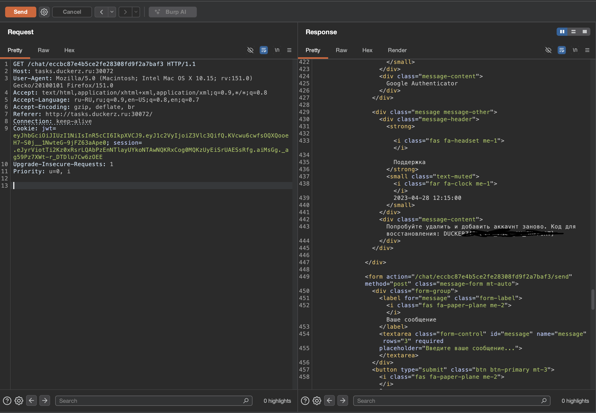

# Поддержка от банка 🌐

## Описание задачи

Задача: **Поддержка от банка**

Сложность: 

Описание с платформы:

> Кажется, в этом банке что-то пошло не так...

Адрес задания:

```text
tasks.duckerz.ru:30072
```

Скрин с названием и описанием задачи:



---

## Первый взгляд 👀

На старте у нас пока есть только описание задачи и адрес сервиса.

По названию и описанию можно предположить, что задача связана с логикой банковского веб-приложения или его системой поддержки:

- авторизация пользователей;
- обращения в поддержку;
- банковские операции;
- роли пользователей;
- ошибки доступа к чужим данным;
- некорректная проверка параметров на сервере.

Пока это только направления для проверки. Реальное решение фиксируем только после анализа сайта и HTTP-запросов.

---

## Что проверять дальше

Первым делом нужно открыть сервис и посмотреть:

- какие страницы доступны без входа;
- есть ли регистрация или готовые учетные данные;
- какие запросы уходят при действиях на сайте;
- какие cookies или токены выдает сервер;
- есть ли числовые идентификаторы заявок, пользователей или операций;
- можно ли через Burp увидеть скрытые параметры.

Для web-задач на банковскую тематику особенно важно смотреть не только интерфейс, но и сами запросы. Часто уязвимость находится в параметрах, которые пользователь не видит на странице напрямую.

---

## Анализ запросов в Burp 🧪

После первых действий на сайте смотрим историю запросов в Burp:



В истории видно, что логика сайта довольно насыщенная. Есть несколько основных маршрутов:

```text
GET  /
GET  /login
GET  /register
POST /register
POST /login
POST /new_chat
GET  /chat/<chat_id>
POST /chat/<chat_id>
GET  /logout
```

То есть приложение не ограничивается одной формой входа. Здесь есть регистрация, логин, создание чата и просмотр конкретного чата по идентификатору.

---

## Cookies: JWT и session

В запросе к чату видим сразу две cookie:

```text
Cookie: jwt=...; session=...
```

Первая cookie называется `jwt`. Это сразу важная зацепка, потому что JWT обычно хранит данные о пользователе в формате:

```text
header.payload.signature
```

То есть строка делится точками на три части. Внутри первых двух частей обычно лежит base64url-кодированный JSON.

Вторая cookie называется `session`. По названию это серверная или подписанная сессия приложения. Она тоже может выглядеть как длинная строка с точками, но ее роль другая: хранить состояние пользователя между запросами.

Разница по смыслу:

- `jwt` часто хранит данные авторизации прямо внутри токена;
- `session` обычно хранит идентификатор или подписанное состояние сессии;
- сервер может проверять обе cookie одновременно.

Поэтому для дальнейшего анализа важно не удалять одну из них наугад, а проверять поведение приложения отдельно:

- что будет, если оставить только `jwt`;
- что будет, если оставить только `session`;
- меняется ли доступ к чатам;
- где именно хранится роль или идентификатор пользователя.

---

## Идентификатор чата похож на MD5

В Burp видим запрос:

```text
GET /chat/8e296a067a37563370ded05f5a3bf3ec
```

Часть после `/chat/`:

```text
8e296a067a37563370ded05f5a3bf3ec
```

выглядит как хеш.

Почему это похоже именно на MD5:

- строка состоит только из символов `0-9` и `a-f`;
- длина строки — 32 символа;
- MD5 обычно записывается как 32 hex-символа;
- многие приложения используют MD5 для коротких идентификаторов объектов.

MD5 на выходе дает 128 бит. Один hex-символ кодирует 4 бита:

```text
128 бит / 4 бита = 32 hex-символа
```

Поэтому строка такого вида:

```text
8e296a067a37563370ded05f5a3bf3ec
```

очень похожа на MD5-хеш.

Важно: по одному виду строки нельзя на 100% доказать, что это именно MD5. Но для CTF это сильная гипотеза, которую стоит проверять дальше.

---

## Проверка через CrackStation

Для быстрой проверки хеша был использован сайт:

```text
https://crackstation.net
```

CrackStation — это онлайн-сервис для поиска исходного значения по хешу. Он не "расшифровывает" хеш в прямом смысле, потому что хеш-функции необратимы. Вместо этого сайт ищет переданный хеш в больших заранее подготовленных таблицах.

Проще:

```text
исходная строка -> hash-функция -> hash
```

Обратно математически восстановить строку нельзя, но можно заранее посчитать много популярных значений и сравнить результат.

Скрин проверки:



В поле был вставлен идентификатор чата:

```text
8e296a067a37563370ded05f5a3bf3ec
```

CrackStation показал:

```text
Type: md5
Result: 25
```

Это значит, что строка:

```text
25
```

после MD5-хеширования дает:

```text
8e296a067a37563370ded05f5a3bf3ec
```

То есть наш `chat_id` оказался не случайным набором символов, а MD5 от числа `25`.

---

## Как понять, что это именно тип хеша

На CrackStation есть колонка `Type`.

В нашем случае там написано:

```text
md5
```

Это не просто предположение по длине строки. Сервис нашел совпадение в своей базе и указал, какой алгоритм дал такой результат.

Колонка `Result` показывает исходное значение, которое было захешировано:

```text
25
```

Также на сайте есть цветовые обозначения:

- зеленый — точное совпадение;
- желтый — частичное совпадение;
- красный — значение не найдено.

На скрине строка зеленая, значит совпадение точное.

---

## Почему это важно

До CrackStation у нас была только гипотеза:

```text
/chat/<id> похож на MD5
```

После проверки стало понятнее:

```text
/chat/md5(25)
```

Значит чаты могут нумероваться обычными числами, а в URL подставляется их MD5-хеш.

Это важная логическая ошибка приложения: если идентификатор строится от предсказуемого числа, то можно пробовать вычислять соседние значения:

```text
md5(1)
md5(2)
md5(3)
...
md5(25)
...
```

и проверять, какие чаты доступны.

Пока это еще не финальный флаг, но уже сильная зацепка для дальнейшего решения.

---

## Декодирование session через CyberChef

Дальше была отдельно разобрана cookie `session` из запроса Burp.

Для этого использовался сайт:

```text
https://cyberchef.org/
```

CyberChef — это удобный онлайн-инструмент для преобразования данных. Его часто используют в CTF, потому что он позволяет собирать цепочки действий в виде рецепта:

```text
входные данные -> операция 1 -> операция 2 -> результат
```

Например, можно быстро сделать:

- Base64 decode;
- URL decode;
- hex decode;
- XOR;
- gzip/zlib распаковку;
- преобразование кодировок;
- поиск строк;
- работу с JSON.

В нашем случае рецепт был такой:

```text
From Base64 -> Zlib Inflate
```

Скрин:



На выходе получился JSON:

```json
{
  "user_id": 8,
  "username": "..."
}
```

Имя пользователя на скрине отображается через Unicode escape-последовательности:

```text
\u0410\u0434\u...
```

Это нормальная запись Unicode-символов внутри JSON. Такие последовательности можно преобразовать обратно в читаемый текст отдельной операцией декодирования Unicode escape.

---

## Почему это похоже на Flask session

Cookie `session` имеет характерный вид:

```text
.payload.timestamp.signature
```

Важная деталь — точка в самом начале:

```text
.eJyr...
```

У Flask такая точка часто означает, что содержимое сессии сжато. После этого идет base64url-представление сжатых данных.

Типичная логика Flask client-side session:

```text
JSON с данными -> сжатие zlib -> base64url -> подпись itsdangerous
```

Flask хранит session cookie на стороне клиента, но подписывает ее секретным ключом приложения. Для подписи Flask использует библиотеку **itsdangerous**.

Что важно:

- данные внутри такой session можно прочитать;
- но просто изменить их нельзя, потому что подпись перестанет совпадать;
- чтобы подделать session, нужен Flask `SECRET_KEY`.

То есть CyberChef помог именно прочитать данные, а не подделать их.

---

## Что такое itsdangerous

`itsdangerous` — это Python-библиотека для безопасной подписи данных.

Она используется во Flask, чтобы сервер мог понять:

```text
эта cookie была создана мной или ее изменили руками
```

Если пользователь поменяет `user_id` в session cookie, но не пересчитает подпись правильным секретом, сервер должен отклонить такую сессию.

Поэтому расшифрованная session дает нам информацию для анализа:

```text
user_id = 8
username = ...
```

Но сама по себе еще не дает возможность стать другим пользователем.

---

## Зачем это нужно для задачи

Теперь у нас есть связь между несколькими частями приложения:

```text
session -> user_id
chat_id -> md5(число)
```

В сессии найден `user_id`, а в URL чата найден MD5 от числа `25`.

Это помогает думать дальше в сторону IDOR или предсказуемых идентификаторов:

- есть ли связь между `user_id` и номером чата;
- можно ли вычислить чужой `/chat/<md5>`;
- проверяет ли сервер владельца чата;
- какую роль играет JWT рядом с Flask session.

---

## Говорящая подсказка в CSS

В ответе на запрос к чату:

```http
GET /chat/8e296a067a37563370ded05f5a3bf3ec HTTP/1.1
Host: tasks.duckerz.ru:30072
Cookie: jwt=...; session=...
```

был найден такой CSS-код:

```css
.idor-warning {
    background-color: #fff7ed;
    border-left: 3px solid #ea580c;
    padding: 0.75rem 1rem;
    margin-bottom: 0.75rem;
    border-radius: 0 6px 6px 0;
}

.idor-warning h5 {
    color: #9a3412;
    font-weight: 500;
    font-size: 0.95rem;
}
```

CSS — это язык стилей. Он отвечает за внешний вид элементов на странице:

- цвет;
- отступы;
- рамки;
- размер текста;
- расположение блоков.

Запись:

```css
.idor-warning
```

означает CSS-класс. Точка перед названием говорит браузеру: "примени эти стили ко всем HTML-элементам с `class="idor-warning"`".

Например:

```html
<div class="idor-warning">
    ...
</div>
```

Селектор:

```css
.idor-warning h5
```

означает: "примени стиль к тегу `h5`, который находится внутри элемента с классом `idor-warning`".

Сам по себе этот CSS-код никакой логики не несет. Он не проверяет права, не открывает чаты и не выполняет запросы. Это только оформление блока на странице.

Но название класса очень говорящее:

```text
idor-warning
```

IDOR расшифровывается как **Insecure Direct Object Reference**.

Суть IDOR:

```text
приложение дает доступ к объекту по ID, но плохо проверяет, имеет ли пользователь право видеть этот объект
```

Пример:

```text
/chat/1
/chat/2
/chat/3
```

Если пользователь может менять ID и смотреть чужие объекты, это похоже на IDOR.

В нашей задаче ID выглядит не как простое число, а как MD5:

```text
/chat/md5(25)
```

Но идея похожая: если можно вычислить идентификатор чужого чата и сервер не проверит владельца, получится доступ к чужому объекту.

Поэтому `.idor-warning` не является уязвимостью само по себе, но это явная подсказка от разработчиков задачи, куда смотреть дальше.

---

## Что это дает для решения

На этом этапе появились три важных направления:

- разобраться, что лежит в `jwt`;
- понять, за что отвечает `session`;
- выяснить, от чего считается `chat_id`.

Если `chat_id` действительно является MD5 от какого-то предсказуемого значения, например имени пользователя, номера чата или строки вида `user_id + something`, то можно попробовать вычислить чужой идентификатор чата и открыть его напрямую.

В итоге именно эта гипотеза и сработала.

---

## Финальное решение

Решение оказалось проще, чем выглядело сначала: подделывать Flask session или JWT не понадобилось.

После проверки стало понятно, что чаты доступны по URL вида:

```text
/chat/<md5_id>
```

где `<md5_id>` — это MD5 от обычного числового идентификатора чата.

Например, наш чат:

```text
/chat/8e296a067a37563370ded05f5a3bf3ec
```

соответствовал:

```text
md5(25)
```

Дальше логика решения:

```text
1. Берем разные числа.
2. Считаем для них MD5.
3. Подставляем получившийся хеш в /chat/<hash>.
4. Проверяем ответы сервера.
5. В одном из доступных чатов находим флаг.
```

То есть уязвимость здесь — **IDOR**.

Сервер разрешал обращаться к чатам по прямому идентификатору, но недостаточно строго проверял, принадлежит ли этот чат текущему пользователю.

Важно, что MD5 не спасает от IDOR. Если исходное значение предсказуемое, например простое число, то хеш можно пересчитать:

```text
25 -> md5(25) -> 8e296a067a37563370ded05f5a3bf3ec
26 -> md5(26) -> другой хеш
27 -> md5(27) -> другой хеш
```

На вид URL кажется сложным, но на самом деле за ним стоит обычная нумерация.

Флаг был найден при запросе разных чатов по таким ID. Сам флаг в writeup не публикуется.

Финальный шаг в Burp:



На скрине видно запрос:

```http
GET /chat/eccbc87e4b5ce2fe28308fd9f2a7baf3 HTTP/1.1
```

Этот хеш тоже выглядит как MD5 от числа. Конкретно:

```text
md5(3) = eccbc87e4b5ce2fe28308fd9f2a7baf3
```

То есть вместо своего чата `md5(25)` был открыт другой чат — `md5(3)`.

В ответе сервера на странице чата видно сообщение поддержки:

```text
Попробуйте удалить и добавить аккаунт заново. Код для восстановления: DUCKERZ{...}
```

Флаг на скрине замазан, а в тексте writeup оставлен только в виде `DUCKERZ{...}`.

---

## Текущий статус

Задача решена.

Зафиксировано:

- название и описание задачи;
- сложность `easy`;
- адрес сервиса;
- скрин с карточкой задания;
- план первичного анализа веб-приложения;
- наличие регистрации, логина и чатов;
- наличие cookies `jwt` и `session`;
- гипотеза, что `/chat/<id>` использует MD5-подобный идентификатор;
- подтверждение через CrackStation: текущий `chat_id` является MD5 от числа `25`;
- декодирование Flask-подобной session cookie через CyberChef;
- обнаружение в session полей `user_id` и `username`;
- нахождение CSS-класса `.idor-warning`, который подсказывает направление IDOR;
- финальное решение через запросы к разным `/chat/<md5(id)>`;
- получение флага без подделки JWT или Flask session.

---

Автор: **masquadd :)** ✍️
