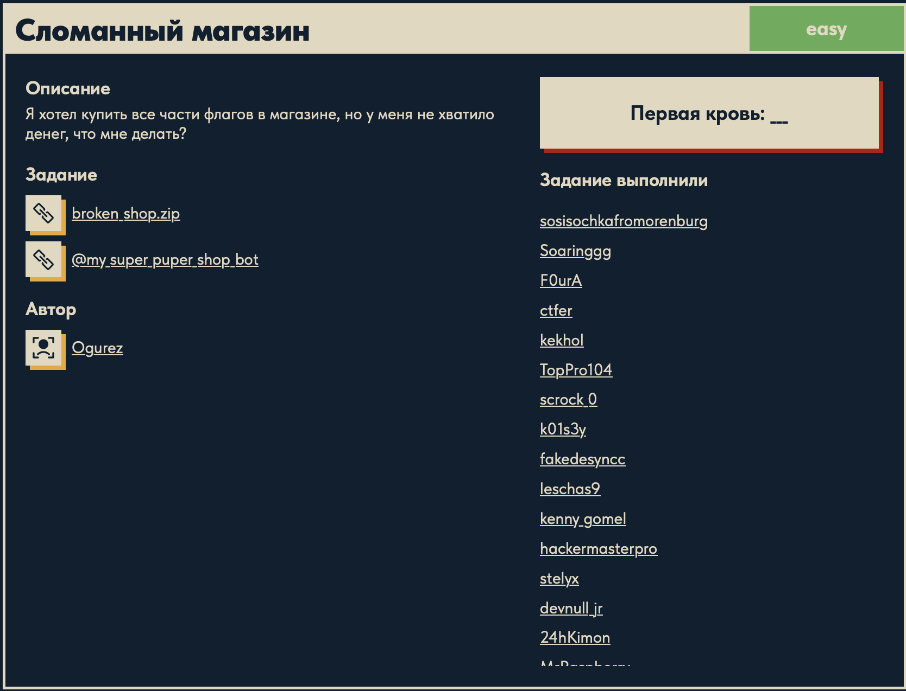
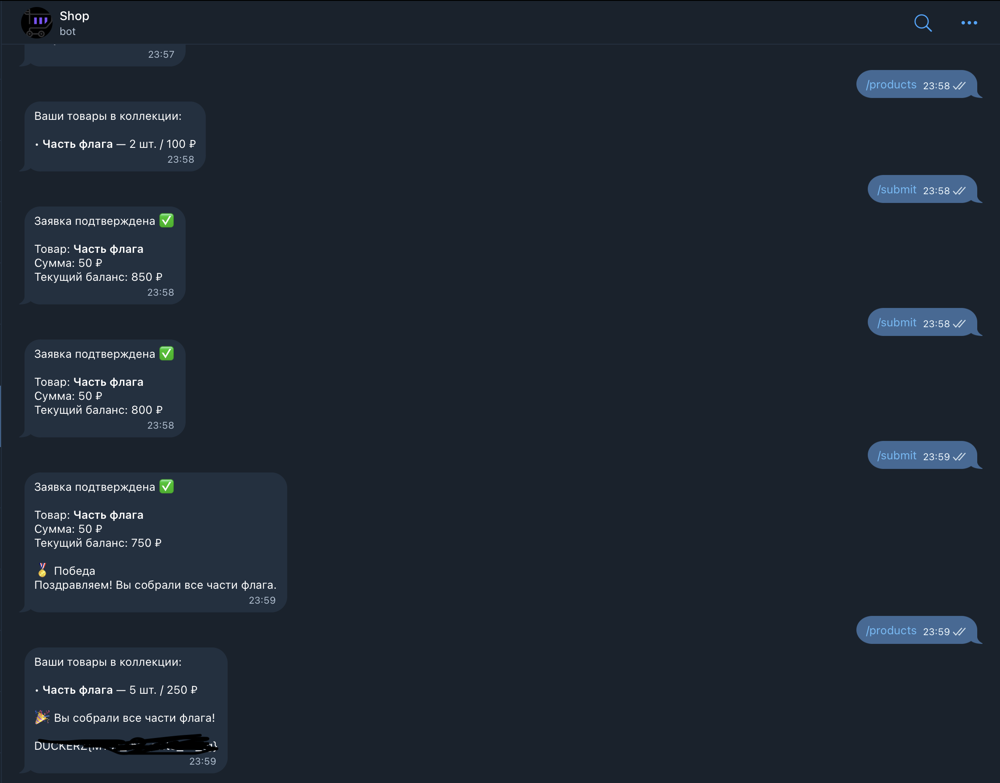

# Сломанный магазин 🌐

## Описание задачи

Задача: **Сломанный магазин**

Сложность: 

Описание с платформы:

> Я хотел купить все части флагов в магазине, но у меня не хватило денег, что мне делать?

К задаче даны:

```text
broken_shop.zip
@my_super_puper_shop_bot
```

Скрин с названием и описанием:



---

## Первый взгляд 👀

В задаче дан архив с исходным кодом приложения.

После распаковки видим проект:

```text
broken_shop/
├── backend/
├── bot/
├── frontend/
└── docker-compose.yml
```

Это сразу важная деталь: задача решается не только через интерфейс сайта, но и через анализ кода.

---

## Структура приложения

В `docker-compose.yml` описаны три сервиса:

```text
backend
frontend
bot
```

`backend` — серверная часть приложения. Внутри лежит Python-код:

```text
backend/app/auth.py
backend/app/config.py
backend/app/crud.py
backend/app/database.py
backend/app/main.py
backend/app/models.py
backend/app/schemas.py
```

`frontend` — клиентская часть. По `package.json` видно, что используется React/Vite:

```json
{
  "scripts": {
    "dev": "vite",
    "build": "tsc && vite build"
  }
}
```

`bot` — отдельный сервис Telegram-бота. Это важно, потому что в описании задачи отдельно указан бот:

```text
@my_super_puper_shop_bot
```

---

## Что видно в docker-compose

В `docker-compose.yml` у backend есть переменные:

```text
SECRET_KEY
DATABASE_URL
ACCESS_TOKEN_EXPIRE_MINUTES
JWT_ALGORITHM
FRONTEND_ORIGIN
BACKEND_CORS_ORIGINS
FLAG_PARTS_REQUIRED
BOT_JWT_SECRET
```

У bot есть:

```text
BOT_TOKEN
BACKEND_API_BASE
FRONTEND_BASE_URL
REQUEST_TIMEOUT
FLAG
BOT_JWT_SECRET
```

Это говорит о нескольких важных вещах:

- приложение использует JWT;
- есть отдельный секрет для бота `BOT_JWT_SECRET`;
- флаг передается боту через переменную окружения `FLAG`;
- приложение, скорее всего, связано с покупкой частей флага;
- количество нужных частей может задаваться через `FLAG_PARTS_REQUIRED`.

---

## Первые зацепки

В `bot/config.py` видно:

```python
flag: str = os.getenv("FLAG", "DUCKERZ{FAKE_FLAG}")
```

Это не настоящий флаг, а заглушка для локального запуска.

Смысл строки:

- если в окружении есть `FLAG`, бот берет его;
- если переменной `FLAG` нет, используется `DUCKERZ{FAKE_FLAG}`;
- настоящий флаг на сервере должен приходить через env.

Также в конфиге бота есть:

```python
bot_jwt_secret: str
jwt_algorithm: str = os.getenv("JWT_ALGORITHM", "HS256")
```

Значит дальше нужно внимательно смотреть, как бот и backend используют JWT и как проверяют права пользователя.

---

## Анализ товаров и баланса

По описанию задачи цель выглядит так:

```text
купить все части флага, даже если не хватает денег
```

Поэтому основные направления анализа:

- как создается пользователь;
- где хранится баланс;
- как устроены товары или части флага;
- как backend проверяет покупку;
- можно ли менять цену, количество или ID товара;
- как бот связан с магазином;
- где проверяется, что куплены все части флага;
- как используется `BOT_JWT_SECRET`.

В `backend/app/crud.py` есть стартовый баланс:

```python
DEFAULT_USER_BALANCE = 1000
```

Там же находятся товары:

```python
DEFAULT_PRODUCTS = [
    {
        "name": "Часть флага",
        "price": 500,
    },
    {
        "name": "Картинка",
        "price": 50,
    },
    {
        "name": "Видео",
        "price": 100,
    },
]
```

В `backend/app/config.py` видно, сколько частей флага нужно собрать:

```python
FLAG_PARTS_REQUIRED = 5
```

Получается экономика задачи:

```text
баланс пользователя: 1000
цена одной части флага: 500
нужно частей: 5
итоговая цена: 2500
```

Обычным способом купить все части не получится.

---

## Intended-решение

Финальная логика решения:

```text
1. Через бота /start получить ссылку на магазин.
2. В магазине создать дешевую заявку, например товар "Картинка" за 50.
3. В Telegram отправить /submit.
4. Бот пришлет кнопку "Подтвердить" с callback-суммой 50.
5. Кнопку пока не нажимать.
6. На сайте отменить дешевую заявку.
7. Создать заявку на "Часть флага" за 500.
8. Нажать старую кнопку подтверждения от дешевой заявки.
9. Бот подтвердит текущую заявку на часть флага, но спишет 50.
10. Повторить до покупки 5 частей.
11. После покупки 5 частей отправить боту /products.
12. Бот выведет флаг.
```

Суть бага: старая кнопка в Telegram хранит старую сумму, но backend подтверждает не старую заявку, а текущую pending-заявку пользователя.

---

## Шаг 1: вход через бота

За команду `/start` отвечает функция в `bot/main.py`:

```python
@router.message(CommandStart())
async def handle_start(message: Message) -> None:
    user_id = message.from_user.id
    ...
    token = await obtain_login_token(client, user_id)
    link = f"{settings.frontend_base_url}?token={token}"
```

Что происходит:

- бот берет Telegram `user_id`;
- отправляет его на backend;
- backend создает или находит пользователя;
- backend выдает JWT для входа;
- бот присылает ссылку на магазин с `?token=...`.

Токен создается на backend в `backend/app/main.py`:

```python
@app.post("/users/login", response_model=TokenResponse)
def login_user(payload: UserCreate, db: Session = Depends(get_session)) -> TokenResponse:
    user = ensure_user(db, payload.user_id)
    token = create_access_token(user_id=user.id)
    return TokenResponse(token=token, user=UserRead.model_validate(user))
```

То есть пользователь авторизуется через Telegram-бота.

---

## Шаг 2: создание заявки на сайте

Покупка на сайте уходит на endpoint:

```python
@app.post("/orders", response_model=OrderResponse, status_code=status.HTTP_201_CREATED)
def create_order(payload: PurchaseRequest, current_user: User = Depends(get_current_user), db: Session = Depends(get_session)) -> OrderResponse:
```

Внутри backend берет товар:

```python
product = get_product(db, payload.product_id)
```

считает цену:

```python
total_price = product.price * payload.quantity
```

и создает pending-заявку:

```python
purchase = create_pending_purchase(
    db,
    user=current_user,
    product=product,
    quantity=payload.quantity,
)
```

Сама pending-заявка создается в `backend/app/crud.py`:

```python
def create_pending_purchase(db: Session, *, user: User, product: Product, quantity: int) -> Purchase:
    ...
    purchase = Purchase(
        user=user,
        product=product,
        quantity=quantity,
        total_price=total_price,
        status=PURCHASE_STATUS_PENDING,
    )
    ...
    user.frozen_balance = total_price
```

Заявка получает статус:

```text
pending
```

То есть покупка еще не завершена. Деньги не списаны окончательно, а сумма замораживается в `frozen_balance`.

---

## Шаг 3: команда /submit

После создания дешевой заявки отправляем боту:

```text
/submit
```

За это отвечает функция `handle_submit` в `bot/main.py`:

```python
@router.message(Command("submit"))
async def handle_submit(message: Message) -> None:
```

Бот запрашивает текущую pending-заявку:

```python
pending_response = await client.get(
    f"{settings.backend_api_base}/orders/pending",
    headers=headers,
)
```

Backend endpoint:

```python
@app.get("/orders/pending", response_model=PendingPurchaseResponse)
def read_pending_order(current_user: User = Depends(get_current_user), db: Session = Depends(get_session)) -> PendingPurchaseResponse:
    purchase = get_pending_purchase(db, current_user)
```

После этого бот строит inline-кнопку:

```python
purchase_id = purchase.get("id", 0)
total_value = str(total_price)
product_value = str(product.get("id", ""))
```

И самое важное:

```python
callback_data=f"purchase:confirm:{purchase_id}:{total_value}:{product_value}"
```

То есть в Telegram-кнопку зашиваются:

```text
purchase_id
total_value
product_id
```

Для дешевой картинки callback будет содержать сумму `50`.

---

## Шаг 4: отмена дешевой заявки

Дальше старую кнопку не нажимаем.

На сайте отменяем дешевую заявку. За отмену отвечает endpoint:

```python
@app.post("/orders/cancel", response_model=OrderResponse)
def cancel_pending_order(current_user: User = Depends(get_current_user), db: Session = Depends(get_session)) -> OrderResponse:
```

Он берет текущую pending-заявку:

```python
purchase = get_pending_purchase(db, current_user)
```

и отменяет ее:

```python
purchase = cancel_purchase(db, purchase=purchase)
```

Функция `cancel_purchase` в `backend/app/crud.py`:

```python
def cancel_purchase(db: Session, *, purchase: Purchase) -> Purchase:
    user = purchase.user
    user.frozen_balance = 0
    purchase.status = PURCHASE_STATUS_CANCELLED
```

Что важно:

- заявка отменяется;
- `frozen_balance` сбрасывается;
- старая Telegram-кнопка при этом остается в чате;
- callback у старой кнопки все еще содержит сумму `50`.

---

## Шаг 5: создание дорогой заявки

После отмены дешевой заявки создаем новую pending-заявку уже на товар:

```text
Часть флага
```

Ее цена:

```text
500
```

Теперь текущая pending-заявка пользователя — это уже не картинка, а часть флага.

Но старая Telegram-кнопка все еще содержит:

```text
purchase:confirm:<старый_id>:50:<product_id_картинки>
```

Вот здесь начинается рассинхрон.

---

## Шаг 6: нажатие старой кнопки

За нажатие inline-кнопки отвечает `handle_purchase_callback` в `bot/main.py`:

```python
@router.callback_query(F.data.startswith("purchase:"))
async def handle_purchase_callback(callback: CallbackQuery) -> None:
```

Бот разбирает callback:

```python
parts = callback.data.split(":")
action = parts[1]
callback_total = parts[3] if action == "confirm" and len(parts) >= 4 else None
callback_product = parts[4] if action == "confirm" and len(parts) >= 5 else None
```

То есть из старой кнопки он достает старую сумму:

```text
callback_total = 50
```

Дальше бот заново запрашивает pending-заявку:

```python
pending_response = await client.get(
    f"{settings.backend_api_base}/orders/pending",
    headers=headers,
)
```

Но теперь pending-заявка уже новая:

```text
Часть флага за 500
```

Затем бот отправляет подтверждение:

```python
confirm_headers = dict(headers)
if callback_total is not None:
    confirm_headers["X-Planner-Locked-Amount"] = callback_total
if action == "confirm":
    confirm_headers["X-Planner-Bot-Token"] = build_bot_token()
```

Ключевая строка:

```python
confirm_headers["X-Planner-Locked-Amount"] = callback_total
```

Бот передает на backend сумму из старой кнопки.

---

## Где именно баг

Backend подтверждает покупку в `confirm_pending_order`:

```python
@app.post("/orders/confirm", response_model=OrderResponse)
def confirm_pending_order(request: Request, current_user: User = Depends(get_current_user), db: Session = Depends(get_session)) -> OrderResponse:
```

Сначала он берет текущую pending-заявку:

```python
purchase = get_pending_purchase(db, current_user)
```

Это уже новая заявка на часть флага.

Потом берет сумму из заголовка:

```python
override_total = request.headers.get("x-planner-locked-amount")
bot_token = request.headers.get("x-planner-bot-token")
```

Если сумма передана, backend проверяет, что запрос пришел от бота:

```python
if override_total is not None:
    verify_bot_token(bot_token)
```

После этого вызывается:

```python
purchase = confirm_purchase(
    db,
    purchase=purchase,
    override_total=override_total,
)
```

А в `confirm_purchase`:

```python
total_price = purchase.total_price

if override_total is not None:
    candidate = float(override_total)
    if candidate >= 0:
        total_price = int(candidate)
```

То есть реальная цена заявки:

```text
500
```

заменяется суммой из старой кнопки:

```text
50
```

Дальше backend списывает именно `total_price`:

```python
user.balance -= total_price
purchase.total_price = total_price
purchase.status = PURCHASE_STATUS_CONFIRMED
```

Итог:

```text
товар: Часть флага
списано: 50
```

Это и есть баг.

Backend не связывает `purchase_id` из callback со свежей pending-заявкой. Более того, `purchase_id` из callback вообще не используется для подтверждения. Сервис подтверждает текущую pending-заявку, но цену берет из старой кнопки.

---

## Почему product_id в callback не спасает

В callback есть еще `callback_product`:

```python
callback_product = parts[4] if action == "confirm" and len(parts) >= 5 else None
```

Но дальше он используется только для debug-лога:

```python
if callback_product is not None:
    logger.debug(
        "Confirm callback uses product %s for user %s",
        callback_product,
        user_id,
    )
```

То есть backend не проверяет:

```text
product_id из callback == product_id текущей заявки
```

Из-за этого старая кнопка от картинки может подтвердить новую заявку на часть флага.

---

## Получение флага

Нужно повторить схему несколько раз:

```text
дешевая заявка -> /submit -> старая кнопка с 50 -> отмена -> заявка на часть флага -> старая кнопка
```

После покупки 5 частей флага бот проверяет коллекцию через команду:

```text
/products
```

За нее отвечает функция:

```python
@router.message(Command("products"))
async def handle_products(message: Message) -> None:
```

Бот получает историю покупок:

```python
history_response = await client.get(
    f"{settings.backend_api_base}/orders/history",
    headers=headers,
)
```

и профиль пользователя:

```python
profile_response = await client.get(
    f"{settings.backend_api_base}/users/me",
    headers=headers,
)
```

Если backend поставил пользователю `flag_awarded`, бот добавляет флаг:

```python
if profile_data and isinstance(profile_data, dict) and profile_data.get("flag_awarded"):
    summary += "\n\n🎉 Вы собрали все части флага!"
    summary += f"\n\n{settings.flag}"
```

Сам флаг хранится у бота в переменной окружения:

```python
flag: str = os.getenv("FLAG", "DUCKERZ{FAKE_FLAG}")
```

Финальный результат:



На скрине видно, что части флага подтверждаются по `50 ₽`, хотя товар — `Часть флага`. После команды `/products` бот показывает, что собрано `5 шт. / 250 ₽`, и выводит флаг. Сам флаг на скрине замазан.

В writeup настоящий флаг не публикуется.

---

## Итог

Уязвимость: рассинхрон между старой Telegram-кнопкой и текущей pending-заявкой.

Коротко:

```text
старая кнопка хранит сумму 50
backend берет текущую pending-заявку
backend списывает сумму из старой кнопки
```

Правильная защита должна была бы:

- проверять `purchase_id` из callback;
- проверять, что сумма из callback совпадает с ценой текущей заявки;
- проверять `product_id`;
- инвалидировать старые кнопки после отмены заявки;
- не доверять цене, пришедшей из callback/header.

---

## Текущий статус

Задача решена.

Зафиксировано:

- название и описание задачи;
- наличие архива `broken_shop.zip`;
- наличие Telegram-бота `@my_super_puper_shop_bot`;
- структура проекта `backend/frontend/bot`;
- переменные окружения из `docker-compose.yml`;
- товары, баланс и требуемое число частей флага;
- intended-решение через старую Telegram-кнопку подтверждения;
- функции backend и bot, отвечающие за каждый шаг;
- место бага: `X-Planner-Locked-Amount` берется из старого callback, а подтверждается текущая pending-заявка;
- получение флага через `/products` после покупки 5 частей.

---

Автор: **masquadd :)** ✍️
