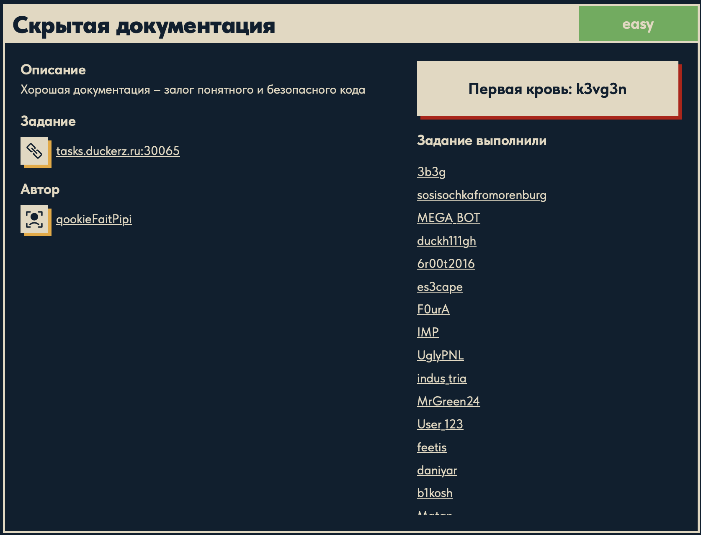
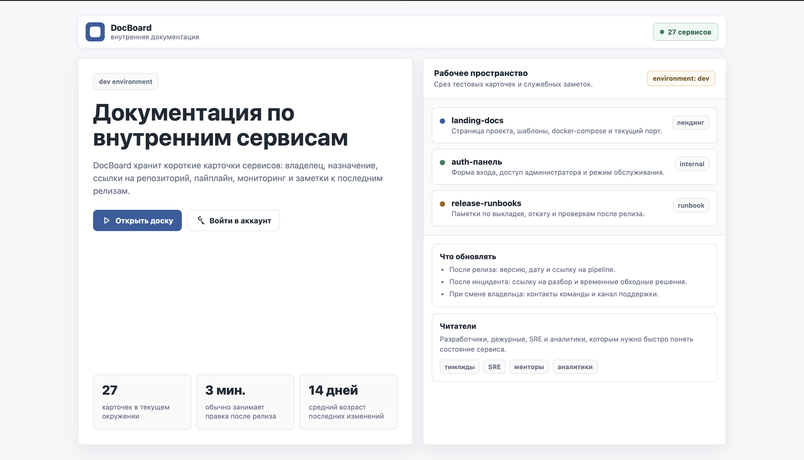
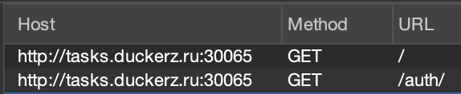
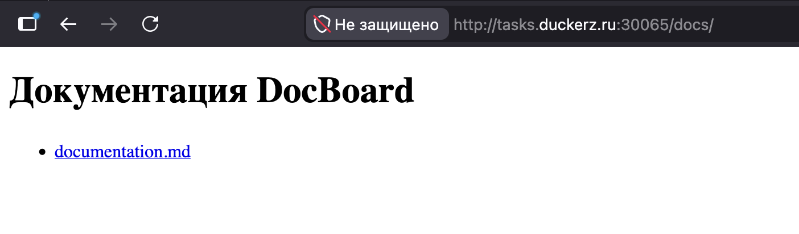
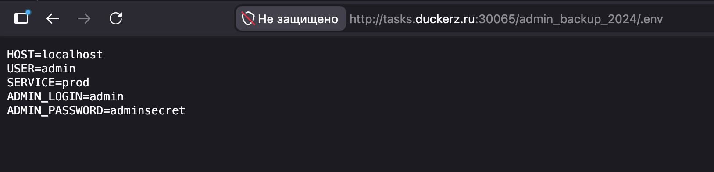
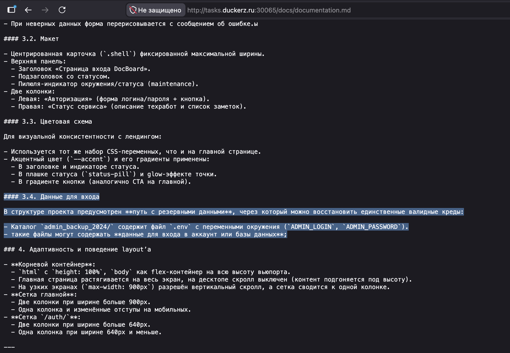

# Скрытая документация 🌐

## Описание задачи 📌

Название задачи:

```text
Скрытая документация
```

Сложность:

```text
Easy
```

Описание со страницы задачи:

```text
Хорошая документация — залог понятного и безопасного кода
```

В качестве цели задачи был указан адрес:

```text
tasks.duckerz.ru:30065
```

Скрин страницы задачи:



## Что есть на старте 🔎

При переходе на сайт открывается сервис:

```text
DocBoard
```

Подзаголовок:

```text
Внутренняя документация
```

Скрин сайта:



## Первичное наблюдение 🧠

На главной странице видно, что это доска с внутренними карточками сервисов.

На странице есть две основные кнопки:

```text
Открыть доску
Войти в аккаунт
```

Также справа перечислены рабочие разделы:

```text
landing-docs
auth-панель
release-runbooks
```

В верхней части страницы указан режим:

```text
dev environment
```

и отдельный бейдж:

```text
environment: dev
```

## Что это может значить для CTF 🧪

Сама задача называется "Скрытая документация", поэтому основной фокус на первом этапе — найти закрытые или неочевидные страницы документации.

Важные зацепки:

- сервис позиционируется как внутренняя документация;
- есть режим `dev`;
- есть доска с карточками внутренних сервисов;
- есть вход в аккаунт;
- в интерфейсе упоминаются `landing-docs`, `auth-панель`, `release-runbooks`.

## Первая зацепка в Burp Suite 🧰

При просмотре запросов в Burp Suite стало видно, что сайт отдает страницу:

```text
/auth/
```

Скрин из Burp:



Это полезная зацепка: если есть страница авторизации, значит рядом могут быть и другие служебные директории.

## Поиск директорий через gobuster 🔎

Дальше был запущен `gobuster` для перебора директорий:

```bash
gobuster dir \
  -u http://tasks.duckerz.ru:30065 \
  -w ~/SecLists/Discovery/Web-Content/common.txt \
  -f
```

Разберем команду.

```bash
gobuster dir
```

Запускает режим перебора директорий и файлов на веб-сервере.

```bash
-u http://tasks.duckerz.ru:30065
```

Указывает базовый URL цели.

```bash
-w ~/SecLists/Discovery/Web-Content/common.txt
```

Указывает wordlist. В нем находятся популярные имена директорий и файлов: `admin`, `docs`, `auth`, `login` и так далее.

```bash
-f
```

Добавляет `/` в конец проверяемых путей. Для этой задачи это важно, потому что интересные пути выглядят именно как директории:

```text
auth/
docs/
```

В результате gobuster нашел:

```text
auth/   Status: 200
docs/   Status: 200
```

То есть обе директории доступны.

## Директория docs 📚

После перехода в:

```text
/docs/
```

открылась простая страница со ссылкой на файл:

```text
documentation.md
```

Скрин:



Внутри `documentation.md` была важная подсказка:

```text
Каталог `admin_backup_2024/` содержит файл `.env`
```

Также там было указано, что `.env` содержит переменные:

```text
ADMIN_LOGIN
ADMIN_PASSWORD
```

То есть документация сама раскрыла, где искать резервные данные для входа.

## Файл .env ⚙️

По подсказке из документации был открыт путь:

```text
/admin_backup_2024/.env
```

На странице отобразились переменные окружения:

```text
HOST=localhost
USER=admin
SERVICE=prod
ADMIN_LOGIN=admin
ADMIN_PASSWORD=adminsecret
```

Скрин:



Здесь важны две строки:

```text
ADMIN_LOGIN=admin
ADMIN_PASSWORD=adminsecret
```

Они дают логин и пароль для административной панели.

## Вход в админку 🔐

После этого возвращаемся на страницу:

```text
/auth/
```

и используем найденные данные:

```text
login: admin
password: adminsecret
```

После успешного входа открывается административная панель, где отображается флаг.

Скрин с замазанным флагом:



## Получение флага 🏁

Флаг был получен после входа в административную панель. В writeup сам флаг не вставляется.

Суть задачи: скрытая документация раскрывала путь к резервному `.env`-файлу, а в нем лежали учетные данные администратора.

## Итоговая цепочка ✅

```text
Главная страница DocBoard
        ↓
Burp показывает /auth/
        ↓
gobuster с -f находит /auth/ и /docs/
        ↓
/docs/ содержит documentation.md
        ↓
documentation.md указывает на /admin_backup_2024/.env
        ↓
.env раскрывает ADMIN_LOGIN и ADMIN_PASSWORD
        ↓
вход в /auth/
        ↓
получение флага
```

## Финальный статус 🏁

В решении использовали:

```text
цель: tasks.duckerz.ru:30065
сервис: DocBoard
тема: внутренняя документация
режим: dev environment
инструменты: Burp Suite, gobuster, браузер
ключевые пути: /auth/, /docs/, /docs/documentation.md, /admin_backup_2024/.env
```

Автор: masquadd :) ✍️
