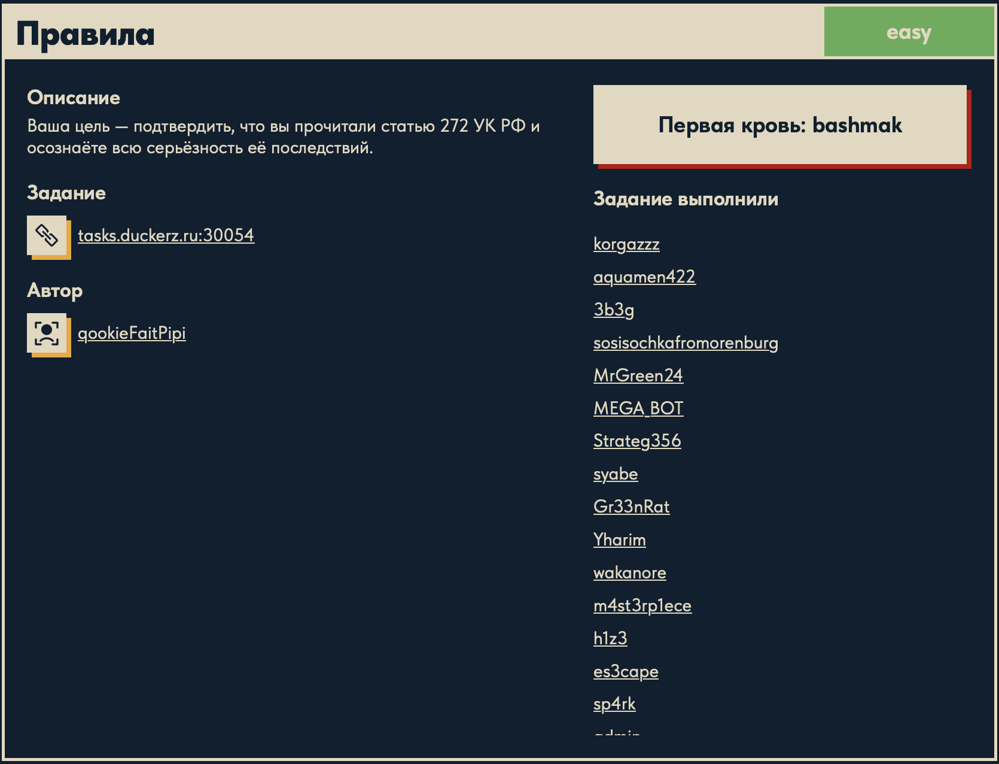
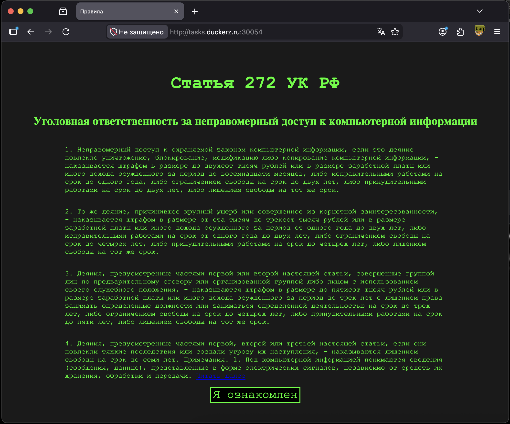
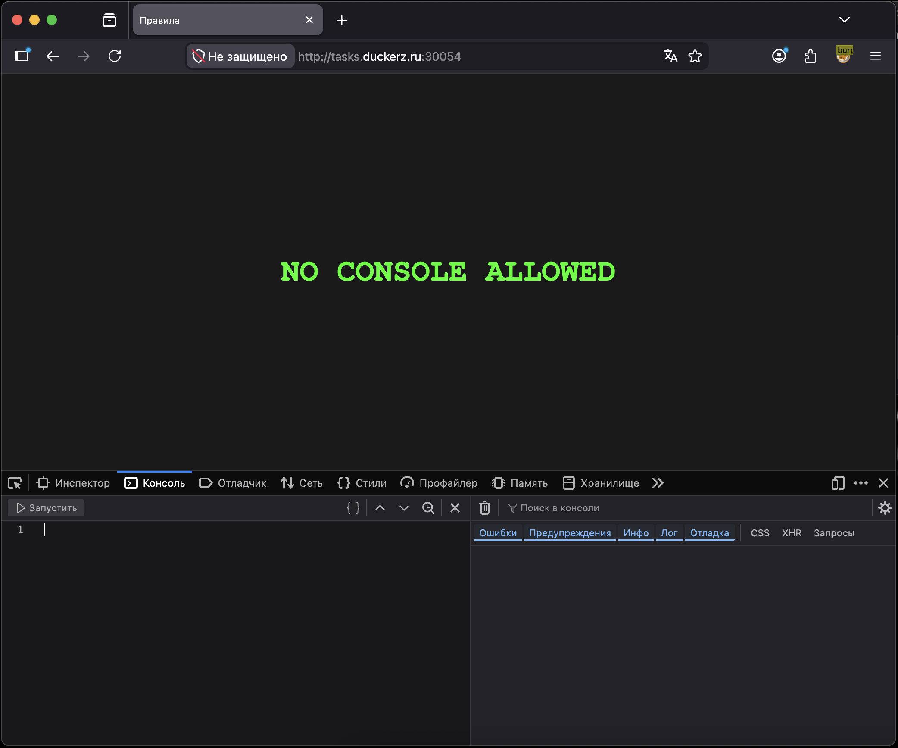

# Правила 🌐

## Описание задачи 📌

Название задачи:

```text
Правила
```

Сложность:

```text
Easy
```

Описание со страницы задачи:

```text
Ваша цель — подтвердить, что вы прочитали статью 272 УК РФ и осознаёте всю серьёзность её последствий.
```

В качестве цели задачи был указан адрес:

```text
tasks.duckerz.ru:30054
```

Скрин страницы задачи:



## Что есть на старте 🔎

При переходе на сайт открывается страница со статьей:

```text
Статья 272 УК РФ
```

На странице есть текст про уголовную ответственность за неправомерный доступ к компьютерной информации и кнопка:

```text
Я ознакомлен
```

Скрин страницы:



## Первичное наблюдение 🧠

Задача выглядит как проверка того, что пользователь прочитал правила или подтвердил ознакомление.

Так как это web-задача, на первом этапе стоит проверить:

- поведение кнопки;
- HTML и JavaScript страницы;
- запросы в DevTools или Burp Suite;
- сообщения в консоли браузера.

## Проверка консоли 🧰

При открытии консоли разработчика страница показывает сообщение:

```text
NO CONSOLE ALLOWED
```

Скрин:



Это важная деталь: сайт пытается мешать анализу через DevTools.

## Получение флага через баг интерфейса 🕹️

Флаг удалось получить через баг в поведении страницы.

Суть:

```text
открываем страницу не на весь экран
частично перекрываем ее другим окном
дважды нажимаем на кнопку
```

После этого проверка обходится, и появляется флаг.

Флаг в writeup не вставляется.

## Анализ JavaScript 🧠

После этого дополнительно посмотрели код страницы.

В JavaScript был найден обработчик клика по кнопке. Код сильно обфусцирован, то есть специально сделан плохо читаемым:

```javascript
document[...]('accept')[...]('click',()=>{...});
```

Человечески это означает:

```text
найти элемент accept
повесить на него обработчик click
при нажатии выполнить проверку
```

Внутри обработчика есть важная часть:

```javascript
alert(...)
```

Именно на `alert` стоит обратить внимание, потому что `alert()` показывает сообщение пользователю во всплывающем окне. Если задача после нажатия должна показать флаг, то очень вероятно, что флаг или его расшифровка находятся рядом с этим `alert`.

В коде было две ветки:

```text
если условие не выполнено -> alert("silly you...")
если условие выполнено -> alert(расшифрованная строка)
```

То есть логика страницы такая:

```text
проверить, достаточно ли пользователь "ознакомился"
если нет -> показать отказ
если да -> показать результат
```

## Как нашли зашифрованную строку 🔎

Внутри второго `alert` была строка:

```text
GV@HFQYxwkbw\avwwlm\tbp\gfejmjwfoz\mlw\lmf\le\wkf\wfqnp~
```

Сама по себе она не похожа на нормальный текст, но она находится прямо внутри успешного `alert`.

Поэтому стало понятно:

```text
это не случайная строка
это данные, которые перед показом преобразуются в читаемый результат
```

Дальше рядом со строкой видно преобразование:

```javascript
charCodeAt(0x0) ^ 0x3
```

Это главный момент.

## Как понять ключ XOR ⚙️

В JavaScript оператор:

```javascript
^
```

означает XOR.

Фрагмент:

```javascript
charCodeAt(0x0) ^ 0x3
```

означает:

```text
взять код символа
сделать XOR с числом 0x3
```

`0x3` - это шестнадцатеричная запись числа `3`.

То есть ключ здесь прямо указан в коде:

```text
ключ = 3
```

Почему это не догадка:

- строка лежит внутри успешного `alert`;
- каждый символ строки прогоняется через `charCodeAt`;
- затем к каждому символу применяется `^ 0x3`;
- результат собирается обратно через `String.fromCharCode`;
- значит, чтобы получить нормальный текст, нужно повторить такое же преобразование.

## Однострочник Python 🐍

Для расшифровки использовали команду:

```bash
python3 -c 's="GV@HFQYxwkbw\\avwwlm\\tbp\\gfejmjwfoz\\mlw\\lmf\\le\\wkf\\wfqnp~"; print("".join(chr(ord(c)^3) for c in s))'
```

Разберем подробно.

Флаг `-c` у `python3` означает:

```text
выполнить код, переданный прямо в командной строке
```

В начале создается переменная `s`:

```python
s="GV@HFQYxwkbw\\avwwlm\\tbp\\gfejmjwfoz\\mlw\\lmf\\le\\wkf\\wfqnp~"
```

Это зашифрованная строка из JavaScript.

Обратные слеши записаны как:

```text
\\
```

Потому что один `\` в строках может начинать escape-последовательность. Чтобы сохранить сам символ обратного слеша, его экранируют вторым слешем.

Дальше идет:

```python
for c in s
```

Это проход по каждому символу строки.

Например, сначала `c` равен первому символу, потом второму, потом третьему и так далее.

Функция:

```python
ord(c)
```

берет символ и возвращает его числовой код.

Например:

```text
ord("A") -> 65
```

Дальше:

```python
ord(c) ^ 3
```

делает XOR кода символа с числом `3`.

Это то же самое, что было в JavaScript:

```javascript
charCodeAt(0x0) ^ 0x3
```

После XOR получается новый числовой код. Его нужно превратить обратно в символ:

```python
chr(ord(c)^3)
```

Функция `chr()` делает обратное к `ord()`:

```text
chr(65) -> "A"
```

Вся эта часть:

```python
chr(ord(c)^3) for c in s
```

создает последовательность расшифрованных символов.

Потом:

```python
"".join(...)
```

склеивает все символы в одну строку без разделителей.

В конце:

```python
print(...)
```

печатает результат в терминал.

В выводе получился флаг:

```text
DUCKERZ{...}
```

Сам флаг в writeup не показывается.

## Почему это флаг 🏁

Мы поняли, что это флаг, по нескольким признакам:

- результат выводится через успешный `alert`;
- строка после XOR становится читаемой;
- результат начинается с формата `DUCKERZ{...}`;
- это стандартный формат флагов на платформе Duckerz.

## Итог 🏁

На этом этапе зафиксировали:

```text
цель: tasks.duckerz.ru:30054
страница: статья 272 УК РФ
кнопка: Я ознакомлен
наблюдение: консоль блокируется сообщением NO CONSOLE ALLOWED
```

Краткая цепочка решения:

```text
страница с правилами -> баг с перекрытием окна и двойным кликом -> флаг
```

Дополнительная цепочка через код:

```text
JavaScript -> успешный alert -> зашифрованная строка -> charCodeAt(...) ^ 0x3 -> Python XOR -> DUCKERZ{...}
```

Суть задачи: страница пыталась проверить ознакомление с правилами и мешала анализу через консоль, но логика получения флага находилась на клиенте. В успешной ветке `alert` была зашифрованная строка, которая расшифровывалась XOR с ключом `3`.

Автор: masquadd :) ✍️
