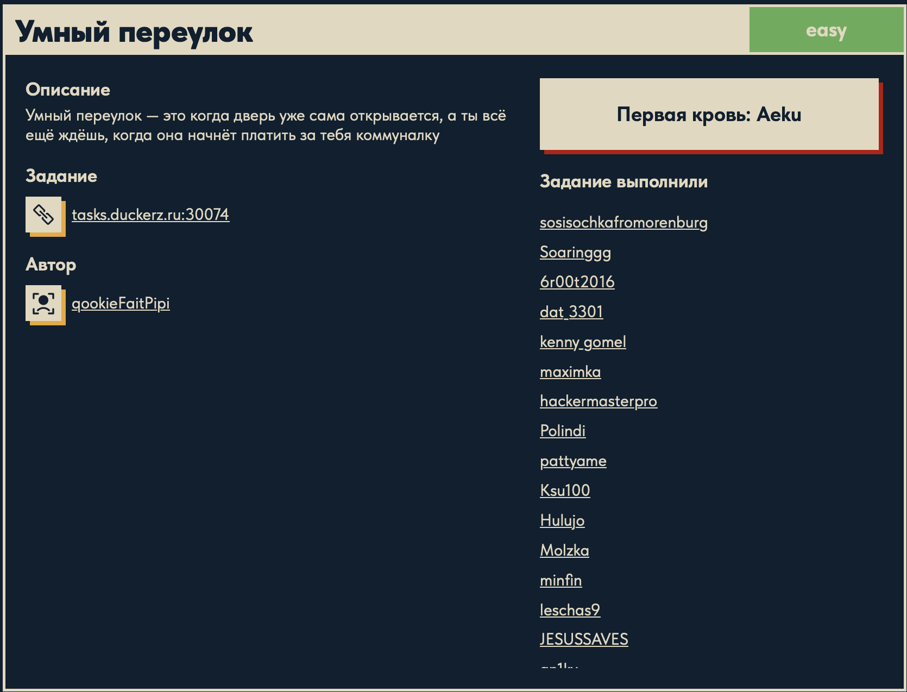
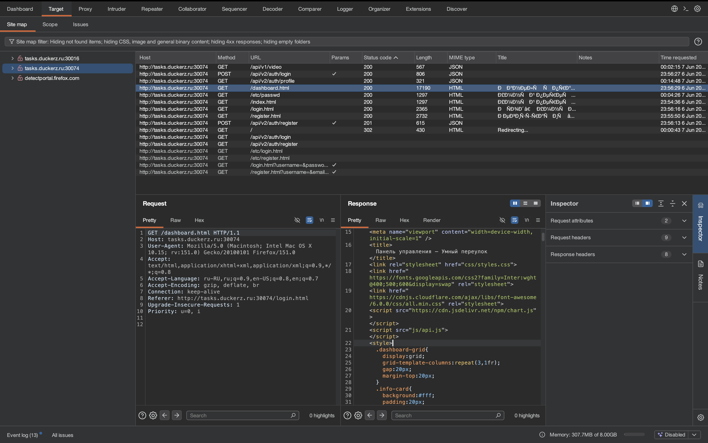
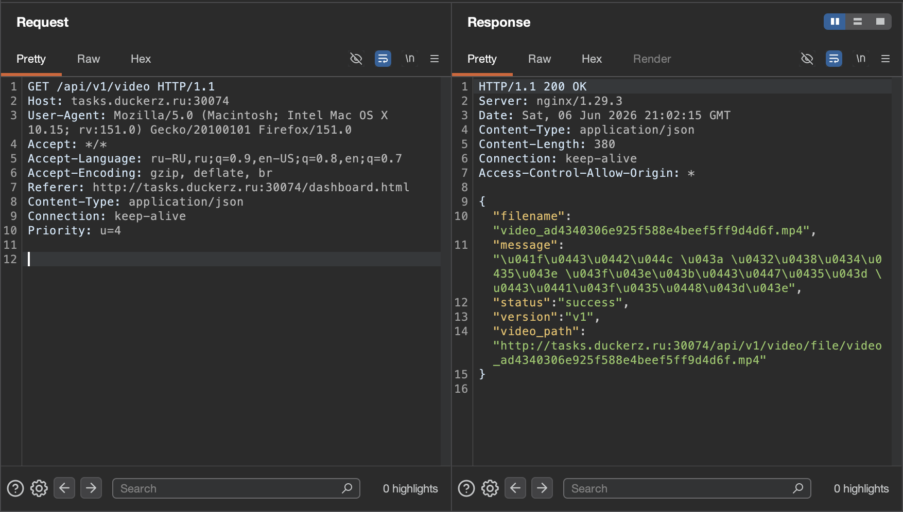
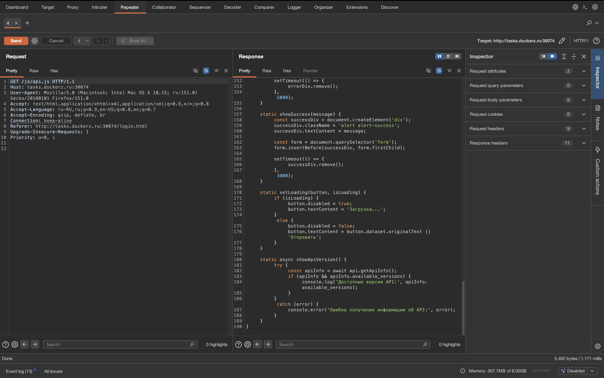

# Умный переулок 🌐

## Описание задачи

Задача: **Умный переулок**

Сложность: 

Описание с платформы:

> Умный переулок — это когда дверь уже сама открывается, а ты всё ещё ждёшь, когда она начнёт платить за тебя коммуналку

Адрес задания:

```text
tasks.duckerz.ru:30074
```

Автор задачи:

```text
qookieFaitPipi
```

Скрин с названием и описанием:



---

## Первый взгляд 👀

На старте пока есть только карточка задачи с названием, описанием и адресом сервиса.

По описанию задача выглядит как веб-интерфейс, связанный с "умным" домом, дверью или системой доступа.

Пока это только направление для первичной проверки. На этом этапе логично смотреть:

- есть ли вход в личный кабинет или панель управления;
- можно ли управлять дверью или другими устройствами;
- есть ли API-запросы к устройствам;
- используются ли токены, cookies или роли пользователей;
- можно ли получить доступ к чужому устройству или изменить его состояние;
- есть ли параметры, связанные с идентификаторами устройств, домов, дверей или пользователей.

---

## Что проверять дальше

Первым делом нужно открыть сервис и зафиксировать:

- какие страницы доступны без авторизации;
- есть ли регистрация или уже выданные данные для входа;
- какие HTTP-запросы отправляются при открытии двери или другой автоматизации;
- какие параметры и идентификаторы передаются на сервер;
- как сайт показывает состояние устройства;
- можно ли повторять или менять запросы через Burp Suite.

Пока реальная уязвимость не подтверждена. Сейчас зафиксирован только стартовый контекст и основные направления разведки.

---

## Что видно в Burp Suite 🧪

После регистрации и недолгого просмотра запросов в Burp стали видны основные страницы и API-маршруты приложения.

Скрин из Burp:



В истории запросов видны:

```text
GET  /
GET  /index.html
GET  /login.html
GET  /register.html
GET  /dashboard.html
POST /api/v2/auth/register
POST /api/v2/auth/login
GET  /api/v2/auth/profile
GET  /api/v1/video
```

Это уже дает полезную картину приложения.

По этим путям можно сделать осторожные выводы:

- у сайта есть отдельные страницы регистрации, логина и панели управления;
- авторизация идет через API версии `v2`;
- после входа используется маршрут профиля:

```text
/api/v2/auth/profile
```

- отдельно существует еще один маршрут другой версии API:

```text
/api/v1/video
```

То есть в приложении одновременно присутствуют как минимум две версии API:

```text
v1
v2
```

Это важное наблюдение для дальнейшего анализа, потому что версии API нередко отличаются по логике проверки прав, формату ответа или набору доступных методов.

---

## Проверка /api/v1/video

Отдельно был открыт маршрут:

```http
GET /api/v1/video HTTP/1.1
```

Скрин запроса и ответа:



Сервер вернул JSON:

```json
{
  "filename": "video_ad4340306e925f588e4beef5ff9d4d6f.mp4",
  "message": "...",
  "status": "success",
  "version": "v1",
  "video_path": "http://tasks.duckerz.ru:30074/api/v1/video/file/video_ad4340306e925f588e4beef5ff9d4d6f.mp4"
}
```

Из этого видно:

- маршрут `/api/v1/video` не отдает видео напрямую;
- вместо этого он возвращает JSON с метаданными;
- в ответе есть имя файла `filename`;
- также сервер сам выдает прямой путь к файлу в `video_path`;
- ответ явно помечен как версия:

```text
v1
```

На этом этапе само видео не дало ничего интересного. Пока полезно только то, что через `v1` можно получить путь к видеофайлу и увидеть, как именно сервер его раскрывает клиенту.

---

## Получение флага из видео 🏁

Следующим шагом был открыт файл по пути из `video_path`:

```text
/api/v1/video/file/video_ad4340306e925f588e4beef5ff9d4d6f.mp4
```

При просмотре видео оказалось, что флаг находится прямо в кадре.

Скрин с найденным флагом:


На изображении видно человека с табличкой, на которой написан флаг.

То есть финальное решение оказалось очень прямым:

```text
/api/v1/video
-> получить video_path
-> открыть mp4-файл
-> заметить флаг в кадре
```

Флаг в README явно не публикуется.

---

## Поиск клиентского JavaScript

В ответе страницы панели управления был найден подключаемый файл:

```html
<script src="js/api.js"></script>
```

Скрин с ответом страницы:


После этого файл:

```text
/js/api.js
```

был открыт отдельно через Repeater.

Скрин с ответом:



Это важный шаг, потому что клиентский JavaScript часто прямо показывает:

- какие endpoint'ы вызывает сайт;
- как формируются заголовки;
- где хранятся токены;
- какие версии API используются;
- какие действия доступны пользователю после входа.

---

## Общая логика страницы

По увиденным запросам и коду `api.js` уже понятно, как примерно устроен интерфейс сайта.

Главные страницы:

- `register.html` — регистрация;
- `login.html` — вход;
- `dashboard.html` — панель после авторизации.

Сама страница панели управления не содержит всю сетевую логику прямо в HTML. Вместо этого она подключает отдельный JavaScript-файл:

```html
<script src="js/api.js"></script>
```

Значит, значимая часть поведения страницы вынесена в клиентский код:

- отправка запросов на backend;
- хранение токена;
- подстановка заголовка `Authorization`;
- работа с ошибками;
- выбор версии API.

---

## Разбор js/api.js

Файл начинается с конфигурации окружений:

```javascript
const config = {
    development: {
        apiUrl: 'http://localhost:8000/api'
    },
    production: {
        apiUrl: window.location.origin + '/api'
    }
};
```

Смысл такой:

- в локальной разработке frontend ходит на:

```text
http://localhost:8000/api
```

- на боевом сервере API берется от текущего домена:

```text
window.location.origin + '/api'
```

Дальше определяется текущее окружение:

```javascript
const environment = window.location.hostname === 'localhost' ? 'development' : 'production';
const API_BASE_URL = config[environment].apiUrl;
```

То есть если сайт открыт на `localhost`, используется development-конфиг. Во всех остальных случаях используется production.

---

## Класс ApiService

Основная логика работы с backend находится в классе:

```javascript
class ApiService
```

При создании объекта задается версия API:

```javascript
const api = new ApiService('v2');
```

Это значит, что по умолчанию весь интерфейс работает через:

```text
/api/v2
```

В конструкторе:

```javascript
constructor(version = 'v2') {
    this.baseUrl = API_BASE_URL;
    this.version = version;
    this.token = localStorage.getItem('token');
}
```

происходит три вещи:

- запоминается базовый URL API;
- запоминается текущая версия;
- токен авторизации читается из `localStorage`.

Это важное наблюдение: токен хранится на стороне браузера в:

```text
localStorage['token']
```

---

## Переключение версии API

В коде есть метод:

```javascript
setVersion(version) {
    this.version = version;
    this.clearToken();
}
```

Он меняет используемую версию API и сразу очищает токен.

Почему это важно:

- приложение явно поддерживает переключение между версиями;
- после смены версии старый токен считается неподходящим;
- значит, разработчики ожидали, что разные версии могут иметь разные правила авторизации или совместимости.

Это хорошо сочетается с тем, что в Burp уже были видны и `v1`, и `v2`.

---

## Работа с токеном

Методы:

```javascript
setToken(token)
clearToken()
isAuthenticated()
```

отвечают за клиентскую авторизацию.

`setToken(token)`:

- сохраняет токен в объекте;
- пишет его в `localStorage`.

`clearToken()`:

- удаляет токен из памяти;
- удаляет его из `localStorage`.

`isAuthenticated()`:

```javascript
return !!this.token;
```

то есть просто проверяет, есть ли токен в объекте.

---

## Формирование заголовков

Метод:

```javascript
getHeaders()
```

создает базовые заголовки:

```javascript
{
    'Content-Type': 'application/json'
}
```

Если токен существует, добавляется:

```javascript
headers['Authorization'] = `Bearer ${this.token}`;
```

То есть все защищенные запросы используют схему:

```text
Authorization: Bearer <token>
```

Это уже объясняет, почему после логина сайт может ходить в:

```text
/api/v2/auth/profile
```

без повторного ввода пароля.

---

## Универсальный request()

Центральная часть `api.js` — метод:

```javascript
async request(endpoint, options = {})
```

Он собирает URL по шаблону:

```javascript
const url = `${this.baseUrl}/${this.version}${endpoint}`;
```

Если текущая версия `v2`, а endpoint равен:

```text
/auth/profile
```

то итоговый путь будет:

```text
/api/v2/auth/profile
```

Это объясняет, как frontend автоматически строит все запросы.

Дальше метод:

- отправляет `fetch`;
- проверяет `Content-Type`;
- ожидает именно JSON-ответ;
- парсит JSON;
- если статус неуспешный, выбрасывает ошибку.

Отдельно интересно, что в коде есть явная проверка:

```javascript
if (!contentType || !contentType.includes('application/json')) {
```

Если сервер вернул не JSON, код считает это ошибкой. В комментарии прямо сказано, что это может быть HTML-страница ошибки.

То есть frontend ожидает, что API всегда отвечает JSON, и не рассчитан на обычный HTML-ответ от backend.

---

## Методы API

Поверх `request()` сделаны конкретные методы:

```javascript
register(userData)
login(credentials)
getProfile()
getVideo()
getApiInfo()
logout()
```

### register(userData)

Отправляет:

```text
POST /api/v2/auth/register
```

с JSON-телом пользователя.

### login(credentials)

Отправляет:

```text
POST /api/v2/auth/login
```

После ответа проверяет:

```javascript
if (data.access_token) {
    this.setToken(data.access_token);
}
```

То есть сервер после логина возвращает токен, а frontend автоматически сохраняет его в `localStorage`.

### getProfile()

Вызывает:

```text
GET /api/v2/auth/profile
```

Это маршрут для получения данных текущего пользователя по `Bearer`-токену.

### getVideo()

Вызывает:

```text
GET /api/<версия>/video
```

Так как объект создается как `new ApiService('v2')`, по умолчанию ожидался бы маршрут:

```text
/api/v2/video
```

Но в Burp видно:

```text
GET /api/v1/video
```

Это особенно важное наблюдение. Оно показывает, что в приложении либо где-то отдельно переключается версия API на `v1`, либо часть логики использует старую версию маршрута.

Пока это не уязвимость, а просто важная аномалия для дальнейшей проверки.

### getApiInfo()

Метод:

```javascript
fetch(`${this.baseUrl.replace('/api', '')}`)
```

ходит не в API-маршрут, а в корень сайта и пытается получить общую информацию о доступных версиях:

```javascript
if (apiInfo && apiInfo.available_versions) {
    console.log('Доступные версии API:', apiInfo.available_versions);
}
```

То есть frontend сам интересуется списком доступных API-версий. Это еще одно подтверждение, что версия API здесь важная часть логики приложения.

---

## UIService

После `ApiService` в файле идет:

```javascript
class UIService
```

Это уже не сетевой код, а вспомогательная логика интерфейса.

### showError(message)

Создает `div` с классом:

```text
alert alert-error
```

и вставляет его в начало формы.

Через 5 секунд сообщение удаляется.

### showSuccess(message)

Аналогично выводит успешное сообщение:

```text
alert alert-success
```

и убирает его через 3 секунды.

### setLoading(button, isLoading)

Управляет состоянием кнопки:

- блокирует кнопку на время запроса;
- меняет текст на:

```text
Загрузка...
```

- после завершения возвращает исходный текст.

### showApiVersion()

Пробует получить данные о версиях API и выводит их в `console.log`.

То есть этот метод полезен скорее для отладки, чем для пользовательского интерфейса.

---

## Что уже понятно из api.js

Даже без финальной уязвимости файл `js/api.js` уже раскрывает важную архитектуру приложения:

- frontend работает с версионированным API;
- основная логика авторизации находится в `v2`;
- используется `Bearer`-токен;
- токен хранится в `localStorage`;
- есть как минимум одна логическая связь с `v1`;
- frontend ожидает строго JSON-ответы;
- у сайта есть отдельная панель управления, которая опирается на API-запросы после логина.

Это полезная точка для дальнейшего анализа, потому что теперь можно целенаправленно проверять:

- можно ли переключить API-версию вручную;
- одинаково ли защищены `v1` и `v2`;
- что делает маршрут `/api/v1/video`;
- как ведет себя сайт при подмене токена или версии.

---

## Итог

Цепочка решения:

```text
регистрация и вход на сайт
-> просмотр запросов в Burp
-> нахождение маршрута /api/v1/video
-> получение JSON с filename и video_path
-> открытие mp4-файла по video_path
-> нахождение флага прямо в кадре
```

Главная проблема задачи выглядит как доступность старого API-маршрута `v1`, который раскрывает ссылку на внутреннее видео. Дополнительной сложной эксплуатации здесь не потребовалось: достаточно было дойти до видео и внимательно посмотреть кадры.

---

## Текущий статус

Задача решена.

Зафиксировано:

- название задачи;
- сложность;
- описание с платформы;
- адрес сервиса;
- автор задачи;
- стартовые направления для проверки;
- найдены страницы `login.html`, `register.html`, `dashboard.html`;
- найдены маршруты `/api/v2/auth/register`, `/api/v2/auth/login`, `/api/v2/auth/profile`, `/api/v1/video`;
- проверен `GET /api/v1/video`, который возвращает JSON с `filename` и `video_path`;
- открыт mp4-файл по `video_path`;
- флаг найден прямо в кадре видео;
- в странице панели найдено подключение `js/api.js`;
- разобрана клиентская логика авторизации, версий API и хранения токена.

---

Автор: **masquadd :)** ✍️
