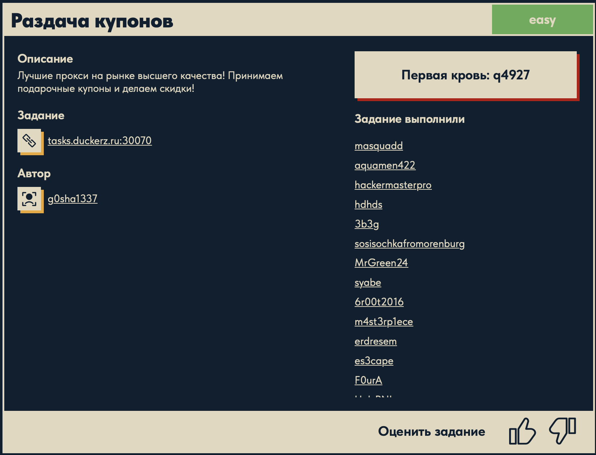
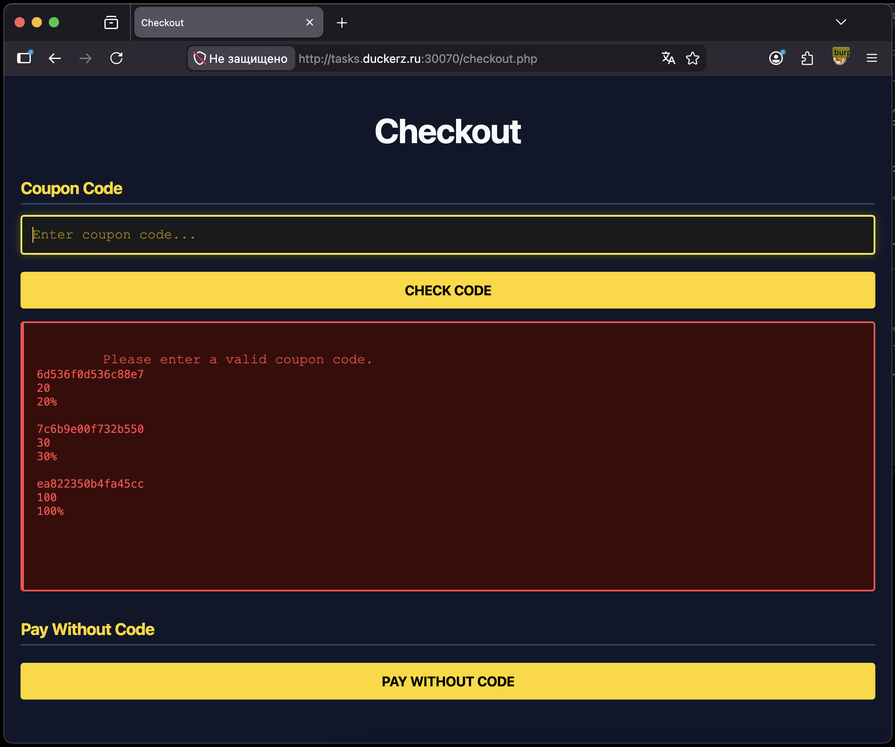
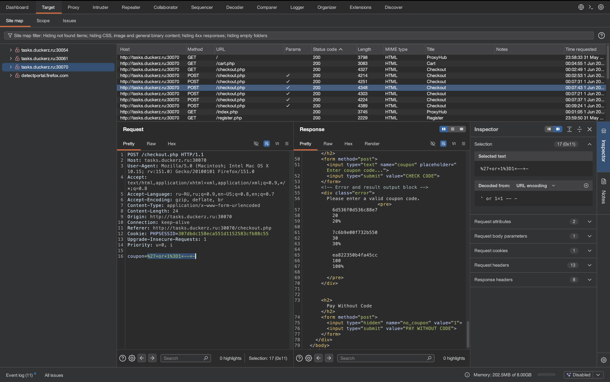
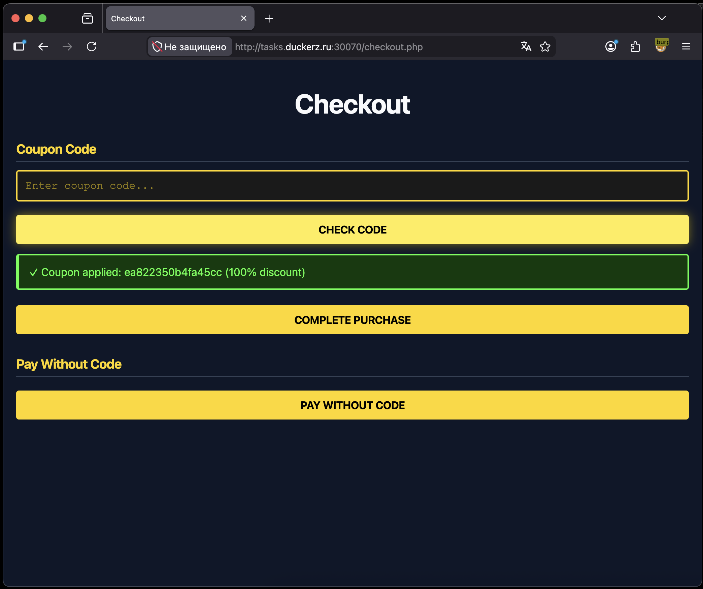
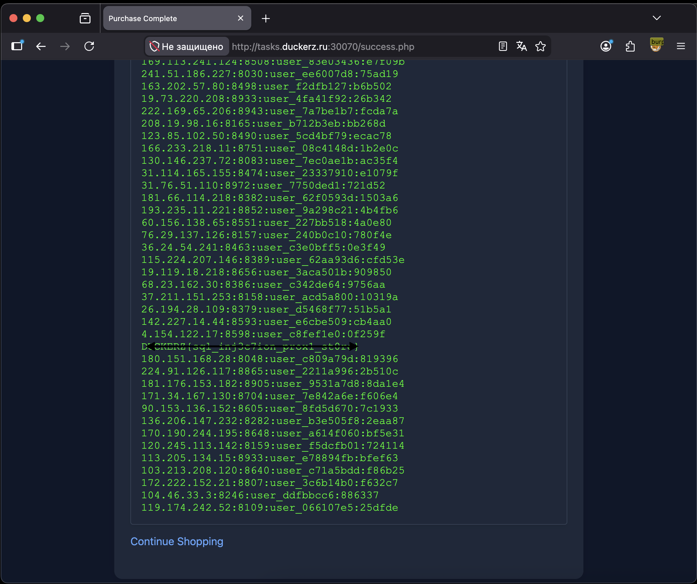

# Раздача купонов 🌐

## Описание задачи 📌

Название задачи:

```text
Раздача купонов
```

Сложность:

```text
Easy
```

Описание со страницы задачи:

```text
Лучшие прокси на рынке высшего качества! Принимаем подарочные купоны и делаем скидки!
```

В качестве цели задачи был указан адрес:

```text
tasks.duckerz.ru:30070
```

Скрин страницы задачи:



## Что есть на старте 🔎

По описанию сразу видно несколько важных слов:

```text
прокси
подарочные купоны
скидки
```

Значит, основной интерес здесь не в самой покупке, а в логике применения купона.

На сайте сначала была выполнена обычная регистрация, после чего появился доступ к странице покупки и форме ввода купона.

## Форма купона 🎟️

После регистрации на странице оформления заказа есть поле:

```text
Coupon Code
```

Если ввести неверный купон, сайт отвечает, что код невалидный.

Скрин страницы с формой и результатом проверки:



## Проверка запроса в Burp Suite 🧪

Дальше запрос на применение купона был открыт в Burp Suite.

Burp Suite удобен тем, что показывает HTTP-запрос полностью: метод, путь, заголовки, cookies и тело запроса. В этой задаче важным оказался именно POST-запрос на страницу оформления заказа.

В теле запроса передавался параметр:

```text
coupon=...
```

То есть пользовательский ввод из поля купона отправлялся на сервер как значение параметра `coupon`.

На скрине из Burp видно, что вместо обычного купона был отправлен SQLi payload:

```text
coupon=%27+or+1%3D1+--+-
```

В раскодированном виде это:

```sql
' or 1=1 -- -
```

Скрин запроса в Burp:



## Почему это сработало 🧠

Идея SQL-инъекции здесь такая: сервер, скорее всего, проверяет купон через SQL-запрос к базе данных.

Условно логика могла выглядеть так:

```sql
SELECT * FROM coupons WHERE code = '<введенный_купон>';
```

Если значение купона вставляется в запрос без нормальной фильтрации и параметризации, можно попробовать изменить сам SQL-запрос.

Разберем payload:

```sql
' or 1=1 -- -
```

- `'` закрывает строку с купоном в SQL-запросе.
- `or 1=1` добавляет условие, которое всегда истинно.
- `-- -` комментирует остаток SQL-запроса, чтобы лишние символы после инъекции не мешали выполнению.

В итоге сервер проверяет уже не один конкретный купон, а условие, которое проходит для записей в таблице. Поэтому в ответе отобразился список доступных купонов.

## Получение купонов 🎁

После SQL-инъекции в ответе появились купоны со скидками. Среди них был купон со скидкой `100%`.

Этот купон был применен на странице оформления заказа.

Скрин успешного применения купона:



## Получение флага 🏁

После применения купона со скидкой `100%` покупка стала бесплатной. Дальше оставалось нажать кнопку завершения покупки.

На странице успешной покупки был получен флаг. На скрине он замазан, чтобы не раскрывать решение напрямую:



## Итоговая цепочка ✅

```text
Регистрация на сайте
        ↓
Переход к покупке
        ↓
Проверка параметра coupon через Burp
        ↓
SQL-инъекция: ' or 1=1 -- -
        ↓
Вывод списка купонов
        ↓
Применение купона на 100%
        ↓
Завершение покупки
        ↓
Получение флага
```

Суть задачи: форма купона оказалась уязвима к SQL-инъекции. Через payload с условием `or 1=1` удалось вывести доступные купоны, найти купон на полную скидку и получить флаг.

Автор: masquadd :) ✍️
