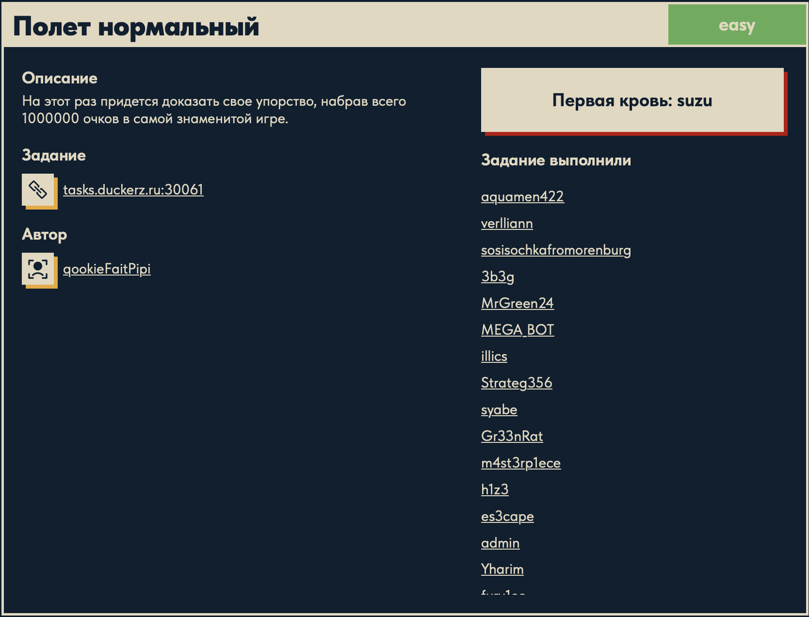
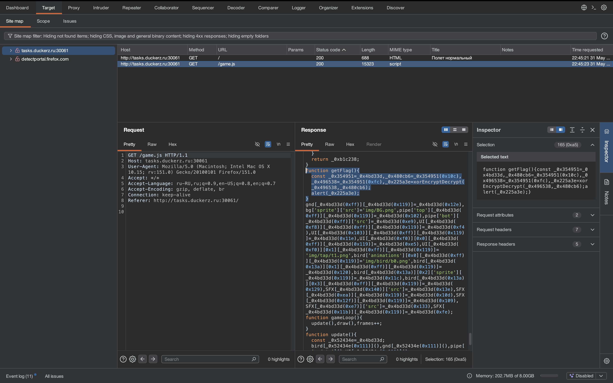
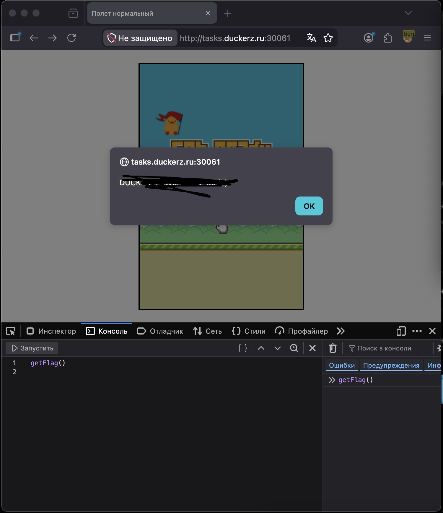

# Полет нормальный 🌐

## Описание задачи 📌

Название задачи:

```text
Полет нормальный
```

Сложность:

```text
Easy
```

Описание со страницы задачи:

```text
На этот раз придется доказать свое упорство, набрав всего 1000000 очков в самой знаменитой игре.
```

В качестве цели задачи был указан адрес:

```text
tasks.duckerz.ru:30061
```

Скрин страницы задачи:



## Что есть на старте 🔎

На странице задачи дан веб-сервис:

```text
tasks.duckerz.ru:30061
```

По описанию видно, что задача связана с игрой и требованием набрать:

```text
1000000 очков
```

На этом этапе важно понять, где находится логика игры: на сервере или в JavaScript на клиенте.

## Разведка через Burp Suite 🧰

Для анализа трафика использовали Burp Suite.

В `Target -> Site map` видно, что браузер загрузил два основных ресурса:

```text
GET /
GET /game.js
```

Скрин из Burp:



Файл:

```text
/game.js
```

особенно интересен, потому что именно JavaScript обычно содержит логику браузерной игры:

- движение объектов;
- счет;
- проверку условий;
- функции, которые вызываются после победы.

## Осмотр JavaScript ⚙️

В Burp был найден фрагмент функции:

```javascript
function getFlag(){
    const _0x354951=_0x4bd33d,
    _0x480cb6=_0x354951(0x10c),
    _0x496538=_0x354951(0xfc),
    _0x225a3e=xorEncryptDecrypt(_0x496538,_0x480cb6);
    alert(_0x225a3e);
}
```

Также этот фрагмент был сохранен в файл:

```text
game.js
```

## Что видно в коде 🧠

Функция называется:

```text
getFlag
```

Это уже сильная подсказка: именно она отвечает за получение или показ флага.

Внутри есть вызов:

```javascript
xorEncryptDecrypt(_0x496538,_0x480cb6)
```

По названию функции видно, что используется XOR.

Результат сохраняется в переменную:

```javascript
_0x225a3e
```

и затем выводится через:

```javascript
alert(_0x225a3e);
```

То есть логика выглядит так:

```text
взять два значения -> расшифровать через XOR -> показать результат в alert
```

## Что такое обфускация JS 🧩

Код выглядит странно из-за обфускации:

```javascript
_0x354951
_0x480cb6
_0x496538
_0x4bd33d
```

Обфускация - это способ сделать код менее читаемым для человека.

Обычно при этом:

- нормальные имена переменных заменяются на бессмысленные;
- строки прячутся в массивы;
- доступ к строкам идет через функции и числовые индексы;
- логика остается рабочей, но читать ее становится неприятнее.

В этой задаче обфускация не скрывает главную идею полностью, потому что название `getFlag` и вызов `xorEncryptDecrypt` уже показывают направление решения.

## Разбор найденных значений 🔎

После просмотра полного `game.js` стало понятно, что важные значения лежат в массиве строк:

```javascript
const _0xa65f=[
  ...
  '\x00\x00\x00\x00\x00\x00\x00$\x06{3l06`\x0bk\x17\x0a\x00$!7\x27',
  ...
  'DUCKERZ_THE_BEST!',
  ...
];
```

Одна строка выглядит как нечитаемый набор байтов:

```text
\x00\x00\x00...
```

Вторая строка выглядит как ключ:

```text
DUCKERZ_THE_BEST!
```

Это хорошо совпадает с вызовом:

```javascript
xorEncryptDecrypt(_0x496538,_0x480cb6)
```

То есть одна строка является зашифрованным текстом, а вторая используется как ключ для XOR.

## Функция XOR ⚙️

В коде была найдена функция:

```javascript
function xorEncryptDecrypt(_0x2d7b81, _0x4dc697) {
  const _0x90d7de=_0x4bd33d;
  let _0xb1c238='';
  for( let _0x20c86b=0x0; _0x20c86b < _0x2d7b81[_0x90d7de(0xf1)]; _0x20c86b++ ) {
    _0xb1c238 += String[_0x90d7de(0x11d)](
      _0x2d7b81['charCodeAt'](_0x20c86b)
      ^
      _0x4dc697[_0x90d7de(0x105)](_0x20c86b%_0x4dc697[_0x90d7de(0xf1)])
    );
  }
  return _0xb1c238;
}
```

Если убрать обфускацию, смысл такой:

```javascript
result += String.fromCharCode(
  encrypted.charCodeAt(i) ^ key.charCodeAt(i % key.length)
);
```

Что здесь происходит:

- `charCodeAt(i)` берет числовой код символа;
- `^` выполняет XOR;
- `i % key.length` зацикливает ключ, если текст длиннее ключа;
- `String.fromCharCode(...)` превращает числовой код обратно в символ;
- результат постепенно собирается в строку.

## Запуск через Node.js 🧪

Чтобы не проходить игру до `1000000` очков, код был немного доработан локально:

```javascript
// alert(_0x225a3e);
console.log(_0x225a3e);
...
getFlag();
```

То есть вместо всплывающего окна `alert()` результат выводится в консоль через:

```javascript
console.log(...)
```

А в конце файла вручную вызывается:

```javascript
getFlag()
```

После этого скрипт можно запустить через Node.js:

```bash
node game.js
```

В выводе появляется флаг:

```text
DUCKERZ{...}
```

Сам флаг в writeup замазан, чтобы не палить ответ.

## Альтернативный способ: консоль браузера 🧰

Уже в конце стало понятно, что можно было сделать еще проще.

Так как функция `getFlag()` уже загружена на странице, ее можно вызвать прямо из консоли разработчика в браузере:

```javascript
getFlag()
```

После вызова появляется `alert` с флагом.

Скрин с вызовом функции:



Флаг на скрине замазан.

## Почему не нужно набирать 1000000 очков 🧠

Условие говорит про миллион очков, но проверка и показ флага реализованы на клиенте.

Если нужная функция уже есть в JavaScript-коде, то браузер не обязан ждать честного прохождения игры. Можно:

- прочитать код;
- найти функцию получения флага;
- понять, какие значения она использует;
- вызвать ее напрямую.

Это типичная логика для web-задач с клиентским JavaScript: если секрет лежит в JS, пользователь может его прочитать и выполнить локально.

## Итог 🏁

На этом этапе зафиксировали:

```text
цель: tasks.duckerz.ru:30061
интересный файл: /game.js
интересная функция: getFlag()
механика: XOR-расшифровка и вывод через alert()
```

Краткая цепочка решения:

```text
Burp -> /game.js -> getFlag() -> xorEncryptDecrypt(...) -> node game.js или getFlag() в консоли -> DUCKERZ{...}
```

Суть задачи: флаг был спрятан в клиентском JavaScript. Вместо набора `1000000` очков достаточно было прочитать JS-код и вызвать функцию `getFlag()`.

Автор: masquadd :) ✍️
