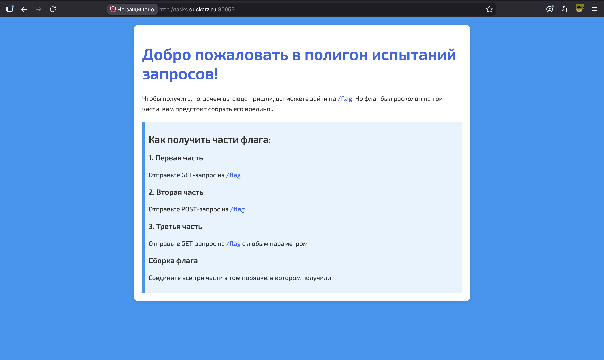
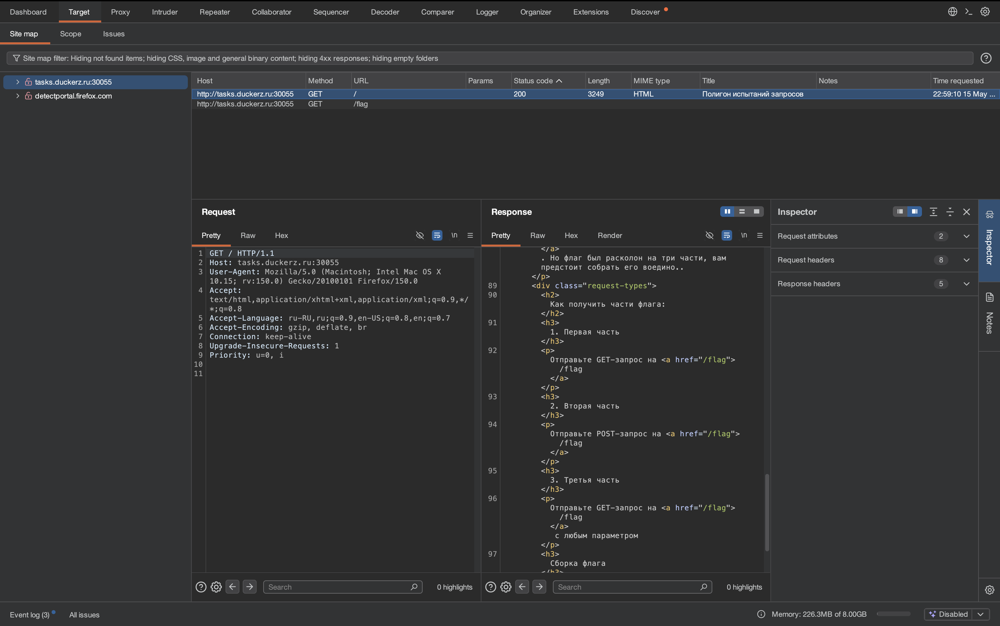
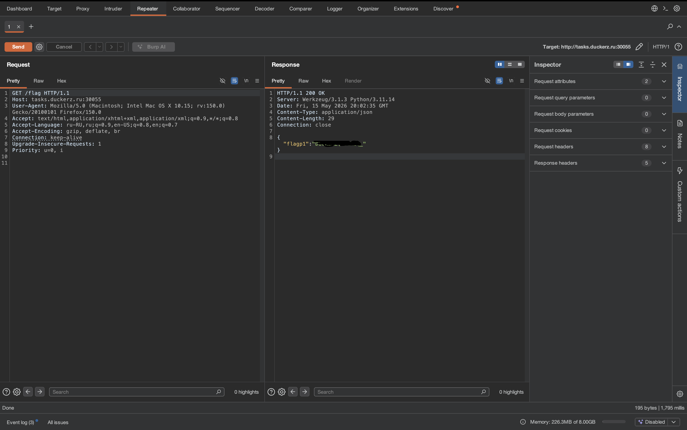
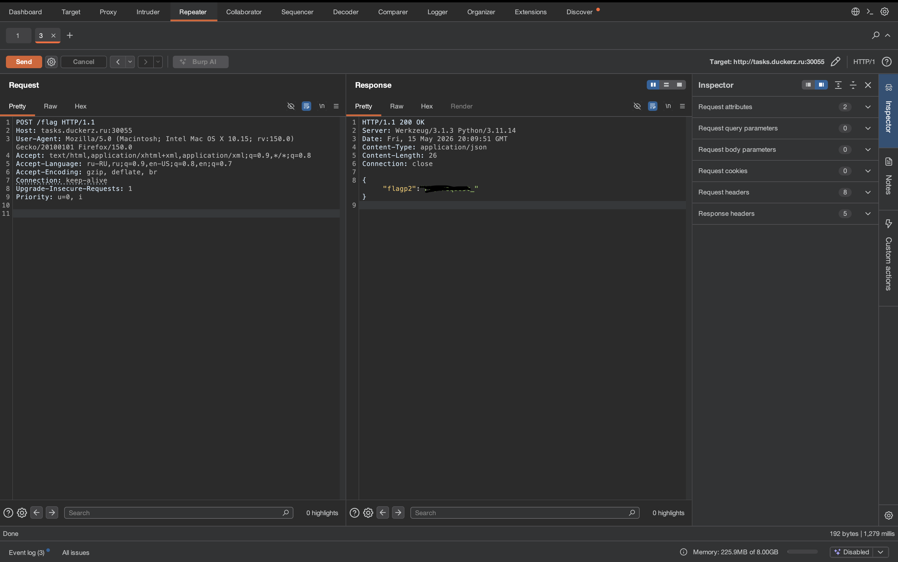
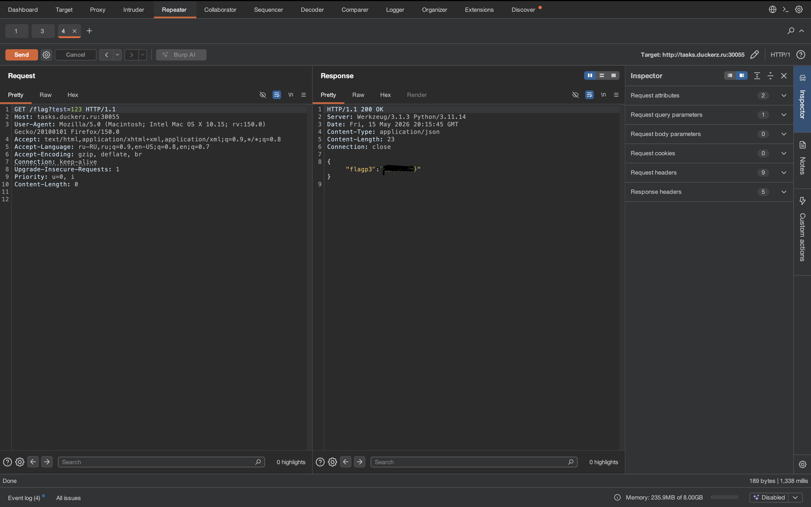

# Web polygon 🌐

## Описание задачи 📌

В этой задаче был доступен веб-сервис:

```bash
http://tasks.duckerz.ru:30055
```

На главной странице находился небольшой "полигон испытаний запросов". Сайт прямо подсказывал, что флаг разделен на три части, а получить их нужно разными HTTP-запросами к одному и тому же маршруту:

```text
1. Первая часть: отправьте GET-запрос на /flag
2. Вторая часть: отправьте POST-запрос на /flag
3. Третья часть: отправьте GET-запрос на /flag с любым параметром
```

Основная идея задачи: понять разницу между HTTP-методами и параметрами запроса.

## Инструменты 🧰

Для решения использовались браузер, `curl` и Burp Suite.

Burp Suite - это инструмент для анализа и тестирования веб-приложений. Он позволяет проксировать запросы браузера, смотреть HTTP-запросы и ответы, изменять их вручную и повторно отправлять на сервер.

Burp Repeater - это вкладка в Burp Suite, в которой удобно вручную менять запрос и отправлять его снова. Например, можно быстро поменять метод `GET` на `POST`, добавить параметр в URL или изменить заголовки, а затем сразу посмотреть ответ сервера.

## Первичная разведка 🔎

Открыли страницу в браузере:



На странице была ссылка на `/flag` и инструкция по сборке флага. Также запросы были видны в Burp Suite в разделе `Target`:



После этого стало понятно, что нужно отправить несколько разных запросов на один endpoint.

## Первая часть флага 🧩

Для первой части требовался обычный GET-запрос на `/flag`.

### Способ через Burp Repeater

В Burp Suite открыли запрос к `/flag` и отправили его в Repeater. Запрос выглядел так:

```http
GET /flag HTTP/1.1
Host: tasks.duckerz.ru:30055
```

После нажатия **Send** сервер вернул первую часть флага:



### Альтернативный способ через curl

То же самое можно сделать одной командой:

```bash
curl -i http://tasks.duckerz.ru:30055/flag
```

Ответ сервера:

```json
{
  "flagp1": "<первая_часть_флага>"
}
```

Первая часть:

```text
<первая_часть_флага>
```

## Вторая часть флага 🧩

Для второй части требовался POST-запрос на тот же путь `/flag`.

### Способ через Burp Repeater

В Repeater поменяли метод запроса с `GET` на `POST`:

```http
POST /flag HTTP/1.1
Host: tasks.duckerz.ru:30055
```

После отправки сервер вернул вторую часть:



### Альтернативный способ через curl

Через терминал POST-запрос отправляется так:

```bash
curl -i -X POST http://tasks.duckerz.ru:30055/flag
```

Ответ сервера:

```json
{
  "flagp2": "<вторая_часть_флага>"
}
```

Вторая часть:

```text
<вторая_часть_флага>
```

## Третья часть флага 🧩

Для третьей части нужно было снова отправить GET-запрос на `/flag`, но уже добавить любой параметр в query string.

### Способ через Burp Repeater

В Repeater оставили метод `GET`, но изменили путь, добавив параметр после `?`:

```http
GET /flag?test=123 HTTP/1.1
Host: tasks.duckerz.ru:30055
```

Параметр мог быть любым. Важно было именно наличие query-параметра.

После отправки сервер вернул третью часть:



### Альтернативный способ через curl

То же самое можно сделать командой:

```bash
curl -i 'http://tasks.duckerz.ru:30055/flag?test=123'
```

Важно брать URL в кавычки, потому что в некоторых shell символ `?` может восприниматься как шаблон для поиска файлов.

Ответ сервера:

```json
{
  "flagp3": "<третья_часть_флага>"
}
```

Третья часть:

```text
<третья_часть_флага>
```

## Сборка флага 🏗️

Сайт просил соединить все три части в том порядке, в котором они были получены:

```text
flagp1 + flagp2 + flagp3
```

Получается:

```text
DUCKERZ{...}
```

## Что здесь проверялось 🧠

Задача проверяла базовое понимание HTTP:

1. Один и тот же endpoint может отвечать по-разному на разные методы.
2. `GET /flag` и `POST /flag` - это разные запросы.
3. Query-параметры являются частью URL и могут менять логику ответа.
4. Burp Suite Repeater удобно использовать для ручного изменения метода, пути и параметров запроса.

## Итог 🏁

Флаг:

```text
DUCKERZ{...}
```

Краткая цепочка решения:

```text
GET /flag -> POST /flag -> GET /flag?test=123 -> сборка трех частей флага
```

Автор: masquadd :) ✍️
